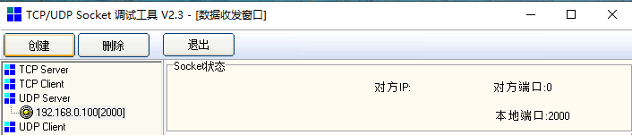

### UDP和调试助手

S7-1200支持UDP单播和UDP广播，不支持UDP组播。UDP是一种无连接的通信协议，通过调用TSEND_C、TRCV_C、TCON等指令可以与其他设备或软件进行UDP通信。

本示例中使用的软件和硬件环境：

① TIA Portal V16

② TCP/UDP Socket调试工具

③ CPU1214C DC/DC/DC(6ES7 214-1AG40-0XB0),V4.4

④ PC

⑤ 以太网线

需要完成的通信任务：

S7-1200和调试助手进行数据通信

### 通信设置

#### 调试助手设置

1、打开调试软件，选中左方的UDP Server，点击"创建"按钮。如图1所示：

**{width="271" height="135"}**

图1.Socket创建UDP

2、软件弹出端口输入框。如图2所示：

{width="310" height="185"}

图2.Socket设置端口号

3、输入端口后，软件会在收到对方数据后更新对方信息。如图3所示：

{width="706" height="151"}

图3.Socket设置完成

#### S7-1200设置

1、打开TIA Portal V16,创建一个新项目,添加CPU1214C DC/DC/DC
V4.4并设置CPU的IP地址。如图4所示：

**{width="1033" height="633"}**

图4.S7-1200设置IP地址

2、添加TCP通信指令。如图5所示：

{width="713" height="353"}

图5.调用通信指令

**注意**：TSEND_C只能实现S7-1200单播，实现广播需要使用TCON+TUSEND指令。

3、对通信进行组态。如图6所示：

{width="818" height="546"}

图6.组态通信

4、编写发送和接收指令。如图7所示：

{width="561" height="521"}

图7.数据收发指令

### 通信测试

编译保存项目，下载至CPU。监控数据交互，如图8所示：

{width="791" height="401"}

图8.数据交互

注意：调试助手发送的ASCII格式的123456789，所以CPU收到的是十六进制的313233343536373839。
