## 07 通信连接

### S7-1200 通过网络视图建立开放式用户通信连接

S7-1200 V4.5 版本开始支持网络视图组态开放式用户通信连接，不需要在程序中调用 TCON 等建立连接指令，只需要调用发送接收指令即可实现数据的收发。下面以 TCP 通信为例，通过电脑上的网络调试助手与 S7-1200 建立 TCP 连接。

本示例中使用的软件和硬件环境：

① TIA Portal V17

② TCP/UDP 网络调试工具

③ CPU 1214C DC/DC/DC(6ES7 214-1AG40-0XB0)，V4.5

④ 电脑

⑤ 以太网线

需要完成的通信任务：

① [S7-1200作为客户端和调试助手进行数据通信](07-OUC_Config.html#Client)

② [S7-1200作为服务器和调试助手进行数据通信](07-OUC_Config.html#Server)

### S7-1200 作为客户端

#### 创建 TCP 服务器

1、打开网络调试助手，选中协议类型为 TCP Server。

2、选择本地主机 IP 地址。即电脑网卡 IP 地址。

3、设置本地主机端口为 2000。

4、点击“打开”按钮。如图 1 所示：

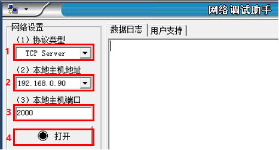

图1\. 网络调试助手创建服务器

#### 创建 TCP 客户端

1、打开 TIA Portal，创建一个新项目，添加 CPU1214C DC/DC/DC V4.5，添加子网并设置 CPU 的 IP 地址。如图 2 所示：

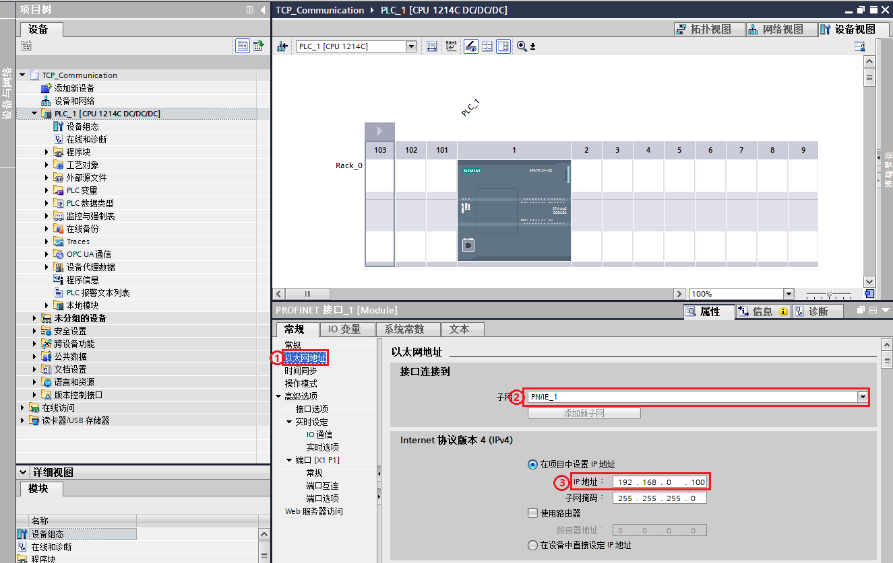

图 2.添加子网并设置 IP 地址

① 点击以太网地址属性

② 添加新子网

③ 设置 IP 地址

2、对通信进行组态。如图 3 - 图 5 所示：

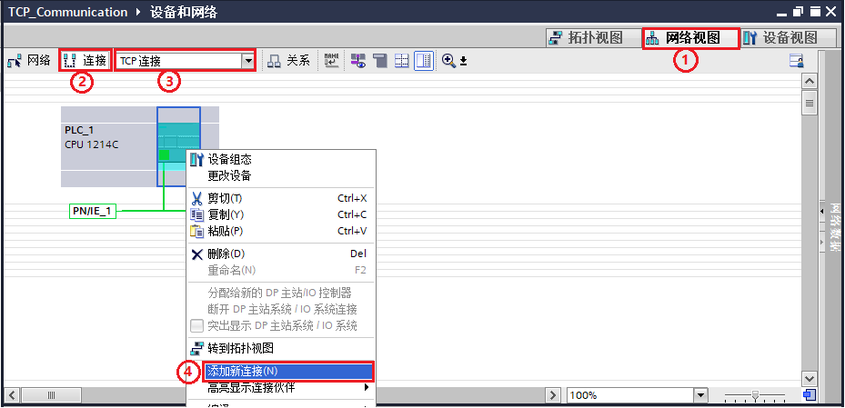

图 3.添加新连接

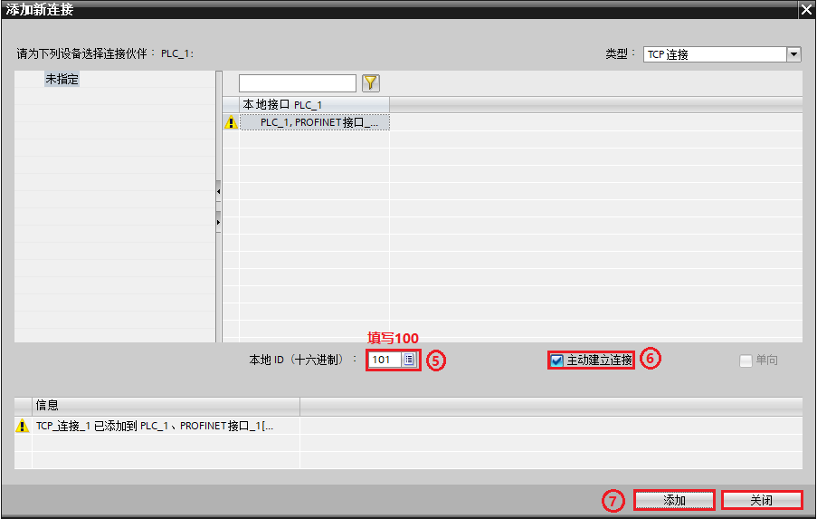

图 4.设置参数

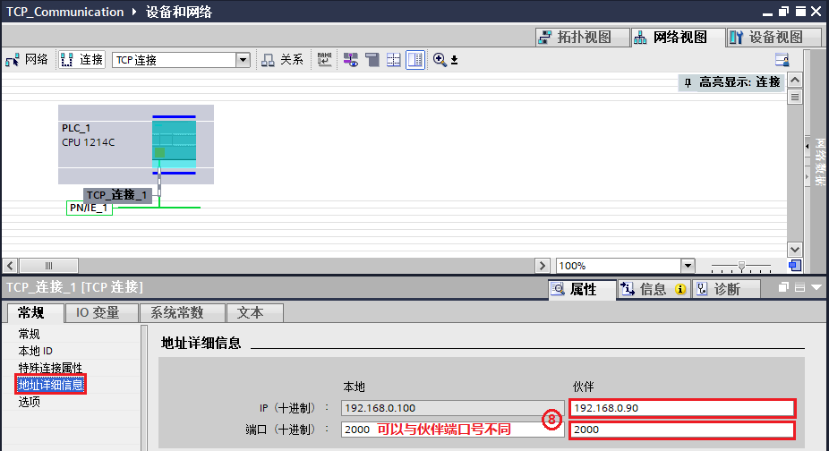

图 5.设置伙伴

① 打开网络视图

② 点击连接

③ 在下拉菜单中选择 TCP 连接

④ 右键点击 PLC 选择添加新连接

⑤ 在弹出的新窗口中填写本地 ID 号 100

⑥ 因为 S7-1200 作客户端，所以需要勾选主动建立连接

⑦ 点击添加按钮，信息窗口中会提示“TCP_连接\_1”已经添加到 PLC\_1，然后点击关闭按钮关闭此窗口

⑧ 在“TCP_连接_1”的地址详细信息属性中根据图 1 中的 IP 与端口号填写伙伴 IP 地址及端口号，本地端口号可以不填或者指定，本例中指定了本地端口号 2000

3、编写发送和接收指令并下载组态和程序。如图 6 所示：

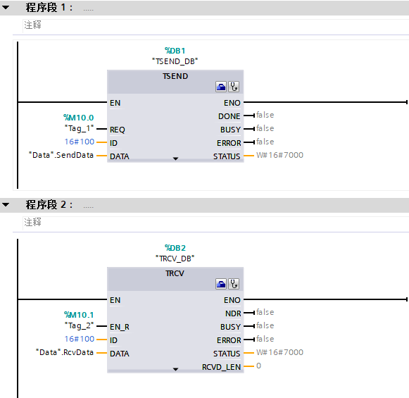

图 6.数据收发指令

4、确认连接。在网络视图中的连接中查看，连接名称前的图标为绿色，代表连接成功。如图 7 所示：

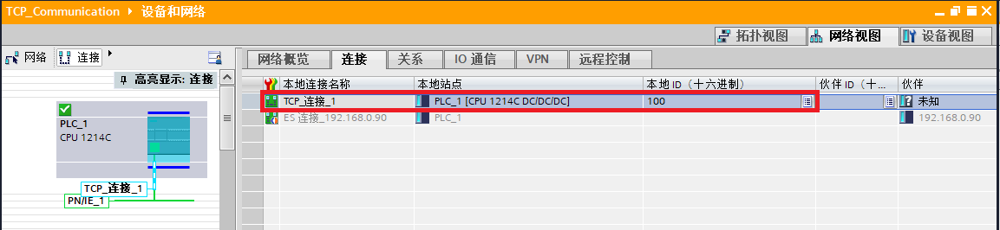

图 7.TCP 连接建立

5、数据交互。通过在线监视 DB 块，可以看到与网络调试助手发送接收数据一致。如图 8 所示：

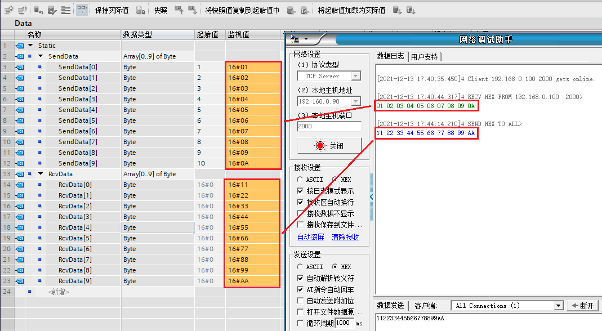

图 8.数据交互

### S7-1200 作为服务器

#### 创建 TCP 服务器

1、打开 TIA Portal ，创建一个新项目，添加 CPU1214C DC/DC/DC V4.5 并设置 CPU 的 IP 地址。如图 9 所示：

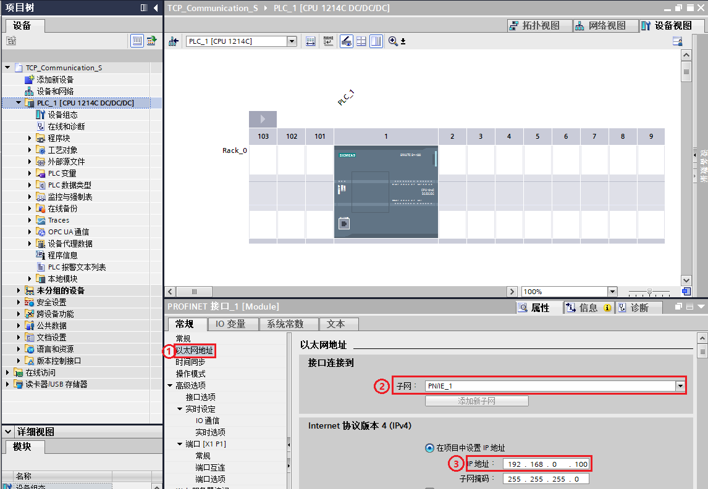

图 9.设置IP地址

① 点击以太网地址属性

② 添加新子网

③ 设置 IP 地址

2、对通信进行组态。如图 10 - 图 12 所示：

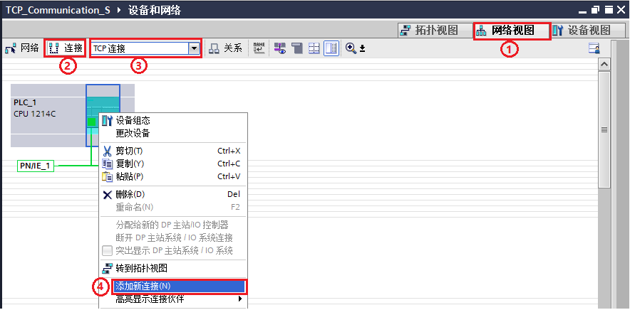

图 10.添加新连接

图 11.设置参数

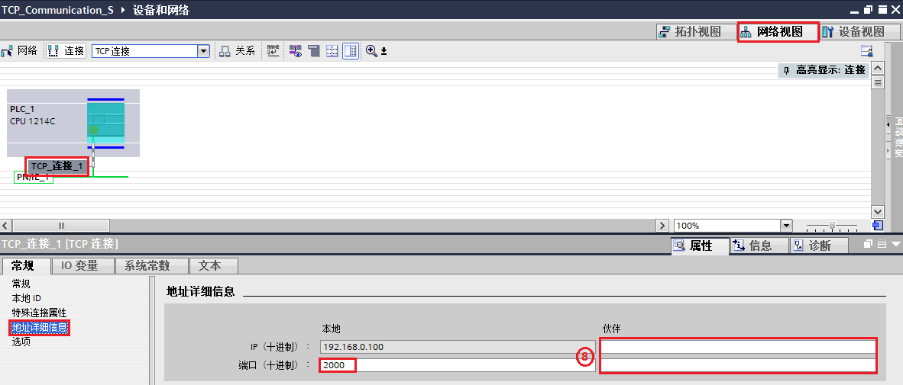

图 12.设置本地端口号

① 打开网络视图

② 点击连接

③ 在下拉菜单中选择 TCP 连接

④ 右键点击 PLC 选择添加新连接

⑤ 在弹出的新窗口中填写本地 ID 号 100

⑥ 因为作为服务器，所以不需要激活主动建立连接

⑦ 点击添加按钮，信息窗口中会提示“TCP_连接\_1”已经添加到PLC\_1，然后可以点击关闭按钮关闭此窗口

⑧ 在“TCP_连接_1”的地址详细信息属性中设置本地端口号，伙伴 IP 与端口号不填

3、编写发送和接收指令并下载组态和程序。如图 13 所示：

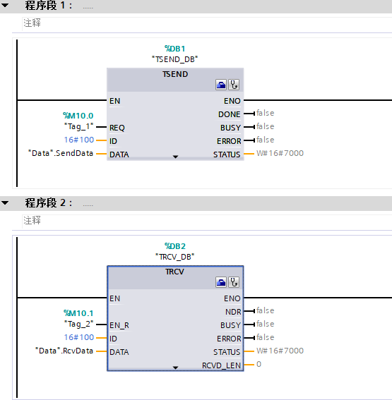

图 13.数据收发指令

#### 创建 TCP 客户端

1、打开网络调试助手，选中协议类型为 TCP Client。

2、根据图 12 本地 IP 填写远程主机地址，。

3、根据图 12 本地端口号填写远程主机端口。

4、点击连接。如图 14 所示：

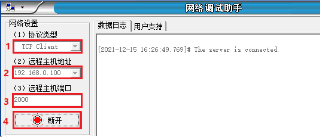

图 14\. 网络调试助手创建客户端

5、确认连接。在网络视图中的连接中查看，连接名称前的图标为绿色，代表连接成功。如图 15 所示：

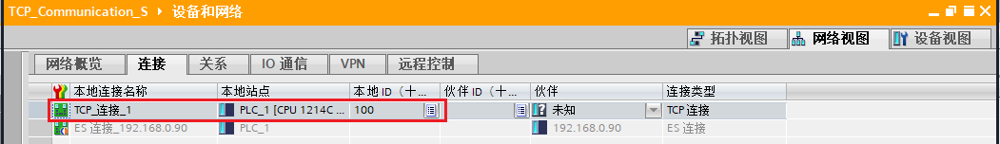

图 15.TCP 建立连接

6、数据交互。通过在线监视DB块，可以看到与网络调试助手发送接收数据一致。如图 16 所示：

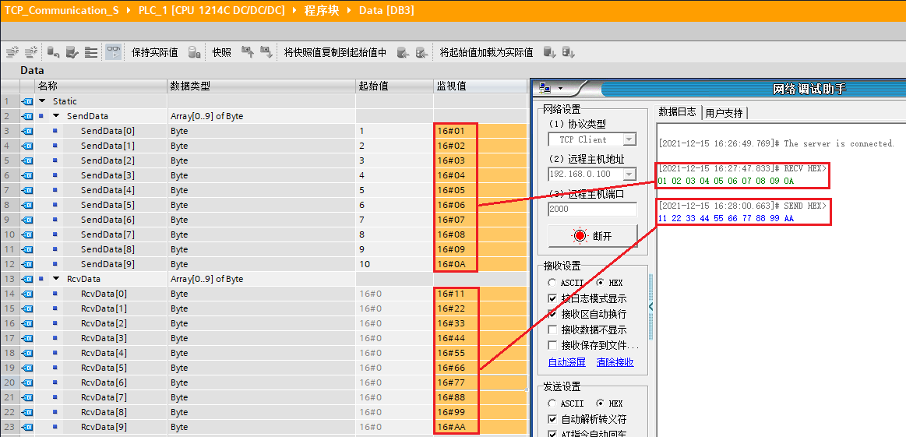

图 16.数据交互