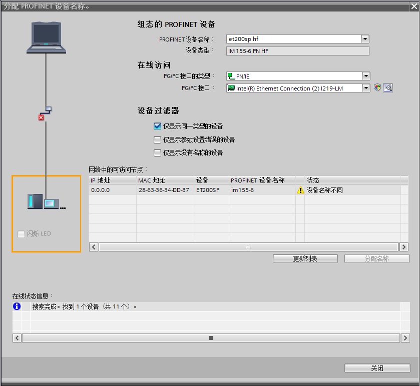

### S7-1200 PROFINET与 IO device 通信

PROFINET IO 设备指分配给一个或多个 IO 控制器的分布式现场设备（例如，远程
IO、阀岛、变频器和交换机等）。PROFINET IO 控制器对连接的 IO
设备进行寻址，与现场设备交换输入和输出信号。

#### 硬件和软件需求及所完成的通信任务

**硬件：**\
① S7-1200 CPU V2.0 或更高版本 （文档中使用V4.2版本S7-1215C DC/DC/DC）\
② PC （带以太网卡），TP电缆(以太网电缆）\
③ 分布式IO（文档中使用ET200SP IM 155-6 PN HF V3.3）

**软件：**\
TIA 博图 STEP7 V11 或更高版本（文档中使用V14 SP1 UPD3）

**所完成的通信任务：**\
① S7-1200 读取IM 155-6 PN HF数字量输入点数据\
② S7-1200 向IM 155-6 PN HF输出点传送数据

#### 通信的编程，连接参数及通信参数的配置

**1. 打开TIA 博图STEP 7软件并新建项目**\
\
在 TIA 博图 STEP 7软件的 "项目视图" 中点击 "创建新项目" 创建一个新项目

**2. S7-1200硬件组态及参数分配**

在硬件列表中选择对应的订货号，如图1所示。

{width="708" height="696"}

图1 添加S7-1200 CPU

在设备视图中显示出 S7-1200 的组态画面，如图2所示。

{width="800" height="400"}

图2 S7-1200 设备视图

接着需要给S7-1200 CPU 设置 IP
地址，通过在设置视图中点击S7-1200的以太网口\>"属性" \>
"常规"\>"以太网地址" 设置，如图3所示。

{width="800" height="550"}

图3 设置IP地址

进入网络视图，在硬件目录中选择IM155-6PN
HF（6ES7155-6AU00-0CN0）并插入，如图4所示。

{width="800" height="300"}

图4 添加IM155-6PN HF

然后双击IM155-6PN HF 进入设备视图进行硬件组态，为IM155-6PN
HF添加IO模块，如图5所示。

需要注意底座颜色（浅色为使用新的电位组，深色为使用左侧模块的电位组），以及IO模块的版本。

{width="800" height="484"}

 

图5 IM155-6PN HF 硬件组态

回到设备视图，点击IM155-6PN HF模块的图标，然后在"属性" 〉"常规" \>
"项目信息"中定义该接口模块的名称 "ET200SP HF"，如图6所示。

{width="800" height="400"}

图6 IM155-6PN HF设置名称。

设置名称后，需要给IM155-6PN HF设置IP 地址，在网络视图中点击IM155-6PN
HF以太网口，然后在"属性" 〉"常规" 〉"以太网地址"中设置IP
地址"192.168.1.11"，如图7所示。

并且从图7中可知该IM155-6PN
HF的设备名称和项目信息中的名称相同，只是大写字母换成了小写字母"et200sp
hf"。

{width="800" height="750"}

图7 设置IM155-6PN HF IP 地址

在网络视图中左键点击IM155-6PN
HF的"未分配"图标，在弹出框中选择该IO设备的控制器，文档中选择"PLC_1.PROFINET接口_1"，即前面新建的CPU
S7-1215C，如图8所示。\

{width="800" height="250"}

图8 IM155-6PN HF 分配IO控制器

这样在IM155-6PN HF的地址总览中可以看到IM155-6PN HF所占用的S7-1200 I/O
区域，以及网络结构，如图9所示。

{width="800" height="600"}

图9 IM155-6PN HF IO 地址及网络结构

右键点击PROFINET 网络给IM155-6PN HF分配设备名称，如图10所示。

{width="800" height="650"}

图10 分配设备名称

在弹出页面"分配PROFINET设备名称"中，点击"更新列表"按钮，搜索ET200SP。

如果此时搜索到的网络节点包含多个ET200SP，则可以通过检查MAC地址的方式确定此刻需要分配设备名称的ET200SP。ET200SP网口的MAC地址位于接口模块24V电源正上方。

如果此时待分配设备名称的ET200SP状态显示"设备名称不同"，则此时组态的离线设备名称（"et200sp
hf"）与在线设备名称不同（"im155-6"），如图11所示。

如果此时待分配设备名称的ET200SP状态显示"确定"，则此时组态的离线设备名称与在线设备名称相同，可以跳过该模块的设备名称分配（即跳过图12）。

{width="839" height="772"}

图11 离线在线设备名称不同

如果离线设备名称与在线设备名称不同，则左键选中该节点，点击"分配名称"按钮，几秒钟后，该网络节点ET200SP的在线设备名称变为"et200sp
hf"，与组态的离线设备名称相同，状态变为"确定"，此时完成一个IO设备的设备名称分配，如图12所示。

{width="837" height="771"}

图12 离线在线设备名称相同

项目硬件和软件全部编译后下载，在S7-1200
变量表中可以监控DI变量的状态，也可以给DO 变量赋值，
观察DO模块的输出，如图13所示。

{width="800" height="150"}

图13 变量表监控
