### S7-1200 和 S7-300 PN/S7-400PN CPU 的 Profinet 通信（S7-1200 作为 IO 控制器）

S7-1200 可以作为 IO 控制器与其它智能 IO 设备进行 Profinet 通信，S7-300
PN CPU 可以做为智能 IO 设备，故可使用 S7-1200 作为控制器和 S7-300 PN CPU
进行 Profinet 通信。本例中将 S7-1200 作为控制器，连接作为智能 IO 设备的
S7-300 PN CPU 实现 Profinet 通信，下面详细介绍使用方法。

此外，本例也可以用在 S7-1200 和 S7-400 PN CPU 的 Profinet 通信（S7-1200
作为 IO 控制器）。

硬件：

1.  CPU 1215C DC/DC/DC，V4.5
2.  CPU 315-2PN/DP，V3.2

软件：

1.  TIA PORTAL V17
2.  Step7 V5.7

S7-300 集成的 PN 接口连接 S7-1200 的 PN 接口，这种方式可以分 3
种情况来操作，具体如下：

1.  [第一种情况：CPU 1215C 和 CPU 315 使用 TIA Portal
    编程，在同一个项目中操作。](02-S7-300.html#a)
2.  [第二种情况：CPU 1215C 和 CPU 315 使用 TIA Portal
    编程，在不同项目中操作。](02-S7-300.html#b)
3.  [第三种情况：CPU 1215C 使用 TIA Portal ，而 CPU 315 使用
    Step7。](02-S7-300.html#c)

### []{#a}1. 第一种情况（CPU 1215C 和 CPU 315 使用 TIA Portal 编程，在同一个项目中操作）

CPU 1215C 作为 IO 控制器，CPU 315-2PN/DP 作为 IO 设备，使用 TIA Portal
在一个项目中操作，详细步骤如下。

### 1-1 使用 TIA Portal 创建 S7-1200 站

使用 TIA Portal 创建一个新项目，并通过\"添加新设备\"组态 S7-1200 站
PLC_1，选择 CPU 1215C DC/DC/DC；设置 IP
地址，并确认设备名称，本示例中设备名称是 PLC_1。如图 1 所示。

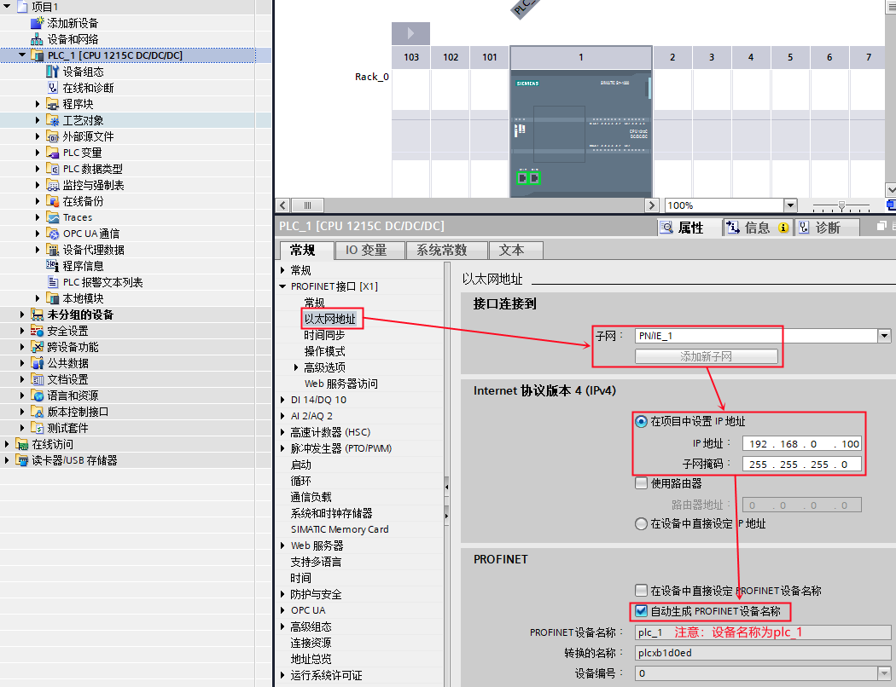{width="1050" height="806"}

图 1. 在新项目中插入 S7-1200 站

### 1-2 使用 TIA Portal 创建 S7-300 站

使用 TIA Portal 创建一个新项目，并通过\"添加新设备\"组态 S7-300 站
PLC_2，选择 CPU 315-2PN/DP；设置 IP
地址，并确认设备名称，本示例中设备名称是 PLC_2。如图 2 所示。

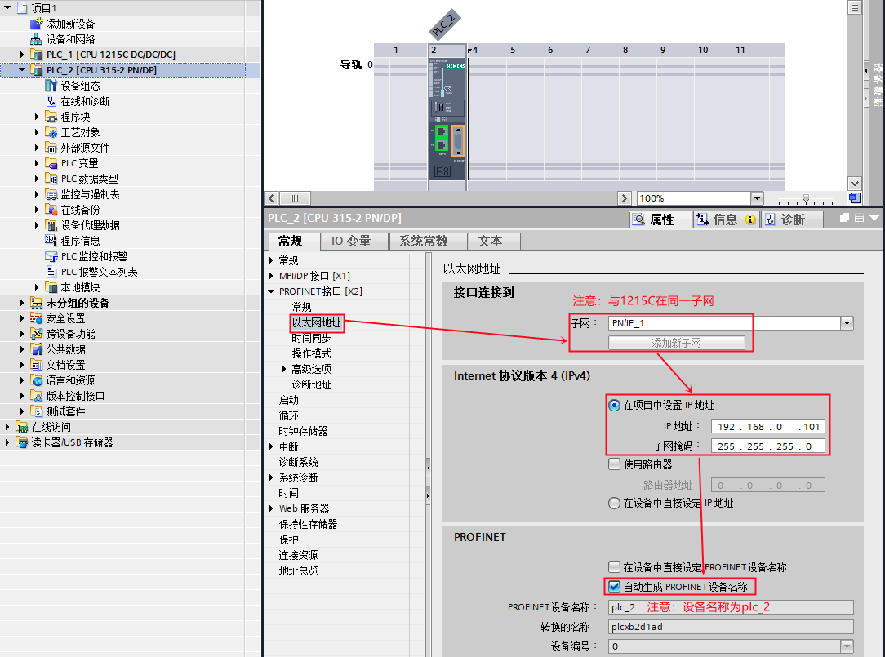{width="1084" height="805"}

图 2. 在新项目中插入 S7-300 站

S7-300 作为 IO 设备，需要将其操作模式设置为 IO 设备，并将 IO
设备分配给控制器 PLC_1 。如图 3 所示。

{width="760" height="301"}

图 3. S7-300 设置为 IO 设备

然后，在\"智能设备通信\"的\"传输区\"创建 IO 通信区，控制器的 QB10\~14
共计 5 个字节传送到 IO 设备的 IB10\~14 ；控制器的 IB10\~14 共计 5
个字节读取来自 IO 设备的 QB10\~14 。如图 4 所示。

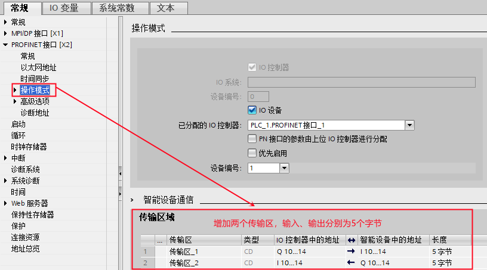{width="816" height="453"}

图 4. 创建 IO 通信区

### 1-3 编程、下载

1、CPU 315-2 PN/DP 作为 IO 设备，需要调用 OB83 和
OB86（防止无法正常连接作为控制器的 S7-1200 时，出现的停机现象）。如图 5
所示。

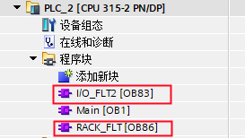{width="273" height="154"}

图 5. OB

2、检查无错误后，分别将 PLC_1 站和 PLC_2 站下载到各自的 PLC 中。

### 1-4 通讯测试

分别给两个站点新建监控表，添加通信数据区，监控。如图 6 所示。

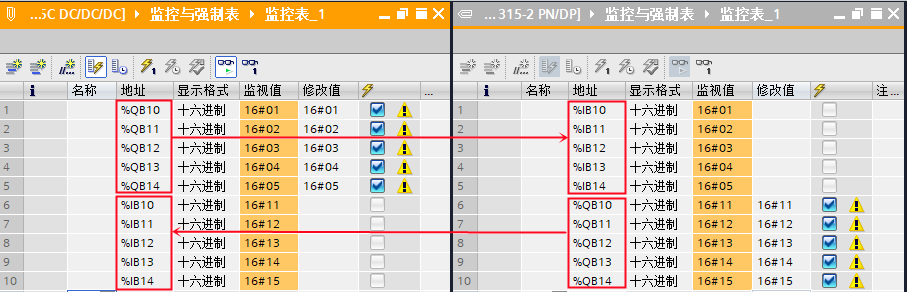{width="907" height="292"}

图 6. 通信测试

### []{#b}2. 第二种情况（CPU 1215C 和 CPU 315 使用 TIA Portal 编程，在不同项目中操作）

CPU 1215C 作为 IO 控制器，CPU 315-2PN/DP 作为 IO 设备，使用 TIA Portal
在不同项目中操作，详细步骤如下。

### 2-1 使用 TIA Portal 创建 S7-300 站

使用 TIA Portal 创建一个新项目，并通过\"添加新设备\"组态 S7-300 站，选择
CPU 315-2PN/DP，设置 IP 地址，并确认设备名称，本示例中设备名称是
io-device。如图 7 所示。

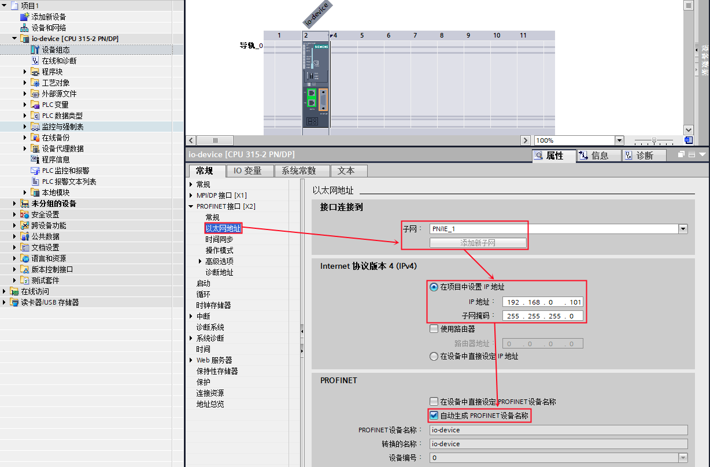{width="1228" height="808"}

图 7. 在新项目中插入 S7-300 站

S7-300 作为 IO 设备，需要将其操作模式设置为 IO
设备。接着，在\"智能设备通信\"的\"传输区\"创建 IO 通信区，控制器将传输 5
个字节到 IO 设备的 IB10\~14；IO 设备将 QB10\~14 共计 5
个字节传送给控制器。如图 8 所示。

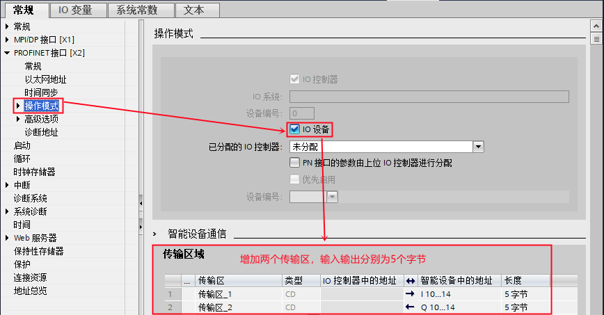{width="868" height="453"}

图 8. S7-300 设置为 IO 设备，并创建 IO 通信区

### 2-2 导出 IO 设备的 GSD 文件

编译该项目，在\"智能设备通信\"属性的下方，找到并点击\"导出\"按钮，根据提示将
GSD 文件导出（注意不要修改设备名称）。如图 9 所示。

{width="669" height="863"}

图 9. 导出 IO 设备的 GSD 文件

### 2-3 使用TIA Portal 创建 S7-1200 站

使用 TIA Portal 创建一个新项目，并组态 CPU 1215C DC/DC/DC，设置 IP
地址，并确认设备名称，本示例中设备名称是 PLC_1。如图 10 所示。

{width="1058" height="789"}

图 10. 在新项目中插入 S7-1200 站

在 TIA Portal
的硬件组态界面，通过\"选项\"进入\"管理通用站描述文件（GSD）\"界面，
在源路径选择 IO 设备 的 GSD 文件存放路径。如图 11 所示。

{width="523" height="566"}

图 11. TIA Portal 安装 IO 设备 的 GSD 文件

### 2-4 在 TIA Portal 中组态 IO 设备

在 TIA Portal 的硬件组态界面，将硬件目录路径：Other field
devices\--（其它现场设备）\> PROFINET IO\--\>PLCs&CPs\--\>SIEMENS
AG\--\> CPU 315-2PN/DP \--\> io-device 拖拽到网络视图中。如图 12 所示。

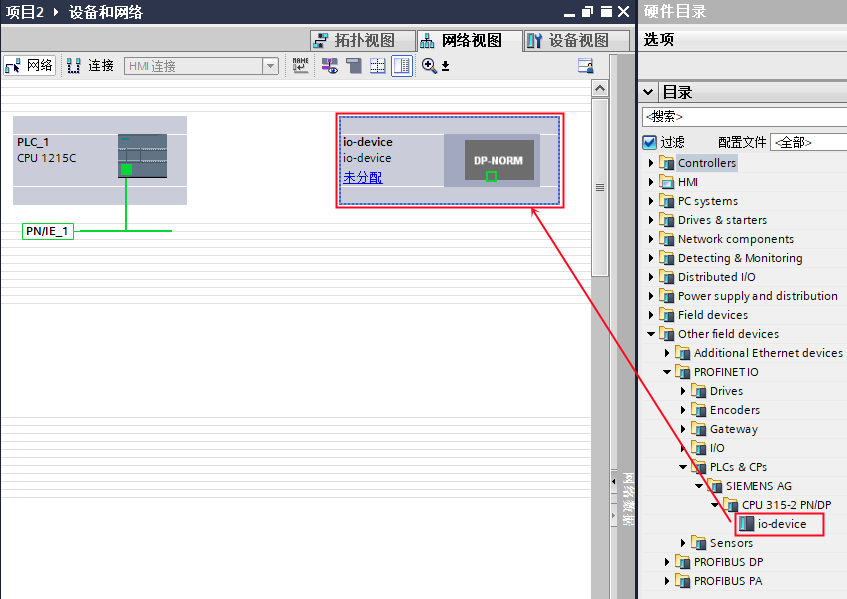{width="847" height="599"}

图 12. 组态 IO 设备

然后为 IO 设备分配 IO 控制器，如图 13 所示。

{width="606" height="359"}

图 13. 分配 IO 控制器

进入到设备视图中的设备概览设置传输区地址，如图 14 所示。

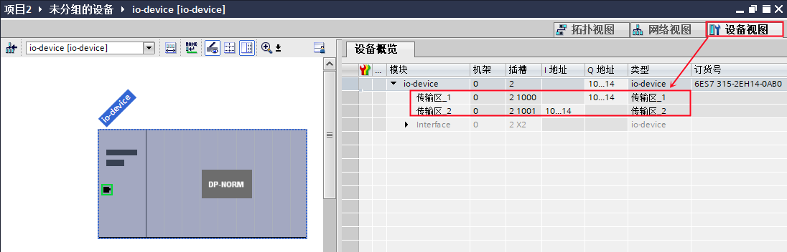{width="1096" height="352"}

图 14. 分配传输区地址

### 2-5 编程、下载

1、CPU 315-2 PN/DP 作为 IO 设备，需要调用 OB83 和
OB86（防止无法正常连接作为控制器的 S7-1200 时，出现的停机现象）；如图 15
所示。

{width="248" height="157"}

图 15. OB

2、检查无错误后，分别将 S7-300 站和 S7-1200 站下载到各自的 PLC 中。

### 2-6 通讯测试

分别给两个站点新建监控表，添加通信数据区，监控。如图 16 所示。

{width="1054" height="311"}

图 16. 通信测试

### []{#c}3. 第三种情况（CPU 1215C 使用 TIA Portal ，而 CPU 315 使用 Step7）

CPU 1215C作为 IO 控制器， CPU 315-2PN/DP 作为 IO 设备，CPU 1215C 使用
TIA Portal ，而 CPU 315 使用 Step7，详细步骤如下。

### 3-1 使用 Step7 创建 S7-300 站

使用 STEP7 创建一个新项目，并通过\"添加新设备\"组态 S7-300 站 IO
设备，选择 CPU 315-2PN/DP；设置 IP
地址，并确认设备名称，本示例中设备名称是 PN-IO。如图 17 所示。

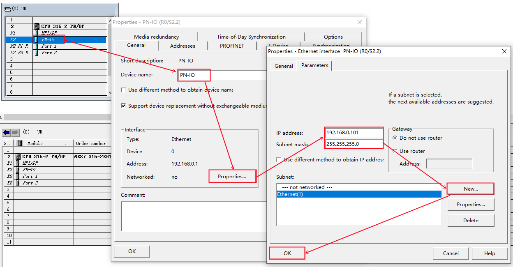{width="1248" height="650"}

图 17. 在新项目中插入 S7-300 站

S7-300 作为 IO 设备，需要将其操作模式设置为 IO
设备。接着，在\"智能设备通信\"的\"传输区\"创建 IO 通信区，控制器将传输 5
个字节到 IO 设备的 IB10\~14 ；IO 设备将 QB10\~14 共计 5
个字节传送给控制器。如图 18 所示。

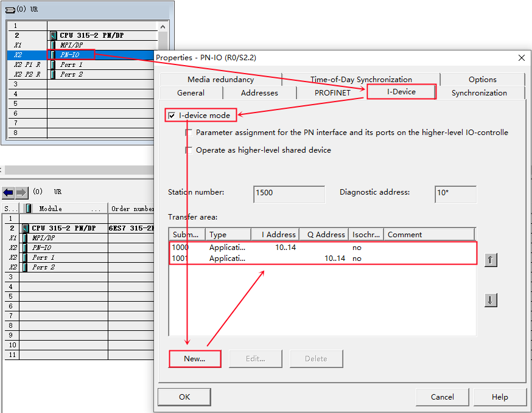{width="874" height="679"}

图 18. S7-300 设置为 IO 设备，并创建 IO 通信区

### 3-2 导出 IO 设备的 GSD 文件

编译该项目，在\"智能设备通信\"属性的下方，找到并点击\"导出\"按钮，根据提示将
GSD 文件导出（注意不要修改设备名称）。如图 19 所示。

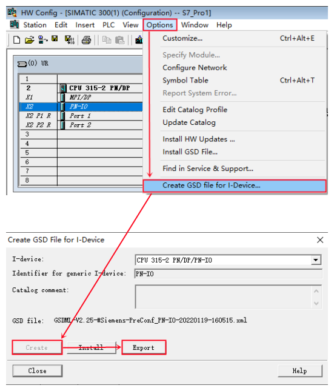{width="551" height="645"}

图 19. 导出 IO 设备的 GSD 文件

### 3-3 使用 TIA Portal 创建 S7-1200 站

使用 TIA Portal 创建一个新项目，并组态 CPU 1215C DC/DC/DC，设置 IP
地址，并确认设备名称，本示例中设备名称是 PLC_1。如图 20 所示。

{width="990" height="840"}

图 20. 在新项目中插入 S7-1200 站

在 TIA Portal
的硬件组态界面，通过\"选项\"进入\"管理通用站描述文件（GSD）\"界面，
在源路径选择 IO 设备 的 GSD 文件存放路径。如图 21 所示。

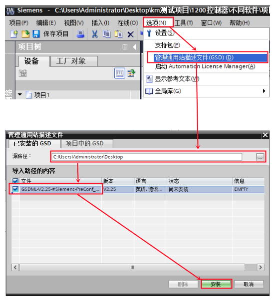{width="551" height="603"}

图 21. TIA Portal 安装 IO 设备的 GSD 文件

### 3-4 在 TIA Portal 中组态 IO 设备

在 TIA Portal 的硬件组态界面，将硬件目录路径：Other field
devices（其它现场设备）\--\> PROFINET IO\--\>PLCs&CPs\--\>SIEMENS
AG\--\> CPU 315-2PN/DP \--\> PN-IO拖拽到 网络视图中。如图 22 所示。

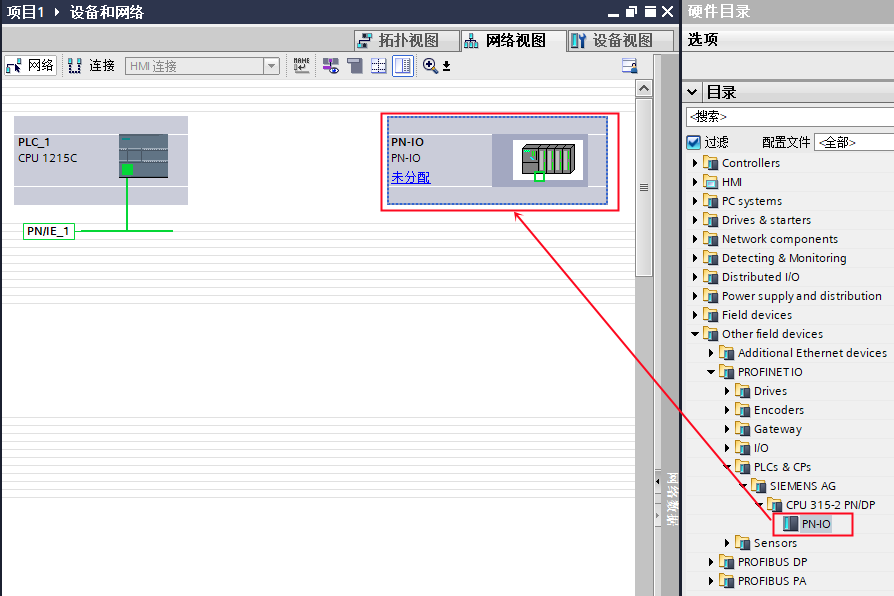{width="894" height="596"}

图 22. 组态 IO 设备

然后为 IO 设备分配 IO 控制器，如图 23 所示。

{width="647" height="394"}

图 23. 分配 IO 控制器

进入到设备视图中的设备概览设置传输区地址，如图 24 所示。

{width="1044" height="373"}

 

图 24. 分配传输区地址

### 3-5 编程、下载

1、CPU 315-2 PN/DP 作为 IO 设备，需要调用 OB83 和
OB86（防止无法正常连接作为控制器的 S7-1200 时，出现的停机现象）；如图 25
所示。

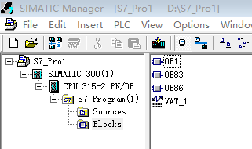{width="321" height="190"}

图 25. OB

2、检查无错误后，分别将 S7-300 站和 S7-1200 站下载到各自的 PLC 中。

### 3-6 通讯测试

分别给两个站点新建监控表，添加通信数据区，监控。如图 26 所示。

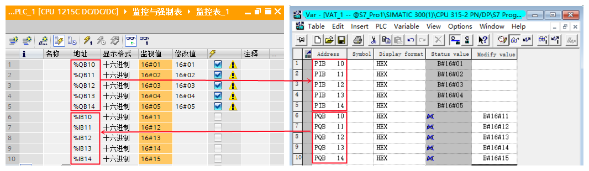{width="1066" height="310"}

图 26. 通信测试
