### S7-1200 和 CP343-1 的 Profinet 通信（S7-1200 做控制器） {#s7-1200-和-cp343-1-的-profinet-通信s7-1200-做控制器 .STYLE1}

CP343-1(6GK7343-1EX30-0XE0) 或 CP343-1
Advanced(6GK7343-1GX30/1GX31-0XE0) 或 CP343-1 Lean(6GK7343-1CX10-0XE0)
支持 I Device 模式，故可使用 CP343-1 作为智能 IO 设备和 S7-1200 做
Profinet 通信。本例中将 S7-1200 做为控制器，连接作为智能 IO 设备的
CP343-1 实现 Profinet 通信；下面详细介绍使用方法。

[硬件：]{.STYLE3}

1.  CPU 1217C DC/DC/DC，V4.4
2.  CPU 314C-2 PN/DP，V3.3 + CP343-1 Standard(6GK7343-1EX30-0XE0) ，V3.0

软件：

1.  TIA Step7 V17
2.  Step7 V5.6 SP2

CP343-1 的 PN 接口连接 S7-1200 的 PN 接口，这种方式可以分 3
种情况来操作，具体如下：

1.  [第一种情况：S7-1200 与 CP343-1 在一个项目中操作(TIA STEP7
    V17)](04-S7-300CP%20I_Device.html#a)
2.  [第二种情况：S7-1200 与 CP343-1 不在一个项目中的操作(两个 TIA STEP7
    V17 项目)](04-S7-300CP%20I_Device.html#b)
3.  [第三种情况：S7-1200 与 CP343-1 不在一个项目中的操作( S7-1200 在TIA
    STEP7 V17 项目中，CP343-1 在 STEP7 V5.6
    项目中)](04-S7-300CP%20I_Device.html#c)

### []{#a}1. 第一种情况（S7-1200 与 CP343-1 在同一 TIA 项目中） {#第一种情况s7-1200-与-cp343-1-在同一-tia-项目中 .STYLE4}

CPU1217C 作为 IO 控制器，CP343-1 作为 IO 设备，使用 TIA Step7 V17
在一个项目中操作，详细步骤如下。

#### 1-1 使用 Step7 V17 创建 S7-1200 站 {#使用-step7-v17-创建-s7-1200-站 .STYLE3}

使用 STEP7 V17 创建一个新项目，并通过"添加新设备"组态 S7-1200 站
PLC_1，选择 CPU 1217C，添加子网并设置 IP 地址，确认设备名称，本示例中
S7-1200 设备名称是 plc_1。如图 1 所示。

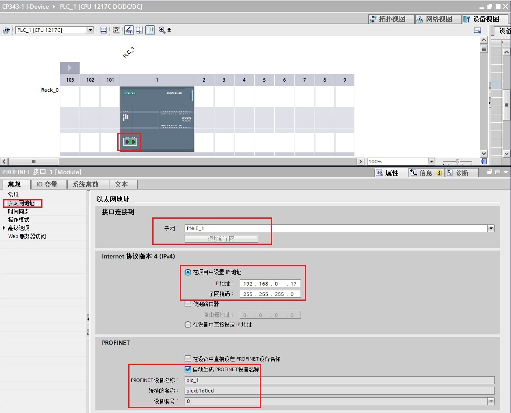{width="1168" height="946"}

图 1 在新项目中插入 S7-1200 站

组态 S7-1200PLC 后，默认为 IO 控制器模式，无需设置。 如图 2 所示。

{width="1163" height="740"}

图 2 S7-1200的操作模式

#### 1-2 使用 Step7 V17 创建 S7-300 站 {#使用-step7-v17-创建-s7-300-站 .STYLE3}

使用 STEP7 V17 创建一个新项目，并通过"添加新设备"组态 S7-300 站
PLC_2，选择 CPU314C-2 PN/DP V3.3 和 CP343-1 V3.0；对 CP343-1
分配子网并设置 IP 地址，并确认设备名称，本示例中 CP343-1 设备名称是
plc_2.cp343-1_1 。如图 3 所示。

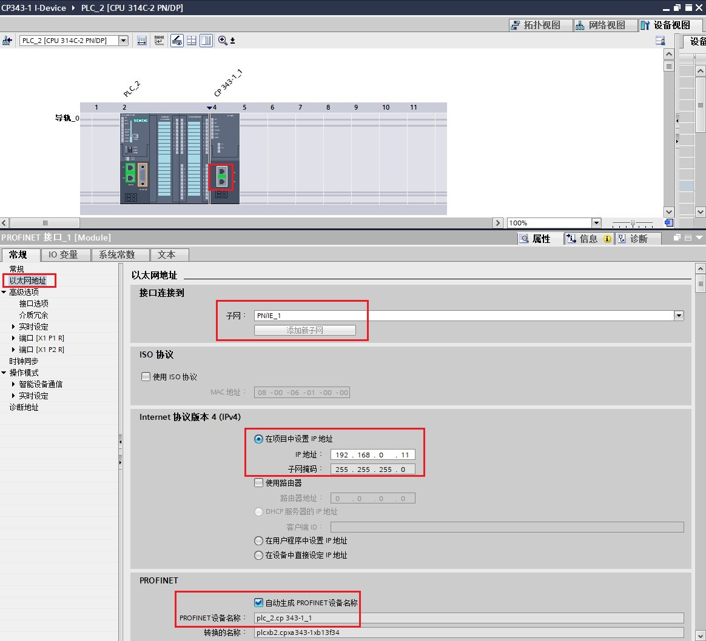{width="1164" height="1058"}

图 3 在新项目中插入 S7-300 和 CP343-1

CP343-1 作为 IO 设备，需要将其操作模式设置为 IO 设备，将 IO
设备分配给控制器 PLC_1。

在"智能设备通信"的"传输区"创建 IO 通信区，控制器的 QB2\~7 共计 6
个字节传送到 IO 设备的接收块中偏移量数据 0\~5 ；控制器的 IB2\~7 共计 6
个字节读取 IO 设备的发送块中偏移量数据 0\~5 ，如图 4 所示。

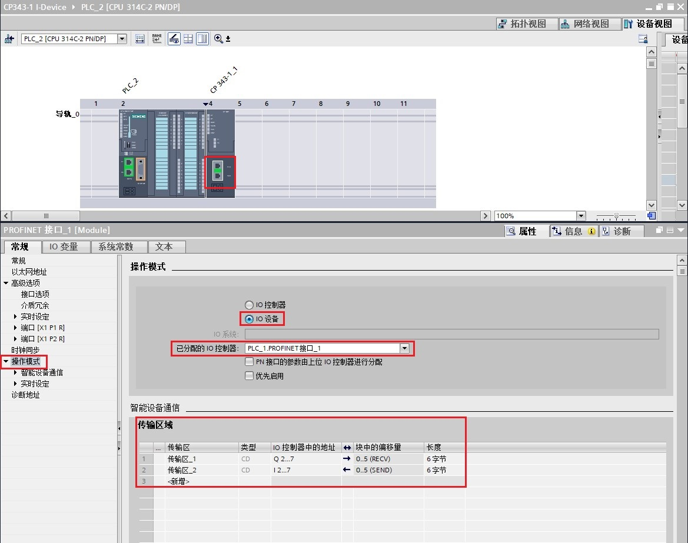{width="1169" height="923"}

图 4 设置 CP343-1 为 IO 设备和智能设备通信传输区域

之后分别将 PLC_1 站和 PLC_2 站硬件组态编译下载到各自的 PLC 中。

#### [1-3 S7-300 编程]{.STYLE3}

本例中，CP343-1 作为 智能 IO 设备，要在 OB1 中编程调用 PNIO_SEND 和
PNIO_RECV 进行数据读写。如图 5 所示。

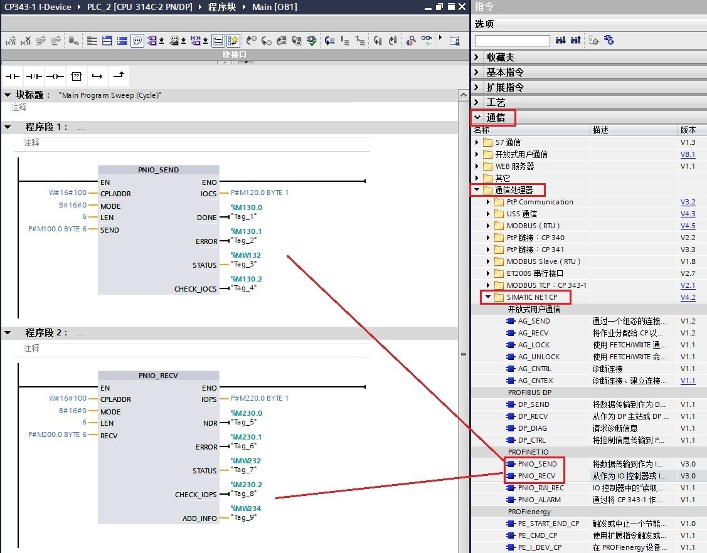{width="1127" height="882"}

图 5 CPU314C-2 PN/DP 中编程

**指令管脚参数说明：**

+-----------------------+-----------------------+-----------------------+
| ::: {align="left"}    |                       | //调用 PNIO_SEND      |
| CALL "PNIO_SEND"      |                       |                       |
| :::                   |                       |                       |
+-----------------------+-----------------------+-----------------------+
| CPLADDR               | ：=W#16#100           | // CP 模板 IO起始地址 |
+-----------------------+-----------------------+-----------------------+
| MODE                  | ：=B#16#0             | // 工作模式：当       |
|                       |                       | CP343-1 仅作为 IO     |
|                       |                       | 控制器或 IO           |
|                       |                       | 设备时，设为 0；当    |
|                       |                       | CP343-1 同时作为 IO   |
|                       |                       | 控制器和 IO           |
|                       |                       | 设备时，设为 1        |
+-----------------------+-----------------------+-----------------------+
| LEN                   | ：=6                  | //                    |
|                       |                       | 要发送的数据          |
|                       |                       | 区长度；该长度始终是  |
|                       |                       | 从数据区地址0开始计算 |
+-----------------------+-----------------------+-----------------------+
| SEND                  | ：=P#M100.0 BYTE 6    | // 发送数据区         |
+-----------------------+-----------------------+-----------------------+
| IOCS                  | ：=P#M120.0 BYTE 1    | //                    |
|                       |                       | 每一用                |
|                       |                       | 户数据字节传送一个状  |
|                       |                       | 态位。长度信息取决于  |
|                       |                       | LEN 参数中的长度。    |
|                       |                       |                       |
|                       |                       | 以程序段 1            |
|                       |                       | 为例，共发送 6        |
|                       |                       | 个字节，每个字节需要  |
|                       |                       | 1 个位，所以共需要 6  |
|                       |                       | 位，即至少需要 1      |
|                       |                       | 字节。\               |
+-----------------------+-----------------------+-----------------------+
| DONE                  | ：=%M130.0            | // 为 1               |
|                       |                       | 时，无错误完成该作业  |
+-----------------------+-----------------------+-----------------------+
| ERROR                 | ：=%M130.1            | // 为 1               |
|                       |                       | 时，有故障发生        |
+-----------------------+-----------------------+-----------------------+
| STATUS                | ：=%MW132             | // 状态代码           |
+-----------------------+-----------------------+-----------------------+
| CHECK_IOCS            | ：=%M130.2            | // 0: 所有 IOCS       |
|                       |                       | 均设置为 GOOD\        |
|                       |                       | // 1: 至少一个 IOCS   |
|                       |                       | 设置为 BAD            |
+-----------------------+-----------------------+-----------------------+

+-----------------------+-----------------------+-----------------------+
| ::: {align="left"}    |                       | //调用 PNIO_RECV      |
| CALL "PNIO_RECV"      |                       |                       |
| :::                   |                       |                       |
+-----------------------+-----------------------+-----------------------+
| CPLADDR               | ：=W#16#100           | // CP 模板 IO起始地址 |
+-----------------------+-----------------------+-----------------------+
| MODE                  | ：=B#16#0             | // 工作模式：当       |
|                       |                       | CP343-1 仅作为 IO     |
|                       |                       | 控制器或 IO           |
|                       |                       | 设备时，设为 0；当    |
|                       |                       | CP343-1 同时作为 IO   |
|                       |                       | 控制器和 IO           |
|                       |                       | 设备时，设为 1        |
+-----------------------+-----------------------+-----------------------+
| LEN                   | ：=6                  | //                    |
|                       |                       | 要接                  |
|                       |                       | 收的数据区长度；该长  |
|                       |                       | 度始终是从数据区地址  |
|                       |                       | 0 开始计算            |
+-----------------------+-----------------------+-----------------------+
| RECV                  | ：=P#M200.0 BYTE 6    | // 发送数据区         |
+-----------------------+-----------------------+-----------------------+
| IOPS                  | ：=P#M220.0 BYTE 1    | //                    |
|                       |                       | 每一用                |
|                       |                       | 户数据字节传送一个状  |
|                       |                       | 态位。长度信息取决于  |
|                       |                       | LEN 参数中的长度。    |
|                       |                       |                       |
|                       |                       | 以程序段 2            |
|                       |                       | 为例，共接收 6        |
|                       |                       | 个字节，每个字节需要  |
|                       |                       | 1 个位，所以共需要 6  |
|                       |                       | 位，即至少需要 1      |
|                       |                       | 字节。                |
+-----------------------+-----------------------+-----------------------+
| NDR                   | ：=%M230.0            | // 为 1               |
|                       |                       | 时，无错误完成该作业  |
+-----------------------+-----------------------+-----------------------+
| ERROR                 | ：=%M230.1            | // 为 1               |
|                       |                       | 时，有故障发生        |
+-----------------------+-----------------------+-----------------------+
| STATUS                | ：=%MW232             | // 状态代码           |
+-----------------------+-----------------------+-----------------------+
| CHECK_IOPS            | ：=%M230.2            | // 0: 所有 IOPS       |
|                       |                       | 均设置为 GOOD\        |
|                       |                       | // 1: 至少一个 IOPS   |
|                       |                       | 设置为 BAD            |
+-----------------------+-----------------------+-----------------------+
| ADD_INFO              | ：=%MW234             | //                    |
|                       |                       | 附加诊断信息；具      |
|                       |                       | 体请查看指令帮助信息  |
+-----------------------+-----------------------+-----------------------+

注意：CPLADDR 是 CP343-1 的 IO 地址的起始地址，如图 6 所示。指令中使用
W#16#100，即 256。

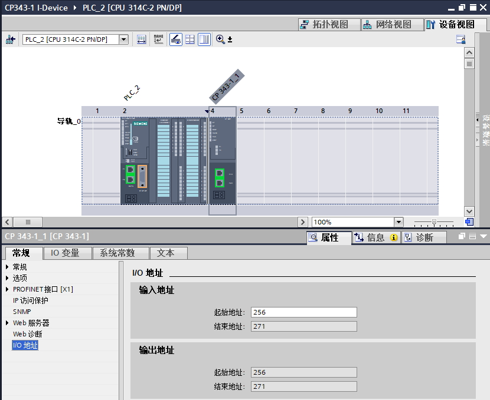{width="830" height="679"}

图 6 CP343-1 地址

#### [1-4 通讯测试]{.STYLE3}

检查无错误后，下载 S7-300
的程序，分别给两个站点新建监控表，添加通信数据区，监控。如图 9 所示。

{width="1158" height="384"}

图 7 通信测试

#### [1-6 地址对应关系的说明]{.STYLE3}

{width="1169" height="547"}

图 8 地址对应关系

从图中可以看到，当 CP343-1 作智能 IO 设备时，传输区块中的偏移量默认从 0
开始，无法修改。地址对应排列关系以逻辑地址大小为序。

### [[]{#b}2. 第二种情况]{.STYLE4}[（ S7-1200 与 CP343-1 在不同TIA项目中）]{.STYLE4}

在不同项目中的操作，即：1217C 作为 IO 控制器，CP343-1 作为 IO 设备在两个
TIA 项目操作，详细步骤如下。

#### 2-1 使用 Step7 V17 创建 S7-300 站 {#使用-step7-v17-创建-s7-300-站-1 .STYLE3}

S7-300 站点创建和第一种情况\--\>[1-2 使用 Step7 V17 创建 S7-300
站]{.STYLE3}章节内容相同，不再赘述。

#### 2-2 配置智能设备通信传输区并导出GSD 文件 {#配置智能设备通信传输区并导出gsd-文件 .STYLE3}

CP343-1 作为 IO 设备，需要将其操作模式设置为 IO 设备，将 IO
设备分配选择未分配。在"智能设备通信"的"传输区"创建 IO 通信区，IO
数据长度分别为6个字节，如图 9 所示。

{width="1156" height="866"}

图 9 设置 CP343-1为 IO 设备和智能设备通信传输区域

编译该项目，在"智能设备通信"属性的下方，找到并点击"导出"按钮，根据提示将
GSD 文件自由选择路径导出（[注意不要修改设备名称]{.STYLE9}）。如图 10、11
所示。

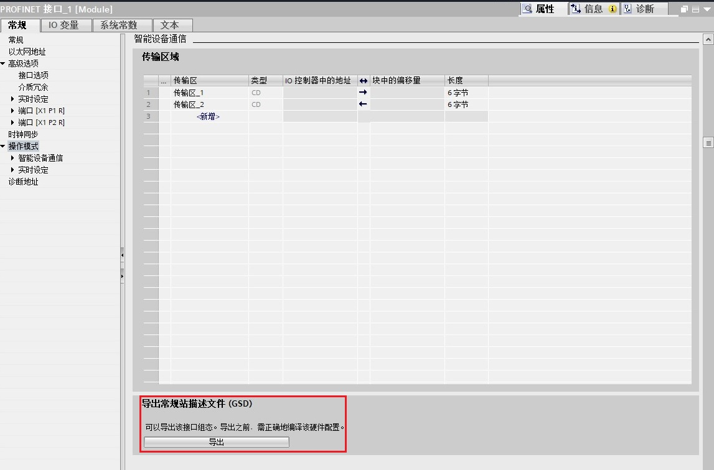{width="1147" height="756"}

图 10 导出 CP343-1的 GSD 文件

{width="647" height="245"}

图 11 导出 CP343-1 的 GSD 文件

#### 2-3 使用 Step7 V17 创建 S7-1200 站 {#使用-step7-v17-创建-s7-1200-站-1 .STYLE3}

S7-1200 站点创建和第一种情况\--\>[1-1 使用 Step7 V17 创建 S7-1200
站]{.STYLE3}章节内容相同，不再赘述。

在 TIA 内导入 CP343-1 的 GSD
文件，路径为"选项"\--\>"管理通用站描述文件（GSD）"。 在源路径选择
IO-device 的 GSD 文件存放路径，选择并安装 GSD 文件。如图 12、13 所示。

{width="553" height="210"}

图 12 TIA 内安装 GSD 文件

{width="642" height="403"}

图 13 选择并安装 GSD 文件

#### 2-4 在S7-1200 中组态 IO-device {#在s7-1200-中组态-io-device .STYLE3}

在网络视图内，硬件目录中找到导入的 CP343-1 ，然后拖拽到网络视图内。点击
CP343-1 网口拖拽到 CPU 1217C 网口上，将 CP343-1 分配给IO 控制器 CPU
1217C 。如图 14 所示。

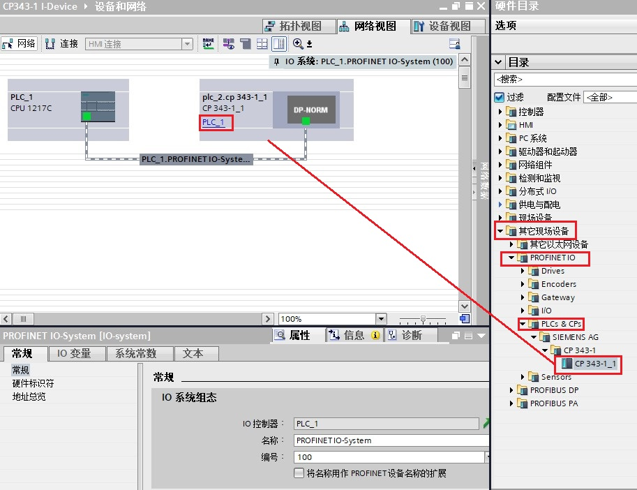{width="913" height="702"}

图 14 IO 控制器项目内组态 IO 设备

在网络视图内，双击 CP343-1 查看 IO 地址分配情况。如图 15 所示。

{width="1186" height="577"}

图 15 IO 设备的 IO 地址分配情况

#### [2-5 硬件组态下载，检查设备名称和 IP 地址是否正确]{.STYLE3}

分别将 S7-300 站和 S7-1200 站下载到各自的 PLC 中。

将 TIA
软件转至在线状态，在网络视图查看站点通信状况。若在线站点显示{width="16"
height="15"}，则表示通信正常。如图 16 所示。

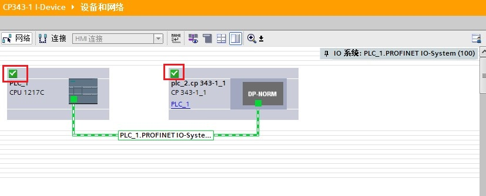{width="827" height="335"}

图 16 TIA 在线查看网络状态

#### [2-6 S7-300 编程]{.STYLE3}

[S7-300 编程 和第一种情况\--\>1-3 S7-300 编程
章节内容相同，不再赘述。]{.STYLE3}

#### [2-7 通讯测试]{.STYLE3}

检查无错误后，分别给两个站点新建监控表，添加通信数据区，监控。如图 17
所示。

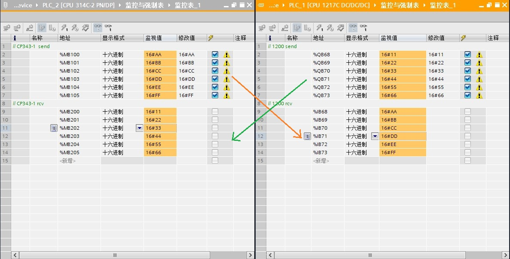{width="1187" height="603"}

图 17 通信测试

#### [2-8 地址对应关系的说明]{.STYLE3}

当 CP343-1 作智能 IO 设备时，传输区块中的偏移量默认从 0
开始，无法修改。在 IO 控制器 S7-1200 PLC 侧导入 GSD 文件后， IO
设备对应主站的 IO 地址可在网络视图内双击 IO 设备查看。如图 15 所示。

本例中，IO 设备传输区对应 IO 控制器 IB68\~IB73 和
QB68\~QB73。对应关系为：

S7-1200 PLC 的 IB68\~IB73 \<\-\--\> S7-300 PLC 的 MB100\~MB105；

S7-1200 PLC 的 QB68\~QB73 \<\-\--\>S7-300 PLC的 MB200\~MB205。

### [[]{#c}3. 第三种情况（S7-1200 在 TIA 项目中，CP343-1 在 Step7 项目）]{.STYLE4}

1217C 作为 IO 控制器，使用 Step7 V17 编程；CP343-1 作为 IO 设备 使用
Step7 V5.6 编程，详细步骤如下。

#### 3-1 使用 Step7 V5.6 创建 S7-300 站 {#使用-step7-v5.6-创建-s7-300-站 .STYLE3}

使用 STEP7 V5.6 创建一个新项目，并组态 CPU 314C-2 PN/DP, 添加 CP343-1
，设置 IP 地址并添加子网，并确认设备名称，本示例中设备名称是 PN-IO
。如图 18 所示。

{width="1538" height="659"}

图 18 在新项目中插入 S7-300 站

#### 3-2 配置智能设备通信传输区并导出 GSD 文件 {#配置智能设备通信传输区并导出-gsd-文件 .STYLE3}

CP343-1 作为 IO 设备需设置 IO 设备模式。在 PN-IO 中，选择 I-Device
页，勾选 I-device mode，并在"智能设备通信"的"传输区"创建 IO 通信区，IO
数据长度分别为 6 个字节，如图 19、20、21 所示。

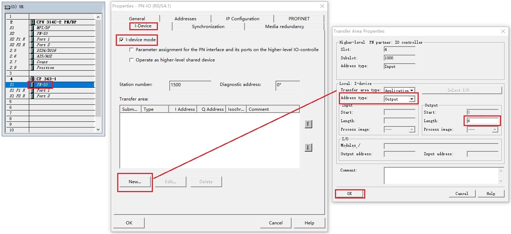{width="1434" height="659"}

图 19 设置 CP343-1 为 IO 设备和智能设备通信传输输出区域

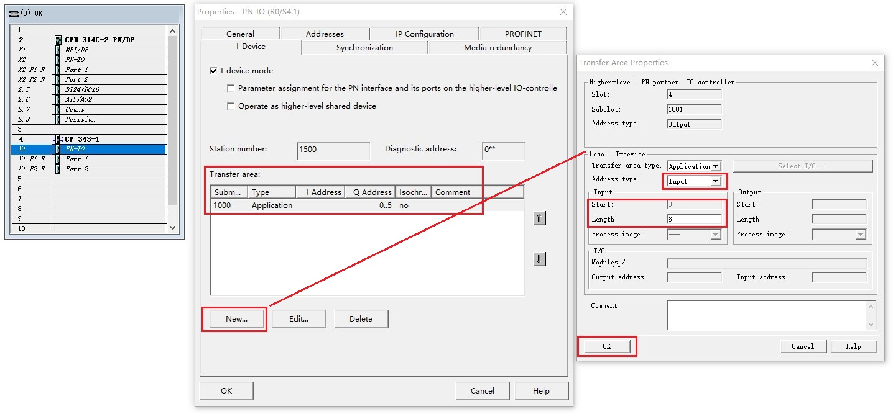{width="1436" height="667"}

图 20 设置 CP343-1 为 IO 设备和智能设备通信传输输入区域

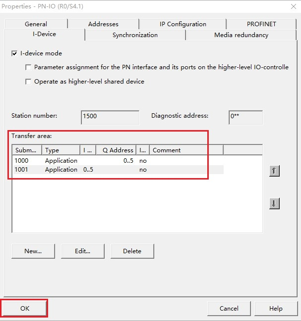{width="607" height="649"}

图 21 智能设备通信传输区域配置完成

CP343-1 智能设备传输区域配置完毕后，生成并导出 GSD 文件。如图 22 所示。

{width="1422" height="746"}

图 22 生成 CP343-1 的 GSD 文件

生成 GSD 文件后，点击导出并选择目标路径，如图 23 所示。

{width="541" height="259"}

图 23 导出 CP343-1 的 GSD 文件

#### 3-3 使用 Step7 V17 创建 S7-1200 站 {#使用-step7-v17-创建-s7-1200-站-2 .STYLE3}

[S7-1200 站点创建及 GSD 导入方法和第二种情况\--\>2-3 使用 Step7 V17 创建
S7-1200 站 章节内容相同，不再赘述。]{.STYLE3}

#### 3-4 在S7-1200 中组态 IO-device {#在s7-1200-中组态-io-device-1 .STYLE3}

在网络视图内，硬件目录中找到导入的 CP343-1，然后拖拽到网络视图内。点击
CP343-1 网口拖拽到 CPU 1217C 网口上，将 CP343-1 分配给 IO 控制器 CPU
1217C。如图 24 所示。

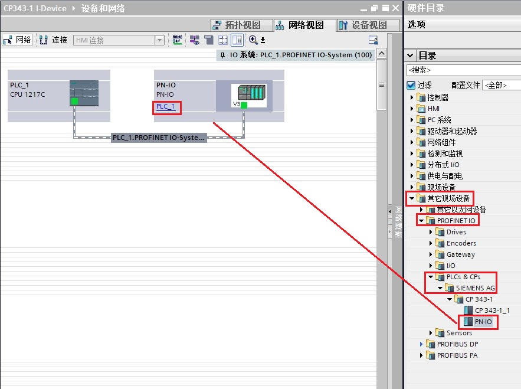{width="883" height="659"}

图 24 IO 控制器项目内组态 IO 设备

在网络视图内，双击 CP343-1 查看 IO 地址分配情况。如图 25 所示。

{width="1085" height="442"}

图 25 IO 设备的IO地址分配情况

#### [3-5 硬件组态下载，检查设备名称和 IP 地址是否正确]{.STYLE3}

分别将 S7-300 站和 S7-1200 站下载到各自的 PLC 中。

将 TIA
软件转至在线状态，在网络视图查看站点通信状况。若在线站点显示{width="16"
height="15"}，则表示通信正常。如图 26 所示。

{width="827" height="335"}

图 26 TIA 在线查看网络状态

#### [3-6 S7-300 编程]{.STYLE3}

本例中，CP343-1 作为 智能 IO 设备，要在 OB1 中编程调用 PNIO_SEND 和
PNIO_RECV 进行数据读写。如图 27 所示。

{width="818" height="974"}

图 27 CPU314C-2 PN/DP 中编程

**指令管脚参数说明：**

+-----------------------+-----------------------+-----------------------+
| ::: {align="left"}    |                       | //调用 PNIO_SEND      |
| CALL "PNIO_SEND"      |                       |                       |
| :::                   |                       |                       |
+-----------------------+-----------------------+-----------------------+
| CPLADDR               | ：=W#16#100           | // CP 模板 IO起始地址 |
+-----------------------+-----------------------+-----------------------+
| MODE                  | ：=B#16#0             | // 工作模式：当       |
|                       |                       | CP343-1 仅作为 IO     |
|                       |                       | 控制器或 IO           |
|                       |                       | 设备时，设为0；当     |
|                       |                       | CP343-1 同时作为 IO   |
|                       |                       | 控制器和 IO           |
|                       |                       | 设备时，设为 1        |
+-----------------------+-----------------------+-----------------------+
| LEN                   | ：=6                  | //                    |
|                       |                       | 要发送的数据          |
|                       |                       | 区长度；该长度始终是  |
|                       |                       | 从数据区地址0开始计算 |
+-----------------------+-----------------------+-----------------------+
| SEND                  | ：=P#M100.0 BYTE 6    | // 发送数据区         |
+-----------------------+-----------------------+-----------------------+
| IOCS                  | ：=P#M120.0 BYTE 1    | //                    |
|                       |                       | 每一用户              |
|                       |                       | 数据字节传送一个状态  |
|                       |                       | 位。长度信息取决于LEN |
|                       |                       | 参数中的长度。        |
|                       |                       |                       |
|                       |                       | 以程序段 1            |
|                       |                       | 为例，共发送 6        |
|                       |                       | 个字节，每个字节需要  |
|                       |                       | 1 个位，所以共需要 6  |
|                       |                       | 位，即至少需要 1      |
|                       |                       | 字节。\               |
+-----------------------+-----------------------+-----------------------+
| DONE                  | ：=%M130.0            | // 为 1               |
|                       |                       | 时，无错误完成该作业  |
+-----------------------+-----------------------+-----------------------+
| ERROR                 | ：=%M130.1            | // 为 1               |
|                       |                       | 时，有故障发生        |
+-----------------------+-----------------------+-----------------------+
| STATUS                | ：=%MW132             | // 状态代码           |
+-----------------------+-----------------------+-----------------------+
| CHECK_IOCS            | ：=%M130.2            | // 0: 所有 IOCS       |
|                       |                       | 均设置为 GOOD\        |
|                       |                       | // 1: 至少一个 IOCS   |
|                       |                       | 设置为 BAD            |
+-----------------------+-----------------------+-----------------------+

+-----------------------+-----------------------+-----------------------+
| ::: {align="left"}    |                       | //调用 PNIO_RECV      |
| CALL "PNIO_RECV"      |                       |                       |
| :::                   |                       |                       |
+-----------------------+-----------------------+-----------------------+
| CPLADDR               | ：=W#16#100           | // CP 模板 IO起始地址 |
+-----------------------+-----------------------+-----------------------+
| MODE                  | ：=B#16#0             | // 工作模式：当       |
|                       |                       | CP343-1 仅作为 IO     |
|                       |                       | 控制器或 IO           |
|                       |                       | 设备时，设为0；当     |
|                       |                       | CP343-1 同时作为 IO   |
|                       |                       | 控制器和 IO           |
|                       |                       | 设备时，设为 1        |
+-----------------------+-----------------------+-----------------------+
| LEN                   | ：=6                  | //                    |
|                       |                       | 要接                  |
|                       |                       | 收的数据区长度；该长  |
|                       |                       | 度始终是从数据区地址  |
|                       |                       | 0 开始计算            |
+-----------------------+-----------------------+-----------------------+
| RECV                  | ：=P#M200.0 BYTE 6    | // 发送数据区         |
+-----------------------+-----------------------+-----------------------+
| IOPS                  | ：=P#M220.0 BYTE 1    | //                    |
|                       |                       | 每一用户              |
|                       |                       | 数据字节传送一个状态  |
|                       |                       | 位。长度信息取决于LEN |
|                       |                       | 参数中的长度。        |
|                       |                       |                       |
|                       |                       | 以程序段2为例，共接收 |
|                       |                       | 6                     |
|                       |                       | 个字节，每个字节需要  |
|                       |                       | 1 个位，所以共需要 6  |
|                       |                       | 位，即至少需要 1      |
|                       |                       | 字节。                |
+-----------------------+-----------------------+-----------------------+
| NDR                   | ：=%M230.0            | // 为 1               |
|                       |                       | 时，无错误完成该作业  |
+-----------------------+-----------------------+-----------------------+
| ERROR                 | ：=%M230.1            | // 为 1               |
|                       |                       | 时，有故障发生        |
+-----------------------+-----------------------+-----------------------+
| STATUS                | ：=%MW232             | // 状态代码           |
+-----------------------+-----------------------+-----------------------+
| CHECK_IOPS            | ：=%M230.2            | // 0: 所有 IOPS       |
|                       |                       | 均设置为 GOOD\        |
|                       |                       | // 1: 至少一个 IOPS   |
|                       |                       | 设置为 BAD            |
+-----------------------+-----------------------+-----------------------+
| ADD_INFO              | ：=%MW234             | //                    |
|                       |                       | 附加诊断信息；具      |
|                       |                       | 体请查看指令帮助信息  |
+-----------------------+-----------------------+-----------------------+

注意：CPLADDR是 CP343-1 的 IO 地址的起始地址，如图 28 所示。指令中使用
W#16#100，即256。

{width="660" height="708"}

图 28 CP343-1 起始地址

#### [3-7 通讯测试]{.STYLE3}

检查无错误后，分别给两个站点新建监控表，添加通信数据区，监控。如图 28
所示。

{width="1340" height="530"}

图 29 通信测试

#### [3-8 地址对应关系的说明]{.STYLE3}

当 CP343-1 作智能 IO 设备时，传输区块中的偏移量默认从 0
开始，无法修改。在 IO 控制器 S7-1200 PLC 侧导入 GSD 文件后， IO
设备对应主站的 IO 地址可在网络视图内双击 IO 设备查看。如图25 所示。

本例中， IO 设备传输区对应 IO 控制器 IB68\~IB73 和 QB68\~QB73
。对应关系为：

S7-1200 PLC 的 IB68\~IB73 \<\-\--\>S7-300 PLC 的 MB100\~MB105；

S7-1200 PLC 的 QB68\~QB73 \<\-\--\> S7-300 PLC 的 MB200\~MB205。
