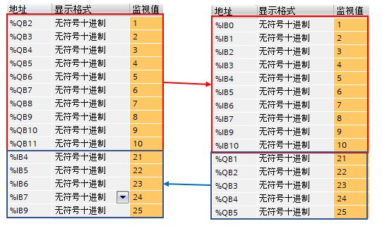

### PN / PN Coupler ------ 不在同一TIA Portal 项中目组态- GSD

PROFINET IO 通信不支持跨网段的实时通信，此外两个 PROFINET IO
控制器如果在其中没有智能设备情况下通常也无法直接进行 PROFINET IO
通信。此时，可以使用 PN/PN Coupler 来解决这些问题。

PN/PN Coupler 具有两个 PROFINET
接口，每个接口连接至不同子网。两个子网彼此电气隔离。在两个子网中 PN/PN
Coupler 作为两个 IO 设备分别与不同的 IO 控制器通信，两个 IO
设备之间的数据交换就实现了不同 IO 控制器之间的通信。

#### 实验任务

本文档要实现的任务是：S7-1200 和 S7-1500 均作为 PROFINET IO
控制器，并且两个控制器的 IP 地址不在同一网段，实现两个 CPU 之间的
PROFINET IO 通信。 S7-1200 输出 10 个字节给 S7-1500；S7-1500 输出 5
个字节给 S7-1200。

具体网络结构及通信角色如图 1 所示，参数分配如表 1 所示：

{width="347" height="276"}

图 1. 网络结构及通信角色

表1.

  ----------------------- -------------------- --------------- ---------------------------------------------------
  **硬件**                **通信角色**         **IP地址**      **数据交换**
  S7-1200                 IO 控制器            192.168.0.124   输出 10 个字节数据；输入 5 个字节数据
  S7-1500                 IO 控制器            192.168.2.155   输入 10 个字节数据；输出 5 个字节数据
  PN/PN Coupler X1 接口   S7-1200 的 IO 设备   192.168.0.158   与 S7-1200 交互数据，并转给 PN/PN Coupler X2 接口
  PN/PN Coupler X2 接口   S7-1500 的 IO 设备   192.168.2.158   与 S7-1500 交互数据，并转给 PN/PN Coupler X1 接口
  ----------------------- -------------------- --------------- ---------------------------------------------------

要实现该通信，可以有 3 种方法：

> [**1. S7-1200 和 S7-1500 在同一 TIA Portal 项目中：从硬件目录中添加
> PN/PN Coupler 组态**](01-sameProject.html)
>
> **[2. S7-1200 和 S7-1500 不在同一 TIA Portal
> 项目中：一方从硬件目录中添加 PN/PN Coupler 组态，导出 GSD
> 文件给另一方组态](02-twoProjectHsp.html)**
>
> **3. S7-1200 和 S7-1500 不在同一 TIA Portal
> 项目中：双方都使用从官网下载的 PN/PN Coupler 的 GSD 文件组态**

本文档介绍第 3 种方法。

#### 实验环境

博途软件： TIA Portal STEP7 Professional V18

硬件如表 2 所示：

表2.

  -------------------- -------------------- --------------
  **名称**             **订货号**           **固件版本**
  CPU 1214C DC/DC/DC   6ES7214-1AG40-0XB0   V4.6
  CPU 1515-2 PN        6ES7515-2AM01-0AB0   V2.9
  PN/PN Coupler        6ES7158-3AD10-0XA0   V4.2
  -------------------- -------------------- --------------

需要使用的 GSD 文件可以从西门子全球技术资源库下载：

**PROFINET GSD files : Gateway：
<https://support.industry.siemens.com/cs/cn/zh/view/23742537>**

#### 第一个项目组态

1\. 新建一个项目，添加 CPU 1214 DC/DC/DC V4.6，名称设置为
IOController1200，如图 2 所示。

{width="704" height="448"}

图 2. 添加 S7-1200CPU

2\. 在弹出的 S7-1200 安全设置对话框中设置，禁用保护 PLC 机密的 PLC
数据；取消勾选仅支持 PG/PC 和 HMI 的安全通信；将 PLC
访问保护设置为完全访问权限；最终设置结果如图 3 所示。

注意： PLC 安全设置可以根据实际需要进行设置！

{width="787" height="282"}

图 3. 安全设置概览

3\. S7-1200 以太网地址设置为 192.168.0.124，如图 4 所示。

{width="663" height="377"}

图 4. 设置 S7-1200 以太网地址

4\.
点击菜单栏选项按钮，点击"管理通用站描述文件"，弹出的对话框中点击已安装的
GSD，在源路径中选择网上下载的 GSD 文件存储的正确路径，勾选待安装的 GSD
文件复选框，点击安装按钮进行安装，安装完成后等待更新硬件目录，更新完成后就可以在硬件目录中找到该
GSD 文件了。如图 5 所示。

{width="731" height="497"}

图 5. 安装 GSD 文件

5\. 在网络视图中添加 PN/PN Coupler ，查找模块按照右侧路径：硬件目录 \>
其他现场设备 \> PROFINET IO \> Gateway \> SIEMENS AG \> PN/PN Coupler \>
PN/PN CouplerV4.2 \> PN/PN Coupler.X1，如图 6 所示。

{width="247" height="708"}

图 6. 添加 PN/PN Coupler X1 接口

6\. 在 PN/PN Coupler 的设备视图，选中 X1 接口，在属性 \> 常规\>
以太网地址属性中设置 IP 地址为 192.168.0.158； 取消勾选自动生成 PROFINET
设备名称，设置设备名称为 pnpncpuplerx1，如图 7 所示。

{width="648" height="401"}

图 7. 设置 PN/PN Coupler X1 接口 IP 地址

7\. 在网络视图中，点击网络，鼠标点击未分配三个字，在出现的下拉菜单中选择
IO 控制器，选择 IOController1200.PROFINET接口_1 作为 IO 控制器，如图 8
所示。

{width="590" height="253"}

图 8. PN/PN Coupler X1 接口分配 IO 控制器

8\. 在 PN/PN Coupler
的设备视图，设备概览中可以添加传输区，硬件目录中点击模块下方的I IO
Modules 中添加 OUT 和 IN 区域，如图 9 所示。

由于 GSD 文件中带的传输区条目长度是固定的，所以

> 输出 10 个字节可以通过 8 Byte+2 Byte 实现；
>
> 输入5 个字节，可以通过 4 Byte+DS_1+1Byte+DS_1 实现，其中 DS
> 表示数据状态，如此设置输入将会占用 7 个字节，5 个字节数据，2
> 个字节数据状态

注意： 此处设置的传输区条目方向及长度需要与 X2 接口设置的条目匹配对应！

{width="1203" height="643"}

图 9. 添加传输区

9\. 将 S7-1200 程序分别做软件和硬件的编译，下载至 CPU 中。

10\. 对 PN/PN Coupler 的 X1 接口进行设备名称的分配

> 网络视图中，鼠标右键选中 X1 侧模块，
> 弹出的下拉菜单中选择分配设备名称，如图 10 所示。
>
> 弹出的"分配 PROFINET 设备名称"对话框中，点击"更新列表"搜索所连接的 IO
> 设备，如果设备名称" 状态" 列显示 "未分配设备名称" 或者
> "设备名称不同"，点击分配设备名称，即可分配设备名称，如图 11 所示。

{width="638" height="509"}

图 10. 选择分配设备名称

{width="812" height="561"}

图 11. 更新列表并分配设备名称

#### 第二个项目组态

1\. 创建另外一个新项目，添加 CPU1515-2PN V2.9 ，名称设置为
IOController1500，如图 12 所示。

{width="699" height="315"}

图 12. 添加 S7-1500 CPU

2\. 在弹出的 S7-1500 安全设置对话框中设置，禁用保护 PLC 机密的 PLC
数据；取消勾选仅支持 PG/PC 和 HMI 的安全通信； 将 PLC
访问保护设置为完全访问权限；最终设置结果如图 13 所示。

注意： PLC 安全设置可以根据实际需要进行设置！

{width="786" height="286"}

图 13. S7-1500 安全设置

3\. S7-1500 以太网地址设置为 192.168.2.155，如图 14 所示。

{width="674" height="473"}

图 14. S7-1500 以太网地址设置

4\. 如果与第一个项目使用的是同一个 TIA Portal 软件，无需重新安装 GSD
文件，如果是不同的博途软件，需要单独安装 PN/PN Coupler 的 GSD
文件，方法步骤可以参考第一个项目 GSD 文件的安装。

5\. 在网络视图中添加 PN/PN Coupler ，查找模块按照右侧路径：硬件目录 \>
其他现场设备 \> PROFINET IO \> Gateway \> SIEMENS AG \> PN/PN Coupler \>
PN/PN CouplerV4.2 \> PN/PN Coupler. X2 ，如图 15 所示。

{width="250" height="686"}

图 15. 添加 PN/PN Coupler 模块

6\. 网络视图中，点击网络，点击 PN/PN Coupler GSD 文件左下角未分配，选择
IOController1500.PROFINET接口_1 为其 IO 控制器，如图 16 所示。

{width="650" height="215"}

图 16. 为 PN/PN Coupler.X2 分配控制器

7\. 在 PN/PN Coupler 的设备视图，选中 X2 接口，在属性 \> 常规 \>
以太网地址属性中设置 IP 地址为 192.168.2.158； 取消勾选自动生成 PROFINET
设备名称，设置设备名称为 pnpncpuplerx2，如图 17 所示。

{width="649" height="403"}

图 17. 设置 PN/PN Coupler X2 接口 IP 地址

8\. 双击 PN/PN Coupler X2 GSD
文件进入其设备视图，在设备视图的设备概览中可以设置传输区，如图 18 所示。

X2 接口设置传输区条目字节数及方向均需要与 X1
接口设置对应匹配，具体设置可以参考列表3.

表3.

  ---------- ------------------ ------- ------------------
             X1 接口            方向    X2 接口
  传输区 1   OUT 8 Byte         \--\>   IN 8 Byte + DS_1
  传输区 2   OUT 2 Byte         \--\>   IN 2 Byte + DS_1
  传输区 3   IN 4 Byte + DS_1   \<\--   OUT 4 Byte
  传输区 4   IN 1 Byte + DS_1   \<\--   OUT 1 Byte
  ---------- ------------------ ------- ------------------

{width="1032" height="642"}

图 18. X2 接口设置传输区

9\. S7-1500 项目硬件和软件分别编译，将程序下载至 CPU 中。

10\. 为 PN/PN Coupler.X2 分配设备名称，可以参考 PN/PN Coupler.X1
的方法。

#### 调试

1\. 为 PN/PN Coupler 供电：

> 如对两个连接 (PS1 / PS2) 施加电压，则 PN/PN Coupler 自动使用 PS1
> 的电压源。一个电压源发生故障，则 PN/PN Coupler
> 自动切换到另一个电压源。
>
> 如仅将 PN/PN Coupler 连接到一个电源，则最好将其连接到 PS1。

2\. 在 S7-1200 和 S7-1500 分别创建监控表，添加对应变量，S7-1200 输出的
10 个字节数据值分别修改为 1 \~ 10， S7-1500 输出的 5 个字节数值分别是 21
\~ 25， 修改数值后监视对侧接收数据正常，如图 19 所示。

{width="541" height="321"}

图 19. 监控表监视数据交换
