### S7-1200 和 S7-300 PN CPU/S7-400 的 Profinet 通信（S7-1200 作为 智能 IO 设备）

S7-1200 V4.0 及以上固件版本的 CPU 支持智能 IO 设备功能，故可使用 S7-1200
作为智能 IO 设备和 S7-300 PN CPU 进行 Profinet 通信。本例中将 S7-300
作为控制器，连接作为智能 IO 设备的 S7-1200 CPU 实现 Profinet
通信；下面详细介绍使用方法。

此外，本例也可以用在 S7-1200 和 S7-400 PN CPU/CP443-1 的 Profinet
通信（S7-1200 作为 IO 设备）。

硬件：

1.  CPU 1215C DC/DC/DC，V4.5
2.  CPU 315-2PN/DP，V3.2

软件：

1.  TIA PORTAL V17
2.  Step7 V5.7

S7-300 集成的 PN 接口连接 S7-1200 的 PN 接口，这种方式可以分 3
种情况来操作，具体如下：

1.  [第一种情况：CPU 1215C 和 CPU 315 使用 TIA PORTAL
    编程，在同一个项目中操作。](02-S7-300.html#a)
2.  [第二种情况：CPU 1215C 和 CPU 315 使用 TIA PORTAL
    编程，在不同项目中操作。](02-S7-300.html#b)
3.  [第三种情况：CPU 1215C 使用 TIA PORTAL 编程，而 CPU 315 使用 Step7
    编程。](02-S7-300.html#c)

### []{#a}1. 第一种情况（CPU 1215C 和 CPU 315 使用 TIA PORTAL 编程，在同一个项目中操作）

CPU 315-2 PN/DP 作为 IO 控制器，CPU 1215C 作为 IO 设备，使用 TIA PORTAL
在一个项目中编程，详细步骤如下。

### 1-1 使用 TIA PORTAL 创建 S7-300 站 点

使用 TIA PORTAL 创建一个新项目，并通过\"添加新设备\"组态 S7-300 站
PLC_1，选择 CPU 315-2 PN/DP；设置 IP
地址，并确认设备名称，本示例中设备名称是 PLC_1，如图 1 所示。

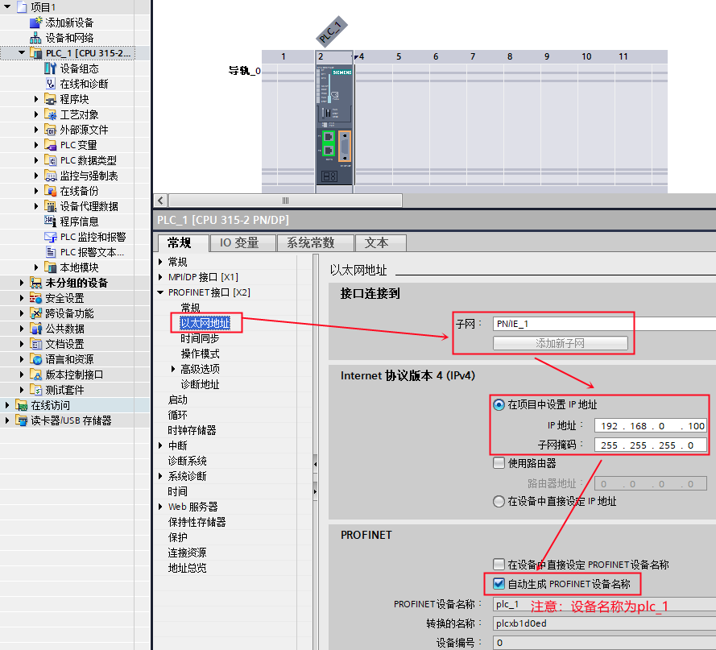{width="889" height="807"}

图 1. 在项目中插入 S7-300 站

### 1-2 使用 TIA PORTAL 创建 S7-1200 站点

使用 TIA PORTAL 创建一个新项目，并通过\"添加新设备\"组态 S7-1200 站
PLC_2，选择 CPU1215C DC/DC/DC；设置 IP
地址，并确认设备名称，本示例中设备名称是 PLC_2，如图 2 所示。

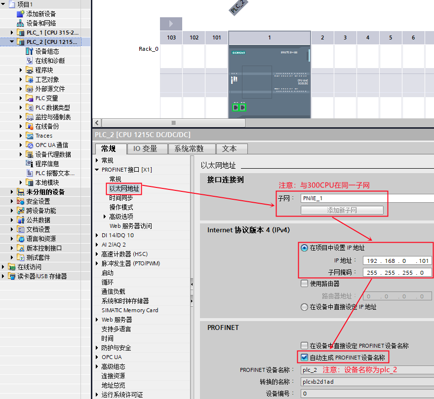{width="879" height="809"}

图 2. 在项目中插入 S7-1200 站

S7-1200 作为 IO 设备，需要将其操作模式设置为 IO 设备，并将 IO
设备分配给控制器 PLC_1，如图 3 所示。

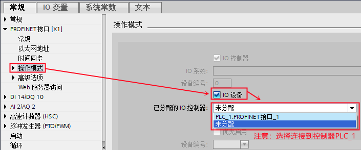{width="705" height="294"}

图 3. S7-1200 设置为 IO 设备

然后，在\"智能设备通信\"的\"传输区域\"创建 IO 通信传输区，控制器的
QB10\~14 共计 5 个字节传送到 IO 设备的 IB10\~14 ；控制器的 IB10\~14 共计
5 个字节读取来自 IO 设备的 QB10\~14，如图 4 所示。

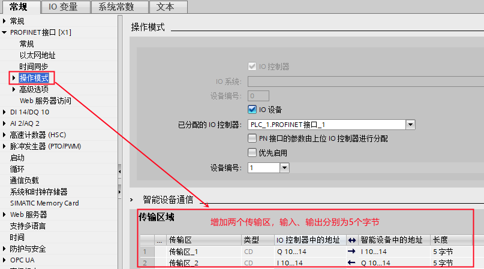{width="807" height="449"}

图 4. 创建 IO 通信区

### 1-3 编程、下载

1、CPU 315-2 PN/DP 作为控制器，需要调用 OB83 和
OB86（防止控制器无法正常连接作为 IO 设备的 S7-1200
时，出现的停机现象），如图 5 所示。

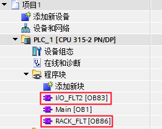{width="266" height="211"}

图 5. 编程调用 OB83 和 OB86

2、检查无错误后，分别将 PLC_1 站和 PLC_2 站下载到各自的 PLC 中。

### 1-4 通讯测试

分别给两个站点新建监控表，添加通信数据区，并进行监控，如图 6 所示。

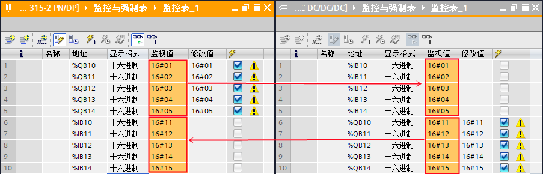{width="903" height="290"}

图 6. 通信测试

### []{#b}2. 第二种情况（CPU 1215C 和 CPU 315 使用 TIA PORTAL 编程，在不同项目中操作）

CPU 315-2PN/DP 作为 IO 控制器，CPU 1215C 作为 IO 设备，使用 TIA PORTAL
在不同项目中编程，详细步骤如下。

### 2-1 使用 TIA PORTAL 创建 S7-1200 站

使用 TIA PORTAL 创建一个新项目，并通过\"添加新设备\"组态 S7-1200
站，选择 CPU1215C DC/DC/DC，设置 IP
地址，并确认设备名称，本示例中设备名称是 io-device，如图 7 所示。

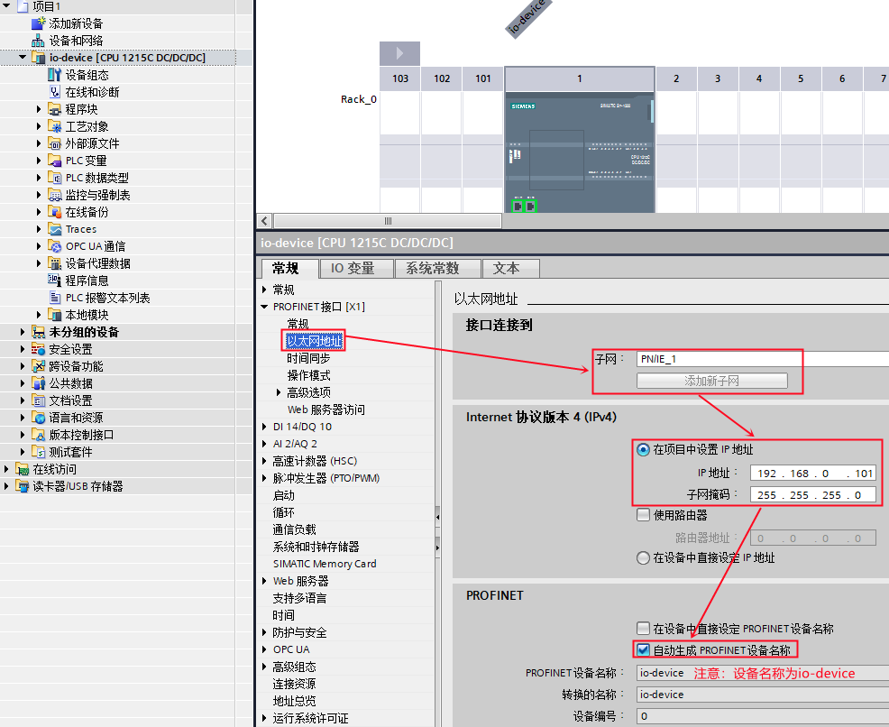{width="986" height="806"}

图 7. 在新项目中插入 S7-1200 站

S7-1200 作为 IO 设备，需要将其操作模式设置为 IO
设备，并在\"智能设备通信\"的\"传输区域\"创建 IO 通信传输区，控制器将传输
5 个字节到 IO 设备的 IB10\~14 、IO 设备将 QB10\~14 共计 5
个字节传送给控制器，如图 8 所示。

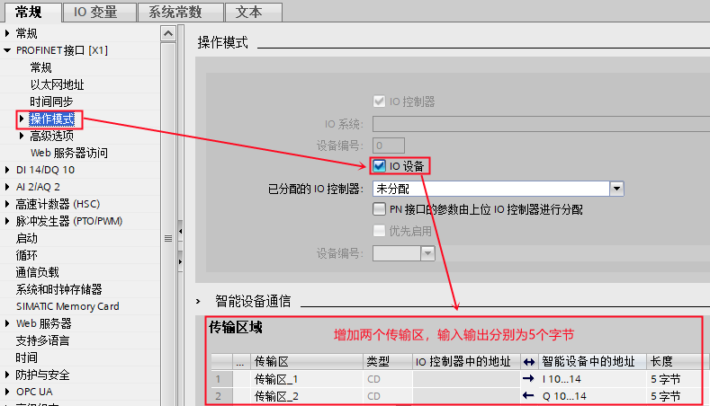{width="789" height="452"}

图 8. S7-1200 设置为 IO 设备，并创建 IO 通信区

### 2-2 导出 IO 设备的 GSD 文件

编译该项目，在\"智能设备通信\"属性的下方，找到并点击\"导出\"按钮，根据提示将
GSD 文件导出（注意不要修改设备名称），如图 9 所示。

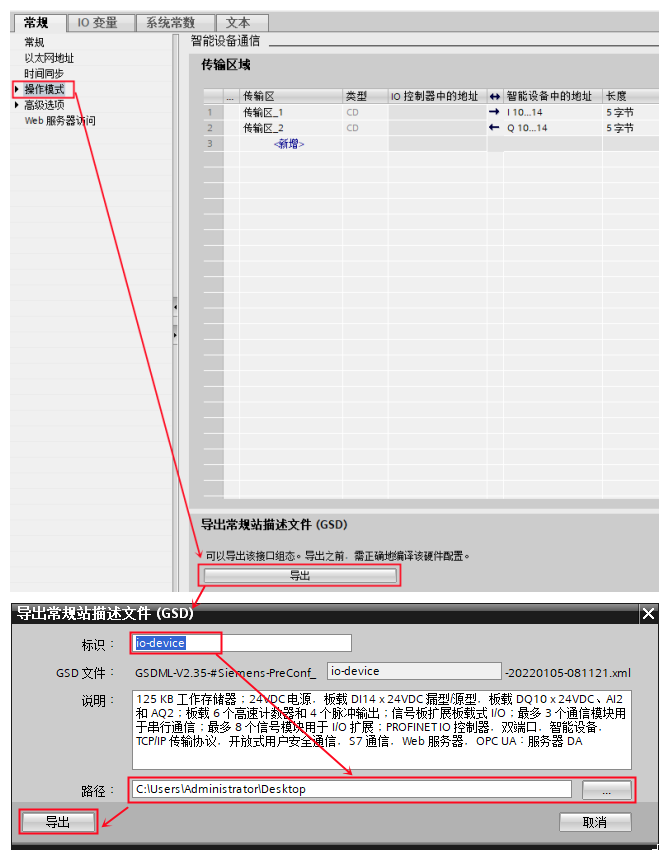{width="669" height="860"}

图 9. 导出 IO 设备的 GSD 文件

### 2-3 使用 TIA PORTAL 创建 S7-300 站

使用 TIA PORTAL 再创建一个新项目，并组态 CPU 315-2 PN/DP，设置 IP
地址，并确认设备名称，本示例中设备名称是 PLC_1，如图 10 所示。

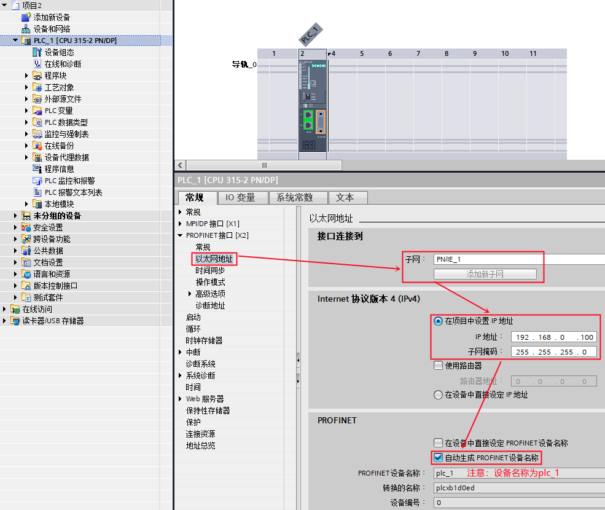{width="985" height="830"}

图 10. 在新项目中插入 S7-300 站

通过 TIA PORTAL 的"选项"菜单下的"管理通用站描述文件（GSD）"，进入 GSD
安装界面， 在源路径选择 IO 设备 的 GSD 文件存放路径，如图 11 所示。

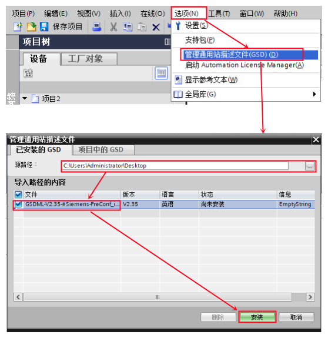{width="558" height="575"}

图 11. 安装 IO 设备 的 GSD 文件

### 2-4 在 TIA PORTAL 中组态 IO 设备

在 TIA PORTAL 的网络视图中，将硬件目录路径：Other field
devices（其它现场设备）\--\> PROFINET IO\--\>PLCs&CPs\--\>SIEMENS
AG\--\> CPU 1215C DC/DC/DC \--\> io-device 拖拽到网络视图中，如图 12
所示。

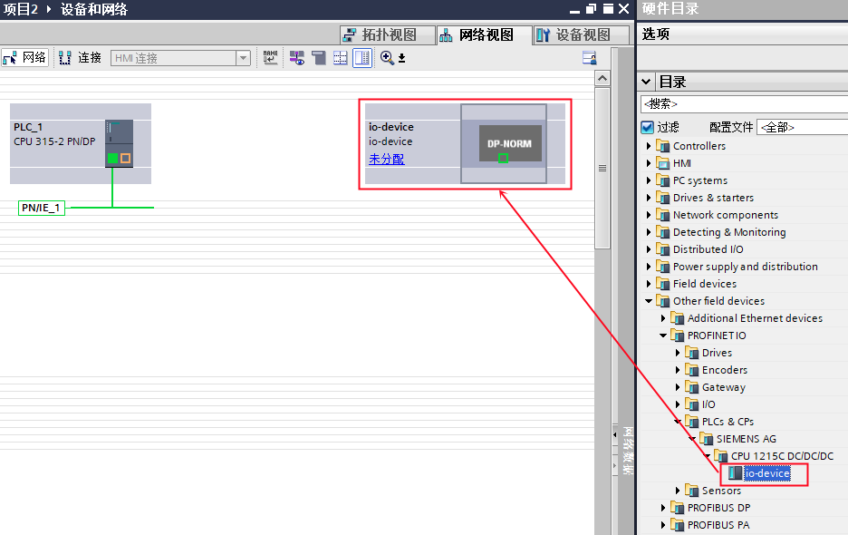{width="936" height="590"}

图 12. 组态 IO 设备

然后为 io-device 分配 IO 控制器，如图 13 所示。

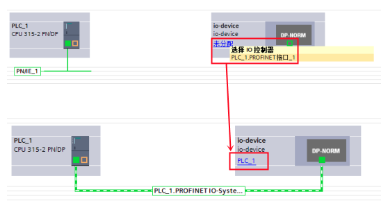{width="558" height="303"}

图 13. 分配 IO 控制器

进入到设备视图中的设备概览设置传输区地址，如图 14 所示。

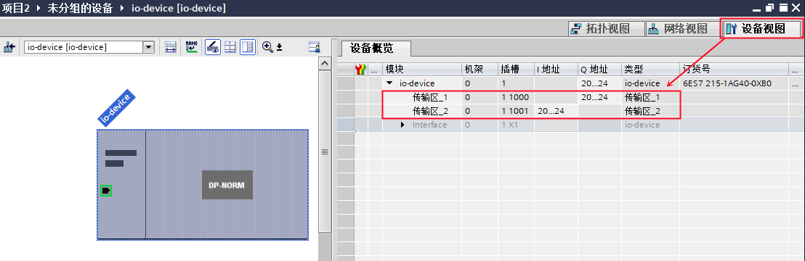{width="1108" height="360"}

图 14. 分配传输区地址

### 2-5 编程、下载

1、CPU 315-2 PN/DP 作为控制器，需要调用 OB83 和
OB86（防止控制器无法正常连接作为 IO 设备的 S7-1200
时，出现的停机现象），如图 15 所示。

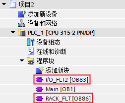{width="252" height="208"}

图 15. 编程调用 OB83 和 OB86

2、检查无错误后，分别将 S7-300 站和 S7-1200 站下载到各自的 PLC 中。

### 2-6 通讯测试

分别给两个站点新建监控表，添加通信数据区，监控。如图 16 所示。

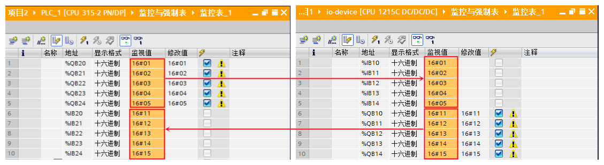{width="1129" height="310"}

图 16. 测试结果

### []{#c}3. 第三种情况（CPU 1215C 使用 TIA PORTAL ，而 CPU 315 使用 Step7 ）

不在一个项目中的操作，即：CPU 315-2PN/DP 作为 IO 控制器 使用 Step7
编程；CPU 1215C 作为 IO 设备，使用 TIA PORTAL 编程，详细步骤如下。

### 3-1 使用 TIA PORTAL 创建 S7-1200 站

使用 TIA PORTAL 创建一个新项目，并通过\"添加新设备\"组态 S7-1200 站
io-device ，选择 CPU1215C DC/DC/DC；设置 IP
地址，并确认设备名称，本示例中设备名称是 io-device。如图 17 所示。

{width="986" height="806"}

图 17. 在新项目中插入 S7-1200 站

S7-1200 作为 IO 设备，需要将其操作模式设置为 IO 设备。如图 18 所示。

{width="789" height="452"}

图 18. S7-1200 设置为 IO 设备，并创建 IO 通信区

然后，在\"智能设备通信\"的\"传输区\"创建 IO 通信区，控制器将传输 5
个字节到 IO 设备的 IB10\~14 ；IO 设备将 QB10\~14 共计 5
个字节传送给控制器。

### 3-2 导出 IO 设备的 GSD 文件

编译该项目，在\"智能设备通信\"属性的下方，找到并点击\"导出\"按钮，根据提示将
GSD 文件导出（注意不要修改设备名称）。如图 19 所示。

{width="669" height="860"}

图 19. 导出 IO 设备的 GSD 文件

### 3-3 使用 Step7 创建 S7-300 站

使用 Step7 创建一个新项目，并组态 CPU 315-2 PN/DP，设置 IP
地址，并确认设备名称，本示例中设备名称是 PN-IO。如图 20 所示。

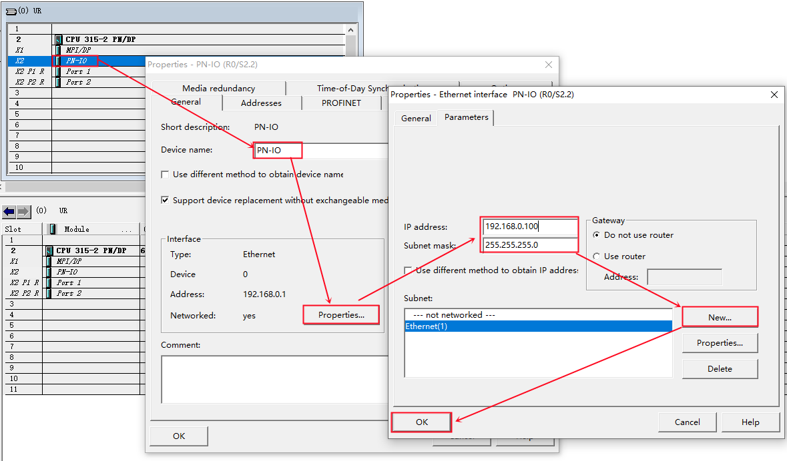{width="1179" height="692"}

图 20. 在新项目中插入 S7-300 站

在 Step7 的硬件组态界面，通过\"选项\"进入\"安装 GSD 文件\...\"界面，
在源路径选择 IO 设备的 GSD 文件存放路径。如图 21 所示。

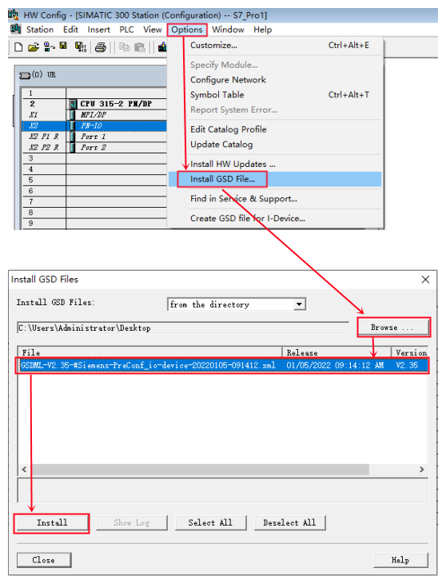{width="558" height="731"}

图 21. Step7 安装 IO 设备的 GSD 文件

### 3-4 在 Step7 中组态 IO 设备

在 Step7 的硬件组态界面，将硬件目录路径：PROFINET IO \--\> Preconfigured
Stations \--\> CPU 1215C DC/DC/DC \--\> IO 设备拖拽到 PN 子网上。如图 22
所示。

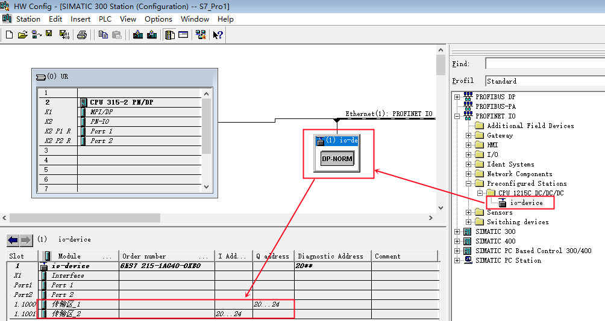{width="1004" height="534"}

图 22. 组态 IO 设备

### 3-5 编程、下载

1、CPU 315-2 PN/DP 作为 IO 控制器，需要调用 OB83 和
OB86（防止控制器无法正常连接作为 IO 设备的 S7-1200
时，出现的停机现象），如图 23 所示。

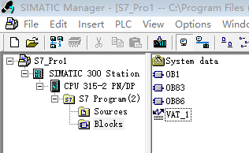{width="316" height="194"}

图 23. 编程调用 OB83 和 OB86

2、检查无错误后，分别将 S7-300 站和 S7-1200 站下载到各自的 PLC 中。

### 3-6 通讯测试

分别给两个站点新建监控表，添加通信数据区，监控。如图 24 所示。

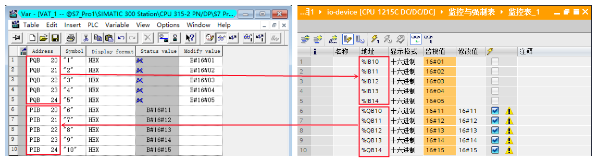{width="1146" height="311"}

图 24. 通信测试
