### S7-1200 和 CP343-1 的 Profinet 通信（S7-1200 作为 智能 IO 设备） {#s7-1200-和-cp343-1-的-profinet-通信s7-1200-作为-智能-io-设备 .STYLE1}

S7-1200 V4.0 及以上固件版本的 CPU 支持智能 IO 设备功能，故可使用 S7-1200
作为智能 IO 设备和 CP343-1 进行 Profinet 通信。本例中将 CP343-1 作为 IO
控制器，连接作为智能 IO 设备的 S7-1200 CPU 实现 Profinet
通信；下面详细介绍使用方法。

CP343-1 版本要求：

-   ST 版本（标准版） ：订货号 6GK7343-1EX30-0XE0 V2.2 版本开始
-   Adv 版本（高级版） X1 接口：订货号 6GK7343-1GX30-0XE0 V1.2 版本开始

硬件：

1.  CPU 1215C DC/DC/DC，V4.5
2.  CPU 315-2PN/DP，V3.2 + CP343-1，V3.1

软件：

1.  TIA PORTAL V17
2.  Step7 V5.7

CP343-1 的 PN 接口连接 S7-1200 的 PN 接口，这种方式可以分 3
种情况来操作，具体如下：

1.  [第一种情况：CPU 1215C 和 CPU 315 使用 TIA PORTAL
    编程，在同一个项目中操作。](03-S7-300CP.html#a)
2.  [第二种情况：CPU 1215C 和 CPU 315 使用 TIA PORTAL
    编程，在不同项目中操作。](03-S7-300CP.html#b)
3.  [第三种情况：CPU 1215C 使用 TIA PORTAL 编程，而 CPU 315 使用 Step7
    编程。](03-S7-300CP.html#c)

### []{#a}1. 第一种情况（CPU 1215C 和 CPU 315 使用 TIA PORTAL 编程，在同一个项目中操作） {#第一种情况cpu-1215c-和-cpu-315-使用-tia-portal-编程在同一个项目中操作 .STYLE4}

CP343-1 作为 IO 控制器，CPU 1215C 作为 IO 设备，使用 TIA PORTAL
在一个项目中编程，详细步骤如下。

#### 1-1 使用 TIA PORTAL 创建 S7-300 站 点 {#使用-tia-portal-创建-s7-300-站-点 .STYLE3}

使用 TIA PORTAL 创建一个新项目，并通过\"添加新设备\"组态 S7-300 站
PLC_1，选择 CPU 315-2 PN/DP， 添加 CP343-1， 并设置 IP 地址，
确认设备名称，本示例中设备名称是 plc_1.cp343-1_1，如图 1 所示。

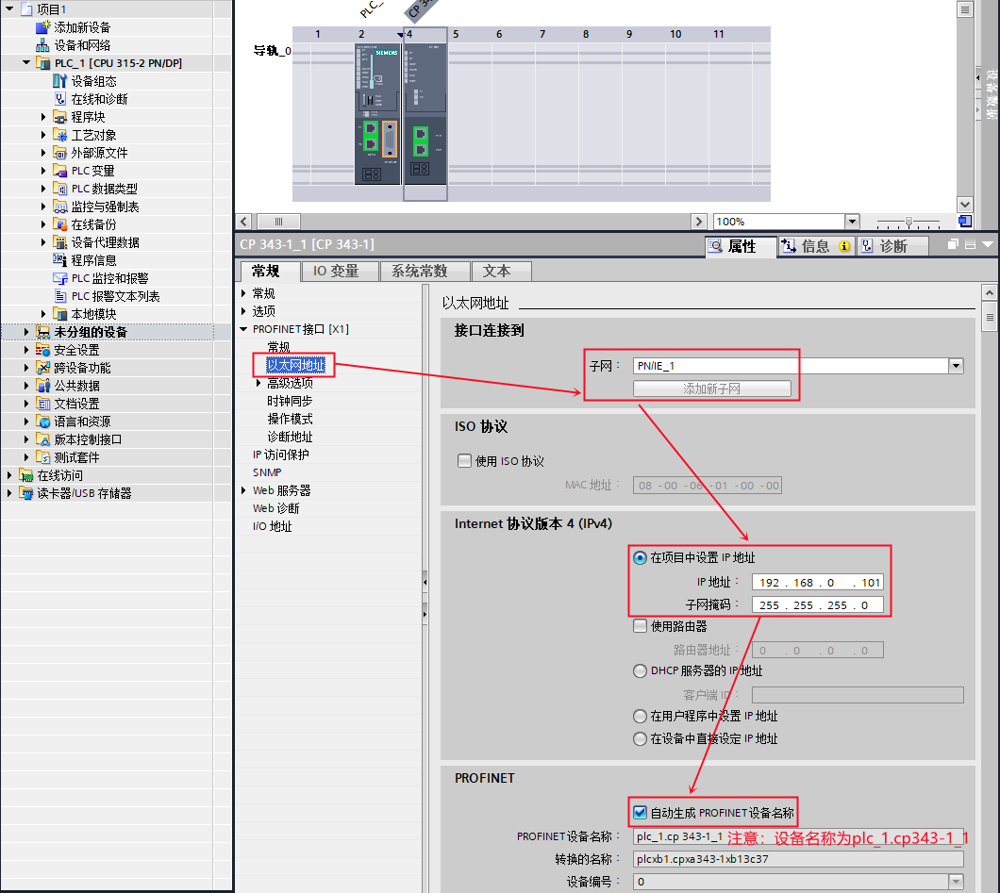{width="1060" height="947"}

图 1. 在新项目中插入 S7-300 站

在"操作模式"选项中确认 CP343-1 的操作模式。 如图 2 所示。

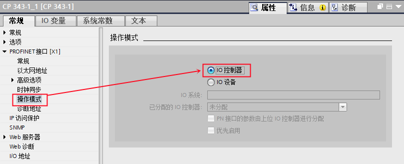{width="809" height="328"}

图 2. 选择 CP343-1 操作模式

#### 1-2 使用 TIA PORTAL 创建 S7-1200 站 {#使用-tia-portal-创建-s7-1200-站 .STYLE3}

使用 TIA PORTAL 创建一个新项目，并通过"添加新设备"组态 S7-1200 站
PLC_2，选择 CPU 1215C DC/DC/DC；设置 IP
地址，并确认设备名称，本示例中设备名称是 PLC_2。如图 3 所示。

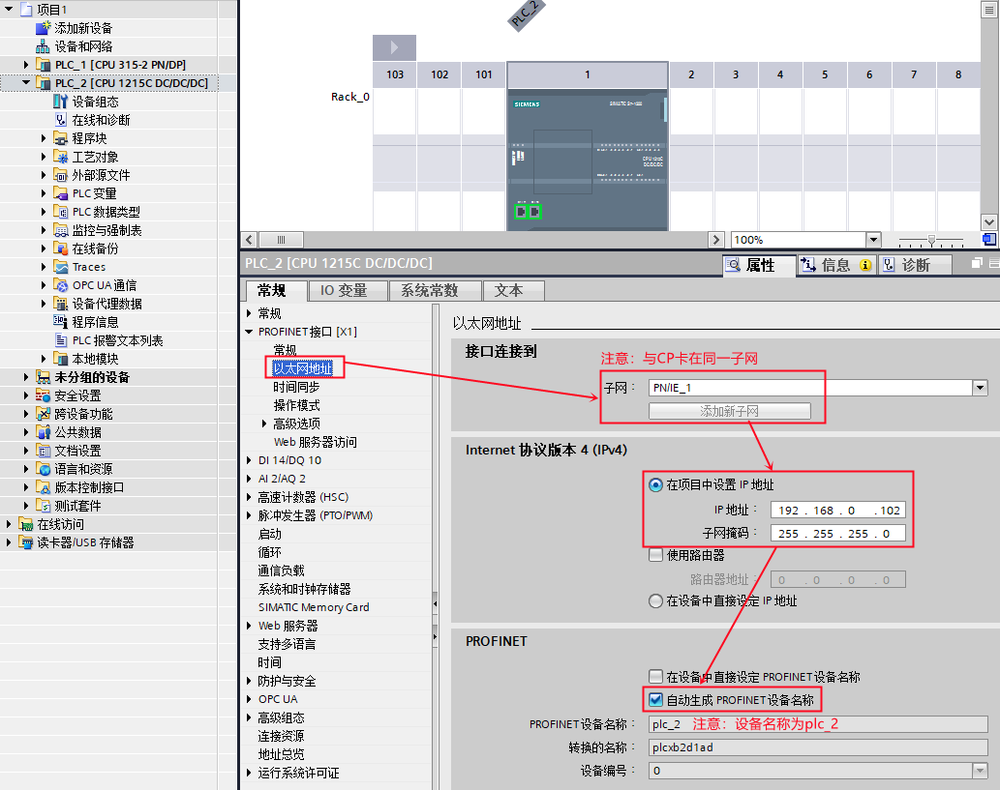{width="1033" height="817"}

图 3. 在新项目中插入 S7-1200 站

S7-1200 作为 IO 设备，需要将其操作模式设置为 IO 设备，并将 IO
设备分配给控制器 PLC_1.CP343-1_1。如图 4 所示。

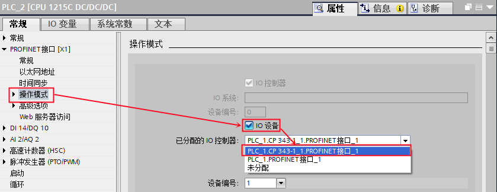{width="839" height="324"}

图 4. S7-1200 设置为 IO 设备

然后，在"智能设备通信"的"传输区"创建 IO 通信区，控制器的 QB10\~14 共计 5
个字节传送到 IO 设备的 IB10\~14 ；控制器的 IB10\~14 共计 5
个字节读取来自 IO 设备的 QB10\~14。如图 5 所示。

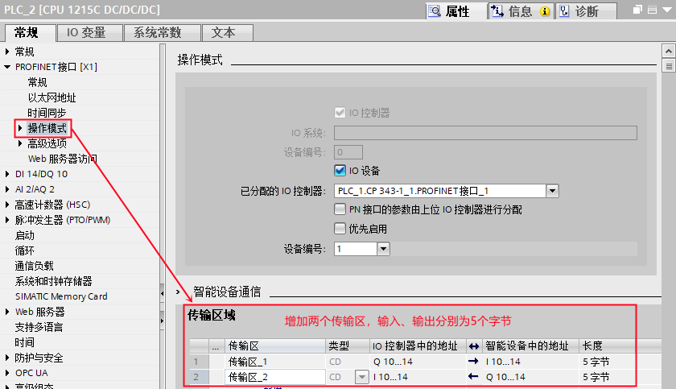{width="840" height="483"}

图 5. 创建 IO 通信区

#### [1-3 编程、下载]{.STYLE3}

本例中，CP343-1 作为 IO 控制器，需要在 OB1 中编程调用 PNIO_SEND 和
PNIO_RECV 进行数据读写。如图 6 所示。

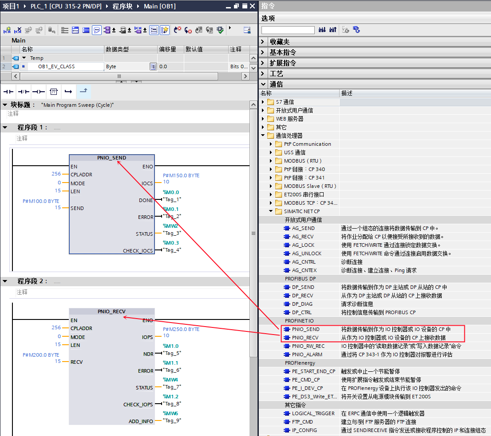{width="1106" height="984"}

图 6. CPU 315 中编程

+-----------------------+-----------------------+-----------------------+
| CALL "PNIO_SEND"      |                       |                       |
+-----------------------+-----------------------+-----------------------+
| CPLADDR               | ：=256                | // CP 模板起始地址    |
+-----------------------+-----------------------+-----------------------+
| MODE                  | ：=0                  | // 工作模式：\        |
|                       |                       | 当 CP343-1 仅作为 IO  |
|                       |                       | 控制器或 IO           |
|                       |                       | 设备时，设为 0；\     |
|                       |                       | 当 CP343-1 同时作为   |
|                       |                       | IO 控制器和 IO        |
|                       |                       | 设备时，设为 1        |
+-----------------------+-----------------------+-----------------------+
| LEN                   | ：=15                 | //                    |
|                       |                       | 要发                  |
|                       |                       | 送的数据区长度；该长  |
|                       |                       | 度始终是从数据区地址  |
|                       |                       | 0 开始计算            |
+-----------------------+-----------------------+-----------------------+
| SEND                  | ：=P#M100.0 BYTE 15   | // 发送数据区         |
+-----------------------+-----------------------+-----------------------+
| IOCS                  | ：=P#M150.0 BYTE 10   | //                    |
|                       |                       | 每一用                |
|                       |                       | 户数据字节传送一个状  |
|                       |                       | 态位。长度信息取决于  |
|                       |                       | LEN 参数中的长度。\   |
|                       |                       | 以程序段 1            |
|                       |                       | 为例，共发送 15       |
|                       |                       | 个字节，每个字节需要  |
|                       |                       | 1 个位，所以共需要 15 |
|                       |                       | 位，即至少需要 2      |
|                       |                       | 字节。                |
+-----------------------+-----------------------+-----------------------+
| DONE                  | ：=%M0.0              | // 为 1               |
|                       |                       | 时，无错误完成该作业  |
+-----------------------+-----------------------+-----------------------+
| ERROR                 | ：=%M0.1              | // 为 1               |
|                       |                       | 时，有故障发生        |
+-----------------------+-----------------------+-----------------------+
| STATUS                | ：=%MW2               | // 状态代码           |
+-----------------------+-----------------------+-----------------------+
| CHECK_IOCS            | ：=%M0.3              | // 0：所有 IOCS       |
|                       |                       | 均设置为 GOOD\        |
|                       |                       | // 1：至少一个 IOCS   |
|                       |                       | 设置为 BAD            |
+-----------------------+-----------------------+-----------------------+

 

+-----------------------+-----------------------+-----------------------+
| CALL "PNIO_RECV"      |                       |                       |
+-----------------------+-----------------------+-----------------------+
| CPLADDR               | ：=256                | // CP 模板起始地址    |
+-----------------------+-----------------------+-----------------------+
| MODE                  | ：=0                  | // 工作模式：\        |
|                       |                       | 当 CP343-1 仅作为 IO  |
|                       |                       | 控制器或 IO           |
|                       |                       | 设备时，设为 0；\     |
|                       |                       | 当 CP343-1 同时作为   |
|                       |                       | IO 控制器和 IO        |
|                       |                       | 设备时，设为 1        |
+-----------------------+-----------------------+-----------------------+
| LEN                   | ：=15                 | //                    |
|                       |                       | 要接                  |
|                       |                       | 收的数据区长度；该长  |
|                       |                       | 度始终是从数据区地址  |
|                       |                       | 0 开始计算            |
+-----------------------+-----------------------+-----------------------+
| RECV                  | ：=P#M200.0 BYTE 15   | // 发送数据区         |
+-----------------------+-----------------------+-----------------------+
| IOPS                  | ：=P#M250.0 BYTE 10   | //                    |
|                       |                       | 每一用                |
|                       |                       | 户数据字节传送一个状  |
|                       |                       | 态位。长度信息取决于  |
|                       |                       | LEN 参数中的长度。\   |
|                       |                       | 以程序段 2            |
|                       |                       | 为例，共接收 15       |
|                       |                       | 个字节，每个字节需要  |
|                       |                       | 1 个位，所以共需要 15 |
|                       |                       | 位，即至少需要 2      |
|                       |                       | 字节。                |
+-----------------------+-----------------------+-----------------------+
| NDR                   | ：=%M1.0              | // 为 1               |
|                       |                       | 时，无错误完成该作业  |
+-----------------------+-----------------------+-----------------------+
| ERROR                 | ：=%M1.1              | // 为 1               |
|                       |                       | 时，有故障发生        |
+-----------------------+-----------------------+-----------------------+
| STATUS                | ：=%MW4               | // 状态代码           |
+-----------------------+-----------------------+-----------------------+
| CHECK_IOPS            | ：=%M1.2              | // 0：所有 IOPS       |
|                       |                       | 均设置为 GOOD\        |
|                       |                       | // 1：至少一个 IOPS   |
|                       |                       | 设置为 BAD            |
+-----------------------+-----------------------+-----------------------+
| ADD_INFO              | ：=%MW6               | //                    |
|                       |                       | 附加诊断信息；具      |
|                       |                       | 体请查看指令帮助信息  |
+-----------------------+-----------------------+-----------------------+

CPU 315-2 PN/DP 作为 IO 控制器，需要调用 OB83 和
OB86（防止控制器无法正常连接作为 IO 设备的 S7-1200
时，出现的停机现象），如图 7 所示。

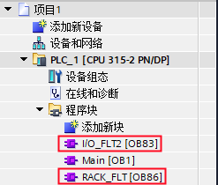{width="247" height="210"}

图 7. 编程调用 OB83 和 OB86

检查无错误后，最后分别将 PLC_1 站和 PLC_2 站下载到各自的 PLC 中。

#### [1-4 通讯测试]{.STYLE3}

分别给两个站点新建监控表，添加通信数据区，监控。如图 8 所示。

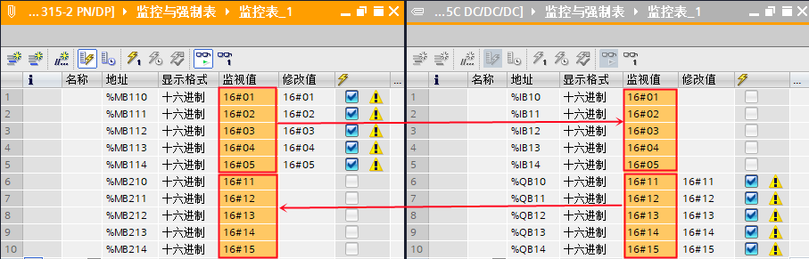{width="907" height="291"}

图 8. 通信测试

#### [1-6 地址对应关系的说明]{.STYLE3}

CP343-1 作为 IO 控制器时，其传送地址需从 0
开始，地址对应排列关系以逻辑地址大小为序，当地址出现间隔时，没有组态的地址也将被传送，如图
9 所示，没有组态的地址区 IB0\~9（QB0\~9) 及其对应的
MB100\~109(MB200\~209) 也将被传送，因此在编写程序时 LEN
管脚对应在数据长度为 15，而不是 5，SEND 及 RECV 管脚对应的数据区也为 15
个字节，而不是 5 个字节。

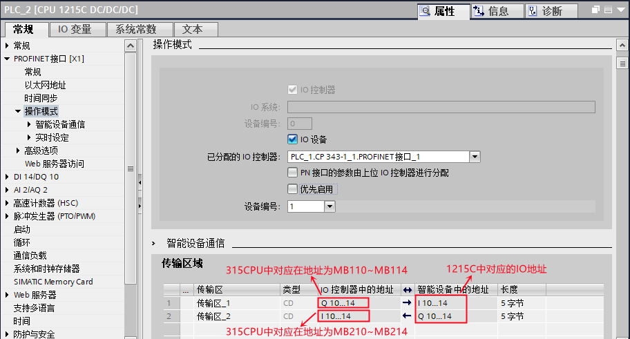{width="912" height="491"}

图 9. 地址对应关系

### [[]{#b}2. 第二种情况]{.STYLE4}[（CPU 1215C 和 CPU 315 使用 TIA PORTAL 编程，在不同项目中操作）]{.STYLE4}

CP343-1 作为 IO 控制器，CPU 1215C 作为 IO 设备，使用 TIA PORTAL
在不同项目中编程，详细步骤如下。

#### 2-1 使用 TIA PORTAL 创建 S7-1200 站 {#使用-tia-portal-创建-s7-1200-站-1 .STYLE3}

使用 TIA PORTAL 创建一个新项目，并通过"添加新设备"组态 S7-1200 站 IO
设备，选择 CPU 1215C DC/DC/DC；设置 IP
地址，并确认设备名称，本示例中设备名称是 io-device。如图 10 所示。

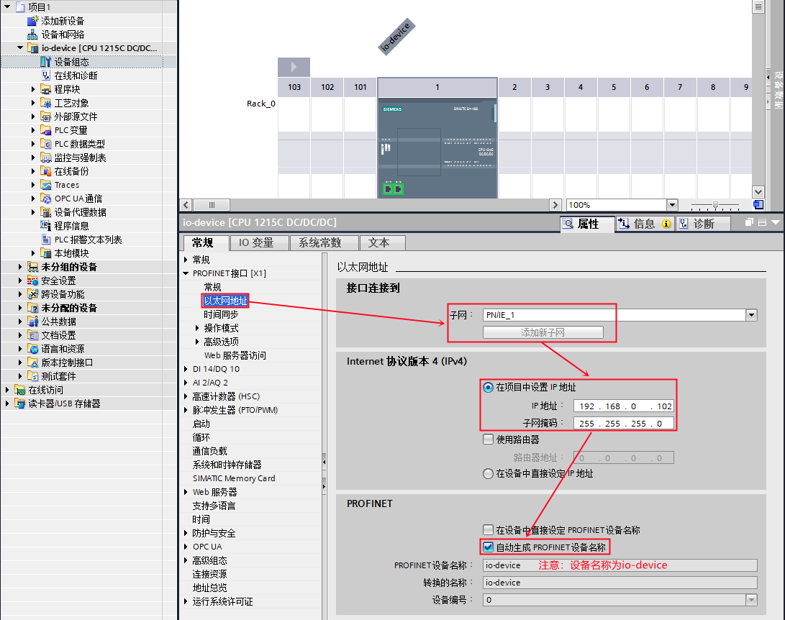{width="1091" height="862"}

图 10. 在新项目中插入 S7-1200 站

S7-1200 作为 IO 设备，需要将其操作模式设置为 IO 设备。如图 11 所示。

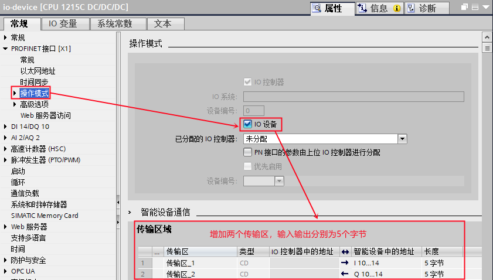{width="841" height="478"}

图 11. S7-1200 设置为 IO 设备，并创建 IO 通信区

然后，在"智能设备通信"的"传输区"创建 IO 通信区，控制器将传输 5 个字节到
IO 设备的 IB10\~14 ；IO 设备将 QB10\~14 共计 5 个字节传送给控制器。

#### 2-2 导出 IO 设备的 GSD 文件 {#导出-io-设备的-gsd-文件 .STYLE3}

编译该项目，在"智能设备通信"属性的下方，找到并点击"导出"按钮，根据提示将
GSD 文件导出（[注意不要修改设备名称]{.STYLE9}）。如图 12 所示。

{width="667" height="873"}

图 12. 导出 IO 设备的 GSD 文件

#### 2-3 使用 TIA PORTAL 创建 S7-300 站 {#使用-tia-portal-创建-s7-300-站 .STYLE3}

使用 TIA PORTAL 创建一个新项目，并组态 CPU 315-2 PN/DP， 添加 CP343-1
，设置 IP 地址，并确认设备名称，本示例中设备名称是 plc_1.cp343-1_1。如图
13 所示。

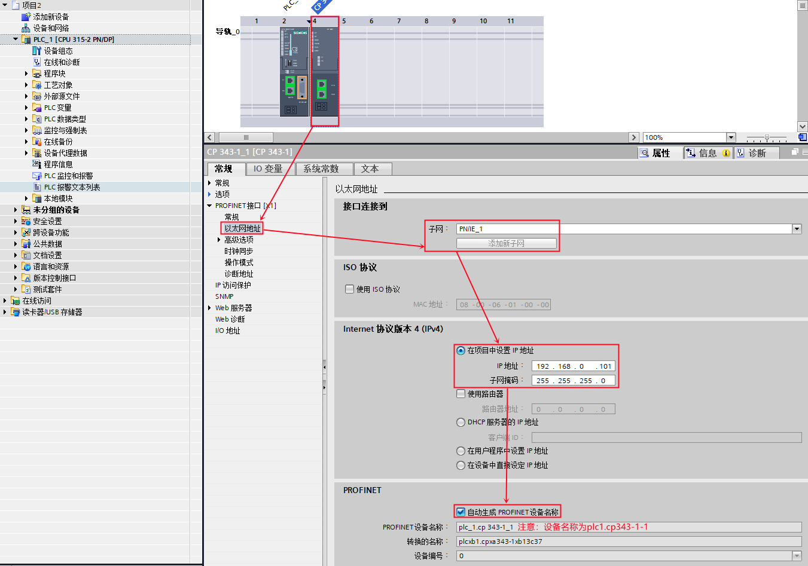{width="1351" height="947"}

图 13. 在项目中插入 S7-300 站

在 TIA PORTAL
的硬件组态界面，通过"选项"进入"管理通用站描述文件（GSD）"界面，
在源路径选择 IO 设备 的 GSD 文件存放路径。如图 14 所示。

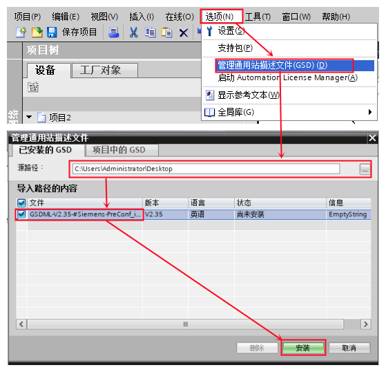{width="559" height="538"}

图 14. TIA PORTAL 安装 IO 设备 的 GSD 文件

#### 2-4 在 TIA PORTAL 中组态 IO 设备 {#在-tia-portal-中组态-io-设备 .STYLE3}

在 TIA PORTAL 的网络视图中，将硬件目录路径：Other field
devices（其他现场设备）\--\> PROFINET IO\--\>PLCs&CPs\--\>SIEMENS
AG\--\> CPU 1215C DC/DC/DC \--\> io-device 拖拽到网络视图中，如图 15
所示。

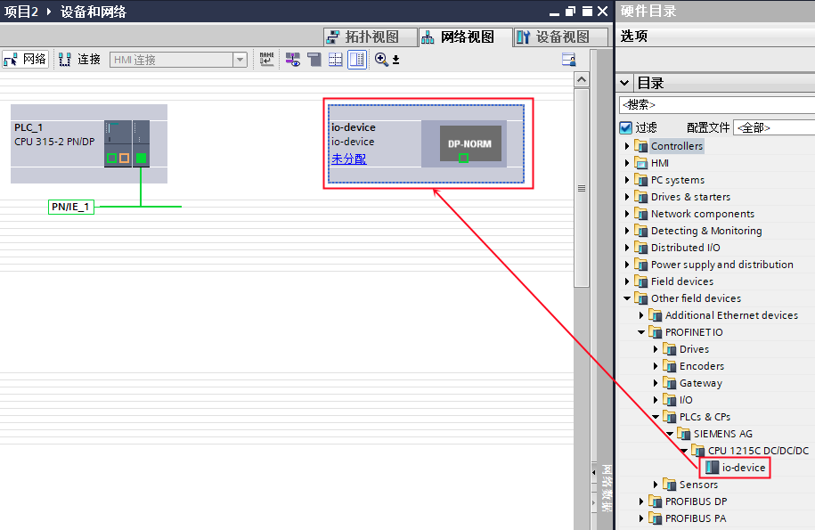{width="915" height="595"}

图 15. 插入 Profinet IO 系统

然后为 IO 设备分配 IO 控制器，如图 16 所示。

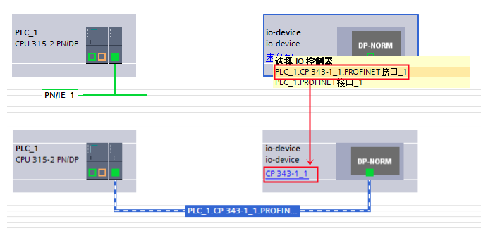{width="692" height="338"}

图 16. 分配 IO 控制器

进入到设备视图中的设备概览设置传输区地址，如图 17 所示。

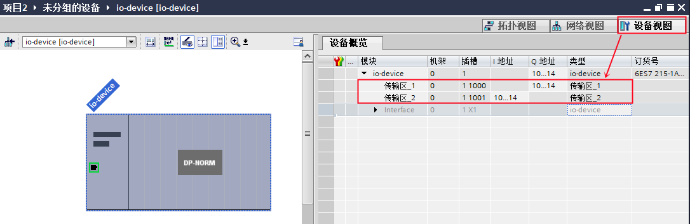{width="1086" height="353"}

图 17. 分配传输区地址

#### [2-5 编程、下载]{.STYLE3}

本例中，CP343-1 作为 IO 控制器，需要在 OB1 中编程调用 PNIO_SEND 和
PNIO_RECV 进行数据读写。如图 18 所示。

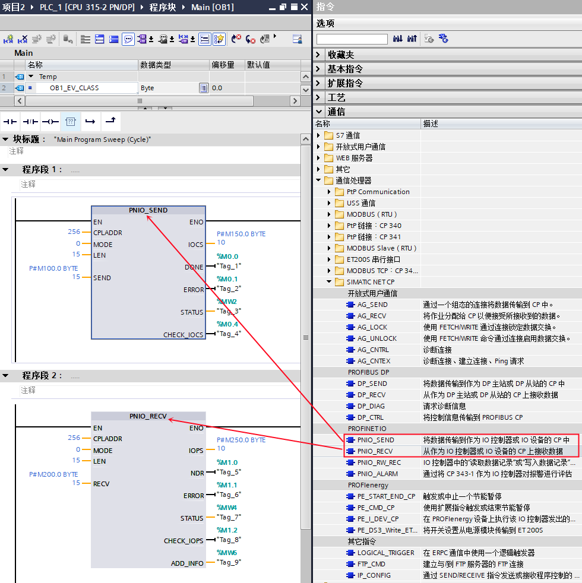{width="980" height="982"}

图 18. CPU 315 中编程

+-----------------------+-----------------------+-----------------------+
| CALL "PNIO_SEND"      |                       |                       |
+-----------------------+-----------------------+-----------------------+
| CPLADDR               | ：=256                | // CP 模板起始地址    |
+-----------------------+-----------------------+-----------------------+
| MODE                  | ：=B#16#0             | // 工作模式：\        |
|                       |                       | 当 CP343-1 仅作为 IO  |
|                       |                       | 控制器或 IO           |
|                       |                       | 设备时，设为 0；\     |
|                       |                       | 当 CP343-1 同时作为   |
|                       |                       | IO 控制器和 IO        |
|                       |                       | 设备时，设为 1        |
+-----------------------+-----------------------+-----------------------+
| LEN                   | ：=15                 | //                    |
|                       |                       | 要发                  |
|                       |                       | 送的数据区长度；该长  |
|                       |                       | 度始终是从数据区地址  |
|                       |                       | 0 开始计算            |
+-----------------------+-----------------------+-----------------------+
| SEND                  | ：=P#M100.0 BYTE 15   | // 发送数据区         |
+-----------------------+-----------------------+-----------------------+
| IOCS                  | ：=P#M150.0 BYTE 10   | //                    |
|                       |                       | 每一用                |
|                       |                       | 户数据字节传送一个状  |
|                       |                       | 态位。长度信息取决于  |
|                       |                       | LEN 参数中的长度。\   |
|                       |                       | 以程序段 1            |
|                       |                       | 为例，共发送 15       |
|                       |                       | 个字节，每个字节需要  |
|                       |                       | 1 个位，所以共需要 15 |
|                       |                       | 位，即至少需要 2      |
|                       |                       | 字节。                |
+-----------------------+-----------------------+-----------------------+
| DONE                  | ：=%M0.0              | // 为 1               |
|                       |                       | 时，无错误完成该作业  |
+-----------------------+-----------------------+-----------------------+
| ERROR                 | ：=%M0.1              | // 为 1               |
|                       |                       | 时，有故障发生        |
+-----------------------+-----------------------+-----------------------+
| STATUS                | ：=%MW2               | // 状态代码           |
+-----------------------+-----------------------+-----------------------+
| CHECK_IOCS            | ：=%M0.3              | // 0：所有 IOCS       |
|                       |                       | 均设置为 GOOD\        |
|                       |                       | // 1：至少一个 IOCS   |
|                       |                       | 设置为 BAD            |
+-----------------------+-----------------------+-----------------------+

 

+-----------------------+-----------------------+-----------------------+
| CALL "PNIO_RECV"      |                       |                       |
+-----------------------+-----------------------+-----------------------+
| CPLADDR               | ：=W#16#100           | // CP 模板起始地址    |
+-----------------------+-----------------------+-----------------------+
| MODE                  | ：=B#16#0             | // 工作模式：\        |
|                       |                       | 当 CP343-1 仅作为 IO  |
|                       |                       | 控制器或 IO           |
|                       |                       | 设备时，设为 0；\     |
|                       |                       | 当 CP343-1 同时作为   |
|                       |                       | IO 控制器和 IO        |
|                       |                       | 设备时，设为 1        |
+-----------------------+-----------------------+-----------------------+
| LEN                   | ：=7                  | //                    |
|                       |                       | 要接                  |
|                       |                       | 收的数据区长度；该长  |
|                       |                       | 度始终是从数据区地址  |
|                       |                       | 0 开始计算            |
+-----------------------+-----------------------+-----------------------+
| RECV                  | ：=P#M200.0 BYTE 15   | // 发送数据区         |
+-----------------------+-----------------------+-----------------------+
| IOPS                  | ：=P#M250.0 BYTE 10   | //                    |
|                       |                       | 每一用                |
|                       |                       | 户数据字节传送一个状  |
|                       |                       | 态位。长度信息取决于  |
|                       |                       | LEN 参数中的长度。\   |
|                       |                       | 以程序段 2            |
|                       |                       | 为例，共接收 15       |
|                       |                       | 个字节，每个字节需要  |
|                       |                       | 1 个位，所以共需要 15 |
|                       |                       | 位，即至少需要 2      |
|                       |                       | 字节。                |
+-----------------------+-----------------------+-----------------------+
| NDR                   | ：=%M1.0              | // 为 1               |
|                       |                       | 时，无错误完成该作业  |
+-----------------------+-----------------------+-----------------------+
| ERROR                 | ：=%M1.1              | // 为 1               |
|                       |                       | 时，有故障发生        |
+-----------------------+-----------------------+-----------------------+
| STATUS                | ：=%MW4               | // 状态代码           |
+-----------------------+-----------------------+-----------------------+
| CHECK_IOPS            | ：=%M1.2              | // 0：所有 IOPS       |
|                       |                       | 均设置为 GOOD\        |
|                       |                       | // 1：至少一个 IOPS   |
|                       |                       | 设置为 BAD            |
+-----------------------+-----------------------+-----------------------+
| ADD_INFO              | ：=%MW6               | //                    |
|                       |                       | 附加诊断信息；具      |
|                       |                       | 体请查看指令帮助信息  |
+-----------------------+-----------------------+-----------------------+

CPU 315-2 PN/DP 作为控制器，需要调用 OB83 和
OB86（防止控制器无法正常连接作为 IO 设备的 S7-1200
时，出现的停机现象），如图 19 所示。

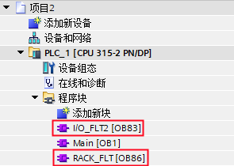{width="295" height="210"}

图 19.编程调用 OB83 和 OB86

检查无错误后，最后分别将两个站下载到各自的 PLC 中。

#### [2-6 通讯测试]{.STYLE3}

检查无错误后，分别给两个站点新建监控表，添加通信数据区，监控。如图 20
所示。

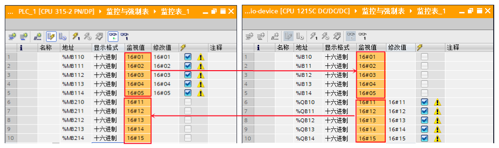{width="1042" height="310"}

图 20. 通信测试

#### [2-7 地址对应关系的说明]{.STYLE3}

CP343-1 作为 IO 控制器时，其传送地址需从 0
开始，地址对应排列关系以逻辑地址大小为序，当地址出现间隔时，没有组态的地址也将被传送，如图
21 所示，没有组态的地址区 IB0\~9（QB0\~9) 及其对应的
MB100\~109(MB200\~209) 也将被传送，因此在编写程序时 LEN
管脚对应在数据长度为 15，而不是 5，SEND 及 RECV 管脚对应的数据区也为 15
个字节，而不是 5 个字节。

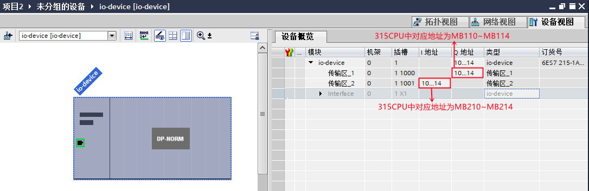{width="1086" height="353"}

图 21. 地址对应关系

### [[]{#c}3. 第三种情况]{.STYLE4}[（CPU 1215C 使用 TIA PORTAL 编程，而 CPU 315 使用 Step7 编程）]{.STYLE4}

不在一个项目中的操作，即：CP343-1 作为 IO 控制器 使用 Step7 编程；CPU
1215C 作为 IO 设备，使用 TIA PORTAL 编程，详细步骤如下。

#### 3-1 使用 TIA PORTAL 创建 S7-1200 站 {#使用-tia-portal-创建-s7-1200-站-2 .STYLE3}

使用 TIA PORTAL 创建一个新项目，并通过"添加新设备"组态 S7-1200 站 IO
设备 ，选择 CPU 1215C DC/DC/DC；设置 IP
地址，并确认设备名称，本示例中设备名称是 io-device。如图 22 所示。

{width="1091" height="862"}

图 22. 在新项目中插入 S7-1200 站

S7-1200 作为 IO 设备，需要将其操作模式设置为 IO 设备。如图 23 所示。

{width="841" height="478"}

图 23. S7-1200 设置为 IO 设备，并创建 IO 通信区

然后，在"智能设备通信"的"传输区"创建 IO 通信区，控制器将传输 5 个字节到
IO 设备的 IB10\~14 ；IO 设备将 QB10\~14 共计 5 个字节传送给控制器。

#### 3-2 导出 IO 设备的 GSD 文件 {#导出-io-设备的-gsd-文件-1 .STYLE3}

编译该项目，在"智能设备通信"属性的下方，找到并点击"导出"按钮，根据提示将
GSD 文件导出（[注意不要修改设备名称]{.STYLE9}）。如图 24 所示。

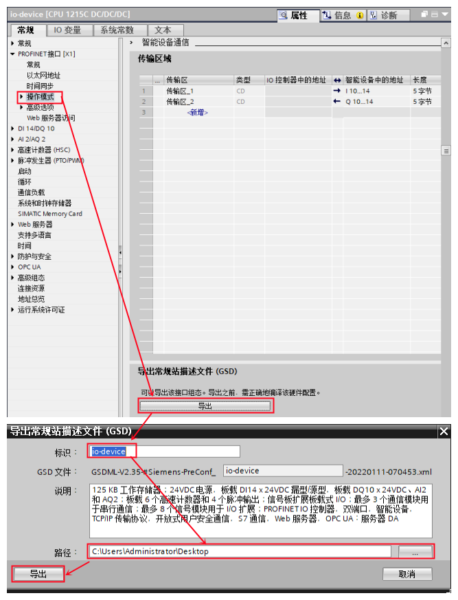{width="667" height="873"}

图 24. 导出 IO 设备的 GSD 文件

#### 3-3 使用 Step7 创建 S7-300 站 {#使用-step7-创建-s7-300-站 .STYLE3}

使用 [Step7]{.STYLE3} 创建一个新项目，并组态 CPU 315-2 PN/DP， 添加
CP343-1 ，设置 IP 地址，并确认设备名称，本示例中设备名称是 PN-IO。如图
25 所示。

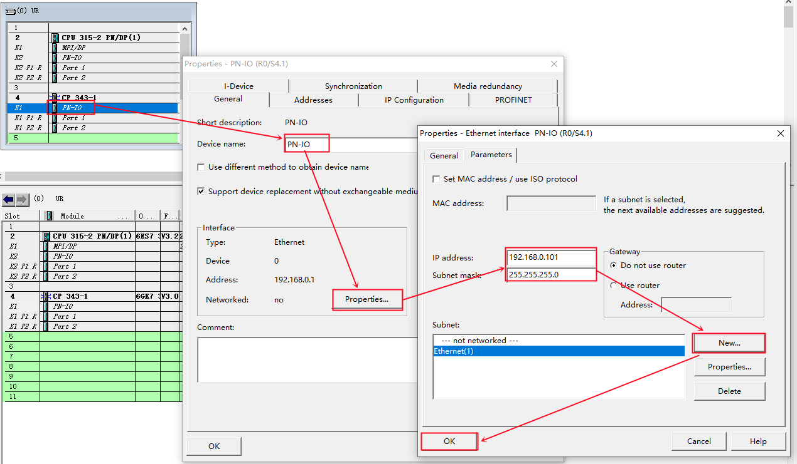{width="1270" height="741"}

图 25. 在新项目中插入 S7-300 站

在 Step7 的硬件组态界面，通过"选项"进入"安装 GSD 文件\..."界面，
在源路径选择 IO 设备的 GSD 文件存放路径。如图 26 所示。

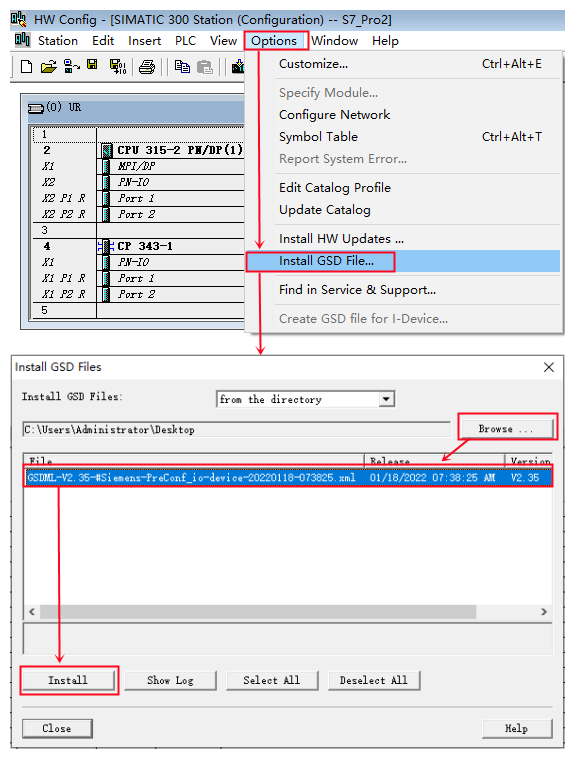{width="575" height="759"}

图 26. Step7 安装 IO 设备的 GSD 文件

#### 3-4 在 Step7 中组态 IO-device {#在-step7-中组态-io-device .STYLE3}

首先，需要给 CP343-1 插入 Profinet IO 子网，在 CP343-1
的"PN-IO"上鼠标右键，选择"插入 Profinet IO 系统"。如图 27 所示。

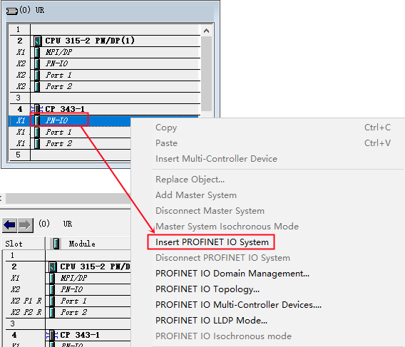{width="568" height="487"}

图 27. 插入 Profinet IO 系统

然后，从硬件目录路径：PROFINET IO \--\> Preconfigured Stations \--\> CPU
1215C DC/DC/DC \--\> io-device 拖拽到 PN 子网上。如图 28 所示。

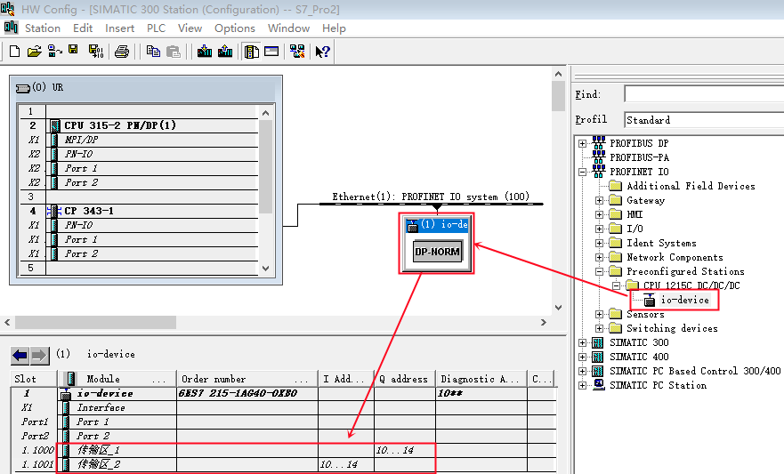{width="881" height="533"}

图 28. 组态 IO 设备

#### [3-5 编程、下载]{.STYLE3}

本例中，CP343-1 作为 IO 控制器，需要在 OB1 中编程调用 PNIO_SEND 和
PNIO_RECV 进行数据读写。如图 29 所示。

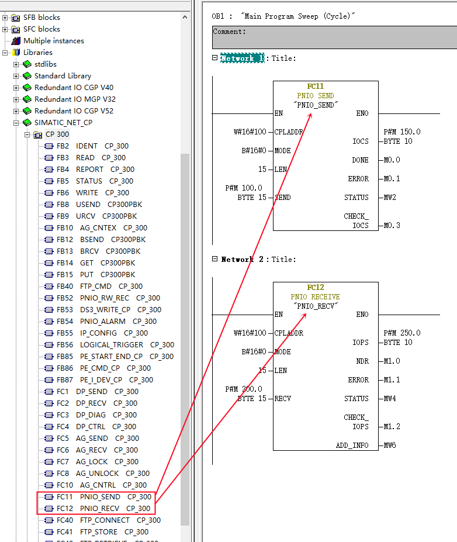{width="782" height="927"}

图 29. CPU 315中编程

+-----------------------+-----------------------+-----------------------+
| CALL "PNIO_SEND"      |                       |                       |
+-----------------------+-----------------------+-----------------------+
| CPLADDR               | ：=W#16#100           | // CP 模板起始地址    |
+-----------------------+-----------------------+-----------------------+
| MODE                  | ：=B#16#0             | // 工作模式：\        |
|                       |                       | 当 CP343-1 仅作为 IO  |
|                       |                       | 控制器或 IO           |
|                       |                       | 设备时，设为 0；\     |
|                       |                       | 当 CP343-1 同时作为   |
|                       |                       | IO 控制器和 IO        |
|                       |                       | 设备时，设为 1        |
+-----------------------+-----------------------+-----------------------+
| LEN                   | ：=15                 | //                    |
|                       |                       | 要发                  |
|                       |                       | 送的数据区长度；该长  |
|                       |                       | 度始终是从数据区地址  |
|                       |                       | 0 开始计算            |
+-----------------------+-----------------------+-----------------------+
| SEND                  | ：=P#M100.0 BYTE 15   | // 发送数据区         |
+-----------------------+-----------------------+-----------------------+
| IOCS                  | ：=P#M150.0 BYTE 10   | //                    |
|                       |                       | 每一用                |
|                       |                       | 户数据字节传送一个状  |
|                       |                       | 态位。长度信息取决于  |
|                       |                       | LEN 参数中的长度。\   |
|                       |                       | 以程序段 1            |
|                       |                       | 为例，共发送 15       |
|                       |                       | 个字节，每个字节需要  |
|                       |                       | 1 个位，所以共需要 15 |
|                       |                       | 位，即至少需要 2      |
|                       |                       | 字节。                |
+-----------------------+-----------------------+-----------------------+
| DONE                  | ：=%M0.0              | // 为 1               |
|                       |                       | 时，无错误完成该作业  |
+-----------------------+-----------------------+-----------------------+
| ERROR                 | ：=%M0.1              | // 为 1               |
|                       |                       | 时，有故障发生        |
+-----------------------+-----------------------+-----------------------+
| STATUS                | ：=%MW2               | // 状态代码           |
+-----------------------+-----------------------+-----------------------+
| CHECK_IOCS            | ：=%M0.3              | // 0：所有 IOCS       |
|                       |                       | 均设置为 GOOD\        |
|                       |                       | // 1：至少一个 IOCS   |
|                       |                       | 设置为 BAD            |
+-----------------------+-----------------------+-----------------------+

 

+-----------------------+-----------------------+-----------------------+
| CALL "PNIO_RECV"      |                       |                       |
+-----------------------+-----------------------+-----------------------+
| CPLADDR               | ：=W#16#100           | // CP 模板起始地址    |
+-----------------------+-----------------------+-----------------------+
| MODE                  | ：=B#16#0             | // 工作模式：\        |
|                       |                       | 当 CP343-1 仅作为 IO  |
|                       |                       | 控制器或 IO           |
|                       |                       | 设备时，设为 0；\     |
|                       |                       | 当 CP343-1 同时作为   |
|                       |                       | IO 控制器和 IO        |
|                       |                       | 设备时，设为 1        |
+-----------------------+-----------------------+-----------------------+
| LEN                   | ：=15                 | //                    |
|                       |                       | 要接                  |
|                       |                       | 收的数据区长度；该长  |
|                       |                       | 度始终是从数据区地址  |
|                       |                       | 0 开始计算            |
+-----------------------+-----------------------+-----------------------+
| RECV                  | ：=P#M200.0 BYTE 15   | // 发送数据区         |
+-----------------------+-----------------------+-----------------------+
| IOPS                  | ：=P#M250.0 BYTE 10   | //                    |
|                       |                       | 每一用                |
|                       |                       | 户数据字节传送一个状  |
|                       |                       | 态位。长度信息取决于  |
|                       |                       | LEN 参数中的长度。\   |
|                       |                       | 以程序段 2            |
|                       |                       | 为例，共接收 15       |
|                       |                       | 个字节，每个字节需要  |
|                       |                       | 1 个位，所以共需要 15 |
|                       |                       | 位，即至少需要 2      |
|                       |                       | 字节。                |
+-----------------------+-----------------------+-----------------------+
| NDR                   | ：=%M1.0              | // 为 1               |
|                       |                       | 时，无错误完成该作业  |
+-----------------------+-----------------------+-----------------------+
| ERROR                 | ：=%M1.1              | // 为 1               |
|                       |                       | 时，有故障发生        |
+-----------------------+-----------------------+-----------------------+
| STATUS                | ：=%MW4               | // 状态代码           |
+-----------------------+-----------------------+-----------------------+
| CHECK_IOPS            | ：=%M1.2              | // 0：所有 IOPS       |
|                       |                       | 均设置为 GOOD\        |
|                       |                       | // 1：至少一个 IOPS   |
|                       |                       | 设置为 BAD            |
+-----------------------+-----------------------+-----------------------+
| ADD_INFO              | ：=%MW6               | //                    |
|                       |                       | 附加诊断信息；具      |
|                       |                       | 体请查看指令帮助信息  |
+-----------------------+-----------------------+-----------------------+

CPU 315-2 PN/DP 作为控制器，需要调用 OB83 和
OB86（防止控制器无法正常连接作为 IO 设备的 S7-1200
时，出现的停机现象），如图 30 所示。

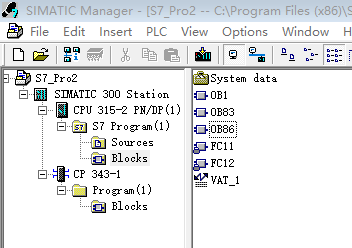{width="352" height="248"}

图 30. 编程调用 OB83 和 OB86

检查无错误后，最后分别将 PLC_1 站和 PLC_2 站下载到各自的 PLC 中。

#### [3-6 通讯测试]{.STYLE3}

分别给两个站点新建监控表，添加通信数据区，监控。如图 31 所示。

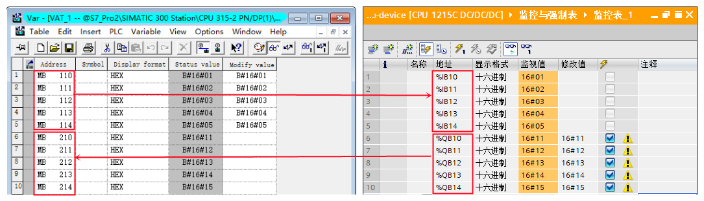{width="1085" height="311"}

图 31. 通信测试

#### [3-8 地址对应关系的说明]{.STYLE3}

CP343-1 作为 IO 控制器时，其传送地址需从 0
开始，地址对应排列关系以逻辑地址大小为序，当地址出现间隔时，没有组态的地址也将被传送，如图
32 所示，没有组态的地址区 IB0\~9（QB0\~9) 及其对应的
MB100\~109(MB200\~209) 也将被传送，因此在编写程序时 LEN
管脚对应在数据长度为 15，而不是 5，SEND 及 RECV 管脚对应的数据区也为 15
个字节，而不是 5 个字节。

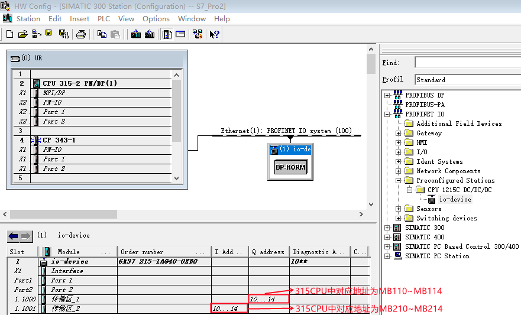{width="881" height="533"}

图 32. 地址对应关系
