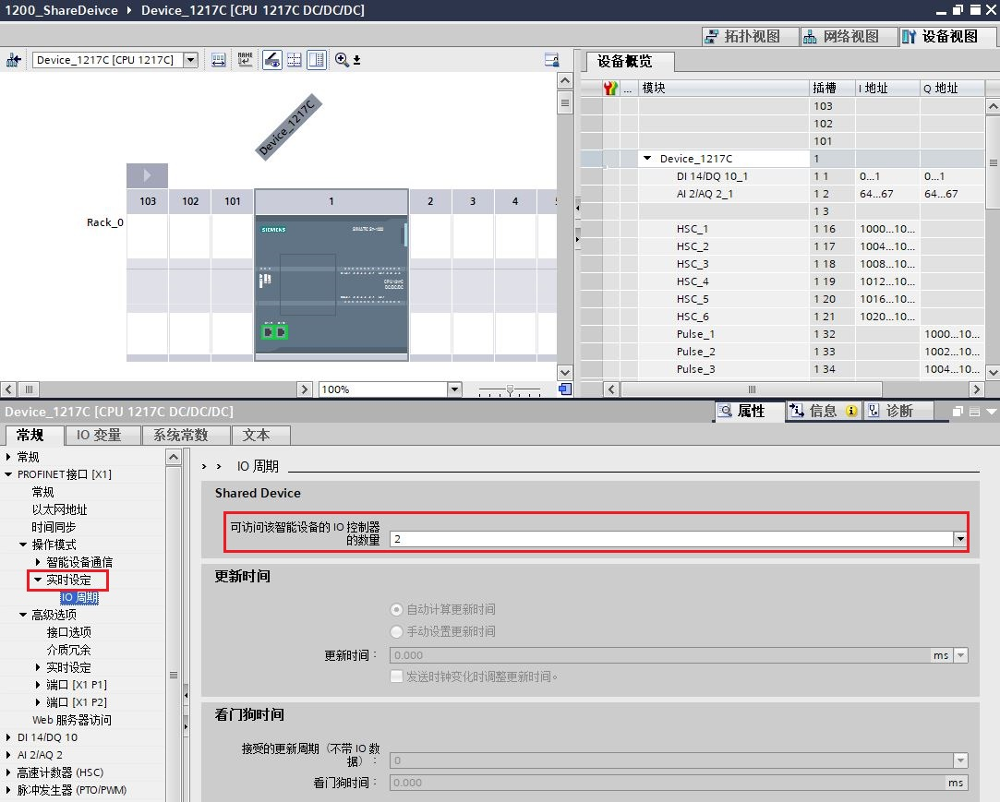
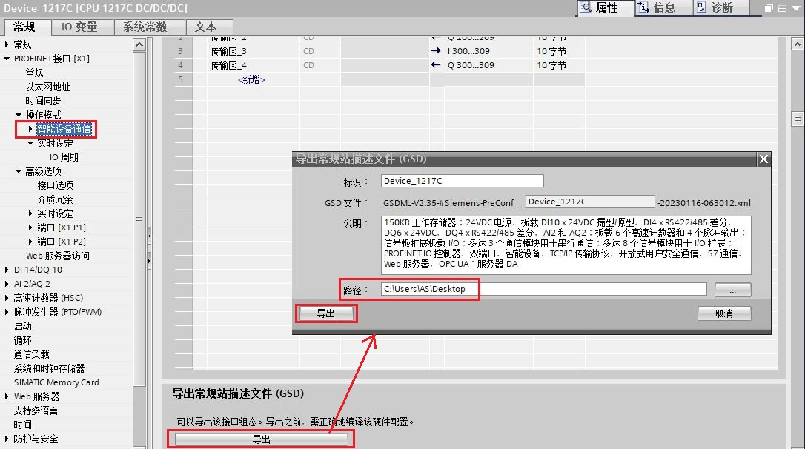
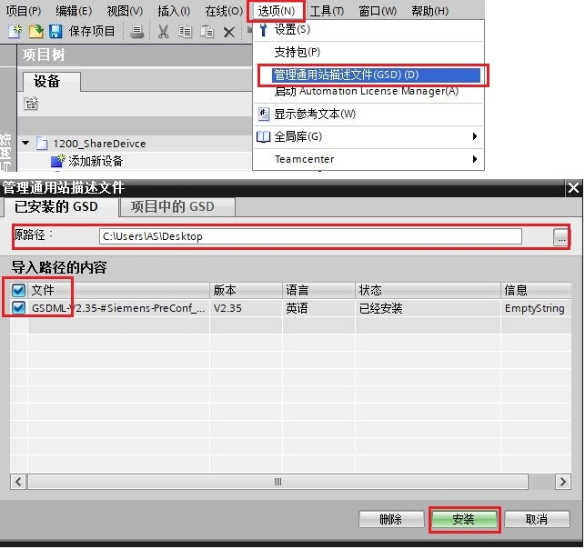
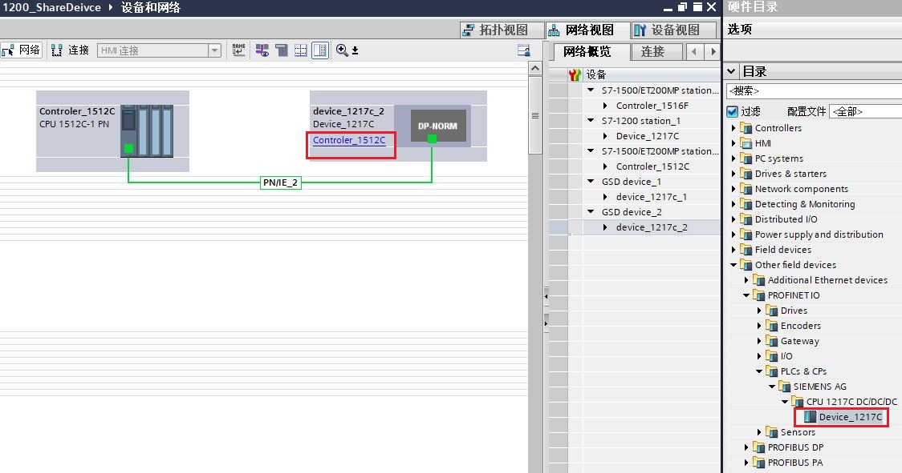
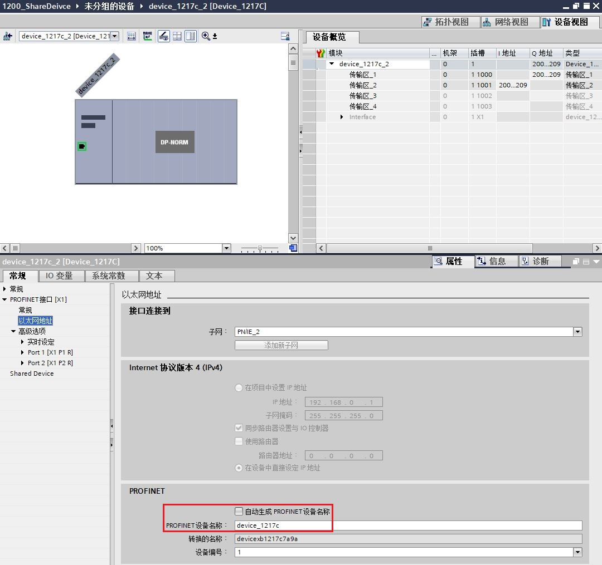
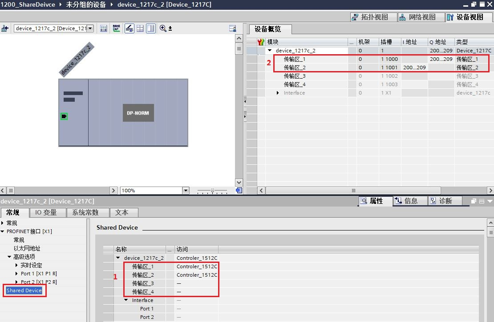
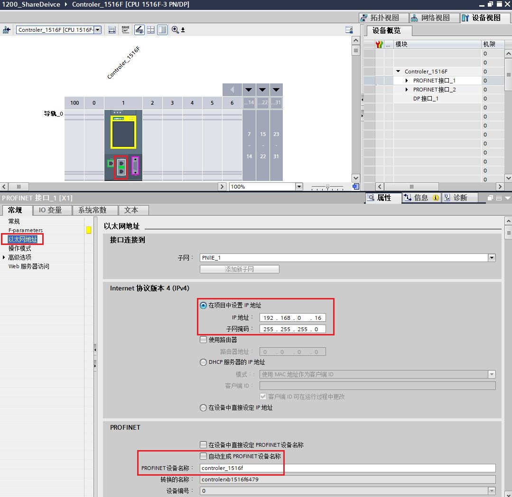
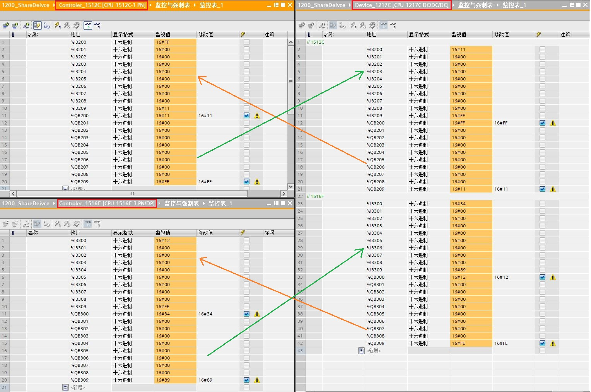

### S7-1200 作为共享设备硬件要求 {#s7-1200-作为共享设备硬件要求 .STYLE1}

S7-1200 CPU 从固件 V4.1 起支持共享设备功能，可与最多 2 个 IO
控制器连接。

此外如果 S7-1200 CPU 作为共享设备的 IO 控制器，也需要至少固件版本 V4.1。

### S7-1200 与 S7-1200 / S7-1500 共享设备通信功能 {#s7-1200-与-s7-1200-s7-1500-共享设备通信功能 .STYLE1}

**软件：**

TIA V17

**硬件：**

CPU1217C DC/DC/DC V4.5

CPU1512C-1 PN V2.9

CPU1516F-3 PN/DP V2.9

**设备类型及地址：**

  ------------------ ------------- ----------------- -------------- ---------------
  CPU 型号           设备类型      设备名称          IP 地址        子网掩码
  CPU1217C           共享设备      device_1217c      192.168.0.17   255.255.255.0
  CPU1512C-1 PN      IO 控制器 1   controler_1512c   192.168.0.12   255.255.255.0
  CPU1516F-3 PN/DP   IO 控制器 2   controler_1516f   192.168.0.16   255.255.255.0
  ------------------ ------------- ----------------- -------------- ---------------

表1 设备类型及地址

#### [1. 共享设备（CPU1217C）组态]{.STYLE4} {#共享设备cpu1217c组态 .STYLE3}

**（1）添加共享设备 CPU1217C**

使用 STEP7 V17 创建一个新项目，添加 CPU1217C 。在设备视图中，设置 IP
地址
（192.168.0.17）、子网掩码（255.255.255.0）和设备名称"device_1217c"，如图
1 所示。

{width="1077" height="981"}

图 1 添加 CPU1217C 并设置 IP和设备名称

**（2）使能" IO 设备"组态**

在 CPU1217C 以太网接口属性巡视窗口中，选择"常规 \>
操作模式"，在"操作模式"界面中，使能"IO 设备"并将"已分配的 IO
控制器"设置为"未分配"， 如图 2 所示。

{width="1082" height="998"}

图 2 使能操作模式

**（3）组态传输区**

在 CPU1217C 以太网接口属性巡视窗口中，选择"常规 \> 操作模式 \>
智能设备通信"。在"传输区域"界面中，添加传输区，并定义本地的通信地址区域和通信长度。如图
3 所示，定义了 4
个传输区，"传输区_1"和"传输区_2"将用于与"controler_1512c"
通信；"传输区_3"和"传输区_4"将用于与"controler_1516f" 通信。

{width="1085" height="764"}

图 3 配置共享设备传输区域

**（4）设置访问共享设备的 IO 控制器的数量**

在 CPU1217C 以太网接口属性巡视窗口中，选择"常规 \> 操作模式 \>
实时设定"，在"Shared Device"中设置"可访问该智能设备的 IO 控制器的数量"为
2，如图 4 所示。

**{width="1083" height="869"}**

图 4 设置访问共享设备的 IO 控制器的数量

**（5）导出 GSD 文件**

保存编译 CPU1217C 硬件配置后，在 CPU1217C
以太网接口属性巡视窗口中，选择"常规 \> 操作模式 \>
智能设备通信"，在"智能设备通信"设置界面底部，单击\"导出\"按钮，生成共享设备的
GSD 文件，选择路径导出并将其保存。如图 5 所示。

{width="1086" height="606"}

图 5 导出共享设备 GSD 文件

#### [2. ]{.STYLE4}IO 控制器 1（CPU1512C-1 PN）组态 {#io-控制器-1cpu1512c-1-pn组态 .STYLE3}

**（1）添加 IO 控制器 1 （CPU1512[C-1 PN]{.STYLE3}）**

在 STEP7 V17 中，添加 CPU1512C-1 PN。在设备视图中，为 CPU1512C-1 PN
以太网接口添加子网，设置 IP 地址
（192.168.0.12）、子网掩码（255.255.255.0）和设备名称"controler_1512c"，如图
6 所示。

{width="1080" height="1049"}

图 6 添加 CPU1512C-1 PN 并设置 IP 和设备名称

**（2）导入 GSD 文件**

在 TIA Portal 软件主菜单栏中，选择"选项 \>
管理通用站描述文件"，在弹出的对话框中选择安装共享设备导出的 GSD
文件，如图 7 所示。

{width="643" height="604"}

图 7 导入共享设备 GSD 文件

**（3）添加共享设备**

GSD 文件安装成功后，其将存在"硬件目录 \> 其他现场设备 \> PROFINET IO \>
PLCs & CPs \> SIEMENS
AG"路径下。在网络视图内，将共享设备拖放组态，并将其分配给 IO 控制器1 的
PROFINET 接口，如图 8 所示。

{width="1124" height="591"}

图 8 添加共享设备

**{width="15" height="15"}注意：**添加共享设备的 GSD
文件的设备名称需要跟共享设备 CPU1217C 的设备名称保持一致，CPU1217C
设备名称为"device_1217c"，此处需要设置一致，如图 9 所示。

{width="1080" height="1015"}

图 9 设置设备名称跟共享设备一致

**（4）配置传输区访问权和地址区**

在共享设备的设备视图中，选择"常规 \> Shared Device"。在 Shared Device
访问权分配表中，为各个传输区分配 IO 控制器和 IO 地址，如图 10 所示。

{width="1110" height="725"}

图 10 配置访问区权限和 IO 地址

1 . 不被 "controler_1512c"
访问的传输区，其访问权限需要设置为"\-\--"，本例中，传输区_3 和传输区_4
是由"controler_1516f"访问，传输区_1 和传输区_2 是由 "controler_1512c"
访问，直接选择 "controler_1512c"。

2.在"设备概览"中，为共享设备中可被 "controler_1512c" 访问的传输区分配 IO
地址。本例中 "controler_1512c"使用 QB200\~QB209
作为数据发送区，该地址对应共享设备 CPU1217C 侧的数据接收区为
IB200\~IB209；"controler_1512c"使用 IB200\~IB209
作为数据接收区，该地址对应共享设备 CPU1217C 侧的数据发送区为
QB200\~QB209。

**{width="15"
height="15"}注意：**确保共享设备的一个传输区只有一个 IO
控制器具有访问权，如果传输区在一个 IO
控制器中设置了访问权，则必须在另一个 IO
控制器中设置访问权"\-\--"，反之亦然。

#### [[3. ]{.STYLE4}IO 控制器 2（CPU1516F-3 PN/DP）组态]{.STYLE3}

**（1）添加 IO 控制器 2 （CPU[ 1516F-3 PN/DP]{.STYLE3}）**

在 STEP7 V17 中，添加 [ CPU1516F-3 PN/DP]{.STYLE3}
CPU。在设备视图中，为[ CPU1516F-3 PN/DP]{.STYLE3}
以太网接口添加子网，设置 IP 地址
（192.168.0.16）、子网掩码（255.255.255.0）和设备名称"controler_1516f"，如图
11 所示。

{width="1079" height="1049"}

图 11 添加 [ CPU1516F-3 PN/DP]{.STYLE3} 并设置 IP 和设备名称

**（2）导入 GSD 文件**

**（3）添加共享设备**

步骤 2 、3 与 IO 控制器 1 组态一致，这里不再赘述。

**（4）配置传输区访问权和地址区**

在共享设备的设备视图中，选择"常规 \> Shared Device"。在 Shared Device
访问权分配表中，为各个传输区分配 IO 控制器和 IO 地址，如图 12 所示。

{width="1005" height="738"}

图 12 配置访问区权限和 IO 地址

1 . 不被 "controler_1516f"
访问的传输区，其访问权限需要设置为"\-\--"，本例中，传输区_1 和传输区_2
是由"controler_1512c"访问，传输区_3 和传输区_4 是由 "controler_1516f"
访问，直接选择 "controler_1516f"。

2.在"设备概览"中，为共享设备中可被 "controler_1516f" 访问的传输区分配 IO
地址。本例中 "controler_1516f"使用 QB300\~QB309
作为数据发送区，该地址对应共享设备 CPU1217C 侧的数据接收区为
IB300\~IB309；"controler_1516f"使用 IB300\~IB309
作为数据接收区，该地址对应共享设备 CPU1217C 侧的数据发送区为
QB300\~QB309。

#### [4. 通信状态测试]{.STYLE3}

将 3 个 CPU 站点组态配置分别下载到对应的 CPU 中， CPU 间的 Profinet IO
通信将自动建立。在监控表中添加传输区数据，给 Q
区赋值，监控发送和接收数据区是一致的，如图 13 所示。

{width="1528" height="1014"}

图 13 通信测试
