### S7-1200 Profinet 的诊断功能 {#s7-1200-profinet-的诊断功能 .STYLE1}

S7-1200 CPU V2.1 版本开始支持分布式 IO 设备的诊断功能，可使用
DeviceStates 和 ModuleStates 指令对分布式 IO
设备的站状态和子模块进行诊断。

S7-1200 CPU V4.0 版本开始支持做为智能设备与其它控制器通信，可使用
ModuleStates 指令诊断智能设备的通信状态。

-   [S7-1200 作为 IO 控制器进行分布式 IO
    设备的通信诊断功能](04-diag.html#a)
-   [S7-1200 做为智能设备进行与 IO 控制器的通信诊断功能](04-diag.html#b)

### []{#a}S7-1200 作为 IO 控制器进行分布式 IO 设备的通信诊断功能

本部分使用 CPU 1214C V4.4 和 ET200SP 的 PN
通信为例进行说明（DP通信同样适用）。

[硬件：]{.STYLE3}

1.  CPU 1214C DC/DC/DC，V4.4，一台
2.  ET200SP 分布式 IO 站，PN 接口，两套

软件：

1.  TIA Portal V16

### 1. 使用 TIA Portal 创建项目 {#使用-tia-portal-创建项目 .STYLE3}

使用 TIA Portal
创建一个新项目，正确配置，下载后，进入网络视图，所有站点状态正常。如图 1
所示。

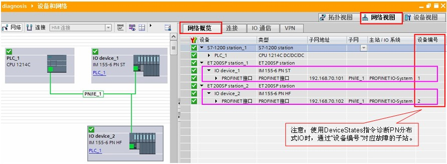{width="891" height="327"}

图 1 网络视图

注意：分布式 IO 为 PN 子站时，可在"网络概览"中可以查看分布式 IO
的设备编号。

### 2. 使用 DeviceStates 指令对分布式 IO 子站进行诊断 {#使用-devicestates-指令对分布式-io-子站进行诊断 .STYLE3}

#### 2.1 创建全局数据块，用于存储状态数据 {#创建全局数据块用于存储状态数据 .STYLE3}

在全局数据块中创建数据类型为 Array of BOOL 数组，共计1024个元素，如图 2
所示。

**『注意』**对于DP主站系统，相关的诊断功能与PROFINET系统类似。只是需要使用DP系统兼容的变量，例如创建128个元素的
Array of BOOL 数组，用于存储DP站的状态，类似情况下文不再赘述。

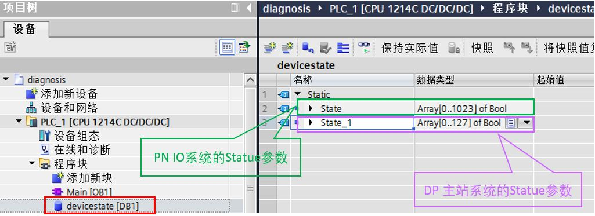{width="1025" height="373"}

图 2 创建全局数据块

#### 2.2 编程 {#编程 .STYLE3}

在 OB1 中调用 DeviceStates 指令，双击 LADDR 引脚，选择需要诊断的 IO
系统，如图 3 所示。

{width="1472" height="848"}

图 3 调用 DeviceStates 指令

本例中选择PN IO系统硬件标识符，并将 MODE 设置为2，STATE
填写上述定义的全局数据块数组。如图 4 所示。

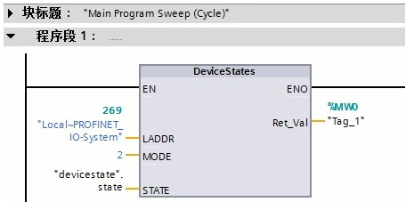{width="456" height="227"}

图 4 填写相应的引脚

表 1 DeviceStates 指令引脚说明

+-----------------------------------+-----------------------------------+
| 参数 LADDR                        | ::: {align="left"}                |
|                                   | 使用 LADDR 参数通过硬件标识符选择 |
|                                   | PROFINET IO 或 DP 主站系统。      |
|                                   |                                   |
|                                   | 硬件标识符位于：                  |
|                                   |                                   |
|                                   | -   PROFINET IO 或 DP             |
|                                   |     主站系统属性的网络视图中。    |
|                                   | -   或数据类型为 HW_IOSYSTEM      |
|                                   |     的所列系统常量的 PLC          |
|                                   |     变量表中。                    |
|                                   | :::                               |
+-----------------------------------+-----------------------------------+
| 参数 MODE                         | ::: {align="left"}                |
|                                   | 使用 MODE 参数可读取状态信息。    |
|                                   | 可读取整个 PROFINET IO 或 DP      |
|                                   | 主站系统的下列一条状态信息：      |
|                                   |                                   |
|                                   | -   1: IO 设备/DP 从站已组态      |
|                                   | -   2: IO 设备/DP 从站故障        |
|                                   | -   3: IO 设备/DP 从站已禁用      |
|                                   | -   4: IO 设备/DP 从站存在        |
|                                   | -   5: 出现问题的 IO 设备/DP      |
|                                   |     从站。                        |
|                                   | :::                               |
+-----------------------------------+-----------------------------------+
| 参数 STATE                        | ::: {align="left"}                |
|                                   | 通过 STATE 参数，输出由 MODE      |
|                                   | 参数选择的 IO 设备/DP             |
|                                   | 从站的状态。\                     |
|                                   | 如果使用 MODE 选择的状态适用于 IO |
|                                   | 设备/DP 从站，则在 STATE          |
|                                   | 参数中将下列位设置为"1"：         |
|                                   |                                   |
|                                   | -   位 0 = 1： 组显示。           |
|                                   |     至少有一个 IO 设备/DP         |
|                                   |     从站的第 n 位设置为"1"。      |
|                                   | -   位 n = 1：通过 MODE           |
|                                   |     选择的状态将应用到 IO 设备/DP |
|                                   |     从站。                        |
|                                   |     -   对于 PROFINET IO 系统，第 |
|                                   |         n 位对应于相应 IO         |
|                                   |         设备的设备编              |
|                                   | 号（请参见设备视图和网络视图中的  |
|                                   |         PROFINET 接口属性）。     |
|                                   |     -   对于 PROFINET DP 系统，第 |
|                                   |         n 位对应于 DP 从站的      |
|                                   |         PROFIBUS                  |
|                                   |         地                        |
|                                   | 址（请参见设备视图和网络视图中的  |
|                                   |         DP 从站属性）。           |
|                                   |                                   |
|                                   | 使用"BOOL"或"Array of             |
|                                   | BOOL"作为数据类型：               |
|                                   |                                   |
|                                   | -   ::: {align="left"}            |
|                                   |                                   |
|                                   |  要仅输出状态信息的组显示位，可在 |
|                                   |     STATE 参数中使用 BOOL         |
|                                   |     数据类型。                    |
|                                   |     :::                           |
|                                   |                                   |
|                                   | -   ::: {align="left"}            |
|                                   |     要输出所有 IO 设备/DP         |
|                                   |                                   |
|                                   |  从站的状态信息，请使用下列长度的 |
|                                   |     Array of BOOL：               |
|                                   |     :::                           |
|                                   |                                   |
|                                   |     ::: {align="left"}            |
|                                   |     -   对于 PROFINET IO          |
|                                   |         系统：1024 位             |
|                                   |     -   对于 DP 主站系统：128 位  |
|                                   |     :::                           |
|                                   | :::                               |
+-----------------------------------+-----------------------------------+

#### [2.3 测试 ]{.STYLE3}

将程序下载到 PLC 中。

监控全局数据块 devicestate。如图 5 所示。

{width="727" height="291"}

图 5 IO 系统正常

当 IO device_2 故障时（掉电或网线拔除导致丢站），state\[2\]=1。如图 6
所示。

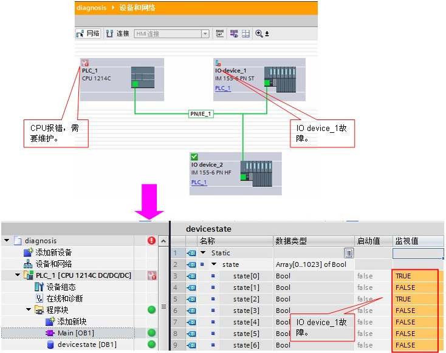{width="734" height="582"}

图 6 IO device_2 故障

当 IO device_1 和 IO device_2
故障时（掉电或网线拔除导致丢站），state\[1\]=1 和 state\[2\]=1。如图 7
所示。

{width="732" height="594"}

图 7 IO device_1 和 IO device_2 故障

### 3. 使用 ModuleStates 指令对分布式 IO 子模块进行诊断 {#使用-modulestates-指令对分布式-io-子模块进行诊断 .STYLE3}

#### 3.1 创建全局数据块，用于存储状态数据 {#创建全局数据块用于存储状态数据-1 .STYLE3}

在全局数据块中创建数据类型为 Array of BOOL 数组，共计128个元素。 如图 8
所示。

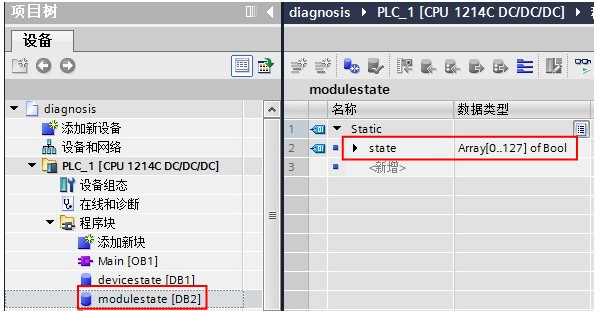{width="598" height="314"}

图 8 创建全局数据块

#### 3.2 编程 {#编程-1 .STYLE3}

在 OB1 中调用 ModuleStates 指令，双击 LADDR 引脚，选择需要诊断的分布式
IO 站。如图 9 所示。

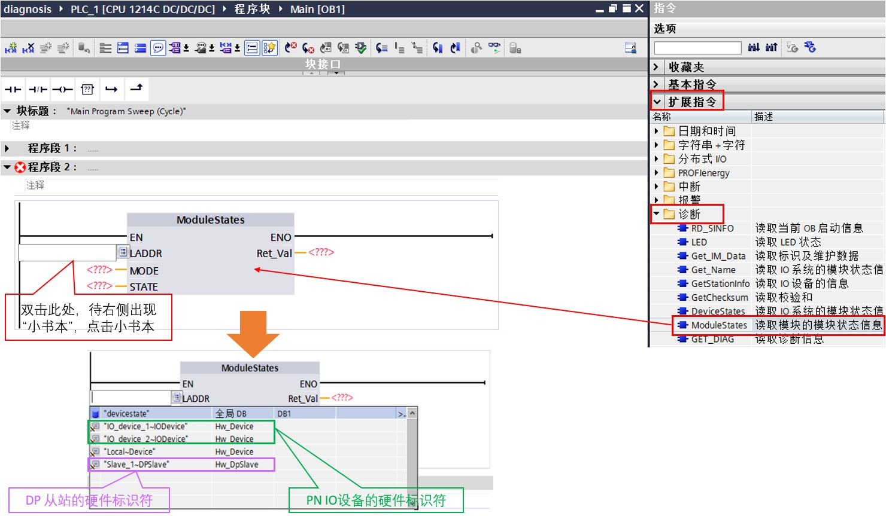{width="1480" height="863"}

图 9 调用 ModuleStates 指令

本例中选择PN IO设备硬件标识符，并将 MODE 设置为2，STATE
填写上述定义的全局数据块数组。如图 10 所示。

{width="442" height="198"}

图 10 填写相应的引脚

表 2 ModuleStates指令引脚说明

+-----------------------------------+-----------------------------------+
| 参数 LADDR                        | 使用 LADDR                        |
|                                   | 参数通过站硬件标识符选择 IO       |
|                                   | 设备或 DP 从站。\                 |
|                                   | 硬件标识符位于：                  |
|                                   |                                   |
|                                   | ::: {align="left"}                |
|                                   | -   IO 设备站或 DP                |
|                                   |     从站属性的网络视图中。        |
|                                   | -   或数据类型为 HW_DEVICE（对于  |
|                                   |     IO 设备）或 HW_DPSLAVE（对于  |
|                                   |     DP 从站）的所列系统常量的 PLC |
|                                   |     变量表中。                    |
|                                   | :::                               |
+-----------------------------------+-----------------------------------+
| 参数 MODE                         | 使用 MODE 参数可读取状态信息。    |
|                                   | 可读取模块的下列一条状态信息：    |
|                                   |                                   |
|                                   | ::: {align="left"}                |
|                                   | -   1: 模块已组态                 |
|                                   | -   2: 模块故障                   |
|                                   | -   3: 模块禁用                   |
|                                   | -   4: 模块存在                   |
|                                   | -   5: 模块中存在故障。           |
|                                   | :::                               |
+-----------------------------------+-----------------------------------+
| 参数 STATE                        | STATE 参数输出使用 MODE           |
|                                   | 参数选择的模块状态。\             |
|                                   | 如果使用 MODE                     |
|                                   | 选择的状态适用于                  |
|                                   | 某个模块，那么下列位将设置为"1"： |
|                                   |                                   |
|                                   | ::: {align="left"}                |
|                                   | -   位 0 = 1： 组显示。           |
|                                   |     至少一个模块的第 n            |
|                                   |     位设置为"1"。                 |
|                                   | -   位 n = 1：使用 MODE           |
|                                   |     选择的状态将应用到插槽        |
|                                   |     n-1（例如：位 3 对应插槽      |
|                                   |     2）中的模块。                 |
|                                   | :::                               |
|                                   |                                   |
|                                   | 使用"BOOL"或"Array of             |
|                                   | BOOL"作为数据类型：               |
|                                   |                                   |
|                                   | ::: {align="left"}                |
|                                   | -                                 |
|                                   |  要仅输出状态信息的组显示位，可在 |
|                                   |     STATE 参数中使用 BOOL         |
|                                   |     数据类型。                    |
|                                   | -   要输出                        |
|                                   | 所有模块的状态信息，请使用长度为  |
|                                   |     128 位的 Array of BOOL。      |
|                                   | :::                               |
+-----------------------------------+-----------------------------------+

#### [3.3 测试 ]{.STYLE3}

将程序下载到 PLC 中。

监控全局数据块 modulestate。如图 11 所示。

{width="684" height="307"}

图 11 分布式 IO 站所有子模块正常

当 IO device_1
站插槽编号1的子模块故障时（损坏或被拔除），state\[2\]=1。如图 12 所示。

{width="702" height="701"}

图 12 插槽编号1子模块故障

### []{#b}S7-1200 做为智能设备进行与 IO 控制器的通信诊断功能

本部分使用 CPU 1215FC V4.4 （智能设备）和 CPU 1217C V4.5 （IO 控制器）PN
通信为例进行说明

[硬件：]{.STYLE3}

1.  CPU 1217C DC/DC/DC，V4.5，一台
2.  CPU 1215FC DC/DC/DC，V4.4，一台

软件：

1.  TIA Portal V17

### 1. 组态配置

#### 1.1 组态概览

CPU 1215FC 做为智能设备，连接到 IO 控制器 CPU 1217C，如图 13 所示。

{width="398" height="137"}

图 13 组态概览

#### 1.2 智能设备配置

本示例中，CPU 1215FC 配置了两个传输区，如图 14 所示。

{width="805" height="494"}

图 14 智能设备设置

### 2. 编写PLC程序，调用诊断块

#### 2.1 指令位置

可以使用 ModuleStates
指令，确认智能设备的连接状态，功能块位于"扩展指令-诊断"中，如图 15
所示。

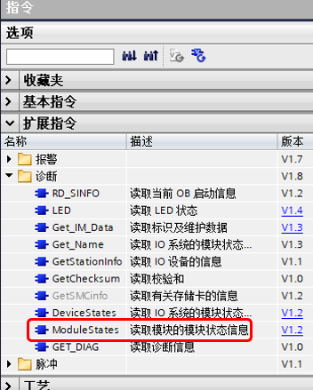{width="352" height="439"}

图 15 ModuleStates 指令位置

#### 2.2 建立用于接收状态的 DB 变量

数据类型为 Bool 数组 (Array\[0..127\] of Bool) ，如图 16 所示：

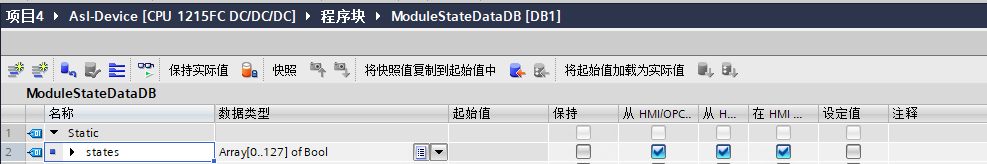{width="987" height="164"}

图 16 用于接收状态的 DB 变量

#### 2.3 调用 ModuleStates 指令

指令在OB1中调用，其中 LADDR 使用的系统常数，如图 17 所示。

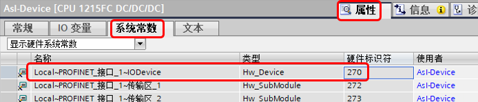{width="694" height="149"}

图 17 硬件标识符

程序中，STATE 使用图 16 创建的数组，MODE 设置为 2，调用如图 18 所示。

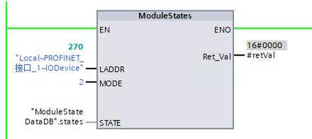{width="440" height="197"}

图 18 调用指令

指令管脚说明参见表 2。

### 3. 诊断

当智能设备与 IO 控制器网络断开以后，如图 19 所示。

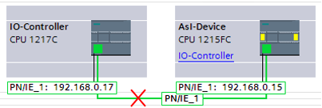{width="403" height="135"}

图 19 断开网络

从智能设备的接收状态 DB 中读取到状态位 0 以及状态位 2
均为\"TRUE\"，说明与 IO 控制器的通信中断，如图 20 所示。

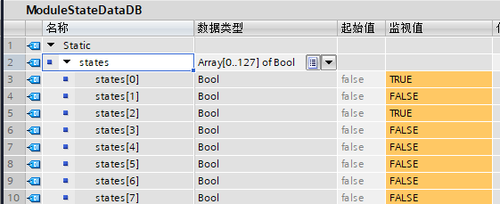{width="561" height="229"}

图 20 读取到的状态
