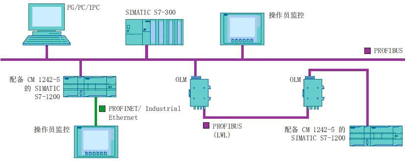
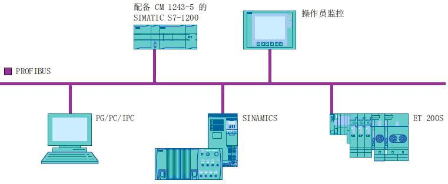

### S7-1200 PROFIBUS DP 通信

S7-1200 CPU固件版本 从V2.0 开始，组态软件STEP 7 版本从
V11.0开始，支持PROFIBUS DP通信。使用STEP 7 Basic V11 或使用STEP 7
Professional V11 可对S7-1200 做PROFIBUS DP 通信组态。\
S7-1200 支持PROFIBUS DP通信的模块：\
CM 1243-5 DP 主站模块，订货号：6GK7 243-5DX30-0XE0\
CM 1242-5 DP 从站模块，订货号：6GK7 242-5DX30-0XE0

### S7-1200 PROFIBUS DP 特性数据：

+-----------------------------------+-----------------------------------+
| **特性数据**                      | **参数**                          |
+-----------------------------------+-----------------------------------+
| **传输速率**                      | **9.6 Kbps 到 12 Mbps**           |
+-----------------------------------+-----------------------------------+
| **PROFIBUS DP 地址范围**          | **0到127**\                       |
|                                   | 0 一般用于编程设备\               |
|                                   | 1 一般用于操作员站；\             |
|                                   | 126                               |
|                                   | 为不具有开关设置，必须            |
|                                   | 通过网络重新寻址的出厂设备保留；\ |
|                                   | 127 用于广播；\                   |
|                                   | DP 设备的有效地址范围是2到125\    |
|                                   | \                                 |
+-----------------------------------+-----------------------------------+
| **S7-1200 DP主站数据区的大小**    | **最大 1024 字节\                 |
|                                   | **输入区最大 512 字节，输出区最大 |
|                                   | 512 字节。                        |
+-----------------------------------+-----------------------------------+
| **S7-1200 DP从站数据区的大小**    | **输入区最大 240 字节，输出区最大 |
|                                   | 240 字节，每个 DP                 |
|                                   | 从站的诊断数据区最大 240 字节。** |
+-----------------------------------+-----------------------------------+

### CM1243-5与S7-1200的固件兼容性

+-----------+-----------+-----------+-----------+-----------+-----------+
| CPU       | CM1243-   | 博途      | 可带      | DP        | 扩展站子  |
| 硬件版本  | 5固件版本 | 软件版本  | 主站数量  | 从站      | 模块最大  |
|           |           |           |           | 最大数量  | 数量总和  |
+===========+===========+===========+===========+===========+===========+
| V4.0 &    | V1.       | STEP7 V13 | ::        | ::        | ::        |
| V4.1      | 3及其以上 |           | : {align= | : {align= | : {align= |
|           |           |           | "center"} | "center"} | "center"} |
|           |           |           | 3         | 32        | 512       |
|           |           |           | :::       | :::       | :::       |
+-----------+-----------+-----------+-----------+-----------+-----------+
| ::        | ::        | ::        | ::        | ::        | ::        |
| : {align= | : {align= | : {align= | : {align= | : {align= | : {align= |
| "center"} | "center"} | "center"} | "center"} | "center"} | "center"} |
| V3.0      | V1.       | STEP7 V12 | 3         | 32        | 512       |
| :::       | 2及其以上 | :::       | :::       | :::       | :::       |
|           | :::       |           |           |           |           |
+-----------+-----------+-----------+-----------+-----------+-----------+
| ::        | ::        | ::        | ::        | ::        | ::        |
| : {align= | : {align= | : {align= | : {align= | : {align= | : {align= |
| "center"} | "center"} | "center"} | "center"} | "center"} | "center"} |
| V2.2      | V1.0/V1.1 | STEP7 V11 | 1         | 16        | 256       |
| :::       | :::       | :::       | :::       | :::       | :::       |
+-----------+-----------+-----------+-----------+-----------+-----------+

#### S7-1200 PROFIBUS DP 的通信伙伴：

CM 1242-5从站模块，可以成为以下 DP V0 / V1 主站的通信伙伴：

-   SIMATIC S7-1200、S7-300、S7-400、WinAC
-   带有DP 主站模块的ET200
-   SIMATIC PC 站
-   SIMATIC NET IE/PB Link
-   第三方PLC

CM 1243-5主站模块，可与以下 DP-V0 / V1 从站进行通信：

-   SIMATIC ET200
-   配有CM 1242-5 的S7-1200 CPU
-   配有EM 277 的S7-200 CPU
-   带集成 DP 口的 S7-300/400 CPU
-   配有CP 342-5 模块的 S7-300 CPU
-   SINAMICS 变频器
-   其它供应商提供的带有DP口的驱动器和执行器
-   其它供应商提供的带有DP口的传感器
-   配有 PROFIBUS CP 的 SIMATIC PC 站

S7-1200 PROFIBUS CM 使用 PROFIBUS DP V1 协议，实现以下类型的通信：

周期性通信，CM 1242-5 和 CM 1243-5都支持。

-   可在 DP 从站和 DP 主站之间传送过程数据
-   由 CPU 的操作系统进行处理，不需要特殊指令块，直接在 CPU
    的过程映像中读取或写入 I/O

非周期性通信，从站 CM 1242-5 不支持，主站 CM
1243-5支持使用软件指令块进行非周期性通信。

-   "RALRM"指令用于处理中断
-   "RDREC"和"WRREC"指令可用于可用于传送组态和诊断数据

#### CM 1243-5 支持的其它通信服务

S7通信：\
可通过 PROFIBUS 与其它 S7 控制器使用 PUT/GET 指令通信。\
PG/OP 通信：\
通过CM 1243-5 ，可对S7-1200 做下载、诊断操作，或连接S7-1200 到HMI
面板、装有 WinCC flexible 的 SIMATIC PC 、支持 S7 通信的 SCADA 系统。

#### 电气连接：

CM 1242-5 通过背板总线供电。\
CM 1243-5 通过模块附带的24 V DC 电源连接器供电。\
\
通过RS485 网络总线连接器连接到 PROFIBUS DP 网络，9
针D型头的引脚分配如下图：

{width="461" height="191" border="1"}

#### 组态示例：

做从站

{width="828" height="328" border="1"}

做主站

{width="761" height="313" border="1"}\
