### PROFIBUS DP 主从配置方法步骤：

-创建 STEP 7 项目\
-插入所需的 SIMATIC S7-1200站\
-在站中插入通信模块和其它所需模块\
-添加PROFIBUS DP网络，分配DP 地址，定义操作模式和DP参数

-   DP 地址定义
-   DP 主 / 从模式选择
-   最高地址：因为PROFIBUS令牌只传递给主站，合适的最高 PROFIBUS
    地址可优化总线

-连接 DP 从站到主站\
-组态其它模块\
-项目保存并下载

#### 1、一般DP从站的组态方法：

以S7-1200和ET200S 为例，说明组态过程。\
（1）S7-1200 通过CM1243-5 做DP主站

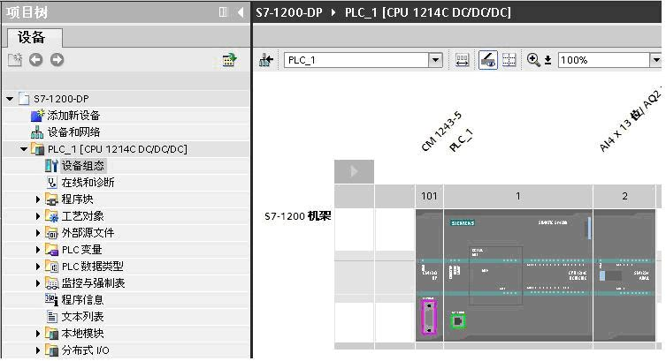{width="753" height="409" border="1"}

（2）创建DP主站系统\
在网络视图右键单击 DP 主站模块CM1243-5的 DP
接口，通过操作"分配主站系统"来创建DP主站。

{width="291" height="338" border="1"}

（3）组态从站\
从硬件目录/ 分布式I/O
中将ET200S拖入网络视图，鼠标拖动从站通信接口到主站接口，
释放鼠标按钮，即可创建 PROFIBUS 连接。

{width="519" height="133" border="1"}

点击 ET200S 上 "未分配"，将从ET200S 分配给 CM1243-5 。显示如下图

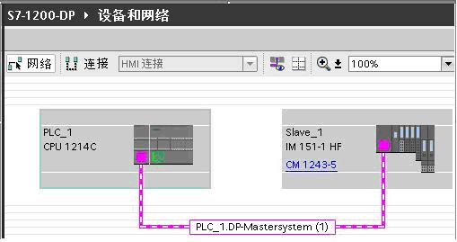{width="509" height="269" border="1"}

鼠标右键点击网线可查看网络参数，在网络设置中可修改传输速率、最高站地址等。

{width="656" height="177" border="1"}

{width="650" height="198" border="1"}

（4）双击ET200S组态从站其它模块\
如图示分别插入电源模块PM-E，DO模块和DI模块。

{width="748" height="471" border="1"}

（5）编译存盘，下载到S7-1200 CPU

#### 2、智能从站组态方法

以2个 S7-1200 DP组态通信为例。\
（1）PLC_1_DP_Master通过CM1243-5 做PROFIBUS DP主站，PLC_2_DP_Slave
通过CM1242-5做PROFIBUS DP从站。组态设备并创建DP主站网络

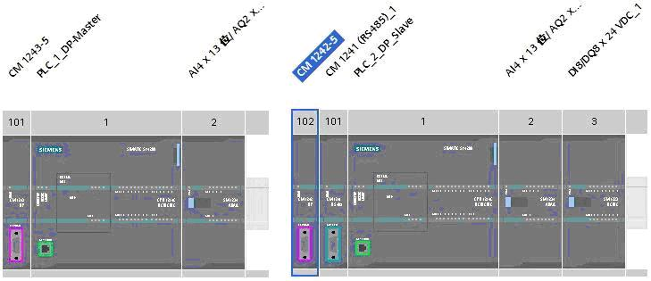{width="729" height="315" border="1"}

（2）从站连接到主站，将 PLC_2_DP_Slave 分配给 DP主站 CM1243-5

{width="528" height="155" border="1"}

（3）双击PLC_2_DP_Slave，点击DP口通过属性组态数据传输区

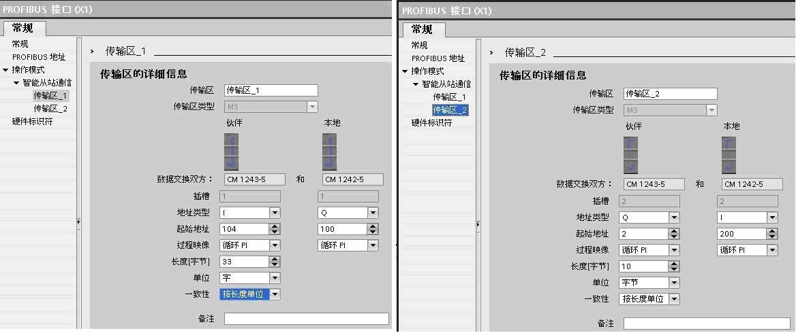{width="1168" height="490" border="1"}

传输区_1主站读取从站33个字，传输区_2主站发送10个字节到从站，按长度单位保持数据的一致性。"按长度单位"一致性数据的读取，不需要编写通讯程序。

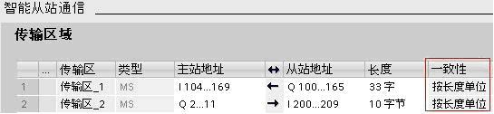{width="545" height="126" border="1"}

比如传输区_1，主站将从站QW100 开始的33个字，读取到从IW104
开始的地址里。\
编译，存盘，下载程序到各自的CPU。\
通过监控表可以看到数据的对应关系。\
{width="658" height="232" border="1"}

对于智能从站的I/O模块：\
DP
主站无法直接读写智能从站的I/O模块，要通过智能从站CPU编写程序，将I/O模块和DP传输区进行数据交换来实现。

{width="376" height="236" border="1"}

假如主站要读取从站CPU集成输入点IW0，则从站主循环程序OB1需要插入一段MOVE程序，如下图，通过MOVE指令将IW0传送到QW120
。使用上边的组态，从站数据QW120通过传输区_1到达主站的IW124。

{width="256" height="122" border="1"}

通过下图的监控表可以看到，主站在IW124读到了从站CPU的集成点IW0。

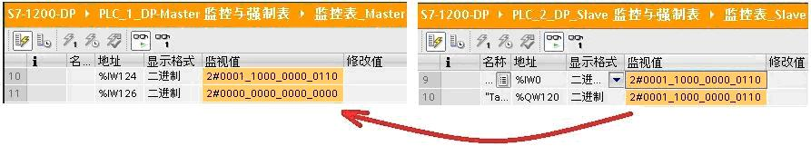{width="893" height="161" border="1"}

#### 3、组态基于 GSD 的 DP 从站

当DP从站为第三方设备，或在 STEP7 V11
硬件列表中找不到的西门子设备，可通过安装GSD 文件将该设备添加到STEP7 V11
，这样该设备就被添加到系统中。\
设备的GSD文件，由设备供应商提供。\
下面以S7-1200 通过CM1243-5 做主站，S7-200 通过EM277
做从站，介绍组态过程：\
（1）在STEP7 V11安装EM277 GSD文件\
安装GSD 文件前，要关闭硬件和网络编辑器,在"选项"(Options)
菜单中，选择命令"安装设备描述文件"。

{width="478" height="166" border="1"}

从"源路径"选择要安装 GSD 文件的文件夹，从所显示 GSD
文件的列表中选择要安装的文件，单击"安装" (Install) 按钮。

{width="644" height="228" border="1"}

重启STEP7后，在硬件目录中"其它现场设备"文件夹下，就可以找到通过 GSD
文件安装的 DP 从站。

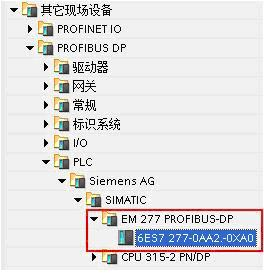{width="264" height="273" border="1"}

（2）将EM277 拖放到网络视图，并连接到主站模块CM1243-5

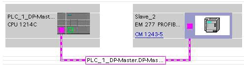{width="494" height="133" border="1"}

[（]{lang="ZH-CN"}3[）双击]{lang="ZH-CN"}EM277
[，在属性中查看]{lang="ZH-CN"}PROFIBUS DP[参数，]{lang="ZH-CN"}EM277
DP[地址为]{lang="ZH-CN"}4
[，]{lang="ZH-CN"}V[区地址偏移量是]{lang="ZH-CN"}0

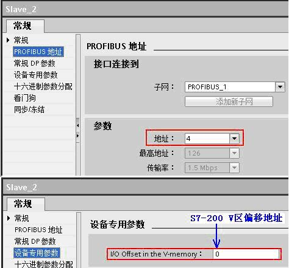{width="474" height="441" border="1"}

（4）组态通信数据\
EM277
设备概览中只有一个可组态的槽位，根据通信数据的要求，可选择固定报文或通用模块，本例选择通用模块，定义了与主站的数据交换为10字节输入，10字节输出，一致性选择"按长度单位"。

{width="593" height="122" border="1"}

[（]{lang="ZH-CN"}5[）编译检查组态，下载到]{lang="ZH-CN"} S7-1200 CPU
[。]{lang="ZH-CN"}

[（]{lang="ZH-CN"}6[）将]{lang="ZH-CN"}EM277
[地址拨码开关拨到]{lang="ZH-CN"}4[，启动]{lang="ZH-CN"}PLC[。]{lang="ZH-CN"}

[通过]{lang="ZH-CN"} S7-1200
[的监控表和]{lang="ZH-CN"}S7-200[的状态表查看通信数据。]{lang="ZH-CN"}

{width="896" height="288" border="1"}

#### [4]{lang="PT-BR"}[、]{lang="ZH-CN"}主站和从站不在一个项目中

当DP主站和DP从站不在同一项目时，DP通信组态要在各自的项目中完成。如下例子CPU315-2PN/DP做DP主站，CPU1214C
和CM1242-5 做DP智能从站，CPU315-2PN/DP在STEP7 V5.5完成组态，S7-1200
使用STEP7 V11 SP2 组态。\
\
（1）在STEP7 V5.5 组态DP主站\
\
a. 在STEP7 V5.5 安装CM1242-5 GSD文件\

{width="33" height="33"}[**CM1242-5 GSD
文件本地下载**](images/si01818e.rar)\
\
STEP7 V5.5 硬件组态，Option/Install GSD File ，将CM1242-5
GSD文件安装到STEP7 V5.5 。

{width="519" height="291"}

b\. 组态主/从通信\
将地址为3的DP从站模块CM1242-5
连接到CPU315-2PN/DP。槽1插入通用模块，2个字节的输入；槽2插入通用模块，2个字节的输出。

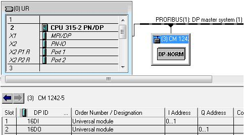{width="483" height="267"}

c\. 下载DP主站组态\
如上组态编译检查，若没有错误，存盘并下载到CPU315-2PN/DP。

\
（2）在STEP7 V11组态DP从站\
\
a.在STEP7 V11组态S7-1200\
在STEP7
V11项目视图添加PLC站S7-1200，以及CM1242-5模块。CM1242-5模块的DP网口添加新网PROFIBUS_1，DP地址定义为3，与STEP7
V5.5 相同。由于主站不在同一个项目中，S7-1200的主站分配状态为"未分配"。\
\
{width="255" height="131"}

\
b. 组态通信传输区\
选择模块CM1242-5上的
DP口属性，添加与主站通信的数据传输区。1槽插入2个字节的输出，2槽插入2个字节的输入，与主站通信组态的槽交叉对应\

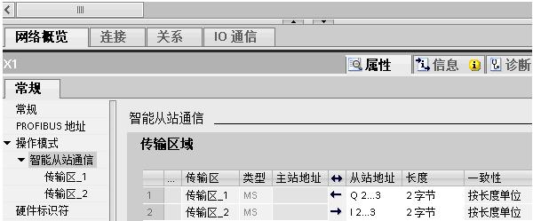{width="600" height="249"}

\
c.下载到 S7-1200 的CPU\
选择 S7-1200 PLC 站，编译，若没有错误，将组态下载到 CPU 1214C。

\
（3）查看通信状态\
通过STEP7 V5.5 的变量表，以及STEP7 V11 的监控表， 查看DP通信结果。

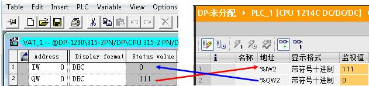{width="631" height="147"}
