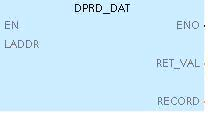
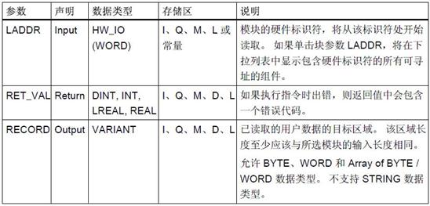
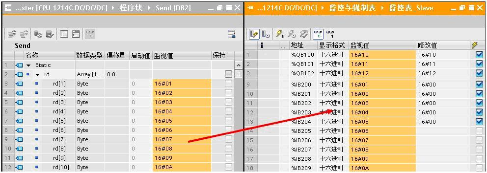

### [对]{lang="ZH-CN"}[DP]{lang="PT-BR"}[从站一致性数据读写]{lang="ZH-CN"}

可以同步更改的数据称为一致性数据。\
CPU 为所有基本数据类型（如Word 或 DWord)和所有系统定义的结构（例如
IEC_TIMERS 或
DTL)保持数据的一致性。数值的读/写操作不会被中断。（例如，在读写四字节的DWord
完成之前，CPU 会防止对该 DWord 进行访问）。

S7-1200 若要通过PROFIBUS
DP对从站进行一致性数据读写，而这些数据无法通过基本数据类型表示时，系统为S7-1200提供了一致性数据读写的指令，DPRD_DAT和
DPWR_DAT。这两个指令块在STEP7 V11 指令的"扩展指令 /分布式I/O /
其它"中。通过DP一致性数据读 / 写指令块，S7-1200 的DP主站可以对从站最多64
个字节读取，最多64个字节的写入。\
\
DPRD_DAT ：读取DP标准从站的一致性数据。

{width="208" height="114" border="1"}

参数说明：

{width="548" height="263"}

DPWR_DAT：将一致性数据写入 DP 标准从站

{width="204" height="96" border="1"}

参数说明：

{width="569" height="271"}

以两个S7-1200 DP通信为例介绍编程方法步骤：\
\
（1）、设备网络组态同上，传输区参数数据一致性要选择"总长度"。

{width="439" height="149" border="1"}

（2）、编写程序\
在主循环程序OB1中执行DPRD_DAT和DPWR_DAT。\
调用DPRD_DAT ，单击块参数
LADDR，将在下拉列表中选择"传输区_1"，DB3从0地址开始存放接收数据。当执行指令发生错误时，可在MW300查询返回的错误代码。

{width="772" height="214" border="1"}

程序执行后，DP主站通过传输区_1读取DP从站从QB100开始的64字节数据，读取结果放到DB3
。

{width="990" height="310"}

[调用]{lang="ZH-CN"}DPWR_DAT [，单击块参数]{lang="ZH-CN"}
LADDR[，将在下拉列表中选择]{lang="ZH-CN"}"[传输区]{lang="ZH-CN"}\_2"[，]{lang="ZH-CN"}DB2[从]{lang="ZH-CN"}0[开始的地址]{lang="ZH-CN"}[为数据源。当执行指令发生错误时，可在]{lang="ZH-CN"}MW302[返回错误代码。]{lang="ZH-CN"}

{width="858" height="215" border="1"}

执行DPWR_DAT，
DP主站将DB2中64字节数据通过传输区_2写到DP从站IB200开始的地址。

{width="992" height="354"}

**{width="15"
height="15"}注意：**DP从站一致性数据读/写指令，只能访问无法通过基本数据类型表示的数据，比如3
个字节或 4 个字节以上的数据区域。 否则，访问将遭到拒绝，并返回错误代码
W#16#8090 。
