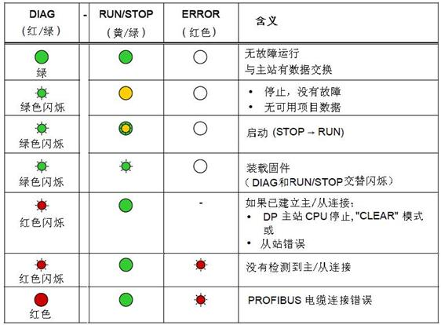
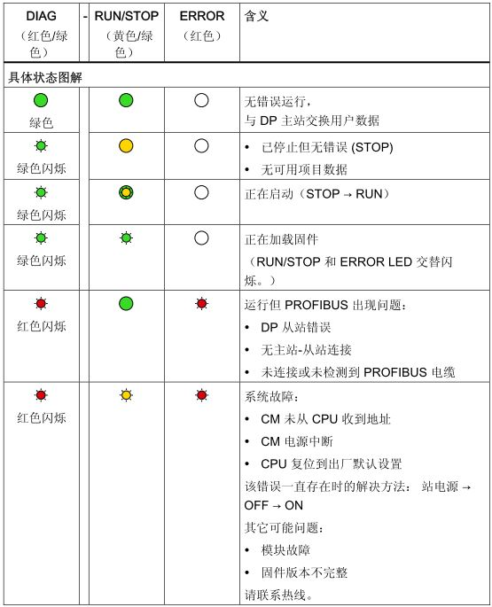
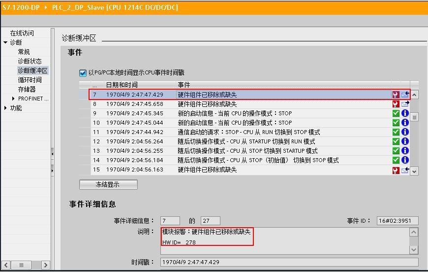
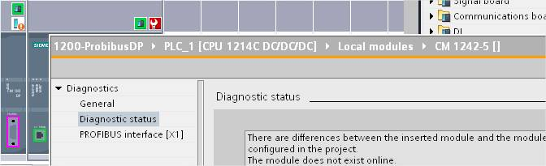
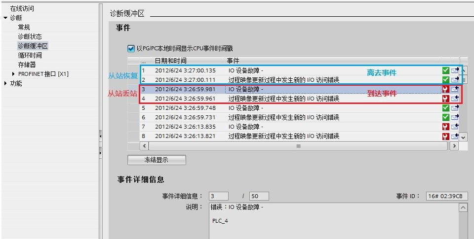
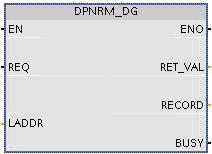
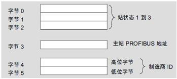
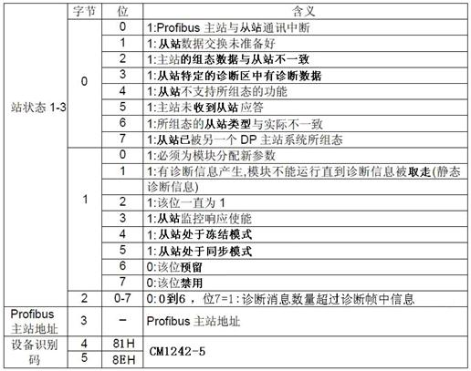
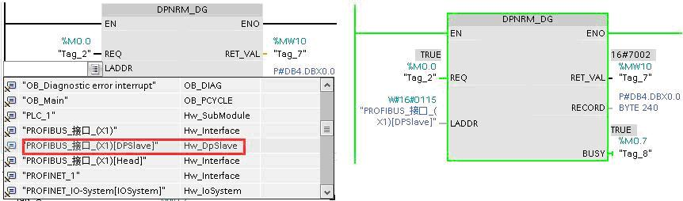
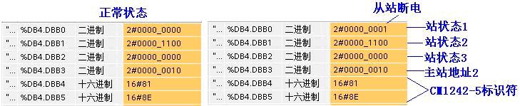

### 故障诊断

**S7-1200 做 DP Master 通讯时，DP slave 丢失后，CPU不会停机，也不需要向
CPU 下载组织块。**

对PROFIBUS DP 的故障诊断，有如下几种方法：

#### 1、通过模块上的指示灯

前面板上的 DIAG 灯，绿色正常，有错误和问题时提示为红色。上盖后面的 RUN /
STOP 、ERROR 和前面板的DIAG 灯相组合，给出模块状态：

{width="562" height="414"}

图1. 早期 CM1243-5固件版本 V1.0 & V1.1 的故障指示灯

{width="556" height="687"}

图2. CM1243-5 固件版本 V1.2 & V1.3 的故障指示灯

#### 2. 通过编程软件诊断

-   早期 CM1243-5 固件版本V1.0 & V1.1在STEP 7 V11中查看CPU
    诊断缓冲区中的条目。\
    \
    {width="870" height="552"}\
    \
    查看在线状态下模块的信息\
    \
    {width="672" height="205"}

<!-- -->

-   较新版本的CM1243-5 例如 V1.3版本在TIA V13
    SP1中查看诊断缓冲区里从站丢站的信息记录如下：

{width="960" height="485"}

#### 3、通过程序读取DP 从站诊断信息

CM1243-5使用 DPNRM_DG 指令，可以读取PROFIBUS DP从站的诊断数据。\
DPNRM_DG 指令参数：

{width="212" height="154"}

REQ：读取请求\
LADDR：从站诊断地址\
RECORD：读取到的诊断数据存放的目标地址\
RET_VAL：执行指令出错时返回错误代码\
BUSY：正在读诊断数据\
CM 1242-5 支持6 个字节的标准诊断，和6
个字节的设备特定的诊断，通过标准诊断，可得到从站状态。\
标准诊断数据概述：

{width="349" height="156" border="1"}

标准诊断数据信息：

{width="516" height="407"}

标准诊断数据读取方法：\
在主程序OB1 调用S7-1200"扩展指令/分布式I/O/其它"的
DPNRM_DG指令。单击块参数
LADDR，将在下拉列表中选择DP从站诊断地址，读取的诊断数据存放在DB4 中。

{width="862" height="254" border="1"}

通过监视表格查看诊断数据：

{width="729" height="149" border="1"}
