### S7-1200 和 S7-300 集成 DP 口的主从通信（1200做主站，300做从站） {#s7-1200-和-s7-300-集成-dp-口的主从通信1200做主站300做从站 .STYLE1}

使用 S7-1200 与 S7-300 的集成 DP 接口进行主从通信，这里是将 S7-1200
做为主站，将 S7-300 做为从站，即：S7-1200 通过 CM1243-5 做主站，S7-300
集成的 DP 接口做从站。下面详细介绍使用方法。

[硬件：]{.STYLE3}

1.  CPU 1214C DC/DC/DC，V2.2
2.  CM1243-5（主站模块）
3.  S7-300 CPU（6ES7 315-2EH14-0AB0）

软件：

1.  Step7 V12
2.  Step7 V5.5 SP1

S7-1200 通过 CM1243-5 做主站，S7-300 集成的 DP
接口做从站，这种方式可以分2种情况来操作，具体如下：

1.  第一种情况：CPU 1214C 和 S7-300 CPU 使用 Step7 V12
    在一个项目中操作。
2.  第二种情况：CPU 1214C 和 S7-300 CPU 使用 Step7 V12
    不在一个项目中的操作。CPU 1214C 使用 Step7 V12，而 S7-300 CPU
    分别使用 Step7 V12 和 Step7 V5.5。

### 1. 第一种情况（同一项目中操作） {#第一种情况同一项目中操作 .STYLE4}

CM1243-5 做 DP 主站，S7-300 CPU 的集成 DP 接口做 DP 从站，使用 Step7 V12
在一个项目中操作，详细步骤如下。

#### 1-1 使用 Step7 V12 生成项目 {#使用-step7-v12-生成项目 .STYLE3}

使用 STEP7 V12 创建一个新项目，并通过"添加新设备"组态 S7-1200 站
PLC_1，选择 CPU1214C DC/DC/DC V2.2；接着组态 S7-300 站 PLC_2，如图 1
所示。

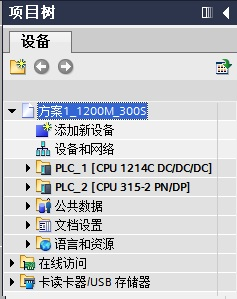{width="237" height="299"}

图 1 在新项目中插入 S7-1200 站和 S7-300 站

#### [1-2 组态主站 CM1243-5]{.STYLE3}

组态 CM1243-5 的 DP 接口，进入 CM1243-5
的属性框，添加子网"PROFIBUS_1",站址选择 2，如图 2 所示。

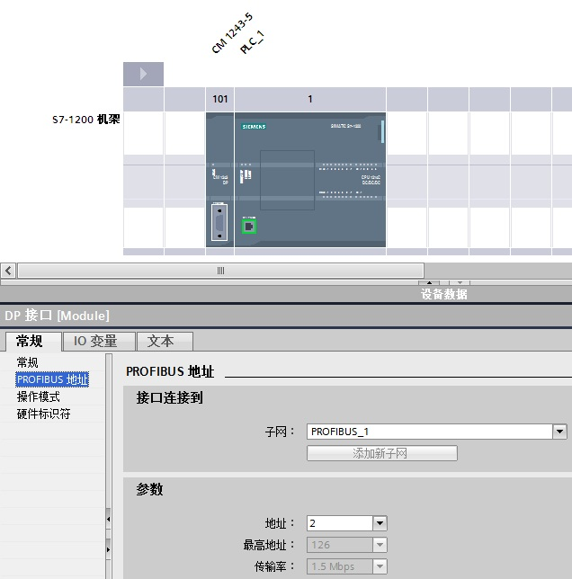{width="636" height="644"}

图 2 组态 CM1243-5

#### [1-3 组态从站 S7-300 CPU 集成 DP 接口 ]{.STYLE3}

组态 S7-300 CPU 的集成 DP 接口，进入 DP 接口的属性框，在"PROFIBUS
地址"界面，子网选择"PROFIBUS_1",地址选择
3；在"操作模式"界面，操作模式选择"DP 从站"，分配的 DP
主站选择"PLC_1.CM1243-5.DP 接口"，在"传输区域"创建 2 个区域，输入输出各
16
个字；可以点击"智能从站通信"中的"传输区_1"和"传输区_2"，查看或修改传输区的详细信息。如图
3 所示。

{width="1147" height="1197"}

图 3 组态 S7-300 CPU 的集成 DP 接口

#### [1-4 通讯测试]{.STYLE3}

在同一项目中，分别为 CPU1214C 和 S7-300 CPU
创建监控表，进行通讯测试，如图 4 所示。

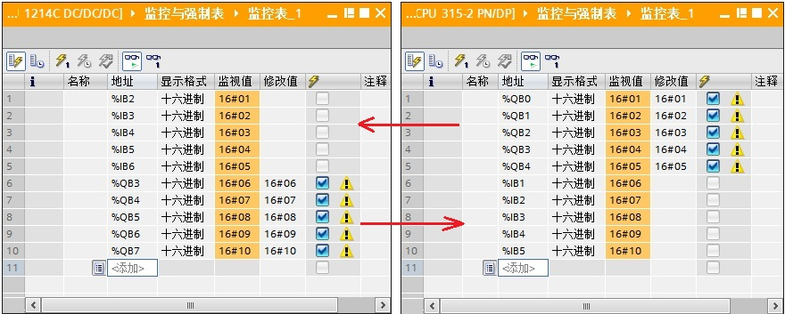{width="880" height="353"}

图 4 同一项目通信测试

### 2. 第二种情况（不同项目中操作） {#第二种情况不同项目中操作 .STYLE4}

CM1243-5 做 DP 主站，S7-300 CPU 的集成 DP 接口做 DP
从站，不在一个项目中的操作，即：CPU 1214C 使用 Step7 V12，而 S7-300 CPU
分别使用 Step7 V12 和 Step7 V5.5，详细步骤如下。

#### 2-1 创建 S7-1200 站并组态 CM1243-5 {#创建-s7-1200-站并组态-cm1243-5 .STYLE3}

使用 STEP7 V12 创建一个新项目，并通过"添加新设备"组态 S7-1200 站
PLC_1，组态 CM1243-5 的 DP 接口，进入 CM1243-5
的属性框，添加子网"PROFIBUS_1",站址选择 2，如图 5 所示。

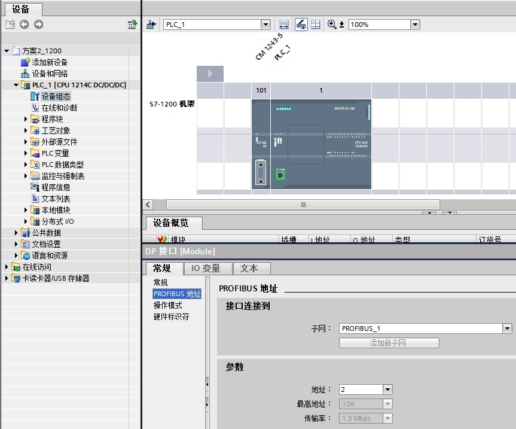{width="863" height="717"}

图 5 插入 S7-1200 站并组态 CM1243-5

#### 2-2 主站项目中安装 S7-300 CPU 的 GSD 文件，并组态该从站 {#主站项目中安装-s7-300-cpu-的-gsd-文件并组态该从站 .STYLE3}

打开软件 Step7 V12，通过"选项"进入"安装设备描述文件"界面，
在"源路径"选择 S7-300 CPU 的 GSD 文件存放路径。***注意：[源]{.STYLE6
.STYLE7}路径中不能有中文字符***。

S7-300 CPU 的 GSD
文件下载链接：<http://support.automation.siemens.com/cn/view/zh/113652>。

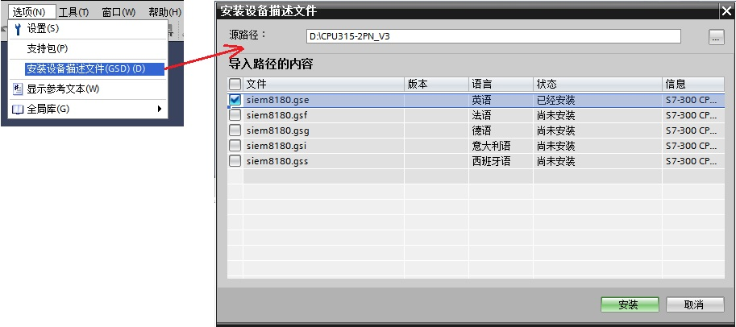{width="913" height="406"}

图 6 安装 S7-300 CPU 的 GSD 文件

安装好从站 S7-300 CPU 的 GSD
文件，在主站项目中的网络视图中，将它从选件的目录中拖拽至视图界面中，如图
7 所示。

{width="761" height="543"}

图 7 插入从站 S7-300 CPU

点击图 7 中的蓝色字"未分配"，出现"选择主站：PLC_1.CM 1243-5.DP
接口"选项，点击"PLC_1.CM 1243-5.DP 接口"，主站选择成 CM
1243-5（见蓝色字），同时 S7-300 CPU 的集成 DP
接口连接到了"主站系统：PLC_1.DP-Mastersystem(1)"。如图 8 所示。

{width="479" height="405"}

图 8 主站项目中配置从站 S7-300 CPU

双击图 7 中的"Slave_1",进入从站的设备视图， 将"Master_I Slave_Q 16 Wo
unit"和"Master_Q Slave_I 16 Wo unit"分别插入到设备概览的 4 槽和 5
槽。***注意：4 槽表示主站组态输入 16 个字，5 槽表示主站组态输出 16
[个]{.STYLE7}******字，***
***这与后面组态从站的输入输出需要一一对应。***如图 9 所示。

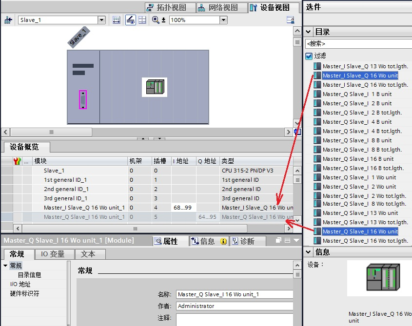{width="845" height="669"}

图 9 主站项目中组态从站 S7-300 CPU

#### 2-3 Step7 V12 创建 S7-300 站并组态 S7-300 CPU 的 DP 接口 {#step7-v12-创建-s7-300-站并组态-s7-300-cpu-的-dp-接口 .STYLE3}

如果使用软件 Step7 V5.5 创建 S7-300 这个DP从站，请直接跳到步骤 2-5。

在这使用 Step7 V12
创建一个新项目（DP从站：S7-300），并通过"添加新设备"组态 S7-300
站PLC_1，进入 S7-300 CPU 集成的 DP 接口的属性框，在"PROFIBUS
地址"界面中，接口类型选择"PROFIBUS"，添加子网"PROFIBUS_1",站址选择
3，如图 10 所示。

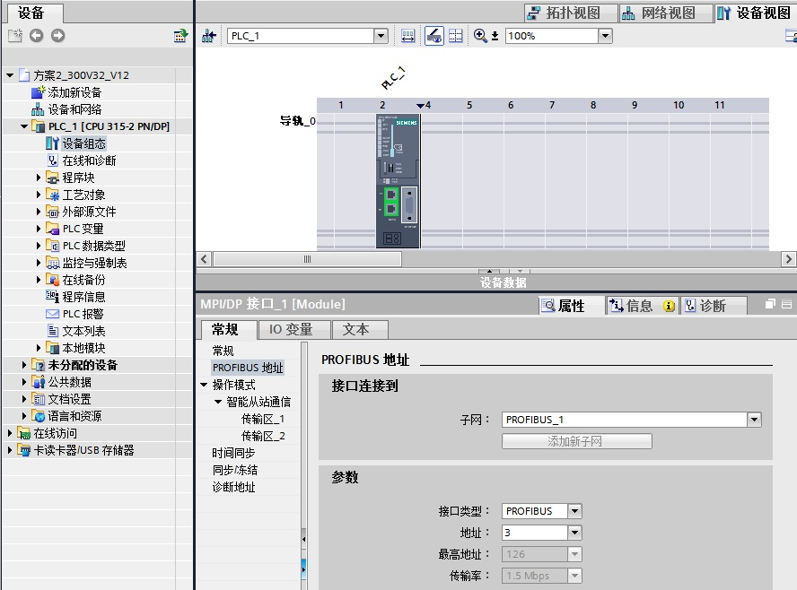{width="888" height="658"}

图 10 Step7 V12 中创建 300

接着在"操作模式"界面中，选择"DP 从站"，在智能从站通信的传输区域添加 2
个传输区（"传输区_1"、"传输区_2"），数据长度都是 16
个字。***注意：要与主站的输入输出对应，即："传输区_1"为 16
个字的输出，"传输区_2"为 16 个字的输入。***如图 11 所示。

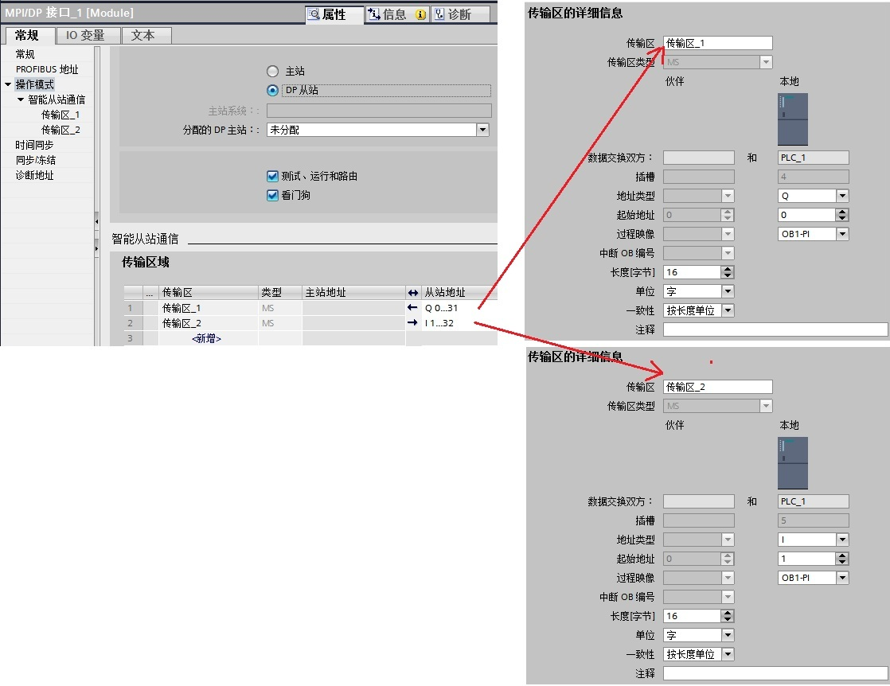{width="1118" height="862"}

图 11 Step7 V12 创建 S7-300 CPU 站的 DP 组态

#### [2-4 Step7 V12 创建 2 个项目（主从站）的通信测试 ]{.STYLE3}

Step7 V12 创建的 CM1243-5 做 DP 主站的项目， Step7 V12 创建的 S7-300 CPU
做 DP 从站的项目，两个项目分别新建监控表，进入通信监控，如图 12 所示。

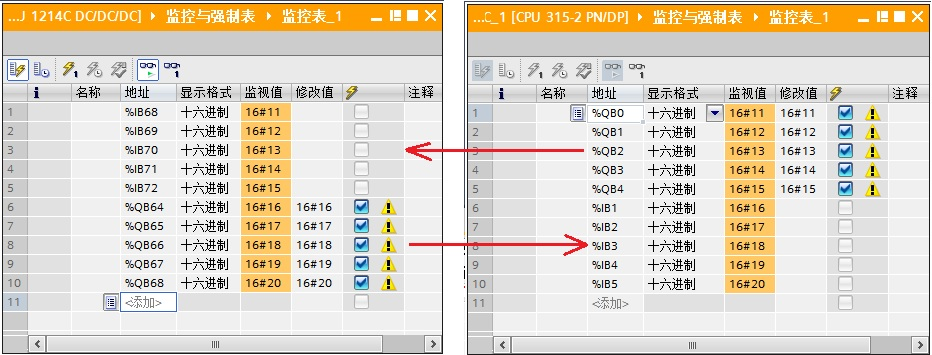{width="932" height="355"}

图 12 不同项目通信测试(V12 与 V12，第二种情况)

#### 2-5 Step7 V5.5 创建 S7-300 CPU 并组态 DP 接口 {#step7-v5.5-创建-s7-300-cpu-并组态-dp-接口 .STYLE3}

[如果使用软件 Step7 V12 创建 S7-300 这个DP从站，请直接跳到步骤
2-3。]{.STYLE7}

在这使用 Step7 V5.5 创建一个新项目（DP从站：S7-300）。在 MPI/DP
接口的属性框中，"常规"属性页中选择"PROFIBUS"接口类型，站址选择
3；"工作模式"属性页中选择"DP 从站"；"组态"属性页中组态输入输出，数据长度
16 个字，***注意：要与主站的输入输出对应，即：第 1 行组态为 16
个字的输出，第 2 行组态为 16 个字的输入。***。如图 13 所示。

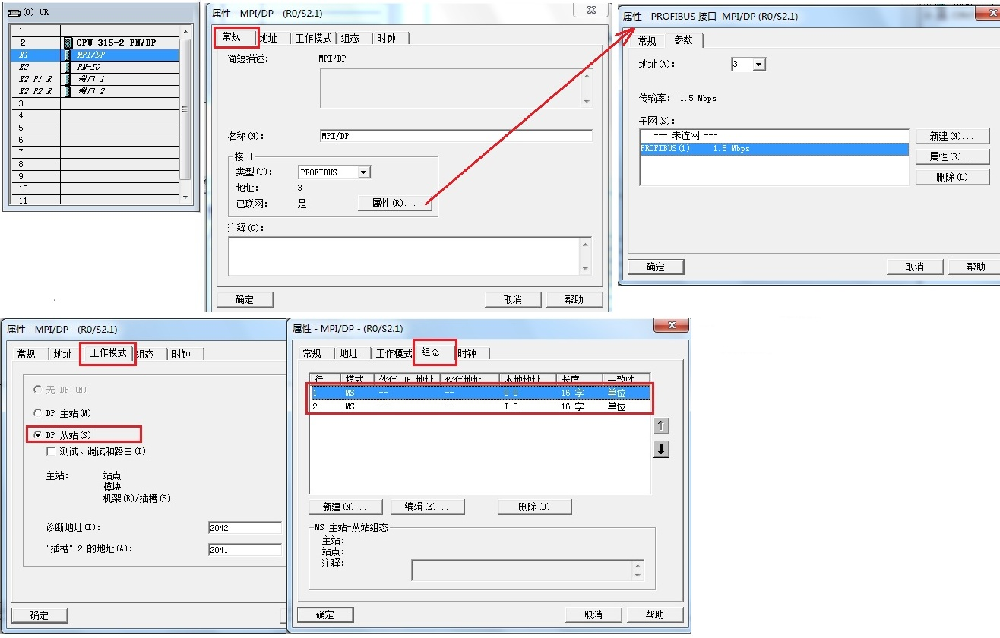{width="1316" height="840"}

图 13 Step7 V5.5 创建 S7-300 CPU 并组态 DP 接口

#### [2-6 通讯测试]{.STYLE3}

Step7 V12 创建的 CM1243-5 做 DP 主站的项目， Step7 V5.5 创建的 S7-300
CPU 做 DP 从站的项目，两个项目分别新建监控表，进入通信监控，如图 14
所示。

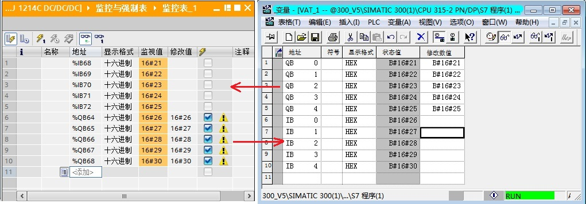{width="1021" height="356"}

图 14 不同项目通信测试(V12 与 V5.5，第二种情况)
