### S7-1200 和 S7-300 集成 DP 口的主从通信（300做主站，1200做从站） {#s7-1200-和-s7-300-集成-dp-口的主从通信300做主站1200做从站 .STYLE1}

使用 S7-1200 与 S7-300 的集成 DP 接口进行主从通信，这里是将 S7-300
做为主站，将 S7-1200 做为从站，即：S7-300 集成的 DP 接口做主站，S7-1200
通过 CM1242-5 做从站。下面详细介绍使用方法。

[硬件：]{.STYLE3}

1.  CPU 1214C DC/DC/DC，V2.2
2.  CM1242-5（从站模块）
3.  S7-300 CPU（6ES7 315-2EH14-0AB0）

软件：

1.  Step7 V12
2.  Step7 V5.5 SP1

S7-300 集成的 DP 接口做主站，S7-1200 通过 CM1242-5
做从站，这种方式可以分2种情况来操作，具体如下：

1.  第一种情况：CPU 1214C 和 S7-300 使用 Step7 V12 在一个项目中操作。
2.  第二种情况：CPU 1214C 和 S7-300 使用 Step7 V12
    不在一个项目中的操作。CPU 1214C 使用 Step7 V12，而 S7-300 分别使用
    Step7 V12 和 Step7 V5.5。

### 1. 第一种情况（同一项目中操作） {#第一种情况同一项目中操作 .STYLE4}

S7-300 的集成 DP 接口做 DP 主站，CM1242-5 做 DP 从站，使用 Step7 V12
在一个项目中操作，详细步骤如下。

#### 1-1 使用 Step7 V12 生成项目 {#使用-step7-v12-生成项目 .STYLE3}

使用 STEP7 V12 创建一个新项目，并通过"添加新设备"组态 S7-300 站
PLC_1，选择 CPU 315-2 PN/DP；接着组态 S7-1200 站 PLC_2，选择 CPU1214C
DC/DC/DC V2.2；如图 1 所示。

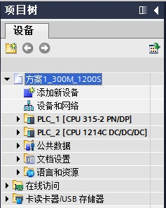{width="237" height="297"}

图 1 在新项目中插入 S7-300 站和 S7-1200 站

#### [1-2 组态主站 S7-300 集成 DP 接口]{.STYLE3}

组态 S7-300 的集成 DP 接口，进入属性框，在"PROFIBUS
地址"界面，添加子网"PROFIBUS_1",地址选择
2；在"操作模式"界面，操作模式选择"DP 主站"，如图 2 所示。

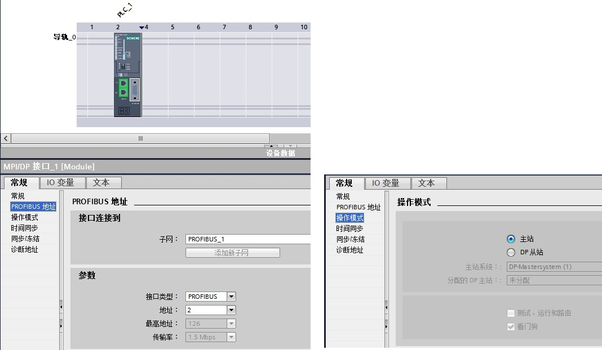{width="1068" height="622"}

图 2 组态主站 CUP300 的 DP 接口

#### [1-3 组态从站 CM1242-5]{.STYLE3}

接着组态从站 CM1242-5 的 DP 接口，进入 CM1242-5 的属性框，在"PROFIBUS
地址"界面，选择子网"PROFIBUS_1",站址选择 3；在"操作模式"界面，选择"DP
从站"，"分配的 DP 主站"选择"PLC_1.MPI/DP接口_1"，在传输区域创建 2
个区域（"传输区_1"、"传输区_2"），输入输出各 16 个字，如图 3 所示。

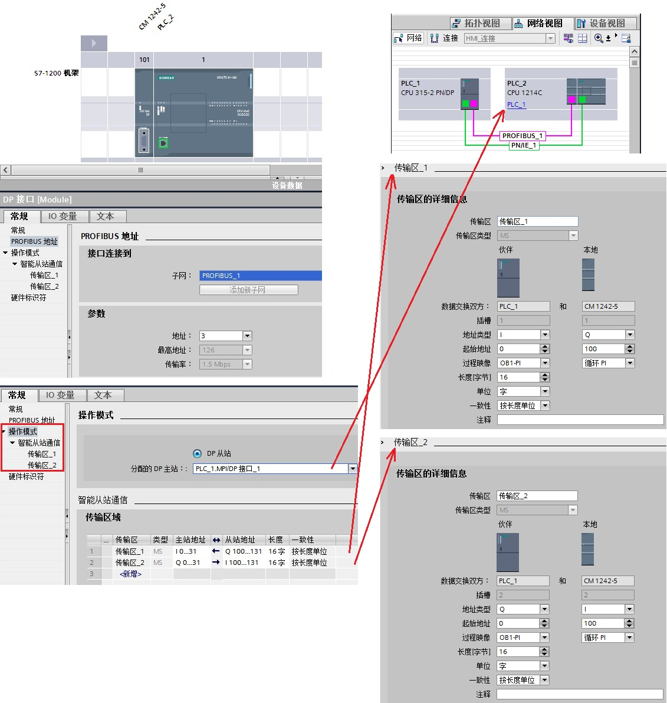{width="1131" height="1191"}

图 3 组态从站 CM1242-5

[3-4 通讯测试]{.STYLE3}

在同一项目中，分别为 S7-300 和 CPU1214C 创建监控表，进行通讯测试，如图 4
所示。

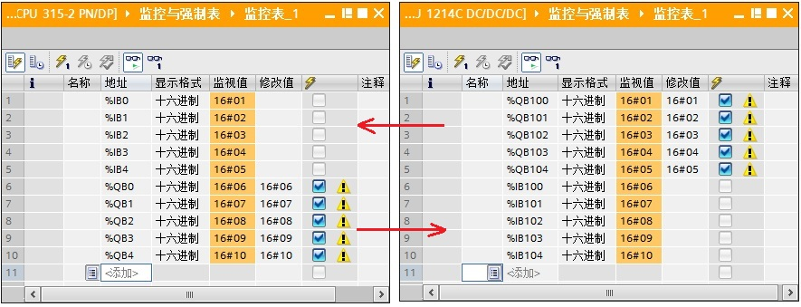{width="885" height="339"}

图 4 同一项目通信测试

### [2. 第二种情况]{.STYLE4}[（不在同一项目中操作）]{.STYLE4}

S7-300 的集成 DP 接口做 DP 主站，CM1242-5 做 DP
从站，不在一个项目中的操作，即：CPU 1214C 使用 Step7 V12，而 S7-300
分别使用 Step7 V12 和 Step7 V5.5，详细步骤如下。

#### 2-1 创建 S7-1200 站并组态从站 CM1242-5 {#创建-s7-1200-站并组态从站-cm1242-5 .STYLE3}

使用 STEP7 V12 创建一个新项目，并通过"添加新设备"组态 S7-1200
站PLC_1，组态 CM1242-5 的 DP 接口，进入 CM1242-5
的属性框，添加子网"PROFIBUS_1",站址选择 3；"操作模式"界面，选择"DP
从站"，"分配的 DP 主站"选择"未分配"；在智能从站通信的传输区域添加 2
个传输区（"传输区_1"、"传输区_2"），数据长度都是 16
个字。***注意：要与主站的输入输出对应，即："传输区_1"为[从站]{.STYLE6
.STYLE7}的 16 个字的输出，"传输区_2"[为从站的]{.STYLE7} 16
个字的输入。***如图 5 所示。

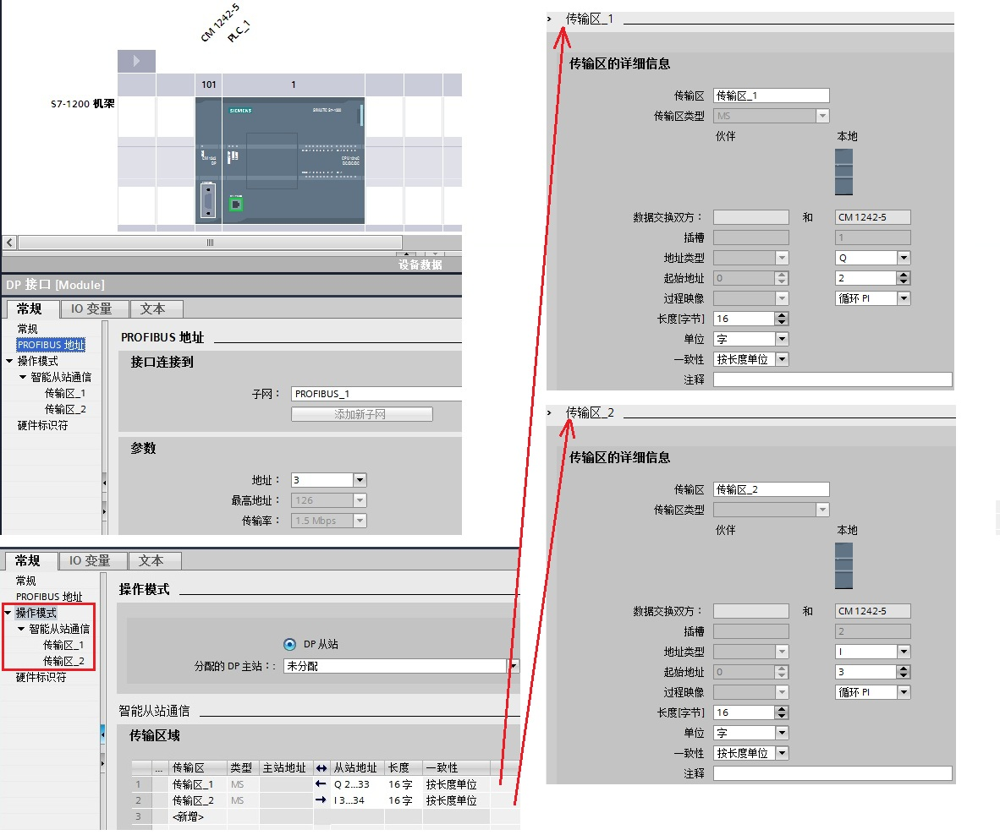{width="1182" height="988"}

图 5 插入 S7-1200 站并组态从站 CM1242-5

#### 2-2 主站项目中组态从站并通讯测试（在 Step7 V12 软件） {#主站项目中组态从站并通讯测试在-step7-v12-软件 .STYLE3}

如果主站项目软件使用的是 Step7 V12，首先安装 CM1242-5 的 GSD
文件。CM1242-5 的 GSD 文件下载链接：[si01818e](images/si01818e.rar)。

在软件 Step7 V12 中，通过"选项"进入"安装设备描述文件"界面， 在源路径选择
CM1242-5 的 GSD 文件存放路径。***注意：源路径中不能有中文字符***。如图 6
所示。

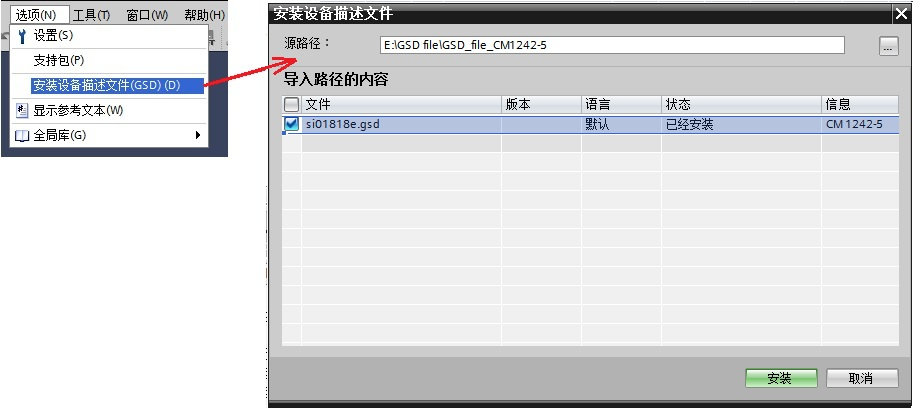{width="913" height="408"}

图 6 Step7 V12 安装 CM1242-5 的 GSD 文件

接着在主站项目中组态从站，在网络视图中，将 CM1242-5
从"选件"中拖拽并放入到网络视图中。如图 7 所示。

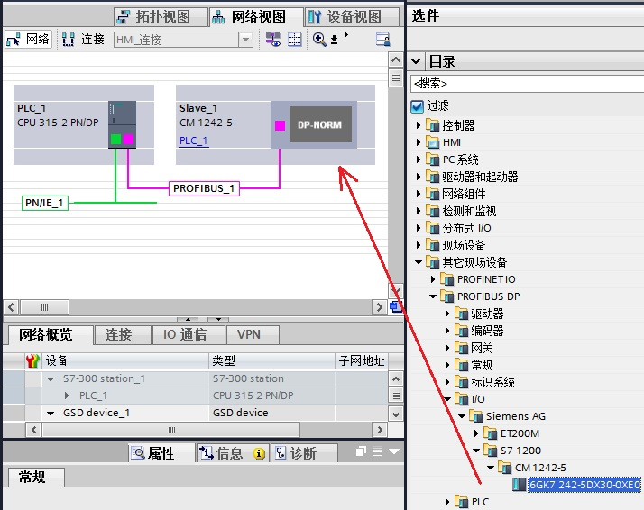{width="714" height="566"}

图 7 拖放从站 CM1242-5（V12 软件）

双击图 7 中的 CM1242-5 的图标，进入
CM1242-5（slave_1）的设备视图，进入设备的属性框中，子网选择"PROFIBUS_1"，地址选择
3，在设备概览中，插入通用模块，形成"通用模块_1"和"通用模块_2"，***注意："通用模块_1"和"通用模块_2"与
2-1 的从站"传输区_1"和"传输区_2"
必须要对应，即：主站的输出对应从站的输入***。如图 8 所示。

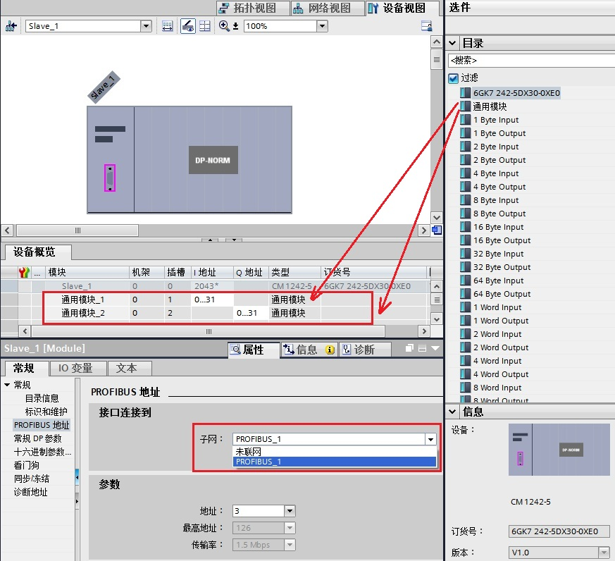{width="873" height="796"}

图 8 组态从站 CM1242-5（V12 软件）

然后进行通信测试，Step7 V12 创建的 S7-300 做 DP 主站的项目，Step7 V12
创建的 CM1242-5 做 DP
从站的项目，两个项目分别新建监控表，进入通信监控，如图 9 所示。

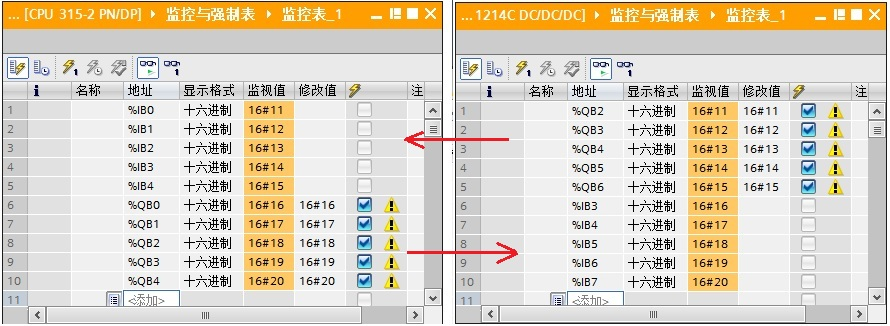{width="890" height="326"}

图 9 不同项目通信测试(V12 与 V12，第二种情况)

#### 2-3 主站项目中组态从站并通讯测试（在 Step7 V5.5 软件） {#主站项目中组态从站并通讯测试在-step7-v5.5-软件 .STYLE3}

如果主站项目软件使用的是 Step7 V5.5，首先安装 CM1242-5 的 GSD
文件。CM1242-5 的 GSD 文件下载链接，详见 2-2。

在软件 Step7 V5.5 中，通过"选项"进入"安装 GSD 文件\..."界面，
在源路径选择 CM1242-5 的 GSD 文件存放路径。如图 10 所示。

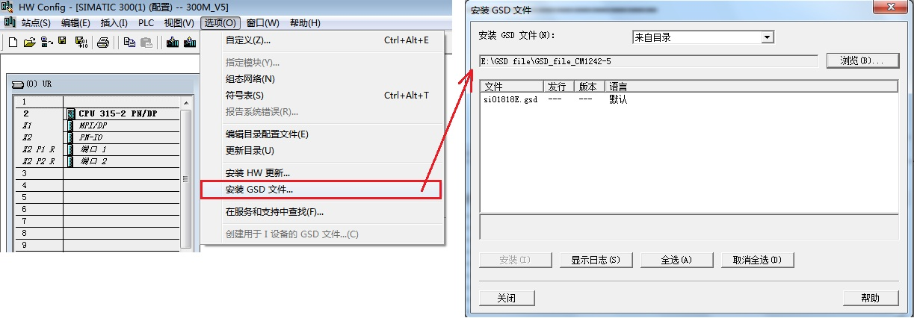{width="1223" height="426"}图 10 Step7 V5.5 安装
CM1242-5 的 GSD 文件

接着在主站项目中组态从站，将 CM1242-5 拖放到主站的 DP
网络中，使用"Universal module"组态输入输出。***注意：主站的输入输出与
2-1 的从站"传输区_1"和"传输区_2"
必须要对应，即：主站的输出对应从站的输入***。如图 11 所示。

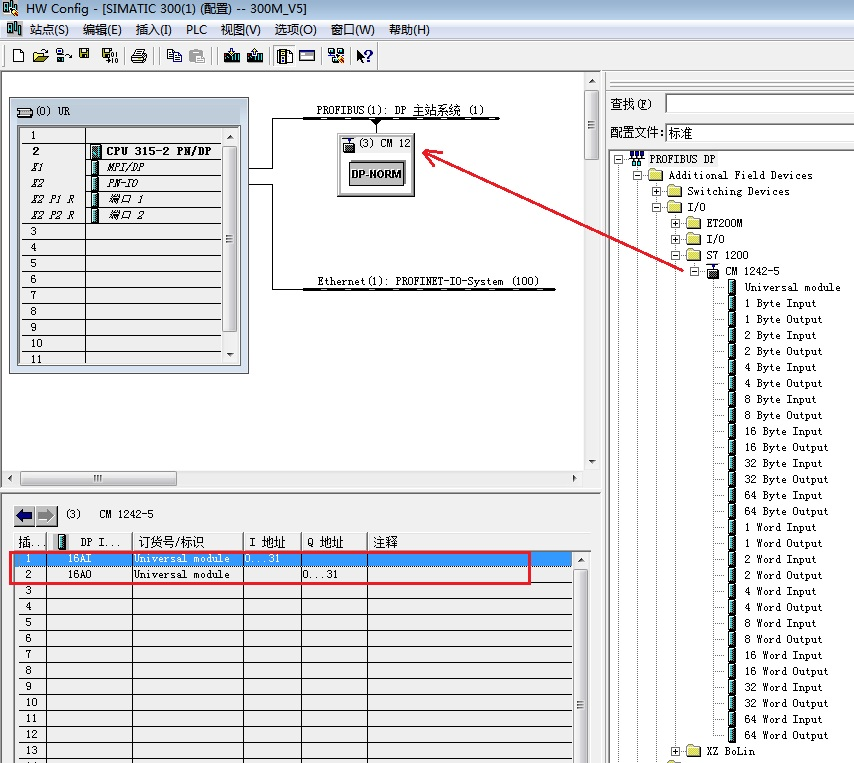{width="854" height="763"}

图 11 组态从站 CM1242-5（V5.5 软件）

然后进行通信测试，Step7 V5.5 创建的 S7-300 做 DP 主站的项目，Step7 V12
创建的 CM1242-5 做 DP
从站的项目，两个项目分别新建监控表，进入通信监控，如图 12 所示。

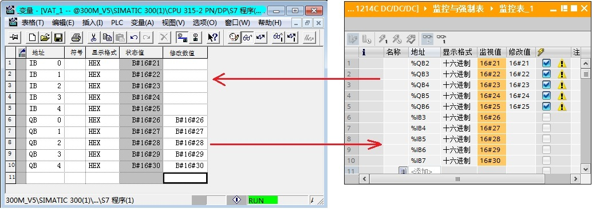{width="1034" height="367"}

图 12 不同项目通信测试(V5.5 与 V12，第二种情况)
