### S7-1200 和 S7-300 CP342-5 的 DP 口的主从通信（S7-1200 做主站，CP342-5 做从站） {#s7-1200-和-s7-300-cp342-5-的-dp-口的主从通信s7-1200-做主站cp342-5-做从站 .STYLE1}

使用 S7-1200 与 S7-300 用 CP342-5 进行主从通信，这里S7-1200 的 CM1243-5
做为主站，将 CP342-5 做从站。

[硬件：]{.styl4}

1.  CPU 1214C DC/DC/DC，V2.1
2.  CM1243-5（主站模块）
3.  S7-300 CPU（6ES7317-2EK14-0AB0）
4.  CP342-5（6GK7342-5DA02-0XE0）

**软件：**

1.  Step7 V13 SP1
2.  Step7 V5.5 SP3

S7-300 用 CP342-5 做 DP 从站，S7-1200 通过 CM1243-5
做主站，这种方式可以分2种情况来操作，具体如下：

1.  第一种情况：CPU 1214C 和 S7-300 使用 Step7 V13 在一个项目中操作。
2.  第二种情况：CPU 1214C 和 S7-300 使用 Step7 V13
    不在一个项目中的操作。CPU 1214C 使用 Step7 V13，而 S7-300 使用 Step7
    V5.5。

### 一. 第一种情况（同一项目中操作）

CM1243-5 做 DP 主站，S7-300 的 CP342-5 DP 接口做 DP 从站，使用 Step7 V13
在一个项目中操作。

#### 1.1 使用 Step7 V13生成项目

使用 STEP7 V13 创建一个新项目，并通过"添加新设备"组态 S7-1200 站 1243-5
m，选择 CPU1214C DC/DC/DC V2.1；接着组态S7-300 站 CP342-5 s，选择 CPU
317-2 PN/DP，如图 1 所示。

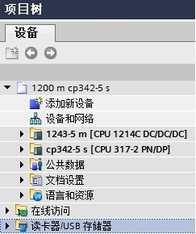{width="243" height="290"}

图 1 在新项目中插入 S7-1200 站和 S7-300 站

### [1.2 组态主站 CM1243-5]{.STYLE3}

组态 CM1243-5 的 DP 接口，进入 CM1243-5
的属性框，添加子网"PROFIBUS_1"，站址选择 2，如图 2 所示。

{width="576" height="589"}

图 2 组态 CM1243-5

#### 1.3 组态从站 CP342-5的 DP 接口

组态 CP342-5 DP 接口，进入 DP 接口的属性框，在"PROFIBUS
地址"界面，子网选择"PROFIBUS_1"，地址选择 3，如图 3 所示。

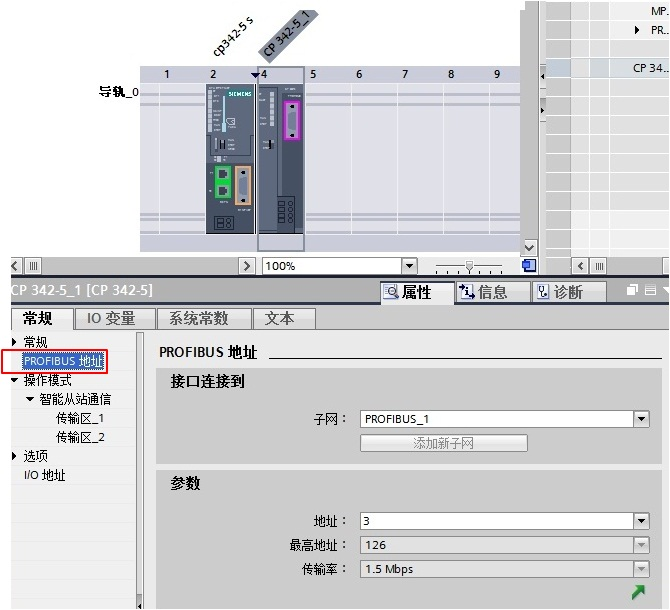{width="661" height="609"}

图 3 组态从站 CP342-5 的 DP 接口

在"操作模式"界面，操作模式选择"DP 从站"，分配的 DP 主站选"1243-5
m.CM1243-5.DP 接口"，在"传输区域"创建 2 个区域，输入输出各 10
个字节；可以点击"智能从站通信"中的"传输区_1"和"传输区_2"，如图 4 所示。

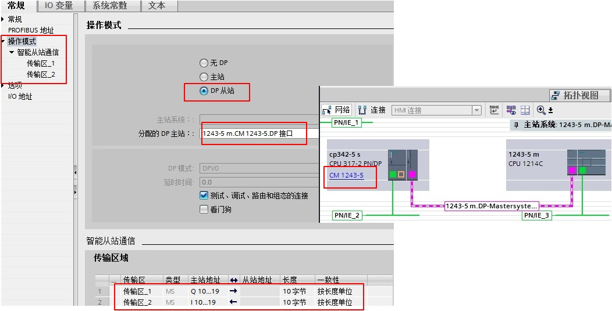{width="1050" height="527"}

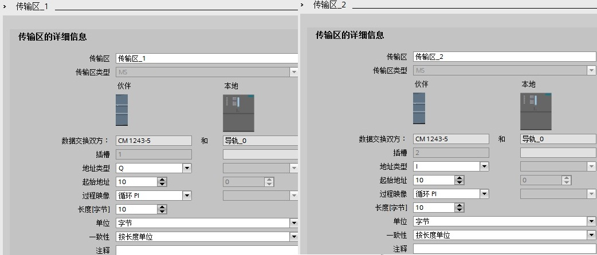{width="1042" height="446"}

图 4 组态 CP342-5 操作模式和传输区

#### 1.4 软件编程

在 S7-300 侧，CP342-5
进行数据发送接收，需要通过编程实现。首先创建发送和接收数据块 DB1 和
DB2，定义成 101 个字节的数组，如图 5 所示。

{width="686" height="331"}

图 5 CP342-5侧创建接收发送数据块

在 OB1 中，从"指令"\>"通信"\>"通信处理器"\>"Simatic NET CP"\>"PROFIBUS
DP"下，调用 DP_SEND、DP_RECV 通信指令，如图 6 所示。

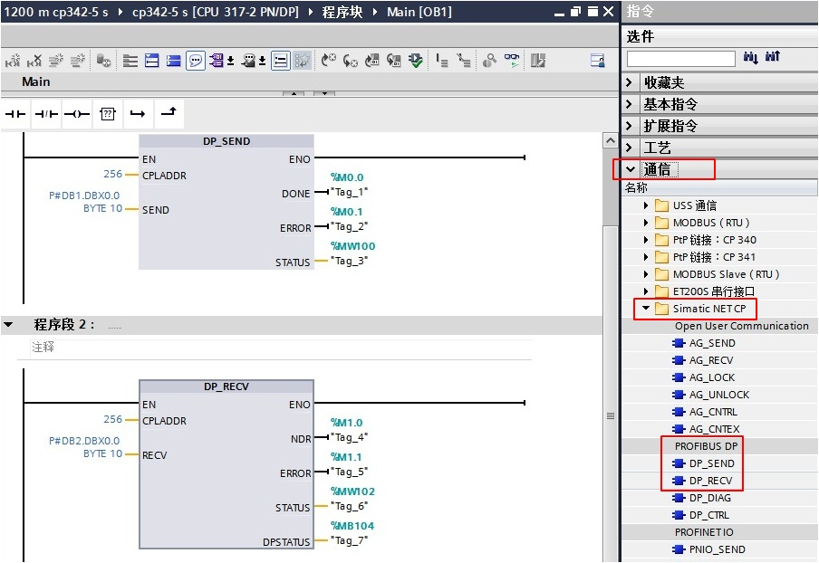{width="903" height="621"}

{width="522" height="558"}

图 6 发送接收指令调用和 CPLADDR 地址

功能块参数意义如下表1.

  ---------- -------------------------------------------------------------------------------
  管脚       说明
  CPLADDR    模块的起始地址（当组态 CP342-5时，在组态表中显示模块的起始地址，这里是256）；
  SEND       发送数据区，对应从站的输入区；
  RECV       接收数据区，对应从站的输出区；
  DONE       发送完成位：作业完成，无错误，该位置1且保持一个脉冲；
  NDR        接收完成位：作业完成，无错误，该位置1且保持一个脉冲；
  ERROR      错误位：0-无错误；1-出现错误，错误原因查看STATUS；
  STATUS     调用功能块时产生的状态代码；
  DPSTATUS   PROFIBUS_DP的状态代码
  ---------- -------------------------------------------------------------------------------

表1. 功能块参数意义

#### 1.5 监控结果 {#监控结果 align="left"}

在同一项目中，分别为 S7-300 和 CPU1214C 创建监控表，进行通讯测试，如图 7
所示。

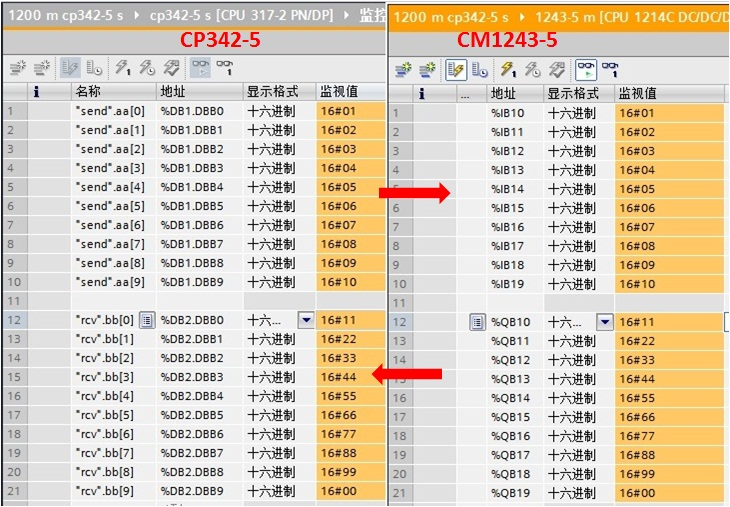{width="729" height="505"}

图 7 监控结果

### 二. 第二种情况（不在同一项目中操作）

CM1243-5 做 DP 主站，S7-300 的CP342-5 DP 接口做 DP
从站，不在一个项目中的操作，即：CPU 1214C 使用 Step7 V13，而 S7-300 使用
Step7 V5.5。

### [2.1 创建 S7-1200 站并组态 CM1243-5]{.STYLE3}

使用 STEP7 V13 创建一个新项目，并通过"添加新设备"组态 S7-1200 站 1243-5
m，组态 CM1243-5 的 DP 接口，进入 CM1243-5
的属性框，添加子网"PROFIBUS_1"，站址选择 2，如图 8 所示。

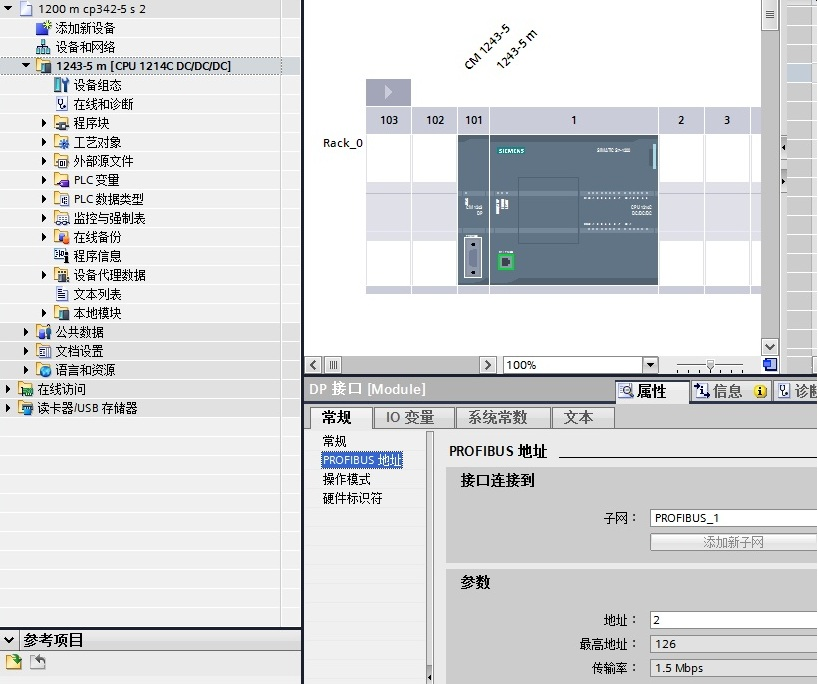{width="818" height="684"}

图 8 插入 S7-1200 站并组态 CM1243-5

#### [2.2 主站项目中安装 CP342-5 的 GSD 文件，并组态该从站]{.STYLE3}

打开软件 Step7 V13，通过"选项"进入"管理通用站描述文件（GSD）"界面，
在"源路径"选择 CP342-5 的 GSD 文件存放路径，如图 9
所示。**注意：[源]{.STYLE6 .STYLE7}路径中不能有中文字符**。

CP342-5 的 GSD
文件下载链接：<http://support.automation.siemens.com/cn/view/zh/113652>。

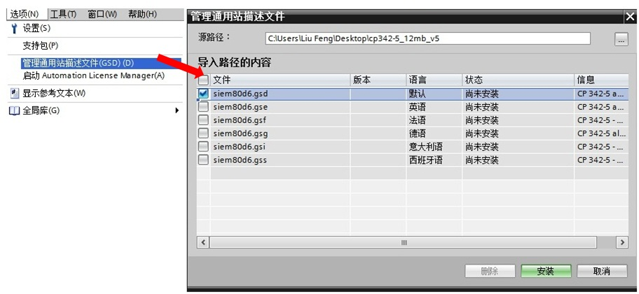{width="911" height="419"}

图 9 安装 CP342-5 的 GSD 文件

安装好从站 CP342-5 的 GSD
文件，在主站项目中的网络视图中，将它从选件的目录中拖拽至视图界面中，如图
10 所示。

{width="822" height="458"}

图 10 插入从站 CP342-5

点击图 10 中的蓝色字"未分配"，出现"选择主站：1243-5 m.CM 1243-5.DP
接口"选项，点击"1243-5 m.CM 1243-5.DP 接口"，主站选择成 CM
1243-5（见蓝色字），同时 CP342-5 DP 接口连接到了"主站系统：1243-5
m.DP-Mastersystem(1)"，如图 11 所示。

{width="528" height="471"}

图 11 主站项目中配置从站 CP342-5

双击图 11 中的"Slave_1",进入从站的设备视图，
将"通用模块"分别插入到设备概览的 1 槽和 2 槽。**注意：1
槽表示主站组态输入 10 个字节，2 槽表示主站组态输出 10
[个]{.STYLE7}字节， 这与后面组态从站的输入输出需要一一对应。**如图 12
所示。

{width="888" height="702"}

图 12 主站项目中组态从站 CP342-5 数据区

#### [2.3 Step7 V5.5 创建 S7-300 并组态 CP342-5 的 DP 接口]{.STYLE3}

Step7 V5.5 创建一个新项目（DP从站：S7-300）。添加 CP342-5
模块，"常规"属性页中选择"PROFIBUS"接口类型，站址选择
3；"工作模式"属性页中选择"DP 从站"，如图 13 所示。

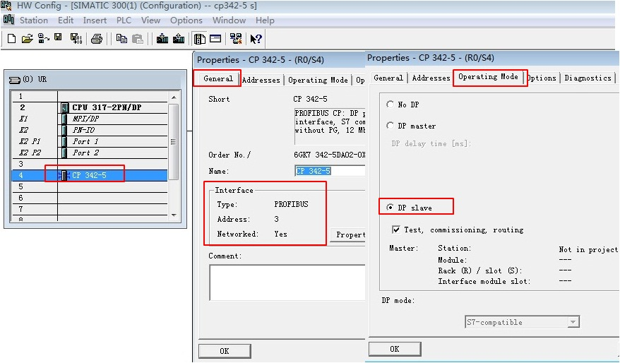{width="876" height="512"}

图 13 Step7 V5.5 创建 S7-300 并组态 CP342-5 的 DP 接口

#### 2.4 软件编程

在 S7-300 侧，CP342-5
进行数据发送接收，需要通过编程实现。首先创建发送和接收数据块 DB1 和
DB2，定义成 101 个字节的数组，如图 14 所示。

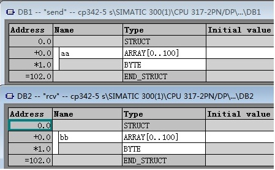{width="449" height="277"}

图 14 CP342-5 侧创建接收发送数据块

在 OB1中，从"Libraries"\>"SIMATIC_NET_CP"\>"CP
300"下，调用FC1（DP_SEND）、FC2（DP_RECV）通信指令，如图 15 所示。

{width="715" height="676"}

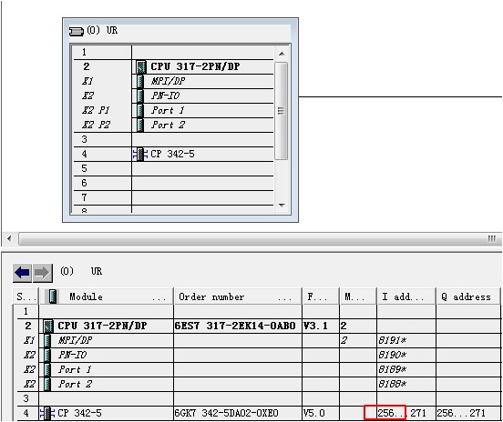{width="550" height="464"}

图 15 发送接收指令调用和 CPLADDR 地址

关于功能块参数意义参考上表1.。

#### 2.5 监控结果

在不同项目中，分别为 S7-300 和 CPU1214C 创建监控表，进行通讯测试，如图
16 所示。

{width="762" height="564"}

图 16 监控结果
