### S7-1200 和 S7-300 CP342-5 的 DP 口的主从通信（CP342-5 做主站，1200 做从站）

使用 S7-1200 与 S7-300 用 CP342-5 进行主从通信，这里 CP342-5
做为主站，将 S7-1200 的 CM1242-5 做从站。

[硬件：]{.styl4}

1.  CPU 1214C DC/DC/DC，V2.1
2.  CM1242-5（从站模块）
3.  S7-300（6ES7317-2EK14-0AB0）
4.  CP342-5（6GK7342-5DA02-0XE0）

**软件：**

1.  Step7 V13 SP1
2.  Step7 V5.5 SP3

S7-300 用 CP342-5 做 DP主站，S7-1200 通过 CM1242-5
做从站，这种方式可以分2种情况来操作，具体如下：

1.  第一种情况：CPU 1214C 和 S7-300使用 Step7 V13 在一个项目中操作。
2.  第二种情况：CPU 1214C 和 S7-300使用 Step7 V13
    不在一个项目中的操作。CPU 1214C 使用 Step7 V13，而 S7-300使用 Step7
    V5.5。

### 一. 第一种情况（同一项目中操作）

#### 1.1 使用 Step7 V13生成项目

使用 STEP7 V13 创建一个新项目，并通过"添加新设备"组态 S7-300 站 CP342-5
m，选择 CPU 317-2 PN/DP；接着组态 S7-1200 站 cm1242-5 s，选择 CPU1214C
DC/DC/DC V2.1，如图 1 所示。

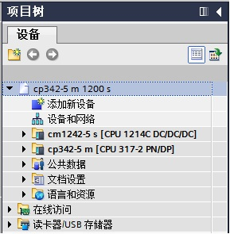{width="289" height="295"}

图 1 在新项目中插入 S7-300 站和 S7-1200 站

#### 1.2 组态主站CP342-5的 DP 接口

组态 CP342-5 DP 接口，进入属性框，在"PROFIBUS
地址"界面，添加子网"PROFIBUS_1"，地址选择
2；在"操作模式"界面，操作模式选择"DP 主站"，如图 2 所示。

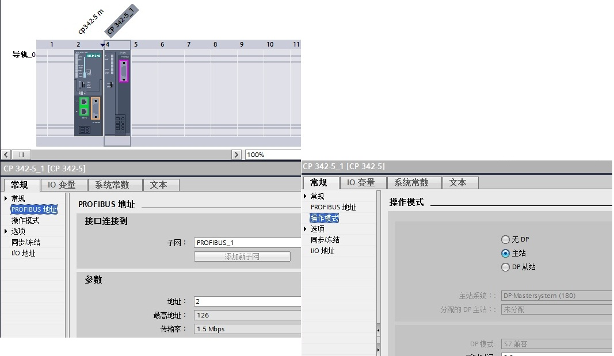{width="1067" height="619"}

图 2 组态主站 CP342-5 的 DP 接口

#### 1.3 组态从站 CM1242-5

接着组态从站 CM1242-5 的 DP 接口，进入 CM1242-5 的属性框，在"PROFIBUS
地址"界面，选择子网"PROFIBUS_1"，站址选择 3，如图3所示；

 

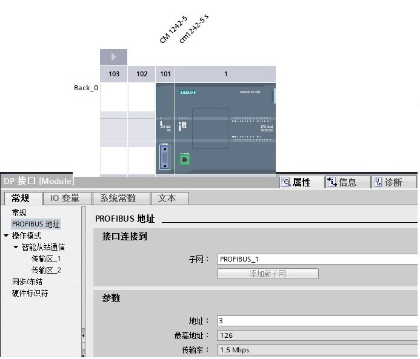{width="693" height="593"}

图 3 组态从站 1242-5 DP 接口

在"操作模式"界面，选择"DP 从站"，"分配的 DP 主站"选择"cp342-5 m.CP
342-5_1"，在传输区域创建 2 个区域（"传输区_1"、"传输区_2"），输入输出各
10 个字节，如图 4 所示。

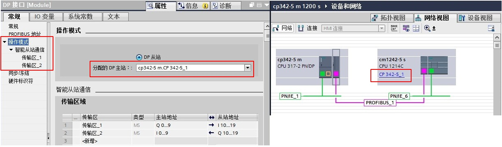{width="1221" height="358"}

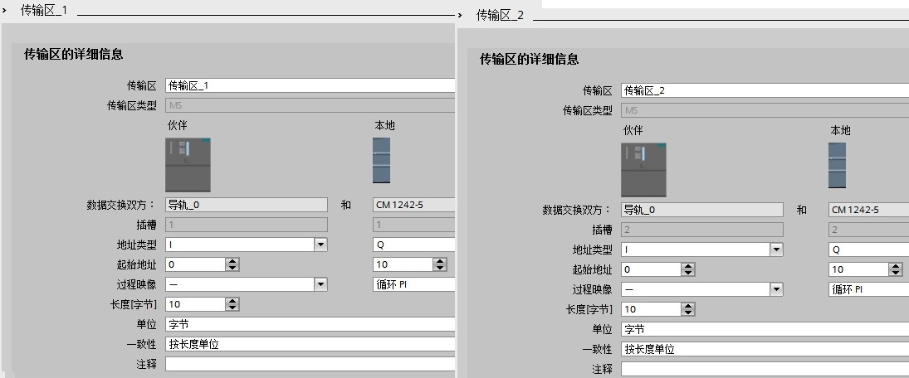{width="1095" height="456"}

图 4 组态 CM1242-5 操作模式和传输区

#### 1.4 软件编程

在 S7-300 侧，CP342-5
进行数据发送接收，需要通过编程实现。首先创建发送和接收数据块 DB1 和
DB2，定义成101个字节的数组，如图 5 所示。

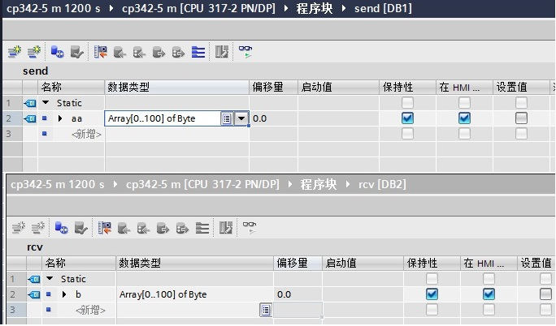{width="684" height="402"}

图 5 CP342-5侧创建接收发送数据块

在 OB1 中，从"指令"\>"通信"\>"通信处理器"\>"Simatic NET CP"\>"PROFIBUS
DP"下，调用DP_SEND、DP_RECV通信指令，如图 6 所示。

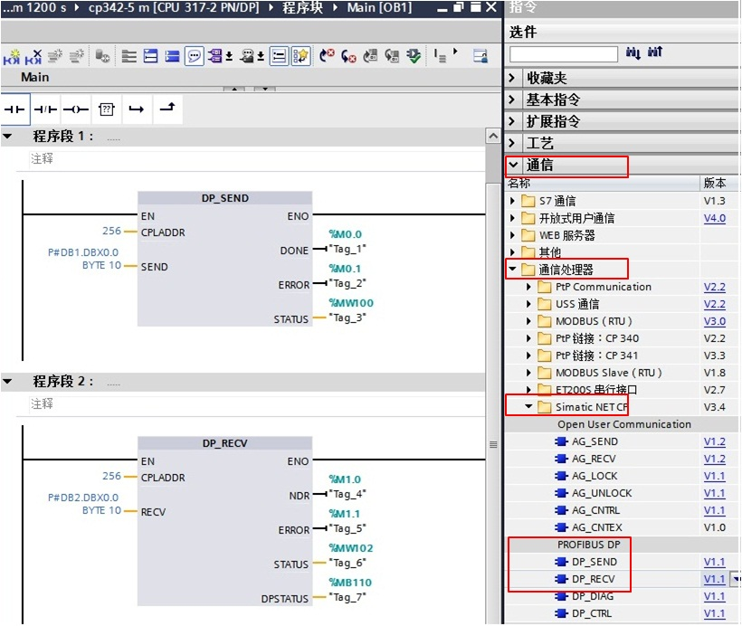{width="820" height="692"}

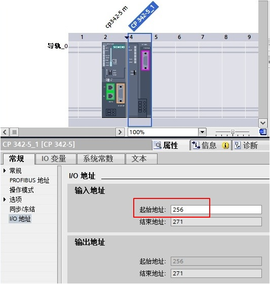{width="533" height="561"}

图 6 发送接收指令调用和 CPLADDR 地址

功能块参数意义如下表1.

  ---------- ------------------------------------------------------------------------------
  管脚       说明
  CPLADDR    模块的起始地址（当组态CP342-5时，在组态表中显示模块的起始地址，这里是256）；
  SEND       发送数据区，对应从站的输入区；
  RECV       接收数据区，对应从站的输出区；
  DONE       发送完成位：作业完成，无错误，该位置1且保持一个脉冲；
  NDR        接收完成位：作业完成，无错误，该位置1且保持一个脉冲；
  ERROR      错误位：0-无错误；1-出现错误，错误原因查看STATUS；
  STATUS     调用功能块时产生的状态代码；
  DPSTATUS   PROFIBUS_DP的状态代码
  ---------- ------------------------------------------------------------------------------

表 1. 功能块参数意义

#### 1.5 监控结果

在同一项目中，分别为 S7-300和 CPU1214C 创建监控表，进行通讯测试，如图 7
所示。

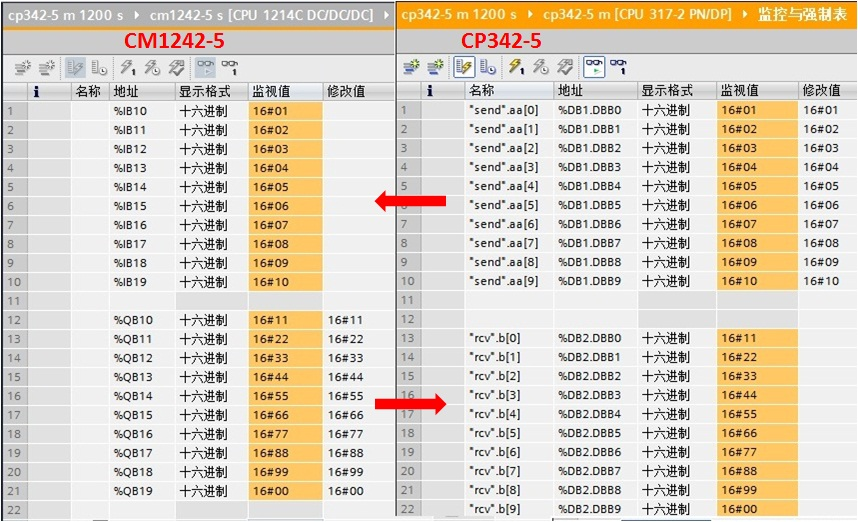{width="858" height="522"}

图 7 监控结果

### 二. 第二种情况（不在同一项目中操作）

S7-300用 CP342-5 接口做 DP 主站，CM1242-5 做 DP
从站，不在一个项目中的操作，即：CPU 1214C 使用 Step7 V13，而
S7-300使用Step7 V5.5。

#### 2.1 创建 S7-1200 站并组态从站 CM1242-5

使用 STEP7 V13 创建一个新项目，并通过"添加新设备"组态 S7-1200
站1**242-5s，**组态 CM1242-5 的 DP 接口，进入 CM1242-5
的属性框，添加子网"PROFIBUS_1"，站址选择 3，如图 8 所示；

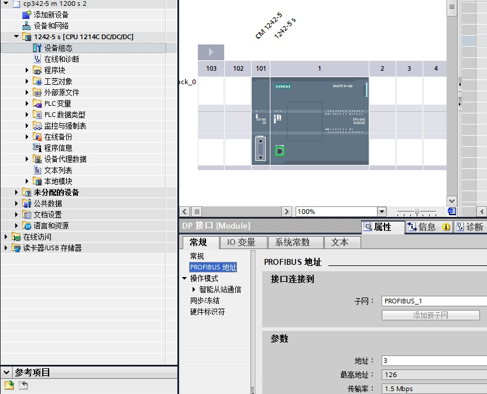{width="832" height="674"}

图 8 组态从站 1242-5 DP 接口

"操作模式"界面，选择"DP 从站"，"分配的 DP
主站"选择"未分配"；在智能从站通信的传输区域添加 2
个传输区（"传输区_1"、"传输区_2"），数据长度都是 10 个字节。

注**意：与主站的输入输出对应，即："传输区\_1"为从站的** **10**
**个字节的输入，"传输区\_2"为从站的** **10**
**个字节的输出，**如图9所示。

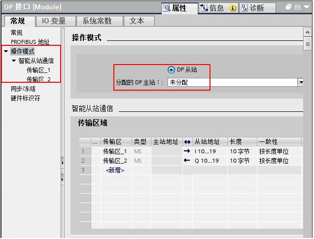{width="637"
height="485"}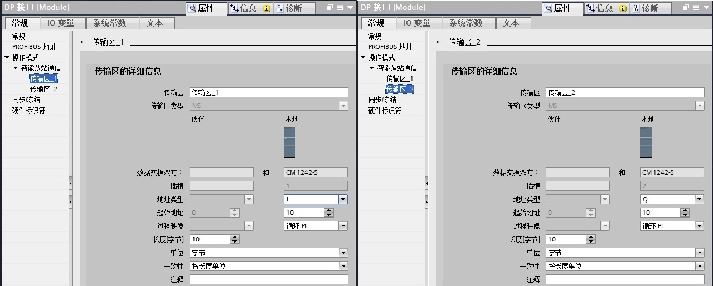{width="1279" height="514"}

图 9 组态 CM1242-5 操作模式和传输区

#### 2.2 主站项目中组态从站

主站项目软件使用的是 Step7 V5.5，首先安装 CM1242-5 的 GSD 文件。CM1242-5
的 GSD 文件下载链接：[si01818e](images/si01818e.rar)。

在软件 Step7 V5.5 中，通过"Options"进入"Install GSD File..."界面，
在源路径选择 CM1242-5 的 GSD
文件存放路径，选择GSD文件，点击"Install"进行安装，如图 10 所示。

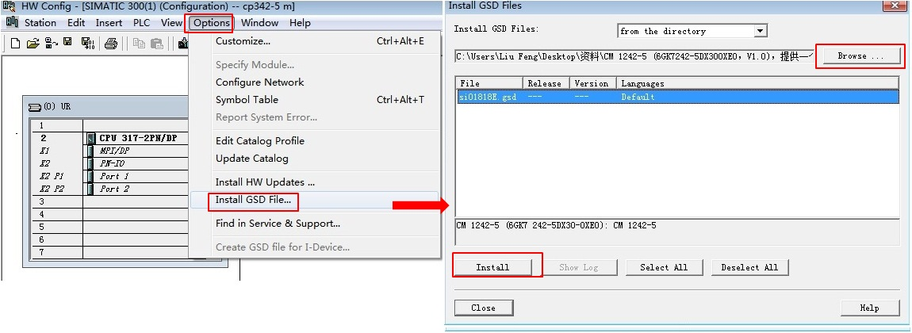{width="1150" height="420"}

图 10 Step7 V5.5 安装 CM1242-5 的 GSD 文件

接着在主站项目中组态从站，将 CM1242-5 拖放到主站的 DP
网络中，使用"Universal
module"组态输入输出。**注意：主站的输入输出与图9中的从站"传输区\_1"和"传输区\_2"**
**必须要对应，即：主站的输出对应从站的输入，输入对应从站的输出**，如图
11 所示。

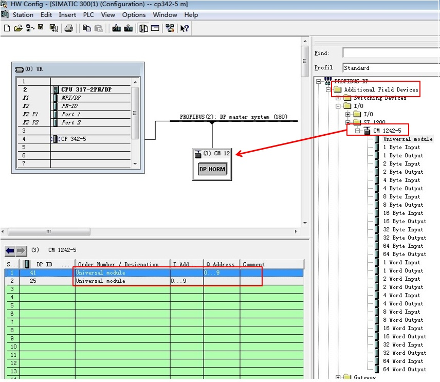{width="856" height="743"}

图 11 组态从站 CM1242-5（V5.5 软件）

#### 2.3 软件编程

在 S7-300 侧，CP342-5
进行数据发送接收，需要通过编程实现。首先创建发送和接收数据块 DB1 和
DB2，定义成101节的数组，如图 12所 示。

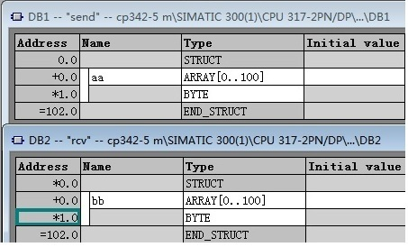{width="453" height="274"}

图 12 CP342-5侧创建接收发送数据块

在 OB1 中，从"Libraries"\>"SIMATIC_NET_CP"\>"CP
300"下，调用FC1（DP_SEND）、FC2（DP_RECV）通信指令，如图13 所示。

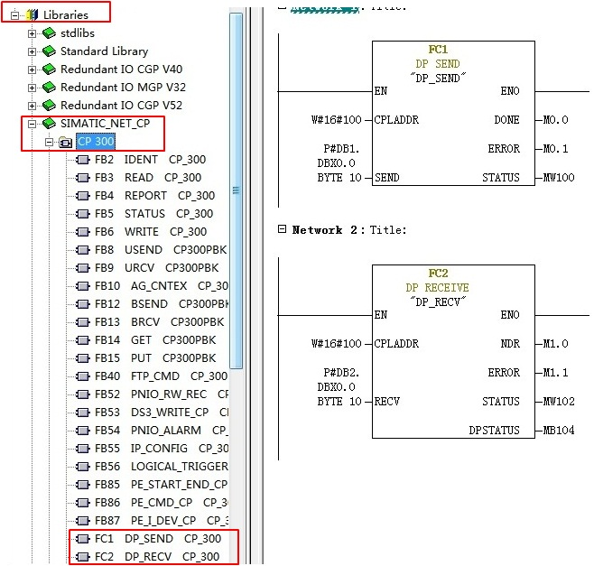{width="658" height="627"}

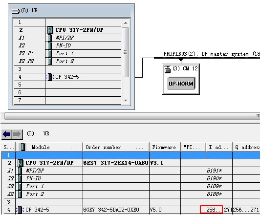{width="534" height="440"}

图 13 发送接收指令调用和 CPLADDR 地址

关于功能块参数意义参考上表 1.。

#### 2.4 监控结果

在不同项目中，分别为 S7-300和 CPU1214C 创建监控表，进行通讯测试，如图 14
所示。

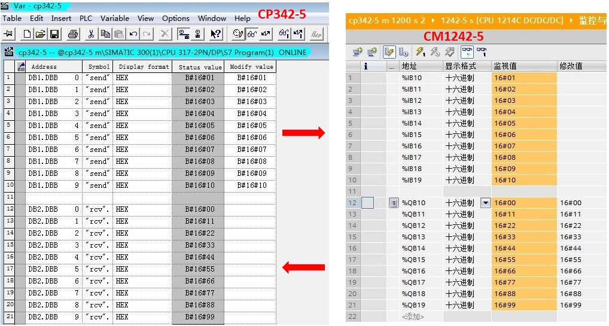{width="1018" height="545"}

图 14 监控结果
