### S7-1200 串行通信

S7-1200支持的串行通讯方式

-   点对点（PtP）通信
-   Modbus 主从通信
-   USS 通信\

+-----------------+-----------------+-----------------+-----------------+
| 名称            | CM 1241 RS232   | CM 1241         | CB 1241 RS485   |
|                 |                 | RS422/485       |                 |
+-----------------+-----------------+-----------------+-----------------+
| 订货号          | ::: {           | ::: {           | ::: {           |
|                 | align="center"} | align="center"} | align="center"} |
|                 | 6ES             | 6ES             | 6ES             |
|                 | 7241-1AH32-0XB0 | 7241-1CH32-0XB0 | 7241-1CH30-1XB0 |
|                 | :::             | :::             | :::             |
+-----------------+-----------------+-----------------+-----------------+
| 通讯口类型      | ::: {           | ::: {           | ::: {           |
|                 | align="center"} | align="center"} | align="center"} |
|                 | RS232           | RS422/RS485     | RS485           |
|                 | :::             | :::             | :::             |
+-----------------+-----------------+-----------------+-----------------+
| 波特率(bps)     | ::: {           |                 |                 |
|                 | align="center"} |                 |                 |
|                 | 300 ;600 ;1.2   |                 |                 |
|                 | k; 2.4 k; 4.8   |                 |                 |
|                 | k; 9.6 k;19.2   |                 |                 |
|                 | k; 38.4 k; 57.6 |                 |                 |
|                 | k; 76.8 k;      |                 |                 |
|                 | 115.2 k         |                 |                 |
|                 | :::             |                 |                 |
+-----------------+-----------------+-----------------+-----------------+
| 校验方式        | -               |                 |                 |
|                 |    None(无校验) |                 |                 |
|                 | -               |                 |                 |
|                 |    Even(偶校验) |                 |                 |
|                 | -   Odd(奇校验) |                 |                 |
|                 | -   Mark(校     |                 |                 |
|                 | 验位始终置为1)  |                 |                 |
|                 | -   Space       |                 |                 |
|                 | (校验位始终为0) |                 |                 |
+-----------------+-----------------+-----------------+-----------------+
| 流控            | ::: {           | ::: {           | ::: {           |
|                 | align="center"} | align="center"} | align="center"} |
|                 | 硬件            | RS422           | 不支持          |
|                 | 流控；软件流控  | 支持软件流控    | :::             |
|                 | :::             | :::             |                 |
+-----------------+-----------------+-----------------+-----------------+
| 接收缓冲区      | ::: {           |                 |                 |
|                 | align="center"} |                 |                 |
|                 | 1kB             |                 |                 |
|                 | :::             |                 |                 |
+-----------------+-----------------+-----------------+-----------------+
| 通讯            | ::: {           | ::: {           | ::: {           |
| 距离(屏蔽电缆)  | align="center"} | align="center"} | align="center"} |
|                 | 10m             | 1000m           | 1000m           |
|                 | :::             | :::             | :::             |
+-----------------+-----------------+-----------------+-----------------+
| 电源消耗(5V DC) | ::: {           | ::: {           | ::: {           |
|                 | align="center"} | align="center"} | align="center"} |
|                 | 200mA           | 220mA           | 50mA            |
|                 | :::             | :::             | :::             |
+-----------------+-----------------+-----------------+-----------------+
| 电源消耗(24V    | ::: {           | ::: {           | ::: {           |
| DC)             | align="center"} | align="center"} | align="center"} |
|                 | \-              | \-              | 80mA            |
|                 | :::             | :::             | :::             |
+-----------------+-----------------+-----------------+-----------------+

#### S7-1200 串口通信模块的特征

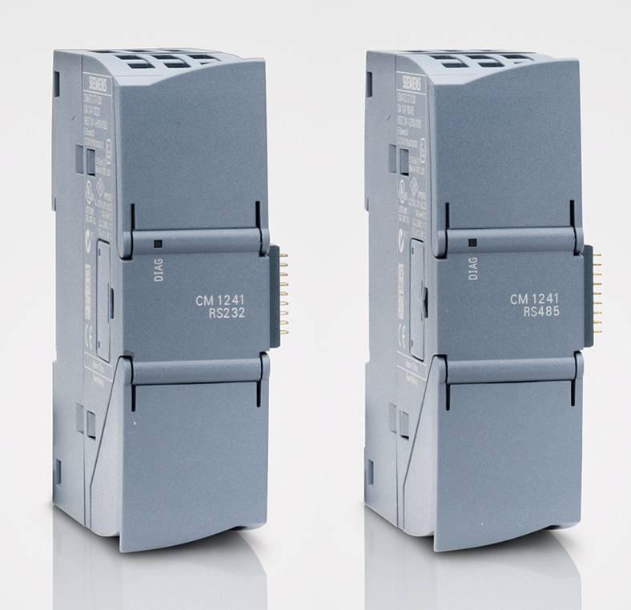{width="435" height="339"}

图1. CM1241串口通信模块

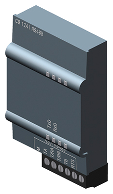{width="234" height="400"}

图2. CB1241串口通信模块

1.  由 CPU 供电，不必连接外部电源\
    \
2.  端口经过隔离，最长距离1000 米\
    \
3.  有诊断 LED 及显示传送和接收活动 LED\
    \
4.  支持点对点协议\
    \
5.  通过扩展指令和库功能进行组态和编程

#### RS485 与 RS232 通信模块的LED

**诊断 LED 灯**

-   **红闪：**如果 CPU 未正确识别到通信模块，诊断 LED 会一直红色闪烁
-   **绿闪：**CPU 上电后已经识别到通信模块，但是通信模块还没有配置
-   **绿灯：**CPU 已经识别到通信模块，且配置也已经下载到了CPU

**发送 LED 灯**

-   代表数据正在通过通信口传送出去

**接收 LED 灯**

-   代表数据正在通过通信口接收进来

{width="15" height="15"}**注意：**通信板 CB1241
只有发送和接收 LED 灯，而没有诊断 LED 灯

#### 串口模板支持的协议

-   ASCII
-   USS
-   Modbus RTU 主站
-   Modbus RTU 从站
-   3964R（RS232/RS422支持）\

#### ASCII 协议的特点

-   报文可以由用户自己定义，便于用户以 ASCII 协议为基础开发
-   使用简单，可以很好地实现与第三方系统的通讯
-   可以进行识别报文结束设置
-   可以进行数据流量控制
-   缺点：具有简单的校验功能（奇偶校验），低数据安全性；数据传输无确认信息；
    通讯需要双方协调

#### S7-1200 的 PTP 校验

**串口的校验：**
奇偶校验：用于检验数据传递的正确性，是最简单的检错方法。

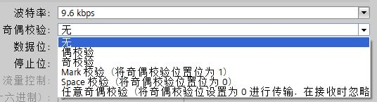{width="536" height="145"}\
\
图3. 校验设置

-   **偶校验：**如果每字节的数据位中"1"的个数为奇数，则校验位为1，如果个数为偶数，则校验位为"0"，
     保证数据位和校验位中"1"的个数是偶数
-   **奇校验：**如果每字节的数据位中"1"的个数为奇数，则校验位为0，如果个数为偶数，则校验位为"1"，
    保证数据位和校验位中"1"的个数是奇数
-   **传号校验：**奇偶校验位始终设置为 1
-   **空号校验：**奇偶校验位始终设置为 0

**{width="15"
height="15"}注意：**奇偶校验可以简单的判断数据的正确性，从原理上可看出当一位出错，可以准确判断，当两位或更多位误码就校验不出，但由于其实现简单，仍得到了广泛使用。

#### PTP 通信的发送信息配置

定义在信息起始发送断点及空闲线

**字符中断**：当接收到的数据保持为零值的时间大于完整的字符传输时间时，代表字符中断。一个完整字符传输时间定义为传输起始位、数据位、校验位和停止位的时间总和。

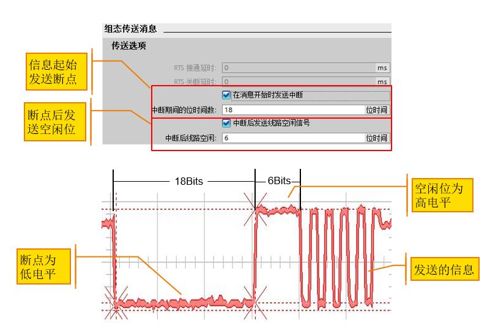{width="801" height="541"}

图4. 定义在信息起始发送断点及空闲线

**{width="15"
height="15"}常问问题：**为什么发送配置中只配了2位字符中断，而通信伙伴却可以正常接收数据？\
**答：**发送配置中设置的字符中断小于等于16位时，系统自动发出16位的字符中断位；设置大于16位时，则发出的中断位与实际设置相符。下图是设置的发送断点及空闲线位及其实际发出的波形图。

+-----------------------------------+-----------------------------------+
| ::: {align="center"}              | ::: {align="center"}              |
| **波形图**                        | **断点及空闲线设置**              |
| :::                               | :::                               |
+-----------------------------------+-----------------------------------+

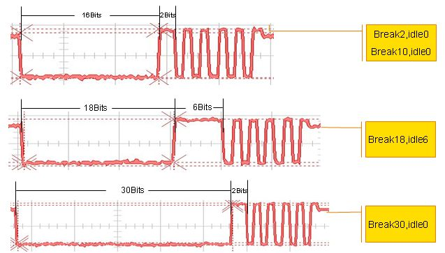{width="637" height="363"}

图5. 断点及空闲线波形图

#### PTP 通信接收起始条件

**以任意字符开始**

**以特殊条件开始**：

-   通过断点识别消息开始
-   通过空闲线识别消息开始
-   通过单个字符识别消息开始
-   通过字符序列识别消息开始

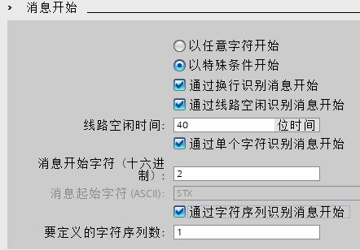{width="442" height="308"}

图6. 通信接收起始条件

**通过字符序列识别消息开始**

对于多个起始序列的组态，只要出现其中一个序列，即会满足开始条件。下图右侧即为满足起始条件的字符串。

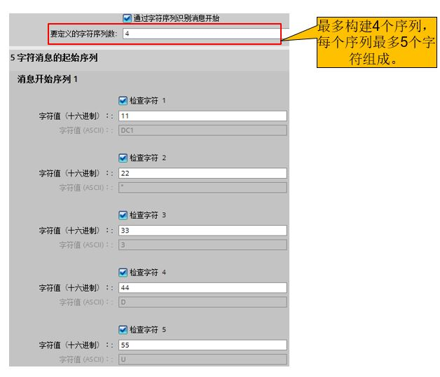{width="628" height="538"}

图7. 通过字符序列识别消息开始

**如果选择了多个起始条件，则检查开始条件的顺序如下:**

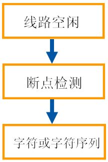{width="216" height="323"}

**{width="15" height="15"}注意:**

检查多个开始条件时，如果有一个条件没有满足，则 CM
将从第一个所需的条件开始重新启动检查。

如果同时组态了字符和字符序列作为开始条件，则字符序列的判断条件无效。\

#### PTP 通信接收结束条件

-   通过消息超时识别：时间从接到符合消息开始条件的第一个字符时开始计算
-   通过响应超时识别：时间从传送结束时开始计算，在指定时间内接收到字符，需要和其他结束条件配合使用
-   通过字符间隙识别：消息中两个连续字符间的间隔超时后，视为消息结束
-   通过最大长度识别：在接收到组态的最大字符数后，视为消息结束
-   通过固定长度识别：在接收到组态的最大字符后，视为消息结束
-   消息本身指定消息长度，在接收到指定长度的消息后，视为消息结束
-   在接收到指定的字符序列后，视为消息结束

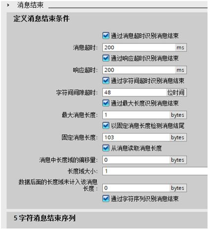{width="425" height="466"}

图8.结束条件设置

**{width="15"
height="15"}注意:**与多个起始条件的判断不同，检查多个结束条件时，任何一个条件满足，信息接收结束。

**消息超时结束条件\
\
**消息超时时间从接到符合消息开始条件的第一个字符时开始计算，如下图。

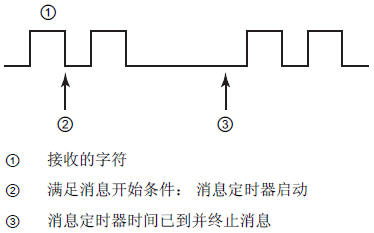{width="374" height="233"}

图9.消息超时

**响应超时结束条件**

响应超时时间从传送结束时开始计算，只要传送成功完成且模块开始接收操作，定时器就会启动。

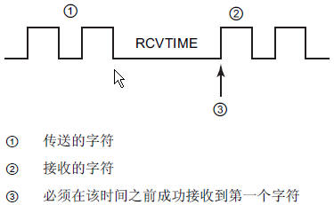{width="375" height="231"}

图10.响应超时

**{width="15"
height="15"}注意:**响应超时结束条件不能作为单独的结束条件的设置，否则会在编译时报如下错误:

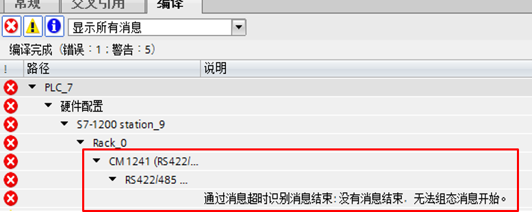{width="777" height="310"}

图11.响应超时作为单独的结束条件报错

**从消息中读取信息长度**

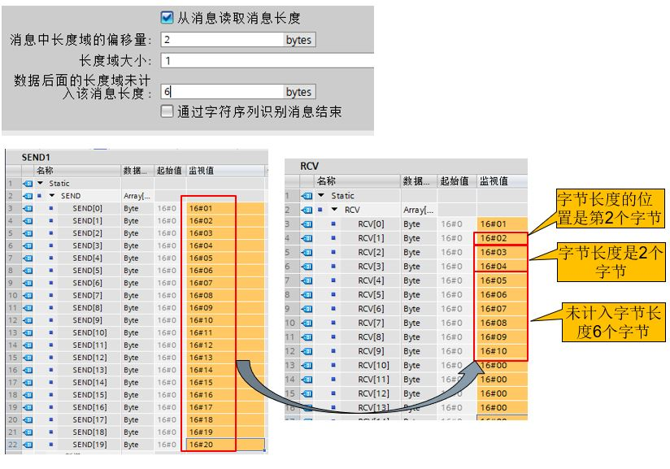{width="824" height="577"}

图12.从消息中读取信息长度的设置

实际收到的数据长度=长度偏移前的字节数+长度字节大小+读取的实际数据长度+不计入字节长度的字节数
10=（2-1）+1+2+6

#### PTP 通信接收缓存区

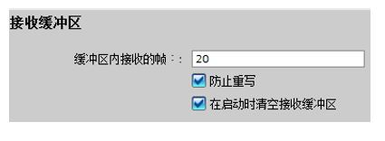{width="425" height="156"}

图13.接收缓冲区设置

**{width="15"
height="15"}注意:**缓存区可以存储多条信息，限制是20条信息或最多1024字节。

**缓存区的数据保持**

断电后缓存区中的数据全部丢失,不能保持。

勾选"在启动时清空接收缓冲区"，CPU停止再启动时，缓冲区数据清空。

**通信模板缓存区超出20条信息**

启用了"防止重写"，如果缓存区中的信息超过20条，后面的信息被
自动丢弃，报错16#81E6。

不启用"防止重写"，如果缓存区中的信息超过20条，后面的信息会将之前的信息覆盖，且不报错。

**通信模板缓存区多包数据超出1024字节**

发送多个每包50个字节数据，当数据超过1024字节那包就被丢弃了，前面的可以正常接收，且没有任何报错.在前面数据被成功接收以后，只要缓存区有空间，后面的数据还可以正常收到。

**通信模板缓存区一包数据超出1024字节**

如果发送数据一包就大于1024字节时，缓冲区接收到数据到1024字节时，虽然没有收到结束字符，数据由缓存区送给CPU，但会报错16#80E0,如下图。

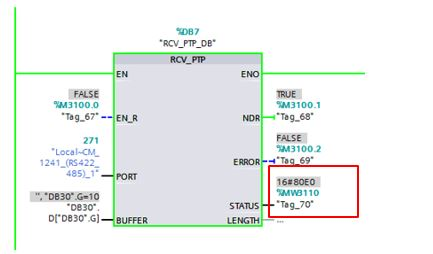{width="433" height="254"}

图14. 发送数据一包大于1024字节时,缓存区报错

**[]{#RESET}通信模板缓存区复位**

当缓冲区溢出报错时，需要使用Reset指令进行清除缓冲区的操作。

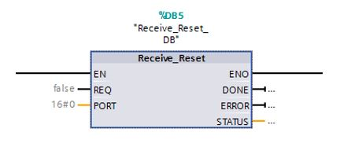{width="432" height="187"}

图15. 使用Reset指令复位缓存区错误，恢复数据接收

#### 为什么不能使用 PC/PPI 电缆与S7-1200 RS485 模块进行串口调试？

**答：**因为 S7-1200 RS485 模块接口不提供24V电源，不能给 PC/PPI
电缆供电，所以电缆无法工作。

**解决办法：**可以将 S7-1200 RS485 与 S7-200 通信口网络连接，将 PC/PPI
电缆插在 S7-200 通信口上总线连接器的编程口上，对S7-1200
RS485进行串口调试。此时S7-200必须上电并打到停止状态。 **\
**

连接

5

GND

逻辑地或通信地

金属壳

\-

外壳接地
