### 串口通信编程

#### 指令概述

S7-1200有两套点对点通信指令，如图1所示。

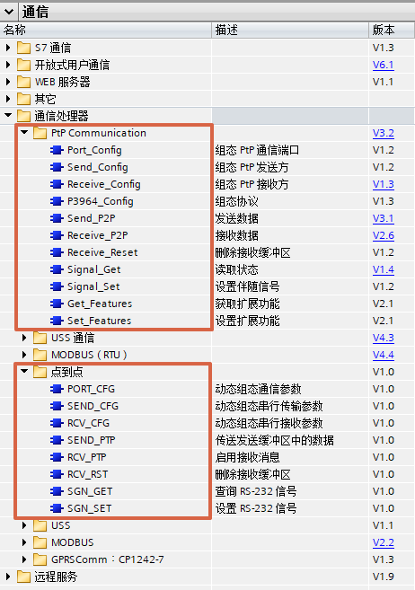{width="462" height="657"}

图1 指令列表

上述两套指令集区别如下表：

  指令集              适用范围          
  ------------------- ----------------- ------------------------------------------------------------------------------------
  PtP Communication   S7-1200中央机架   CPU版本\>=V4.1.1，CM1241版本\>=V2.1， TIA PORTAL 版本\>=V13SP1，CB1241没有版本要求
                      分布式IO          CPU版本\>=V4.1.1，ET200SP/ET200MP分布式IO的串口模块
  点到点              S7-1200中央机架   CPU、TIA PORTAL、CM1241、CB1241 均没有版本限制

建议使用PtP
Communication指令集的指令，因为指令和S7-1500兼容，并且指令版本一直在更新，点到点指令集不再更新，建议只用于老项目升级。

#### 指令说明

对于如图2中的指令，这些是用于在线修改串口模块硬件组态的指令，例如在线修改波特率，在线修改接收条件。一般不需要使用，具体使用可以参见TIA
PORTAL帮助或者S7-1200系统手册。

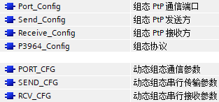{width="313" height="146"}

图2 组态指令

对于如图3中的指令，这些是用于硬流控操作的指令，通过信号设置激活相关的接收发送。除非使用硬流控，否则不需要使用，具体使用可以参见TIA
PORTAL帮助或者S7-1200系统手册。

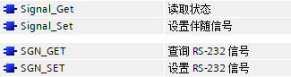{width="325" height="86"}

图3 流控指令

对于如图4中的指令，这些是用于实现一些扩展功能的指令，例如与第三方设备非标准MODBUS通信，伙伴不需要CRC校验，可以使用该指令禁用MODBUS
CRC。一般不需要使用，具体使用可以参见TIA PORTAL帮助或者S7-1200系统手册。

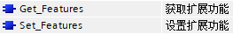{width="263" height="39"}

图4 扩展功能

对于如图5中的指令，这些是用于清除通信模块接收缓冲区的指令。

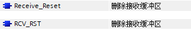{width="323" height="52"}

图5 清除缓冲区

对于一般情况下的自由口通信，都是只使用如图6中的发送接收指令。

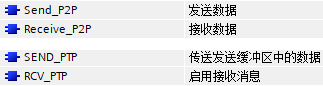{width="323" height="86"}

图6 发送接收

{width="781" height="175"}

图7 发送指令

           Send_P2P                                                                                                                                                                                                                                                      SEND_PTP
  -------- ------------------------------------------------------------------------------------------------------------------------------------------------------------------------------------------------------------------------------------------------------------- ----------
  EN       使能，建议常接通                                                                                                                                                                                                                                              
  REQ      发送触发信号，使用沿触发                                                                                                                                                                                                                                      
  PORT     串口硬件模块标识符，可以在PLC变量表中找到，如图9所示                                                                                                                                                                                                          
  BUFFER   发送区，一般使用[P#指针形式](../../../07-Program/02-basic/01-Data_Type/07-Variant.html#P)，String类型或者WString类型，字符数组等，如果使用String类型或者WString类型，则伙伴方收到时不会看到字符串前面的最大长度和实际长度，也就是说相当于发送的是字符数组。   
  LENGTH   实际发送的字节数，如果为0，则是全部发送                                                                                                                                                                                                                       
  PCTRL    \-                                                                                                                                                                                                                                                            没有意义
  DONE     将数据发送至通信模块发送缓冲区完成，将有一个扫描周期置位                                                                                                                                                                                                      
  ERROR    发送错误，将有一个扫描周期置位                                                                                                                                                                                                                                
  STATUS   通常显示状态代码，错误时会在ERROR为1的周期显示错误信息（16#8xxx）                                                                                                                                                                                             

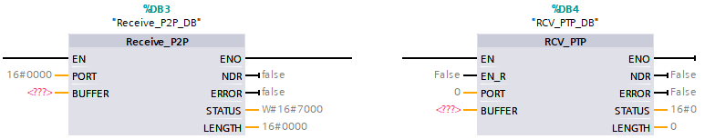{width="784" height="153"}

图8 接收指令

+-----------------------+-----------------------+-----------------------+
|                       | Receive_P2P           | RCV_PTP               |
+=======================+=======================+=======================+
| EN                    | 为True时，如果通信    | 使能，建议常接通      |
|                       | 模块接收缓冲区有数据  |                       |
|                       | ，则将其传送至BUFFER  |                       |
+-----------------------+-----------------------+-----------------------+
| EN_R                  | \-                    | 为True时，如果通信    |
|                       |                       | 模块接收缓冲区有数据  |
|                       |                       | ，则将其传送至BUFFER  |
+-----------------------+-----------------------+-----------------------+
| PORT                  | 串口硬件模            |                       |
|                       | 块标识符，可以在PLC变 |                       |
|                       | 量表中找到，如图9所示 |                       |
+-----------------------+-----------------------+-----------------------+
| BUFFER                | 接收区，一般使用[P#指 |                       |
|                       | 针形式](../../../07-P |                       |
|                       | rogram/02-basic/01-Da |                       |
|                       | ta_Type/07-Variant.ht |                       |
|                       | ml#P)，String类型或者 |                       |
|                       | WString类型，字符数组 |                       |
|                       | 等，如果使用String类  |                       |
|                       | 型或者WString类型，则 |                       |
|                       | 即使伙伴方发送的是字  |                       |
|                       | 符数组，指令也会为字  |                       |
|                       | 符数组添加最大长度和  |                       |
|                       | 实际长度成为字符串。  |                       |
+-----------------------+-----------------------+-----------------------+
| NDR                   | 将通                  | 如果                  |
|                       | 信模块接收缓冲区的数  | EN_R为True时，则将通  |
|                       | 据接收至BUFFER完成，  | 信模块接收缓冲区的数  |
|                       | 将有一个扫描周期置位  | 据接收至BUFFER完成，  |
|                       |                       | 将有一个扫描周期置位\ |
|                       |                       | 如果EN_R为False，则   |
|                       |                       | 通信模块接收缓冲区有  |
|                       |                       | 数据时NDR将始终为True |
+-----------------------+-----------------------+-----------------------+
| ERROR                 | 指令错误，            |                       |
|                       | 将有一个扫描周期置位  |                       |
+-----------------------+-----------------------+-----------------------+
| STATUS                | 通常                  |                       |
|                       | 显示状态代码，错误时  |                       |
|                       | 会在ERROR为1的周期显  |                       |
|                       | 示错误信息（16#8xxx） |                       |
+-----------------------+-----------------------+-----------------------+
| LENGTH                | 在接收完              |                       |
|                       | 成时，将有一个扫描周  |                       |
|                       | 期显示接收到的字节数  |                       |
+-----------------------+-----------------------+-----------------------+

{width="15"
height="15"}如果通信模块接收缓冲区包含有n次接收到的数据，则需要Receive_P2P
EN/RCV_PTP EN_R n个扫描周期为True才能接收至BUFFER完成。

一般建议Receive_P2P EN/RCV_PTP
EN_R常通或者接通一段时间而不是使用沿触发，这样通信模块接收缓冲区一旦接收到新数据，就可以立即接收至BUFFER。如果可能，可以把接收指令放在循环OB内尽可能快的调用。

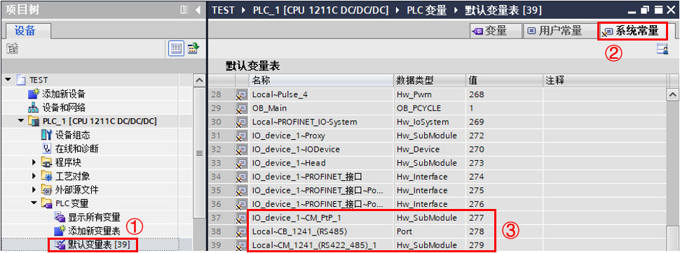{width="970" height="362"}

图9 系统常量

①在CPU中选择PLC变量表\>默认变量表

②选择系统常量

③找到相关串口模块，建议直接将模块名称复制到PORT处

#### **发送指令、发送完成位、发送错误位、发送错误代码**

下面分为点对点指令与PtP Communication 指令分别介绍

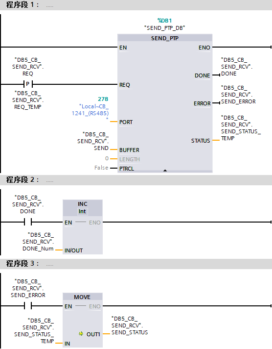{width="556" height="712"}

图10 点到点发送相关指令

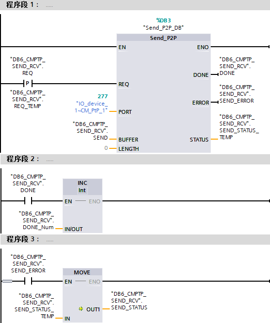{width="556" height="664"}

图10 PtP Communication 发送相关指令

程序段1：触发发送

程序段2：发送完成位触发一个全局变量自加一，每完成一次该变量加一个数，可以通过这种方法检测是否发送完成

程序段3：发送错误位触发一个MOVE指令，当发送错误到来时，通过这种方法将STATUS的变量移动到一个全Word类型全局变量，发送错误代码将保存到该变量中

#### **接收指令、接收完成位、接收错误位、接收错误代码、接收长度**

下面分为点对点指令与PtP Communication 指令分别介绍

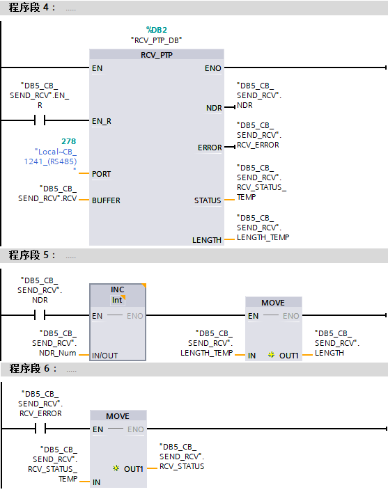{width="557" height="707"}

图12 点到点接收相关指令

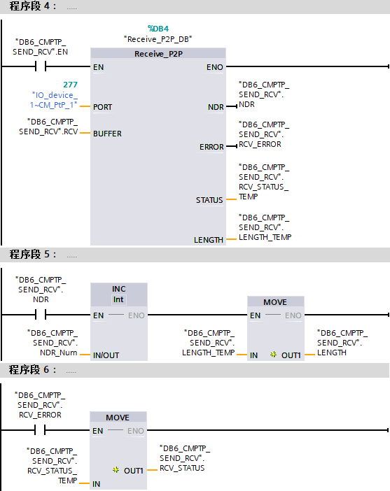{width="557" height="702"}

图13 PtP Communication 接收相关指令

程序段4：触发接收

程序段5：接收完成位触发一个全局变量自加一，每完成一次该变量加一个数，可以通过这种方法检测是否接收完成，同时将长度变量通过一个MOVE指令移动到一个UInt类型全局变量，接收长度将保存到该变量中

程序段6：接收错误位触发一个MOVE指令，接收送错误到来时，通过这种方法将STATUS的变量移动到一个Word类型全局变量，接收错误代码将保存到该变量中

#### 轮询编程

**通信任务：**

1号站S7-1200使用CB1241，利用点对点指令发送接收。

2号站S7-1200使用ET200SP分布式IO的CMPTP模块，利用PtP Communication
指令发送接收。

1号站发送字符串\'西门子\'，2号站发送字符串\'博大精深\'。

{width="15"
height="15"}注：例子中1号站先发送，2号站先接收，实际取决于需要，对于PLC来说，先发送还是先接收都是可以的。

例子中使用系统存储器FirstScan，激活方式如图14所示。

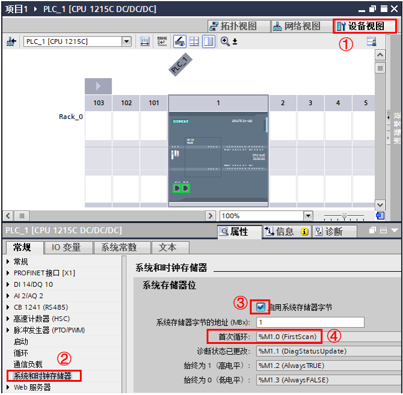{width="671" height="657"}

图14 设置系统存储器

①进入CPU的设备视图

②在属性\>常规下选中系统和时钟存储器

③激活启用系统存储器字节，默认MB1

④即为FirstScan变量，默认M1.0

图15为1号站轮询：

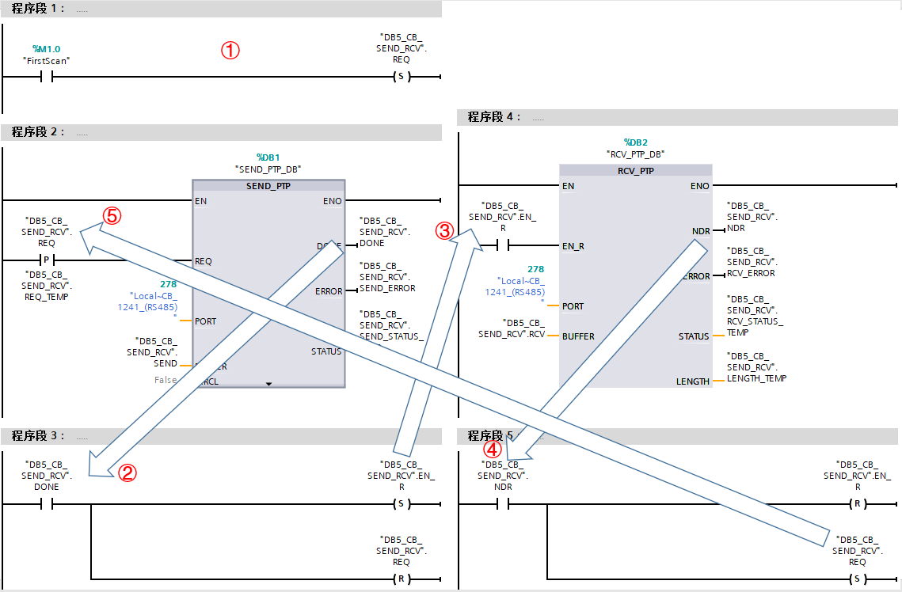{width="1139" height="748"}

图15 1号站轮询

①使用系统存储器"FirstScan"激活第一次的发送

②发送DONE位置位接收请求，复位发送请求

③触发接收

④接收NDR位置位发送请求，复位接收请求

⑤触发下一次的发送

图16为2号站轮询：

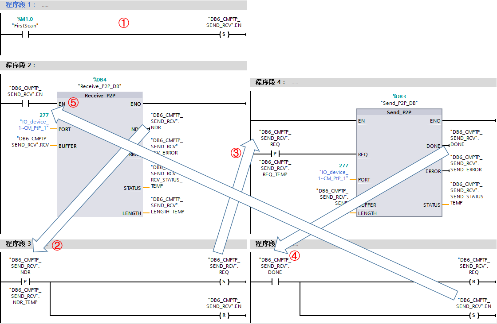{width="1120" height="732"}

图16 2号站轮询

①使用系统存储器"FirstScan"激活第一次的接收

②接收NDR位的上升沿置位接收请求，复位发送请求

③触发发送

④发送DONE位置位接收请求，复位发送请求

⑤触发下一次的接收

**通信结果**：

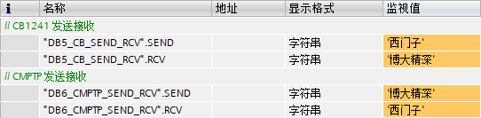{width="542" height="133"}

图17 通信结果

#### 常见问题

{width="15"
height="15"}如何处理对于字符串、字符数组等的发送接收？

考虑到PLC通常与第三方进行自由口通信，而通信内容通常是字符串，但是西门子的SIMATIC
String或者WString是包含最大长度与实际长度的，而第三方的字符串对于西门子来说是Char数组或者WChar数组。

基于此点对点及PtP Communication
指令集均对字符串、字符数组的发送接收进行了优化，即：

第三方伙伴发送字符数组，PLC的接收指令BUFFER类型为字符数组，则接收成字符数组，BUFFER类型为字符串，则接收成字符串，接收指令自动将字符串的最大长度和实际长度补齐。

第三方伙伴接收字符数组，PLC的发送指令BUFFER类型为字符数组，则发送字符数组，BUFFER类型为字符串，同样发送字符数组，发送指令自动将字符串的最大长度和实际长度去掉。

简单的说PLC会按照字符数组的形式收发，发送或者接收BUFFER如果是字符串，则会进行相应的转换。以上面轮询为例，参见图18图19。

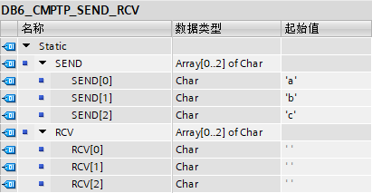{width="411" height="213"}

图18 修改2号站的发送接收区的String类型改为Char数组

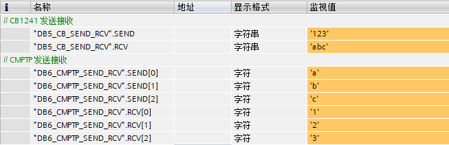{width="653" height="211"}

图19 收发结果

可以得知，1号站发送字符串'123'，2号站接收到字符数组，每个字符分别是\'1\'、\'2\'、\'3\'。2号站发送字符数组，每个字符分别是\'a\'、\'b\'、\'c\'，1号站接收到字符串为\'abc\'。
