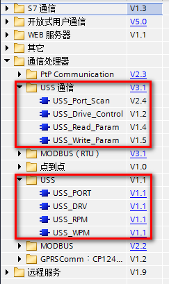
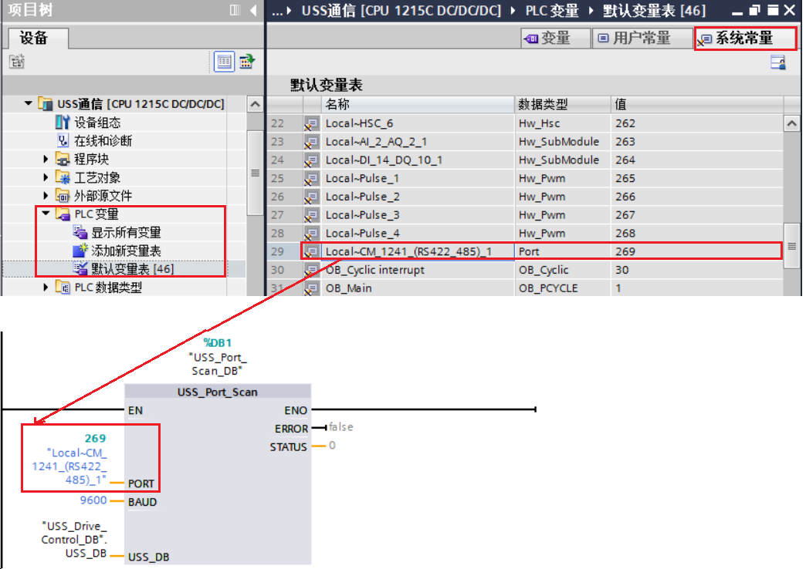
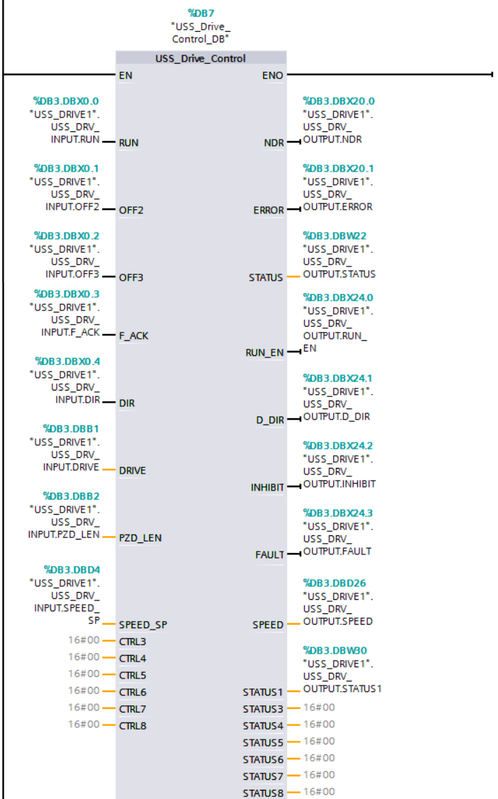
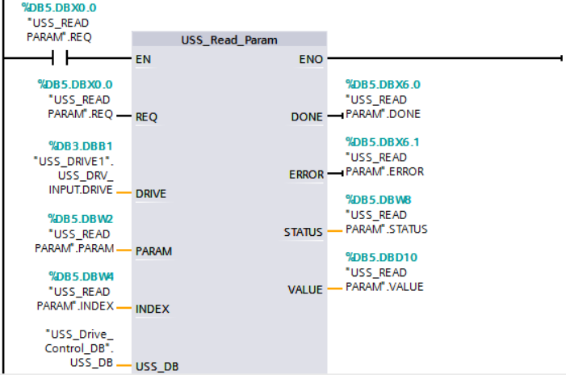

### USS 通信基本原理

USS 协议（Universal Serial Interface
Protocol，即通用串行接口协议）是西门子专为驱动装置开发的通用通信协议，它是一种基于串行总线进行数据通信的协议。

USS 通信总是由主站发起，USS
主站不断轮询各个从站，从站根据收到主站报文，决定是否、以及如何响应。从站必须在接收到主站报文之后的一定时间内发回响应到主站，否则主站将视该从站出错。

USS 协议是主从结构的协议，总线上的每个从站都有唯一的从站地址。一个
S7-1200 CPU 中最多可安装三个 CM 1241 RS422/RS485模块和一个 CB 1241 RS485
板，每个 RS485 端口最多控制 16 台驱动器。

### S7-1200 与西门子传动设备 V20 之间 USS 通信

**使用环境**

-   TIA Portal STEP 7 V16
-   CPU1215C DC/DC/DC V4.4
-   CM1241 RS422/RS485 V2.2
-   SINAMICS SINAMICS V20（6SL3210-5BE03-7UV0）
-   1LA9 电机（1LA9060-4KA10-Z）

**实现功能**

-   S7-1200 与西门子传动设备 V20 之间 USS
    通信，控制变频器的启停和频率，并读取和修改变频器的加减速时间。

#### 两类指令"USS通信"与"USS"区别：

如图 1 所示，S7-1200 USS 有两个 USS 指令库

-   "USS通信" 指令库下的指令除了适用于 S7-1200 中央机架串口模块（CM 1241
    V2.1 以上或 CB 1241 且 S7-1200 CPU V4.1 以上），还可用于分布式 I/O
    PROFINET 或 PROFIBUS 的 ET200SP/ET200MP 串口通信模块。
-   "USS" 指令库下的指令只能用于 S7-1200 中央机架串口模块（CM 1241 或 CB
    1241）

"USS通信"
是目前最新的指令库，并且以后的更新也会基于这个指令库。一般情况下，"USS"
只是在老项目中使用。

下面的介绍以 "USS 通信" 指令库为例。

{width="243" height="409"}

图 1.S7-1200 PLC 的 USS 通信指令

#### 1. SINAMICS V20 变频器设置

SINAMICS V20 的启停和频率控制通过 PZD 过程数据来实现，参数读取和修改通过
PKW 参数通道来实现。可以使用连接宏 Cn010 实现 SINAMICS V20 的 USS
通信，也可以直接修改变频器参数。

变频器参数设置步骤如下：

\(1\) 恢复工厂设置 设置参数 P0010（调试参数）= 30，P0970（工厂复位）= 21

\(2\) 设置用户访问级别 设置参数 P0003（用户访问级别）= 3 (专家访问级别)

\(3\) 设置 SINAMICS V20 变频器 USS
通信所需的命令源、协议、波特率、地址等参数。选择连接宏 Cn010
后，需要将参数 P2013 的值由 127（PKW长度可变）修改为 4（PKW长度为 4）；

此外对于本例需要将参数 P2010 的值由 8（波特率 38400）修改为
6(本例中使用波特率为 9600），P2010 值与波特率对应关系参见表 1。

表 1 P2010 值与波特率对应关系

+--------+--------+--------+--------+--------+--------+--------+--------+
| ::: {a | ::: {a | ::: {a | ::: {a | ::: {a | ::: {a | ::: {a | ::: {a |
| lign=" | lign=" | lign=" | lign=" | lign=" | lign=" | lign=" | lign=" |
| left"} | left"} | left"} | left"} | left"} | left"} | left"} | left"} |
| 参数值 | 6      | 7      | 8      | 9      | 10     | 11     | 12     |
| :::    | :::    | :::    | :::    | :::    | :::    | :::    | :::    |
+--------+--------+--------+--------+--------+--------+--------+--------+
| ::: {a | ::: {a | ::: {a | ::: {a | ::: {a | ::: {a | ::: {a | ::: {a |
| lign=" | lign=" | lign=" | lign=" | lign=" | lign=" | lign=" | lign=" |
| left"} | left"} | left"} | left"} | left"} | left"} | left"} | left"} |
| 波     | 9600   | 19200  | 38400  | 57600  | 76800  | 93750  | 115200 |
| 特率（ | :::    | :::    | :::    | :::    | :::    | :::    | :::    |
| bps）  |        |        |        |        |        |        |        |
| :::    |        |        |        |        |        |        |        |
+--------+--------+--------+--------+--------+--------+--------+--------+

本例中使用如下表 2 所列的设置值。

表 2.SINAMICS V20 设置变频器参数值

+-----------------+-----------------+-----------------+-----------------+
| :::             | :::             | :::             | :::             |
|  {align="left"} |  {align="left"} |  {align="left"} |  {align="left"} |
| 参数            | 描述            | 设置值          | 备注            |
| :::             | :::             | :::             | :::             |
+-----------------+-----------------+-----------------+-----------------+
| :::             | :::             | :::             | :::             |
|  {align="left"} |  {align="left"} |  {align="left"} |  {align="left"} |
| P0700\[0\]      | 选择命令源      | 5               | 命令源来源于    |
| :::             | :::             | :::             | RS485 总线      |
|                 |                 |                 | :::             |
+-----------------+-----------------+-----------------+-----------------+
| :::             | :::             | :::             | :::             |
|  {align="left"} |  {align="left"} |  {align="left"} |  {align="left"} |
| P1000\[0\]      | 选择设定源      | 5               | 设定值来源于    |
| :::             | :::             | :::             | RS485 总线      |
|                 |                 |                 | :::             |
+-----------------+-----------------+-----------------+-----------------+
| :::             | :::             | :::             | :::             |
|  {align="left"} |  {align="left"} |  {align="left"} |  {align="left"} |
| P2000\[0..2\]   | 基准频率值      | 50.00           | 百分比100% ==\> |
| :::             | :::             | :::             | P2000 的值      |
|                 |                 |                 | :::             |
+-----------------+-----------------+-----------------+-----------------+
| :::             | :::             | :::             | :::             |
|  {align="left"} |  {align="left"} |  {align="left"} |  {align="left"} |
| P2023\[0\]      | RS485 协议选择  | 1               | USS协议         |
| :::             | :::             | :::             | :::             |
+-----------------+-----------------+-----------------+-----------------+
| :::             | :::             | :::             | :::             |
|  {align="left"} |  {align="left"} |  {align="left"} |  {align="left"} |
| P2010\[0\]      | USS 波特率      | 6               | 波特率为 9600   |
| :::             | :::             | :::             | :::             |
+-----------------+-----------------+-----------------+-----------------+
| :::             | :::             | :::             | :::             |
|  {align="left"} |  {align="left"} |  {align="left"} |  {align="left"} |
| P2011\[0\]      | USS 地址        | 1               | USS 站地址为 1  |
| :::             | :::             | :::             | :::             |
+-----------------+-----------------+-----------------+-----------------+
| :::             | :::             | :::             | :::             |
|  {align="left"} |  {align="left"} |  {align="left"} |  {align="left"} |
| P2012\[0\]      | USS PZD 长度    | 2               | USS PZD 长度为  |
| :::             | :::             | :::             | 2 个字长        |
|                 |                 |                 | :::             |
+-----------------+-----------------+-----------------+-----------------+
| :::             | :::             | :::             | :::             |
|  {align="left"} |  {align="left"} |  {align="left"} |  {align="left"} |
| P2013\[0\]      | USS PKW 长度    | 4               | USS PKW 长度为  |
| :::             | :::             | :::             | 4               |
|                 |                 |                 | :::             |
+-----------------+-----------------+-----------------+-----------------+
| :::             | :::             | :::             | :::             |
|  {align="left"} |  {align="left"} |  {align="left"} |  {align="left"} |
| P2014\[0\]      | USS             | 500             | 可设置范围      |
| :::             | 报文间断时间    | :::             | 0-65535         |
|                 | :::             |                 | ms。报          |
|                 |                 |                 | 文间隔超过此设  |
|                 |                 |                 | 定时间还没有接  |
|                 |                 |                 | 收到下一条报文  |
|                 |                 |                 | 信息，则变频器  |
|                 |                 |                 | 将会停止运行。  |
|                 |                 |                 | :::             |
+-----------------+-----------------+-----------------+-----------------+

\(4\) 变频器重新上电

在更改通信协议 P2023
后，需要对变频器重新上电。在此过程中，请在变频器断电后等待数秒，确保 LED
灯熄灭或显示屏空白后再次接通电源。

#### 2. USS_Port_Scan

USS_Port_Scan 指令用于处理 USS 网络上的通信。

用户程序执行 USS_Port_Scan
指令的次数必须足够多，以防止驱动器超时。通常从循环中断调用 USS_Port_Scan
。 例如添加循环中断 OB30， 并设置循环中断时间 30ms。如图 2 所示：

{width="859" height="384"}

图 2.添加 OB30

USS_Port_Scan
指令输入引脚"PORT"为分配的串口模块的"硬件标识符"。安装并组态串口模块之后，可用的端口标识符将出现在
"PORT
"功能框连接的参数助手下拉列表中。或者，可在系统常量中找到该硬件标识符值。在
OB30 中调用"USS_Port_Scan"指令， 鼠标双击 CPU 1215 DC/DC/DC 站点下的
"PLC变量\>默认变量表" ， 在"系统常量"标签栏中找到本例所使用的 CM1241
RS422/485 模块，如图 3 所示。

USS_Port_Scan 指令输入引脚"USS_DB"指向为 USS_Drive_Control
指令放入程序时创建并初始化的背景数据块的名称。详见常见问题\"[如何输入参数
USS_DB?\"](#如何输入参数USS_DB)

表 3 为该指令的接口参数说明。

{width="1044" height="741"}

图 3.USS_Port_Scan

表 3.USS_Port_Scan 指令接口参数说明

::: {align="left"}
:::

+-----------------+-----------------+-----------------+-----------------+
| :::             | :::             | :::             | :::             |
|  {align="left"} |  {align="left"} |  {align="left"} |  {align="left"} |
| 参数            | 类型            | 数据类型        | 描述            |
| :::             | :::             | :::             | :::             |
+-----------------+-----------------+-----------------+-----------------+
| :::             | :::             | :::             | :::             |
|  {align="left"} |  {align="left"} |  {align="left"} |  {align="left"} |
| PORT            | IN              | Port            | 串口            |
| :::             | :::             | :::             | 模块硬件标识符  |
|                 |                 |                 | :::             |
+-----------------+-----------------+-----------------+-----------------+
| :::             | :::             | :::             | :::             |
|  {align="left"} |  {align="left"} |  {align="left"} |  {align="left"} |
| BAUD            | IN              | DInt            | 波特率          |
| :::             | :::             | :::             | :::             |
+-----------------+-----------------+-----------------+-----------------+
| :::             | :::             | :::             | :::             |
|  {align="left"} |  {align="left"} |  {align="left"} |  {align="left"} |
| USS_DB          | INOUT           | USS_Base        | 将              |
| :::             | :::             | :::             | US              |
|                 |                 |                 | S_Drive_Control |
|                 |                 |                 | 指              |
|                 |                 |                 | 令放入程序时创  |
|                 |                 |                 | 建并初始化的背  |
|                 |                 |                 | 景数据块的名称  |
|                 |                 |                 | :::             |
+-----------------+-----------------+-----------------+-----------------+
| :::             | :::             | :::             | :::             |
|  {align="left"} |  {align="left"} |  {align="left"} |  {align="left"} |
| ERROR           | OUT             | Bool            | 该输出为 True   |
| :::             | :::             | :::             | 时，表示        |
|                 |                 |                 | 发生错误，此时  |
|                 |                 |                 | STATUS          |
|                 |                 |                 | 输出错误代码。  |
|                 |                 |                 | :::             |
+-----------------+-----------------+-----------------+-----------------+
| :::             | :::             | :::             | :::             |
|  {align="left"} |  {align="left"} |  {align="left"} |  {align="left"} |
| STATUS          | OUT             | WORD            | USS 通信状态值  |
| :::             | :::             | :::             | :::             |
+-----------------+-----------------+-----------------+-----------------+

**{width="15" height="15"}注意：**

1.  一个串口通信端口无论与几台变频器连接，都只能有一个 USS_Port_Scan
    指令，每次调用该函数块都与单个驱动器进行通信。
2.  如果使用 CB1241，需要使得 USS_Port_Scan 背景 DB 中的 LINE_PRE
    起始值更改为 0。

#### 3. USS_Drive_Control

USS_Drive_Control
指令用于请求消息、驱动器响应消息，以及与驱动器交换数据。

例如， 本例中将输入引脚"OFF2"和"OFF3"设置为 True， ""DIR"使能为
True,"Drive" 设置为 1，\"PZD_LEN"设置为 2，"SPEED_SP"设置为 50.0（即 50%
频率值为 25Hz）， 然后将"RUN" 使能为 True，使变频器以 25HZ
频率运行。如图 4 所示。表 4 为该指令的接口参数说明。

{width="704" height="1127"}

图 4.USS_Drive_Control 指令

表 4.USS_Drive_Control 指令接口参数说明

+-----------------+-----------------+-----------------+-----------------+
| :::             | :::             | :::             | :::             |
|  {align="left"} |  {align="left"} |  {align="left"} |  {align="left"} |
| 参数            | 类型            | 数据类型        | 描述            |
| :::             | :::             | :::             | :::             |
+-----------------+-----------------+-----------------+-----------------+
| :::             | :::             | :::             | :::             |
|  {align="left"} |  {align="left"} |  {align="left"} |  {align="left"} |
| RUN             | IN              | Bool            | 驱动器起        |
| :::             | :::             | :::             | 始位：该输入为  |
|                 |                 |                 | True，将        |
|                 |                 |                 | 使驱动器以预设  |
|                 |                 |                 | 速度运行。如果  |
|                 |                 |                 | 在驱动器运行时  |
|                 |                 |                 | RUN 变为        |
|                 |                 |                 | False，电机     |
|                 |                 |                 | 将减速直至停止  |
|                 |                 |                 | :::             |
+-----------------+-----------------+-----------------+-----------------+
| :::             | :::             | :::             | :::             |
|  {align="left"} |  {align="left"} |  {align="left"} |  {align="left"} |
| OFF2            | IN              | Bool            | 电气            |
| :::             | :::             | :::             | 停止位：该位为  |
|                 |                 |                 | False           |
|                 |                 |                 | 时，将使驱      |
|                 |                 |                 | 动器在无制动的  |
|                 |                 |                 | 情况下自然停止  |
|                 |                 |                 | :::             |
+-----------------+-----------------+-----------------+-----------------+
| :::             | :::             | :::             | :::             |
|  {align="left"} |  {align="left"} |  {align="left"} |  {align="left"} |
| OFF3            | IN              | Bool            | 快速            |
| :::             | :::             | :::             | 停止位：该位为  |
|                 |                 |                 | False           |
|                 |                 |                 | 时，将通        |
|                 |                 |                 | 过制动的方式使  |
|                 |                 |                 | 驱动器快速停止  |
|                 |                 |                 | :::             |
+-----------------+-----------------+-----------------+-----------------+
| :::             | :::             | :::             | :::             |
|  {align="left"} |  {align="left"} |  {align="left"} |  {align="left"} |
| F_ACK           | IN              | Bool            | 故障确认位      |
| :::             | :::             | :::             | :::             |
+-----------------+-----------------+-----------------+-----------------+
| :::             | :::             | :::             | :::             |
|  {align="left"} |  {align="left"} |  {align="left"} |  {align="left"} |
| DIR             | IN              | Bool            | 驱动器方        |
| :::             | :::             | :::             | 向控制：设位为  |
|                 |                 |                 | True            |
|                 |                 |                 | 时指示          |
|                 |                 |                 | 正方向（对于正  |
|                 |                 |                 | SPEED_SP）      |
|                 |                 |                 | :::             |
+-----------------+-----------------+-----------------+-----------------+
| :::             | :::             | :::             | :::             |
|  {align="left"} |  {align="left"} |  {align="left"} |  {align="left"} |
| DRIVE           | IN              | USInt           | 驱动器          |
| :::             | :::             | :::             | 地址：该输入是  |
|                 |                 |                 | USS             |
|                 |                 |                 | 驱              |
|                 |                 |                 | 动器的地址。有  |
|                 |                 |                 | 效范围是驱动器  |
|                 |                 |                 | 1 到驱动器 16   |
|                 |                 |                 | :::             |
+-----------------+-----------------+-----------------+-----------------+
| :::             | :::             | :::             | :::             |
|  {align="left"} |  {align="left"} |  {align="left"} |  {align="left"} |
| PZD_LEN         | IN              | USInt           | 字长度：PZD     |
| :::             | :::             | :::             | 数据的          |
|                 |                 |                 | 字数。有效值为  |
|                 |                 |                 | 2、4、6 或 8    |
|                 |                 |                 | 个字            |
|                 |                 |                 | :::             |
+-----------------+-----------------+-----------------+-----------------+
| :::             | :::             | :::             | :::             |
|  {align="left"} |  {align="left"} |  {align="left"} |  {align="left"} |
| SPEED_SP        | IN              | Real            | 速度设定值：以  |
| :::             | :::             | :::             | 组态频率的百分  |
|                 |                 |                 | 比表示的驱动器  |
|                 |                 |                 | 速度。正值表示  |
|                 |                 |                 | 正方向。（DIR为 |
|                 |                 |                 | True 时）       |
|                 |                 |                 | :::             |
+-----------------+-----------------+-----------------+-----------------+
| :::             | :::             | :::             | :::             |
|  {align="left"} |  {align="left"} |  {align="left"} |  {align="left"} |
| CTRL3-CTRL8     | IN              | Word            | 控制字          |
| :::             | :::             | :::             | :::             |
+-----------------+-----------------+-----------------+-----------------+
| :::             | :::             | :::             | :::             |
|  {align="left"} |  {align="left"} |  {align="left"} |  {align="left"} |
| NDR             | OUT             | Bool            | 新数            |
| :::             | :::             | :::             | 据就绪：该位为  |
|                 |                 |                 | Tru             |
|                 |                 |                 | e，表示输出包含 |
|                 |                 |                 | 新通信请求数据  |
|                 |                 |                 | :::             |
+-----------------+-----------------+-----------------+-----------------+
| :::             | :::             | :::             | :::             |
|  {align="left"} |  {align="left"} |  {align="left"} |  {align="left"} |
| ERROR           | OUT             | Bool            | 该输出为 True   |
| :::             | :::             | :::             | 时，表示        |
|                 |                 |                 | 发生错误，此时  |
|                 |                 |                 | STATUS          |
|                 |                 |                 | 输出错误代码    |
|                 |                 |                 | :::             |
+-----------------+-----------------+-----------------+-----------------+
| :::             | :::             | :::             | :::             |
|  {align="left"} |  {align="left"} |  {align="left"} |  {align="left"} |
| STATUS          | OUT             | Word            | 状态值          |
| :::             | :::             | :::             | :::             |
+-----------------+-----------------+-----------------+-----------------+
| :::             | :::             | :::             | :::             |
|  {align="left"} |  {align="left"} |  {align="left"} |  {align="left"} |
| RUN_EN          | OUT             | Bool            | 运行已启        |
| :::             | :::             | :::             | 用：该位指示驱  |
|                 |                 |                 | 动器是否在运行  |
|                 |                 |                 | :::             |
+-----------------+-----------------+-----------------+-----------------+
| :::             | :::             | :::             | :::             |
|  {align="left"} |  {align="left"} |  {align="left"} |  {align="left"} |
| D_DIR           | OUT             | Bool            | 驱动器方向：该  |
| :::             | :::             | :::             | 位指示驱动器是  |
|                 |                 |                 | 否正在正向运行  |
|                 |                 |                 | :::             |
+-----------------+-----------------+-----------------+-----------------+
| :::             | :::             | :::             | :::             |
|  {align="left"} |  {align="left"} |  {align="left"} |  {align="left"} |
| INHIBIT         | OUT             | Bool            | 驱动器已禁止：  |
| :::             | :::             | :::             | 该位指示驱动器  |
|                 |                 |                 | 上禁止位的状态  |
|                 |                 |                 | :::             |
+-----------------+-----------------+-----------------+-----------------+
| :::             | :::             | :::             | :::             |
|  {align="left"} |  {align="left"} |  {align="left"} |  {align="left"} |
| FAULT           | OUT             | Bool            | 驱动            |
| :::             | :::             | :::             | 器故障：在该位  |
|                 |                 |                 | 被置位时，设置  |
|                 |                 |                 | F_ACK           |
|                 |                 |                 | 位以清除此位    |
|                 |                 |                 | :::             |
+-----------------+-----------------+-----------------+-----------------+
| :::             | :::             | :::             | :::             |
|  {align="left"} |  {align="left"} |  {align="left"} |  {align="left"} |
| SPEED           | OUT             | Real            | 驱动器当前速度  |
| :::             | :::             | :::             | （驱动器状态字  |
|                 |                 |                 | 2               |
|                 |                 |                 | 的标定值        |
|                 |                 |                 | ）：以组态速度  |
|                 |                 |                 | 百分数形式表示  |
|                 |                 |                 | 的驱动器速度值  |
|                 |                 |                 | :::             |
+-----------------+-----------------+-----------------+-----------------+
| :::             | :::             | :::             | :::             |
|  {align="left"} |  {align="left"} |  {align="left"} |  {align="left"} |
| STATUS1-STATUS8 | OUT             | Word            | 驱动器状态字    |
| :::             | :::             | :::             | :::             |
+-----------------+-----------------+-----------------+-----------------+

可以使用 DIR 或使用符号（正或负）和 SPEED_SP
输入控制驱动器旋转方向。如表 5 所列。

表 5.SPEED_SP 和 DIR 参数

  ---------- ----- ----------------
  SPEED_SP   DIR   驱动器旋转方向
  数值\>0    0     反转
  数值\>0    1     正转
  数值\<0    0     正转
  数值\<0    1     反转
  ---------- ----- ----------------

**{width="15" height="15"}注意：**

每个驱动器应使用一个单独的 USS_Drive_Control
函数块，但同一个串口模块接口下的所有 USS 协议变频器使用的
USS_Drive_Control 必须使用同一个背景数据块。

#### 4. USS_Write_Param

USS_Write_Param 指令用于修改驱动器中的参数。必须从主程序循环 OB 中调用
USS_Write_Param。

输入参数"USS_DB"详见常见问题\"[如何输入参数
USS_DB?\"](#如何输入参数USS_DB)

例如， 本例中将输入引脚 "Drive" 设置为 1，\"PARAM"设置为
1120，"INDEX"设置为0 (即 V20 的加减速时间参数为 1120， 该参数下标为 0),
\"EEPROM\"设置为 False， "VALUE"设置为"10.0"（即加减速时间
10.0s）。然后将"EN" 和\"REQ\"使能为 True，将修改变频器的加减速时间为
10.0s。如图 5 所示。表 6 为该指令的接口参数说明。

{width="704" height="605"}

图 5.USS_Write_Param 指令

表 6.USS_Write_Param 指令接口参数说明

+-----------------+-----------------+-----------------+-----------------+
| :::             | :::             | :::             | :::             |
|  {align="left"} |  {align="left"} |  {align="left"} |  {align="left"} |
| 参数            | 类型            | 数据类型        | 描述            |
| :::             | :::             | :::             | :::             |
+-----------------+-----------------+-----------------+-----------------+
| :::             | :::             | :::             | :::             |
|  {align="left"} |  {align="left"} |  {align="left"} |  {align="left"} |
| REQ             | IN              | Bool            | REQ 为 True     |
| :::             | :::             | :::             | 时，            |
|                 |                 |                 | 表示新的读请求  |
|                 |                 |                 | :::             |
+-----------------+-----------------+-----------------+-----------------+
| :::             | :::             | :::             | :::             |
|  {align="left"} |  {align="left"} |  {align="left"} |  {align="left"} |
| DRIVE           | IN              | USInt           | 驱              |
| :::             | :::             | :::             | 动器地址：DRIVE |
|                 |                 |                 | 是 USS          |
|                 |                 |                 | 驱              |
|                 |                 |                 | 动器的地址。有  |
|                 |                 |                 | 效范围是驱动器  |
|                 |                 |                 | 1 到驱动器 16   |
|                 |                 |                 | :::             |
+-----------------+-----------------+-----------------+-----------------+
| :::             | :::             | :::             | :::             |
|  {align="left"} |  {align="left"} |  {align="left"} |  {align="left"} |
| PARAM           | IN              | UInt            | 参数编号：PARAM |
| :::             | :::             | :::             | 指示要写入      |
|                 |                 |                 | 的驱动器参数。  |
|                 |                 |                 | 该参数的范围为  |
|                 |                 |                 | 0 到 2047       |
|                 |                 |                 | :::             |
+-----------------+-----------------+-----------------+-----------------+
| :::             | :::             | :::             | :::             |
|  {align="left"} |  {align="left"} |  {align="left"} |  {align="left"} |
| INDEX           | IN              | UInt            | 要写入的        |
| :::             | :::             | :::             | 驱动器参数索引  |
|                 |                 |                 | :::             |
+-----------------+-----------------+-----------------+-----------------+
| :::             | :::             | :::             | :::             |
|  {align="left"} |  {align="left"} |  {align="left"} |  {align="left"} |
| EEPROM          | IN              | Bool            | 该参数为 True   |
| :::             | :::             | :::             | 时，            |
|                 |                 |                 | 写驱动器的参数  |
|                 |                 |                 | 将存储在驱动器  |
|                 |                 |                 | EEPROM 中       |
|                 |                 |                 | :::             |
+-----------------+-----------------+-----------------+-----------------+
| :::             | :::             | :::             | :::             |
|  {align="left"} |  {align="left"} |  {align="left"} |  {align="left"} |
| VALUE           | IN              | Word, Int,\     | 要写            |
| :::             | :::             | UInt,DWord,\    | 入的参数值，REQ |
|                 |                 | DInt,           | 为 True         |
|                 |                 | UDInt,Real      | 时该值必须有效  |
|                 |                 | :::             | :::             |
+-----------------+-----------------+-----------------+-----------------+
| :::             | :::             | :::             | :::             |
|  {align="left"} |  {align="left"} |  {align="left"} |  {align="left"} |
| USS_DB          | INOUT           | USS_BASE        | 将              |
| :::             | :::             | :::             | US              |
|                 |                 |                 | S_Drive_Control |
|                 |                 |                 | 指              |
|                 |                 |                 | 令放入程序时创  |
|                 |                 |                 | 建并初始化的背  |
|                 |                 |                 | 景数据块的名称  |
|                 |                 |                 | :::             |
+-----------------+-----------------+-----------------+-----------------+
| :::             | :::             | :::             | :::             |
|  {align="left"} |  {align="left"} |  {align="left"} |  {align="left"} |
| DONE            | OUT             | Bool            | DONE 为 True    |
| :::             | :::             | :::             | 时，表示输入    |
|                 |                 |                 | VALUE           |
|                 |                 |                 | 已写入驱动器    |
|                 |                 |                 | :::             |
+-----------------+-----------------+-----------------+-----------------+
| :::             | :::             | :::             | :::             |
|  {align="left"} |  {align="left"} |  {align="left"} |  {align="left"} |
| ERROR           | OUT             | Bool            | 该输出为 True   |
| :::             | :::             | :::             | 时，表示        |
|                 |                 |                 | 发生错误，此时  |
|                 |                 |                 | STATUS          |
|                 |                 |                 | 输出错误代码    |
|                 |                 |                 | :::             |
+-----------------+-----------------+-----------------+-----------------+
| :::             | :::             | :::             | :::             |
|  {align="left"} |  {align="left"} |  {align="left"} |  {align="left"} |
| STATUS          | OUT             | Word            | 写              |
| :::             | :::             | :::             | 请求的状态代码  |
|                 |                 |                 | :::             |
+-----------------+-----------------+-----------------+-----------------+

**{width="15" height="15"}注意：**

请勿过多使用 EEPROM 永久写操作。请尽可能减少 EEPROM 写操作次数以延长
EEPROM 的寿命。

#### 5. USS_Read_Param

USS_Read_Param 指令用于从驱动器读取参数。必须从主程序循环 OB 调用
USS_Read_Param。

输入参数"USS_DB"详见常见问题\"[如何输入参数
USS_DB?\"](#如何输入参数USS_DB)

例如， 本例中将输入引脚 "Drive" 设置为 1，\"PARAM"设置为
1120，"INDEX"设置为 0 (即 V20 的加减速时间参数为 1120， 该参数下标为
0)。然后将"EN" 和\"REQ\"使能为 True，读取变频器的加减速时间，
该值输出在参数"VALUE"。如图 6 所示。表 7 为该指令的接口参数说明。

{width="701" height="464"}

图 6. USS_Read_Param 指令

表 7.USS_Read_Param 指令接口参数说明

+-----------------+-----------------+-----------------+-----------------+
| :::             | :::             | :::             | :::             |
|  {align="left"} |  {align="left"} |  {align="left"} |  {align="left"} |
| 参数            | 类型            | 数据类型        | 描述            |
| :::             | :::             | :::             | :::             |
+-----------------+-----------------+-----------------+-----------------+
| :::             | :::             | :::             | :::             |
|  {align="left"} |  {align="left"} |  {align="left"} |  {align="left"} |
| REQ             | IN              | Bool            | REQ 为 True     |
| :::             | :::             | :::             | 时，            |
|                 |                 |                 | 表示新的读请求  |
|                 |                 |                 | :::             |
+-----------------+-----------------+-----------------+-----------------+
| :::             | :::             | :::             | :::             |
|  {align="left"} |  {align="left"} |  {align="left"} |  {align="left"} |
| DRIVE           | IN              | USInt           | 驱              |
| :::             | :::             | :::             | 动器地址：DRIVE |
|                 |                 |                 | 是 USS          |
|                 |                 |                 | 驱              |
|                 |                 |                 | 动器的地址。有  |
|                 |                 |                 | 效范围是驱动器  |
|                 |                 |                 | 1 到驱动器 16   |
|                 |                 |                 | :::             |
+-----------------+-----------------+-----------------+-----------------+
| :::             | :::             | :::             | :::             |
|  {align="left"} |  {align="left"} |  {align="left"} |  {align="left"} |
| PARAM           | IN              | UInt            | 要读取的驱      |
| :::             | :::             | :::             | 动器参数编号。  |
|                 |                 |                 | 该参数的范围为  |
|                 |                 |                 | 0 到 2047       |
|                 |                 |                 | :::             |
+-----------------+-----------------+-----------------+-----------------+
| :::             | :::             | :::             | :::             |
|  {align="left"} |  {align="left"} |  {align="left"} |  {align="left"} |
| INDEX           | IN              | UInt            | 要读取的        |
| :::             | :::             | :::             | 驱动器参数索引  |
|                 |                 |                 | :::             |
+-----------------+-----------------+-----------------+-----------------+
| :::             | :::             | :::             | :::             |
|  {align="left"} |  {align="left"} |  {align="left"} |  {align="left"} |
| USS_DB          | INOUT           | USS_BASE        | 将              |
| :::             | :::             | :::             | US              |
|                 |                 |                 | S_Drive_Control |
|                 |                 |                 | 指              |
|                 |                 |                 | 令放入程序时创  |
|                 |                 |                 | 建并初始化的背  |
|                 |                 |                 | 景数据块的名称  |
|                 |                 |                 | :::             |
+-----------------+-----------------+-----------------+-----------------+
| :::             | :::             | :::             | :::             |
|  {align="left"} |  {align="left"} |  {align="left"} |  {align="left"} |
| DONE            | OUT             | Bool            | 该参数为 True   |
| :::             | :::             | :::             | 时，VALUE       |
|                 |                 |                 | 输出请          |
|                 |                 |                 | 求的读取参数值  |
|                 |                 |                 | :::             |
+-----------------+-----------------+-----------------+-----------------+
| :::             | :::             | :::             | :::             |
|  {align="left"} |  {align="left"} |  {align="left"} |  {align="left"} |
| ERROR           | OUT             | Bool            | 该输出为 True   |
| :::             | :::             | :::             | 时，表示        |
|                 |                 |                 | 发生错误，此时  |
|                 |                 |                 | STATUS          |
|                 |                 |                 | 输出错误代码    |
|                 |                 |                 | :::             |
+-----------------+-----------------+-----------------+-----------------+
| :::             | :::             | :::             | :::             |
|  {align="left"} |  {align="left"} |  {align="left"} |  {align="left"} |
| STATUS          | OUT             | Word            | 读              |
| :::             | :::             | :::             | 请求的状态代码  |
|                 |                 |                 | :::             |
+-----------------+-----------------+-----------------+-----------------+
| :::             | :::             | :::             | :::             |
|  {align="left"} |  {align="left"} |  {align="left"} |  {align="left"} |
| VALUE           | OUT             | Word, Int,\     | 已读取的        |
| :::             | :::             | UInt,DWord,\    | 参数的值，仅当  |
|                 |                 | DInt, UDInt,    | DONE 位为 True  |
|                 |                 | Real            | 时才有效        |
|                 |                 | :::             | :::             |
+-----------------+-----------------+-----------------+-----------------+

### USS 通信常见问题

#### {width="15" height="15"}\"如何输入参数 USS_DB?\"[]{#如何输入参数USS_DB}

USS_Drive_Control
指令放入程序时会自动创建背景数据块。例如"USS_Drive_Control_DB"。例如在"USS_Port_Scan"指令输入引脚"USS_DB"下拉菜单可选择"USS_Drive_Control_DB"，之后左键点击自动出现的"USS_DB"即可。如图
7 所示：

{width="701" height="740"}

图 7. USS_DB 输入
