### WinCC V7.2与S7-1200 PLC 通信

自WinCC V7.2版本起，软件新增加了 \"SIMATIC S7-1200, S7-1500
Channel\"通道,用于WinCC与 S7-1200/S7-1500
PLC之间的通信。此驱动只支持以太网通讯，使用 TCP/IP 协议。

文档示例的软/硬件环境\
硬件：WinCC项目运行的电脑自带普通以太网卡、CPU 1214C\
软件：WinCC V7.2 Upd6、Simatic NET V8.2 SP1、Step7
V13（用于组态S7-1200）

#### 1.设置PLC通讯参数以及DB块属性设置

在Step7 V13组态软件中打开S7-1200项目，关于PLC硬件组态步骤在此不详述。

注意，如果您使用固件版本为 V4.0 以上的 S7-1200
CPU，则需要如下额外设置，才能保证通信正常。

请点开 CPU
的设备组态，\"属性-\>常规-\>保护\"里\"连接机制\"一项需要勾选\"允许从远程伙伴（PLC\\HMI\\OPC\\\...)使用
PUT/GET 通信访问\"，如图 1所示：

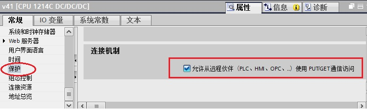{width="751" height="224"}

图1. 连接机制

在树形菜单中打开\"设备和网络\"，打开网络视图点击CPU 1214C
通讯端口，在\"属性\"界面中设置通讯参数，在\"子网\"列表中可把接口连接到某一子网，设置
\"IP地址\"和\"子网掩码\"参数。简单通讯情况下，可以不用启用IP路由器，如图
2所示。

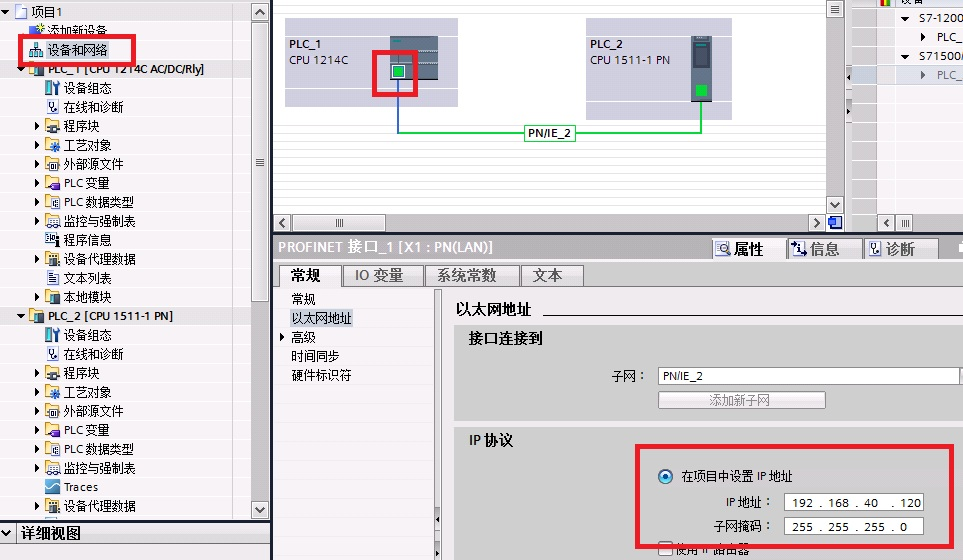{width="963" height="560"}

图 2. S7-1200通讯参数

打开项目中\"程序块\"，创建DB块，创建数据，如图 3所示。

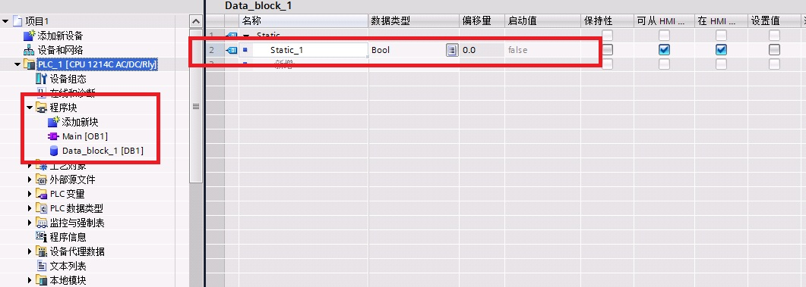{width="1061" height="379"}

图 3. 创建DB块

注意：WinCC需要读写的DB块，不能使用符号寻址，只能使用绝对寻址。所建的DB块属性中需要**取消**\"优化的块访问\"，如图
4所示。

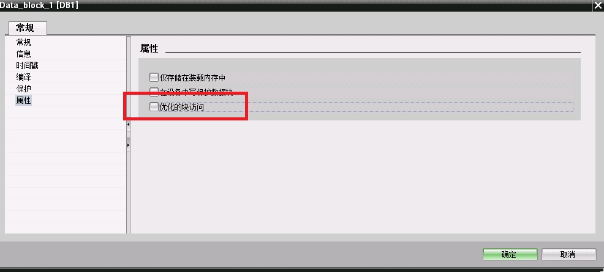{width="986" height="445"}

图4. DB块属性

编写相应的PLC程序，下载到实际硬件。

#### 2. WinCC添加新驱动

在WinCC项目中可添加此驱动，如图
5所示，打开变量管理界面，选择\"变量管理\"点击鼠标右键，选择\"添加新的驱动程序\"，在驱动列表中选择\"SIMATIC
S7-1200, S7-1500 Channel\"驱动。

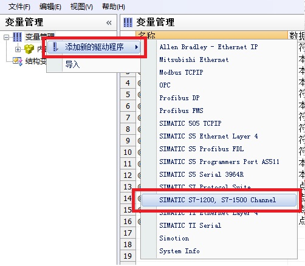{width="502" height="438"}

图 5. 添加驱动

#### 3. 电脑网卡参数设置 {#电脑网卡参数设置 style="FONT-WEIGHT: bold"}

在操作系统网络连接中设置此网卡的IP地址以及子网掩码，在此例中，IP地址和PLC的IP地址在同一样网段中，子网掩码一致，如图
6所示。

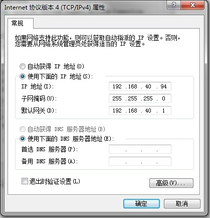{width="419" height="434"}

图 6.网卡参数

在PLC和电脑之间接入以太网通讯电缆，测试电脑与PLC之间物理连接是否正常。选择操作系统左下角\"开始\"菜单，在最下一行运行栏中输入\"CMD\"命令，然后敲回车进入DOS命令界面。在界面中输入ping命令，格式：ping
\<PLC IP地址\>
回车。如果物理连接正常如图6所示；如果显示超时或者硬件故障，请检查IP地址设置、网卡驱动以及物理网线。

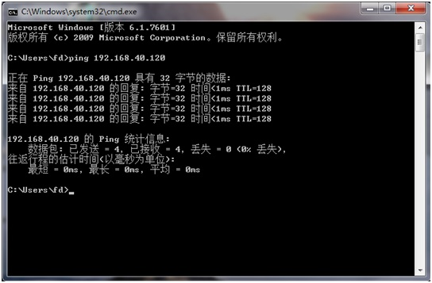{width="544" height="357"}

图 7.测试物理连接

#### 4 设置PG/PC接口

打开电脑的控制面板，选择\"设置 PG/PC
接口\"选项，在界面中点击\"应用程序访问点\"下拉列表，选择\<添加/删除\>，如图
8所示。

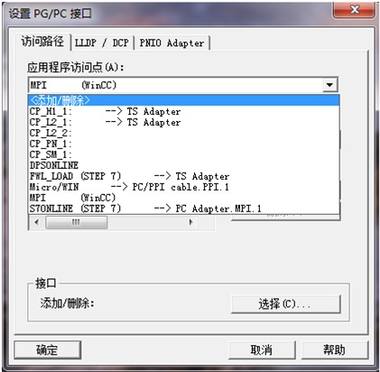{width="421" height="412"}

图 8. 设置PG/PC 接口

在弹出框中\"新建访问点\"填写\"CP-TCPIP\"，点击\"添加\"按钮添加访问点，如图
9所示，完成后关闭对话框。

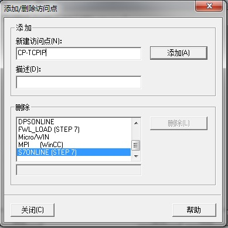{width="389" height="389"}

图 9.新建访问点

返回\"设置 PG/PC
接口\"界面，\"应用程序访问点\"选择\"CP-TCPIP\"，\"为使用的接口分配参数\"选择普通以太网卡的TCPIP协议，如图
10所示，完成后点击\"确定\"退出。

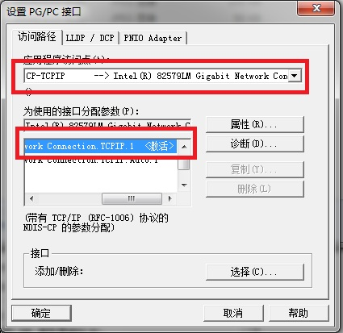{width="425" height="413"}

图 10.设置访问点

#### 5 WinCC 软件设置

鼠标右键\"SIMATIC S7-1200, S7-1500
Channel\"驱动下\"OMS+\"选项，选择\"新建连接\"新建与S7-1200
PLC的连接。右键选择连接名称，选择\"连接参数\"，如图 11所示。

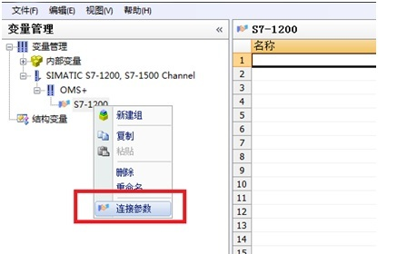{width="459" height="280"}

图 11.新建连接

连接参数中，\"IP地址\"填写PLC通讯端口的IP地址，\"访问点\"填写\"设置
PG/PC接口\"中设置的访问点，\"产品系列\"填写\" S7 1200\"，如图 12所示。

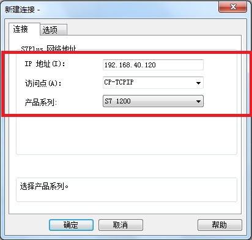{width="412" height="392"}

图 12.连接参数

在新建的连接列表中，创建对应的变量，如图 13所示。

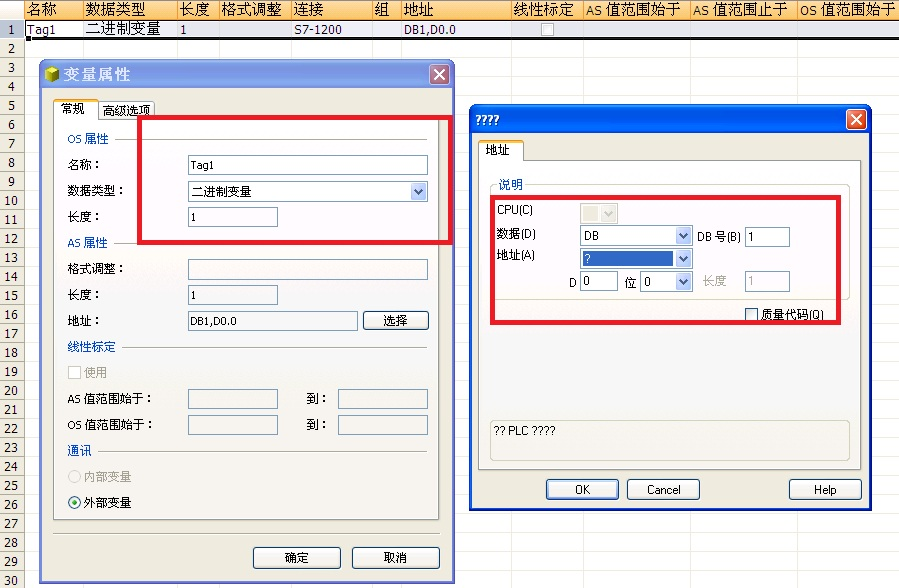{width="899" height="588"}

图 13. 创建变量

#### 6 通讯诊断

项目激活后，在变量管理界面可以直接观察到通讯是否建立，绿勾表示通讯建立，如图14所示。通讯建立后在变量管理中组态相对应的变量。

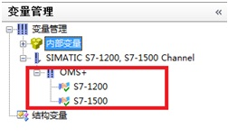{width="252" height="152"}

图 14. 变量管理诊断
