### Step7 组态PC Station 与 S7-1200 基于以太网的S7 通信

#### 硬件需求和软件需求

**硬件：**\
① S7 1200 CPU\
② PC （带普通以太网卡）\
③ TP线\
\
**软件：**\
① STEP 7 Basic V10.5\
② STEP 7 V5.4\
③ SIMATIC NET V7.1\

#### STEP7中组态PC Station

**1. 在STEP7 中新建项目,组态PC Station。**\
\
打开STEP7并新建一个项目："S7-1200_OPC",通过"Insert"\>"Station"\>"SIMATIC
PC Station"插入一个PC站,PC站的名字为："SIMATIC PC
Station(1)"。如图1所示。

[注意：]{.STYLE1}STEP7 中PC Station的名字"SIMATIC PC
Station(1)"要与SIMATIC NET 中"Station Configuration Editor"的"Station
Name"完全一致,才能保证下载成功。\
\
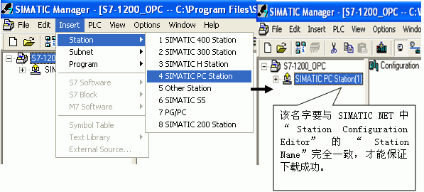{width="597" height="270"}

图1．插入并组态PC 站\
**\
2. 双击Configuration即可进入PC Station硬件组态界面。**\
\
在第一个槽中,从"SIMATIC PC Station"\>"User Application"\>"OPC
Server"下,选择版本"SW V6.2 SP1"添加一个OPC Sever 的应用。\
　　 在第三个槽中,从"SIMATIC PC Station" \>"CP Industrial Ethernet"\>"IE
General"下,选择版本"SW V6.2 SP1"添加一个 IE General,并设置IP
地址,如图2所示。\
\
[注意：]{.STYLE1}因为使用的是普通以太网卡,所以要选择添加"IE General"。

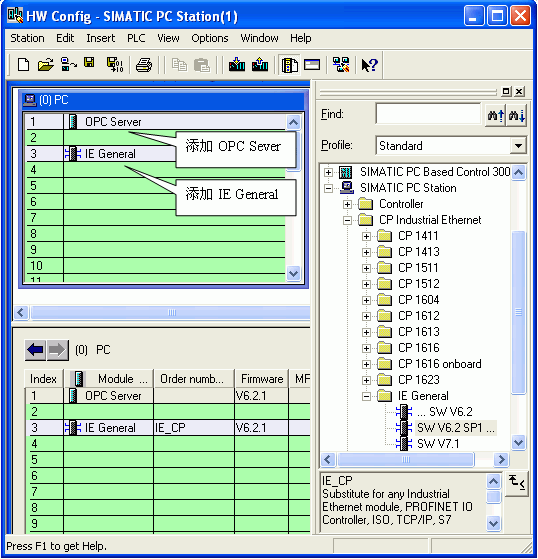{width="538" height="559"}\
\
图2．PC Station的硬件组态\
\
然后配置网卡地址并新建一个以太网,如图3所示。　　\
\
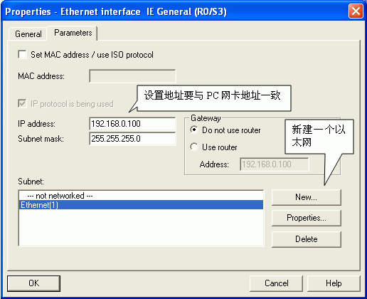{width="516" height="420"}\
\
图3．设置以太网地址\
\
完成PC站硬件组件设置后,按下编译存盘按钮,确定且存储当前组态配置。\
\
**3. 配置网络连接**\
\
通过点击工具栏右上角网络配置的图标 图：Icon
network进入网络配置,然后在NetPro网络配置中,用鼠标选择OPC
Server后,在连接表第一行鼠标右键插入一个新的连接或通过"Insert\>New
Connection"也可建立一个新连接然后定义连接属性,如图4\~图5所示。

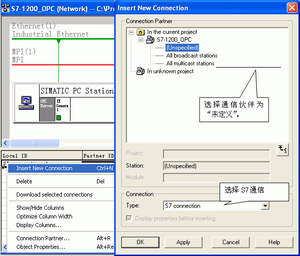{width="591" height="504"}\
\
图4．建立连接及定义连接属性\
\
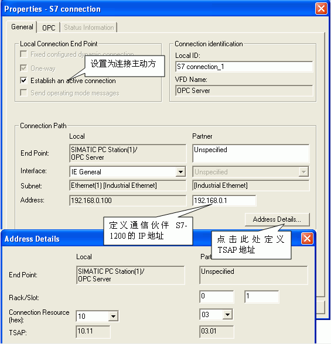{width="565" height="588"}

图5． 设置 S7 连接属性及TSAP地址Connection properties, TSAP\
\
确认完成所有配置后,已建好的S7连接会显示在连接列表中。点击编译存盘按钮或选择"Network"\>"Save
and Compile",如得到No
error的编译结果,则正确组态完成。这里编译结果信息非常重要,如果有错误信息（error
Message）,说明组态不正确,是不能下载到PC Station中的。\
成功编译完成后,在STEP7中的所有PC Station的硬件组态就完成了。

### 创建一个虚拟的PC Station硬件机架

通过"Station Configuration Editor"创建一个虚拟的PC
Station硬件机架,以便在STEP7中组态的PC Station 下载到这个虚拟的PC
Station硬件机架中去。\
\
**1.** **进入PC Station硬件机架组态界面**\
\
点击右下角的图标 Icon PC Station,进入PC Station硬件机架组态界面。\
\
**2. 添加OPC Server**

选择第一号插槽,点击Add按钮或鼠标右键选择添加,在添加组件窗口中选择OPC
Server,如图6所示。\
\
{width="561" height="589"}\
\
图6． 插入OPC Server\
\
**3. 添加组件窗口中选择IE General**

选择第三号插槽,点击Add按钮或鼠标右键选择添加,在添加组件窗口中选择IE
General,如图7所示。\
\
{width="543" height="592"}\
\
图7．插入IE General insert IE general\
\
[注意：]{.STYLE1}STEP7 中的PC Station硬件组态与虚拟PC
Station硬件机架的名字、组件及"Index"必须完全一致。\
\
**4.** **网卡参数配置**

插入IE General后,随即会弹出组件属性对话框。点击Network
Properties,进行网卡参数配置,如图8所示。\
\
{width="465" height="217"}\
\
图8．进入PC 网卡参数设置\
\
选择本地连接,通过右键菜单进入属性,如图9所示。\
\
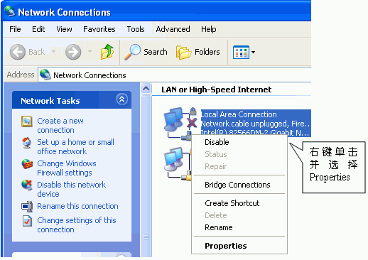{width="518" height="366"}\
图9．选择本地连接local properties\
\
选择TCP/IP属性,如图10所示。\
\
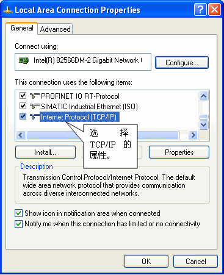{width="367" height="451"}\
\
图10．进入TCP/IP 属性Internet properties\
\
定义网卡地址,如图11所示。

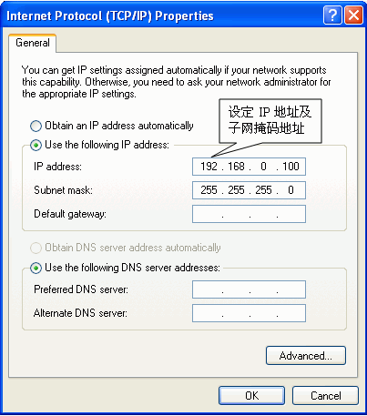{width="403" height="457"}\
\
图11．置网卡地址PC IP\
\
**5. 命名PC Station**\
\
这里的"PC Station"的名字一定要与STEP 7硬件组态中的"PC
Station"的名字一致,如图12所示。\
\
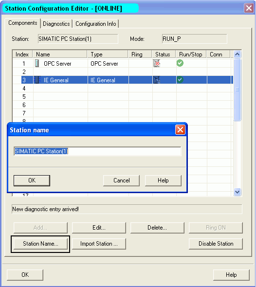{width="526" height="590"}\
\
图12．命名PC STATION Station name

### 下载PC Station硬件组态及网络连接

**1. 设置PG/PC 接口**

在STEP7 软件中,通过"Options"\>"Set PG/PC
Interface"进入设置界面,如图13所示。

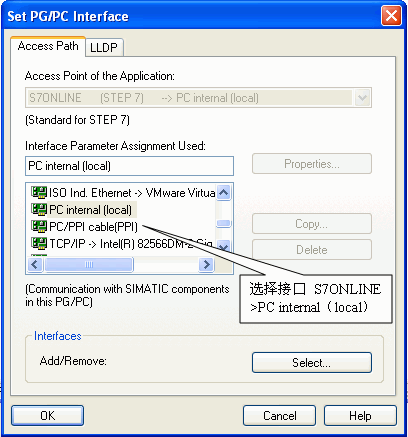{width="408" height="437"}\
\
图1．设置PG/PC接口PC internal\
\
**13. 检查配置控制台**\
\
通过"start"\>"Simatic"\>"SIMATIC NET"\>"Configuration
Console"进入配置控制台检查,如图14所示。

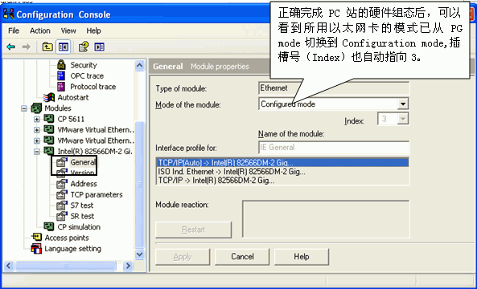{width="593" height="360"}

图14．配置控制台\
\
[注意：]{.STYLE1}对于Simatic Net
V6.1或V6.0版本的软件,需要在上面窗口中,手动将模块模式（Mode of the
module）从PG模式切换到组态模式（Configured
mode）,并设置Index号。然后再在Station Configuration Editor中添加硬件。\
\
**3. 在STEP7的硬件配置中下载PC Station组态。**\
\
**4. 在网络配置中将配置好的连接下载到PC Station中。**\
\
下载完成后在"Station Configuration
Editor"中状态显示,如图15所示。在编程过程中,可以根据这些状态显示进行判断组态是否正确。\
\
{width="530" height="260"}

图15．下载完成后的状态Station Editor online

### 使用 OPC Scout 测试 S7 OPC Sever

SIMATIC NET自带OPC Client端软件 OPC
Scout,可以使用这个软件测试所组态的OPC
Sever。通过点击左下角的"Start"\>"Simatic"\>"SIMATIC NET"\>"OPC
Scout"启动进行测试。\
\
**1. 新建变量组**

双击OPC.SimaticNET,新建一个组并输入变量组的名称,例如S7-1200
。如图16所示。\
\
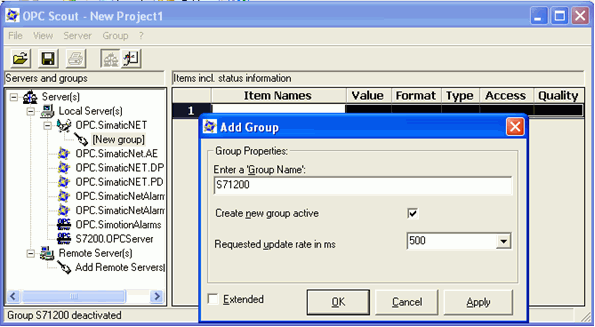{width="595" height="327"}\
\
图16． 创建一个新的变量组\
\
**2. 添加变量**

选择一个数据,点击"S7:"\>"S7 connection_1"\>"objects"\>"M"\>"New
Definition"来添加一个变量,并为变量选择数据类型、起始地址、数据长度,并添加到右侧窗口中。如图17所示。\
\
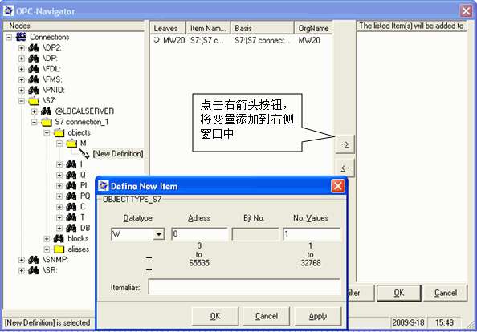{width="594" height="414"}\
\
图17． 添加变量

[{width="15"
height="15"}注意：]{.STYLE2}如果访问数据为DB块,在创建DB块时不能勾选"Symbolic
access only(仅符号寻址）",单方S7通信只支持绝对寻址的DB块。\
\
**3. 观察通信结果及质量,如图18所示。**\
\
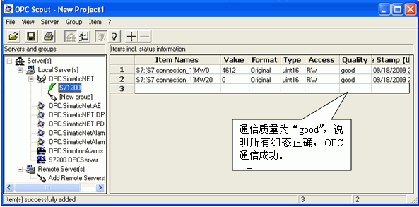{width="593" height="293"}\
\
图18．检查通信结果\
\
[{width="15"
height="15"}注意：]{.STYLE2}如果通信质量为"bad",则说明通信失败,需要检查软件组态及硬件连接是否正确。

### 常见问题

{width="15" height="15"} **如何在 OPC Scout 中添加 DB
区数据变量？**

答：在 OPC Scout中添加变量时,DB 数据没有添加变量的选项,如图19所示。

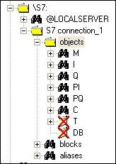{width="164" height="231"}

图19．无法添加 DB 数据

如果要添加数据区需要先添加 I 区或 M 区数据,然后修改成 DB
区数据,添加步骤如图20所示。

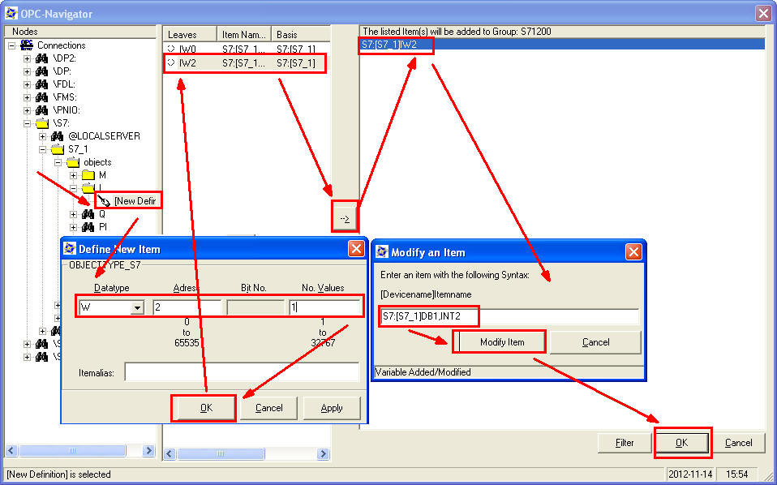{width="958" height="598"}

图20.在 OPC Scout中添加 DB 数据的步骤

观察 DB 通信结果及质量，如图21所示。

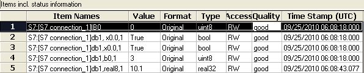{width="596" height="120"}

图21. 观察 DB 通信结果及质量

**{width="15" height="15"} 如何在 OPC Scout
中添加不同数据类型的 DB?**

答: 添加不同 DB 数据类型的表达形式如下：

BOOL ：DB1,X0.0,1

BYTE : DB1,B10,1

WORD : DB1,W20,1

DWORD: DB1,D30,1

INT : DB2,INT40,1

DINT : DB2,DINT50,1\
\
REAL ：DB2,REAL60,1

{width="15" height="15"} **在 OPC Scout
中为什么可以访问到 I,Q,M 等数据,却唯独不能与 DB 通信?**

答:
在创建DB块时,缺省的属性设置为**\"只支持符号寻址\"**,这就造成OPC无法访问
DB
的绝对地址,造成通信错误。为了避免通信错误,创建DB块时,一定不要勾选**\"只支持符号寻址\"**。正确的设置如图22所示。

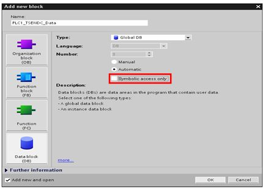{width="430" height="308"}

图22. 取消勾选\"Symbolic access only\"
