### TIA Portal 组态PC Station 与 S7-1200 基于以太网的S7 通信

#### 硬件需求和软件需求

**硬件：**\
① S7 1200 CPU (6ES7 212-1HD30-0XB0) V2.2\
② PC （带普通以太网卡）\
③ TP线(网线）\
\
**软件：**\
① STEP 7 PRO V11 SP2 UPDATE4\
② SIMATIC NET V7.1 SP2

#### TIA V11 中组态PC Station

**1．在 TIA V11 中新建项目，组态PC Station。**\
\
打开 TIA V11 并新建一个项目："S7-1200_OPC"，通过"添加新设备"\>"PC
系统"\>"常规PC"插入一个PC站，PC站的名字为："SIMATIC PC
Station(1)"。如图1所示。

[注意：]{.STYLE1}TIA V11 中PC Station的名字"SIMATIC PC
Station(1)"要与SIMATIC NET 中"Station Configuration Editor"的"Station
Name"完全一致，才能保证下载成功。\
\
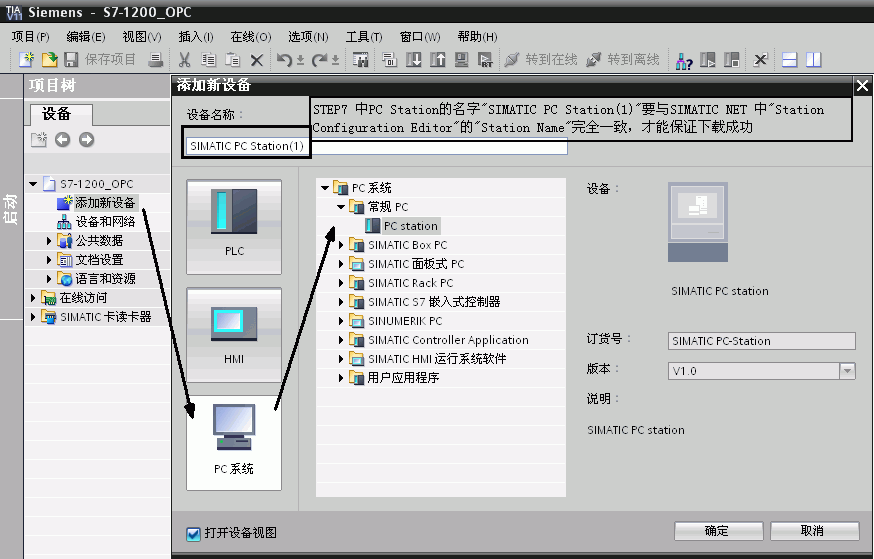{width="874" height="559"}

图1．插入并组态PC 站\
**\
2． 双击"设备组态"即可进入PC Station硬件组态界面。**\
\
在第一个槽中，从"用户应用程序"，选择"OPC服务器"添加一个OPC Sever
的应用。\
在第三个槽中，从"通讯模块" \>"PROFINET/以太网"下，选择IE
General，并设置IP 地址，如图2所示。\
\
[注意：]{.STYLE1}因为使用的是普通以太网卡，所以要选择添加"IE General"。

通过选中
"OPC服务器"\--\>右键\--\>选中"更改设备类型"，可选择其他版本OPC服务器,

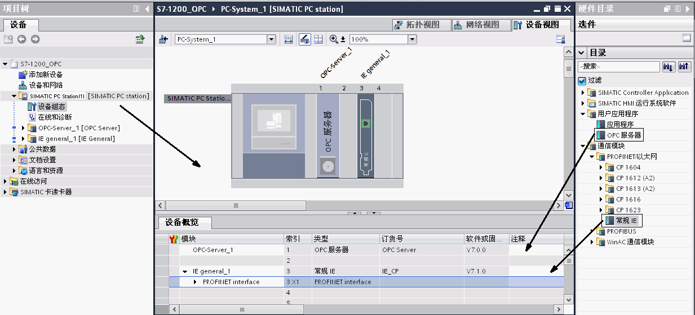{width="1233" height="561"}\
图2．PC Station的硬件组态

然后配置网卡地址并新建一个以太网，如图3所示。　　\
\
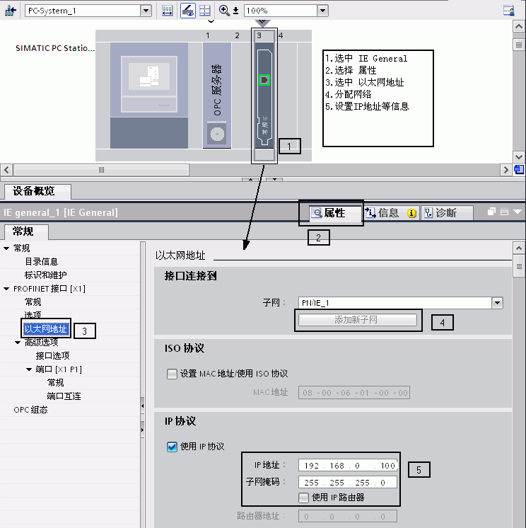{width="744" height="746"}\
\
图3．设置以太网地址\
\
完成PC站硬件组件设置后，按下编译存盘按钮，确定且存储当前组态配置。\
\
**3． 配置网络连接**\
\
通过点击"网络视图"的图标，进入网络配置，然后在网络视图设置连接，添加S7连接，详见图4中的1\~5步所示。

直接选中S7-1200PLC 建立S7连接

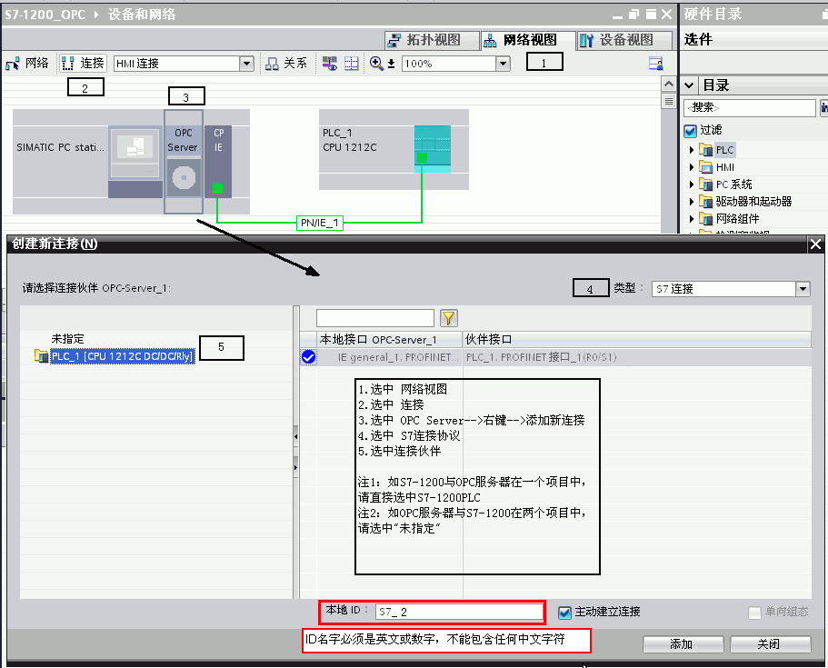{width="911" height="735"}\
\
图4．建立连接及定义连接属性

添加完成连接后，在连接视图中将会有连接指示，如图5上半部分。

通过选中"未指定"方式配置连接参数\
\
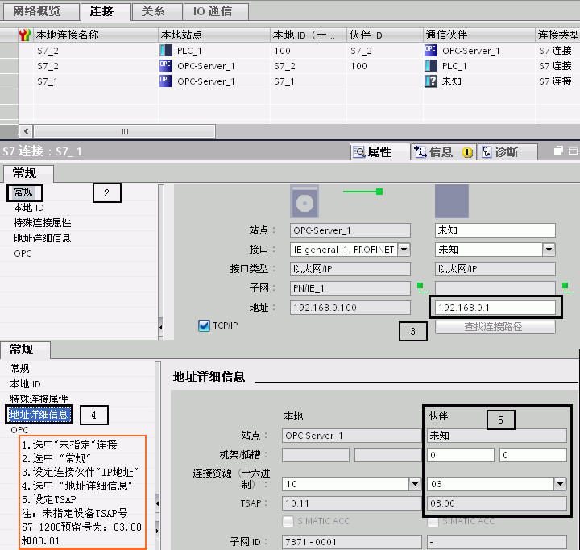{width="720" height="683"}

图5． 设置 S7 连接属性及TSAP地址Connection properties， TSAP\
\
确认完成所有配置后，已建好的S7连接会显示在连接列表中。点击编译存盘按钮或选择"Network"\>"Save
and Compile"，如得到No
error的编译结果，则正确组态完成。这里编译结果信息非常重要，如果有错误信息（error
Message），说明组态不正确，是不能下载到PC Station中的。\
成功编译完成后，在 TIA V11中的所有PC Station的硬件组态就完成了。

### 创建一个虚拟的PC Station硬件机架

通过"Station Configuration Editor"创建一个虚拟的PC
Station硬件机架，以便在 TIA V11 中组态的PC Station 下载到这个虚拟的PC
Station硬件机架中去。\
\
**1.** **进入PC Station硬件机架组态界面**\
\
点击右下角的图标 Icon PC Station{width="177"
height="30"}，进入PC Station硬件机架组态界面。\
\
**2. 添加OPC Server**

选择第一号插槽，点击Add按钮或鼠标右键选择添加，在添加组件窗口中选择OPC
Server，如图6所示。\
\
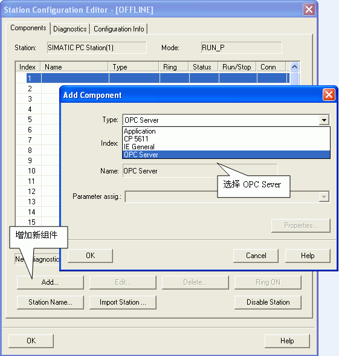{width="561" height="589"}\
\
图6． 插入OPC Server\
\
**3. 添加组件窗口中选择IE General**

选择第三号插槽，点击Add按钮或鼠标右键选择添加，在添加组件窗口中选择IE
General，如图7所示。\
\
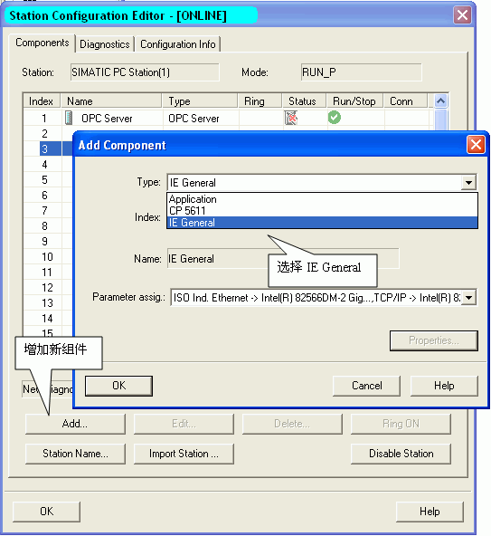{width="543" height="592"}\
\
图7．插入IE General insert IE general\
\
[注意：]{.STYLE1}TIA V11 中的PC Station硬件组态与虚拟PC
Station硬件机架的名字、组件及"Index"必须完全一致。\
\
**4.** **网卡参数配置**

插入IE General后，随即会弹出组件属性对话框。点击Network
Properties，进行网卡参数配置，如图8所示。\
\
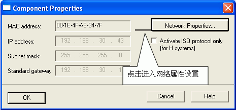{width="465" height="217"}\
\
图8．进入PC 网卡参数设置\
\
选择本地连接，通过右键菜单进入属性，如图9所示。\
\
{width="518" height="366"}\
图9．选择本地连接local properties\
\
选择TCP/IP属性，如图10所示。\
\
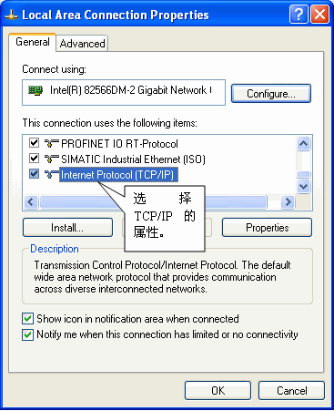{width="367" height="451"}\
\
图10． 进入TCP/IP 属性Internet properties\
\
定义网卡地址，如图11所示。

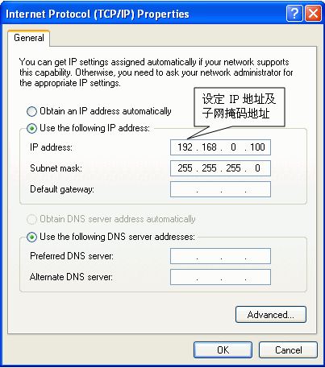{width="403" height="457"}\
\
图11．置网卡地址PC IP\
\
**5. 命名PC Station**\
\
这里的"PC Station"的名字一定要与 TIA V11 硬件组态中的"PC
Station"的名字一致，如图12所示。\
\
{width="526" height="590"}\
\
图12．命名PC STATION Station name

### 下载PC Station硬件组态及网络连接

**1．下载硬件组态及网络连接**

在 TIA V11软件中，通过选中 "下载" 图标，进入设置界面，如图13所示。

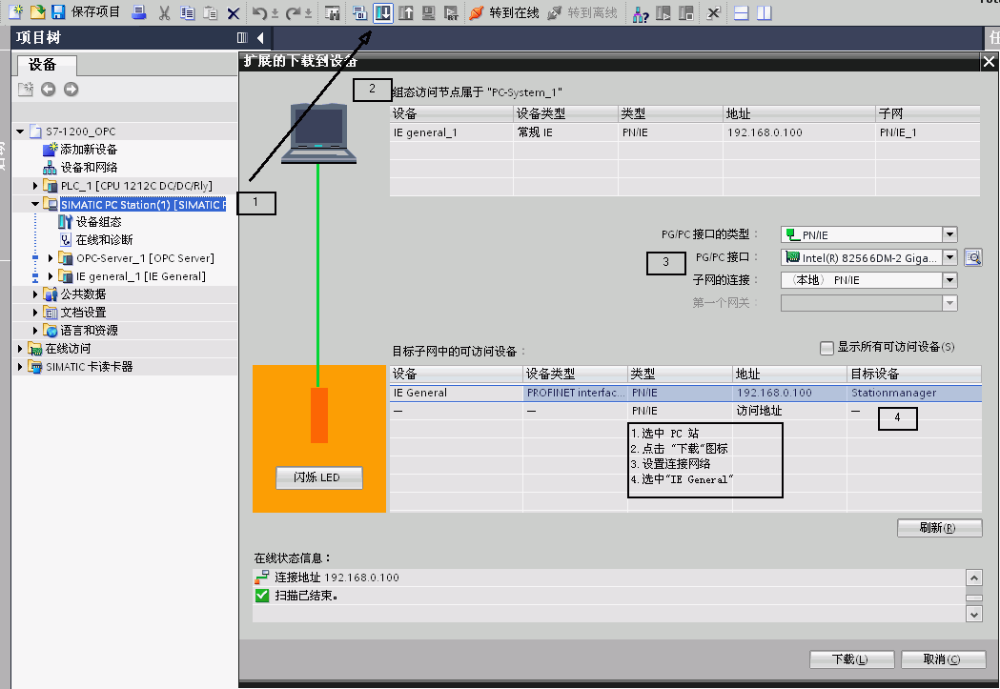{width="1049" height="723"}\
\
图13．设置下载页面\
\
**2．在 TIA V11 将硬件配置及网络连接下载到"Station Configuration
Editor"。**\
\
**3．网络已经建立成功标识。**\
\
下载完成后在"Station Configuration
Editor"中状态显示，如图14所示。在编程过程中，可以根据这些状态显示进行判断组态是否正确。\
\
{width="530" height="260"}

图14．下载完成后的状态Station Editor online

### 使用 OPC Scout 测试 S7 OPC Sever

SIMATIC NET自带OPC Client端软件 OPC
Scout，可以使用这个软件测试所组态的OPC
Sever。通过点击左下角的"Start"\>"Simatic"\>"SIMATIC NET"\>"OPC
Scout"启动进行测试。\
\
**1．新建变量组**

双击OPC.SimaticNET，新建一个组并输入变量组的名称，例如S7-1200
。如图15所示。\
\
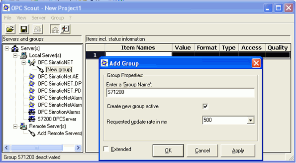{width="595" height="327"}\
\
图15． 创建一个新的变量组\
\
**2．添加变量**

选择一个数据，点击"S7:"\>"S7 connection_1"\>"objects"\>"M"\>"New
Definition"来添加一个变量，并为变量选择数据类型、起始地址、数据长度，并添加到右侧窗口中。如图16所示。\
\
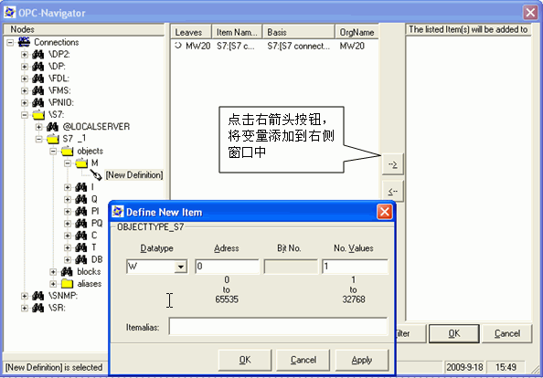{width="594" height="414"}\
\
图16． 添加变量

[{width="15"
height="15"}注意：]{.STYLE2}如果访问数据为DB块，在创建DB块时必须选择
"与S7-300/400兼容类型"，不能选择"已优化\"方式（符号寻址），单方S7通信只支持绝对寻址的DB块。\
\
**3． 观察通信结果及质量，如图17所示。**\
\
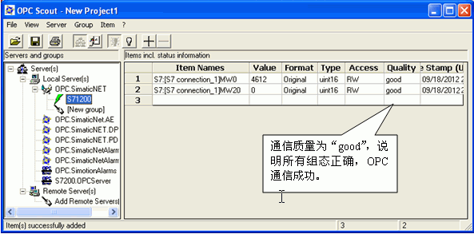{width="593" height="293"}\
\
图17．检查通信结果\
\
[{width="15"
height="15"}注意：]{.STYLE2}如果通信质量为"bad"，则说明通信失败，需要检查软件组态及硬件连接是否正确。

### 常见问题

{width="15" height="15"}**如何在 OPC Scout 中添加 DB
区数据变量？**

答：在 OPC Scout中添加变量时，DB 数据没有添加变量的选项，如图18所示。

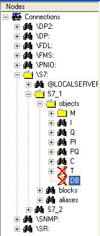{width="167" height="392"}

图18．无法添加 DB 数据

如果要添加数据区需要先添加 I 区或 M 区数据,然后修改成 DB
区数据，添加步骤如图19所示。

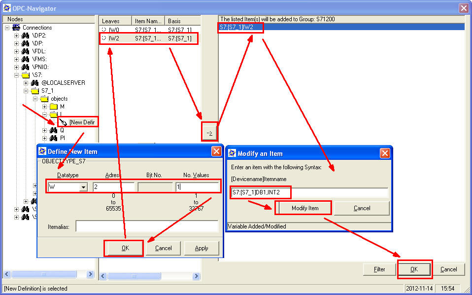{width="958" height="598"}

图19.在 OPC Scout中添加 DB 数据的步骤

观察 DB 通信结果及质量，如图20所示。

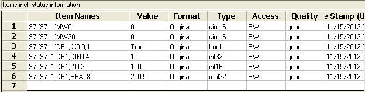{width="624" height="157"}

图20. OPC scout数据监控

S7-1200 DB块监控状态，如图21所示。

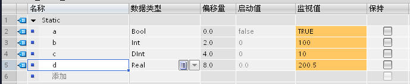{width="689" height="142"}

图21. DB 结果及质量

**{width="15" height="15"} 如何在 OPC Scout
中添加不同数据类型的 DB?**

答: 添加不同 DB 数据类型的表达形式如下：

BOOL ：DB1，X0.0，1

BYTE : DB1，B10，1

WORD : DB1，W20，1

DWORD: DB1，D30，1

INT : DB2,INT40,1

DINT : DB2,DINT50,1\
\
REAL ：DB2，REAL60，1

{width="15" height="15"} **在 OPC Scout
中为什么可以访问到 I,Q,M 等数据,却唯独不能与 DB 通信?**

答: 在创建DB块时,缺省的属性设置为**\"只支持符号寻址\"即"已优化"**
,这就造成OPC无法访问 DB
的绝对地址,造成通信错误。为了避免通信错误，创建DB块时，一定不要勾选**\"只支持符号寻址\"**。正确的设置如图22所示。

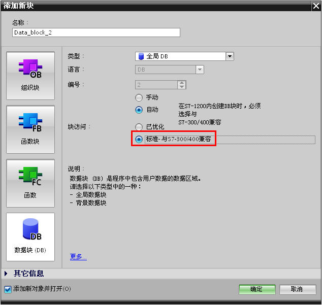{width="634" height="601"}

图22. 选择 标准-与S7-300/400兼容
