### SIMATIC NET 作为 OPC UA 服务器与 S7-1200 基于以太网的S7通信

#### 硬件需求和软件需求

表1.硬件和软件要求\

             组件                                   支持版本                 例中使用
  ---------- -------------------------------------- ------------------------ ---------------------------------------------
  硬件部分   S7-1200 各型号CPU                      V4版本及以上             例中使用：S7-1217C V4.4版本
  软件部分   TIA Portal STEP 7 Basic/Professional   V13及以上                例中使用：TIA Portal STEP7 V16 Professional
             SIMATIC NET                            SIMATIC NET V12 及以上   例中使用： SIMATIC NET V16

**{width="15" height="15"}** 这种组态方式可以实现 OPC
UA 客户端通过 SIMATIC NET 访问 S7-1200 CPU
[**优化的数据块**]{.underline}，要求：

**1. 通信双方站点必须在同一项目内组态**

**2. S7连接伙伴方必须设置为指定的伙伴**

**3. 软件版本要求见表1**

如果不满足其中任意条件，则只能实现 OPC UA 客户端 或者 OPC DA 客户端通过
SIMATIC NET 访问 S7-1200 CPU 的非优化数据块，具体参见链接：[STEP 7
组态](01-Step7.html)、[TIA PORTAL组态](02-TIA.html)、[PC
ACCESS组态](03-PC_Access.html)。

具体步骤可参考下文描述。

#### 一、TIA STEP7 V16中组态S7-1200 站点

**1.新建项目PLC站点并设置IP地址**

使用 TIA Portal软件，创建S7-1200 CPU版本为V4.4的站点，如图1所示。\
{width="705" height="693"}-\
[图1.]{.STYLE1}添加新设备

为CPU分配新子网并设置IP地址，如图2所示。\
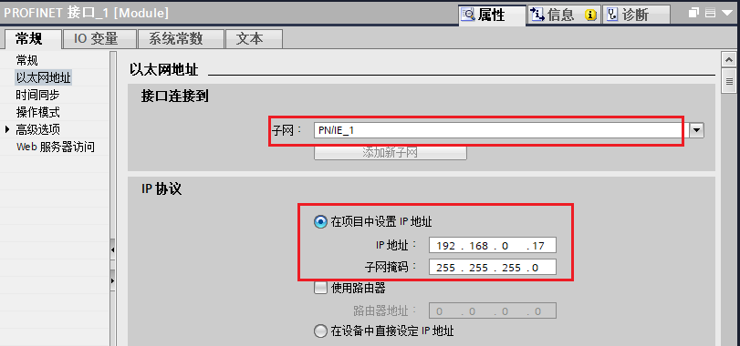{width="811" height="380"}-\
[图2.]{.STYLE1}设置子网以及IP

**2.新建全局DB块并设置属性**

新建全局DB "数据块_1
DB1"将其重命名为\"ABC\"，如图3所示（DB块属性优化/非优化均可）。\
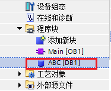{width="187" height="154"}-\
[图3.]{.STYLE1}新建全局DB块

双击打开DB1，建立DB块变量，并设置初始值，下图中因为是优化的DB块，所以各变量没有绝对地址，只有符号名，如图4所示。\
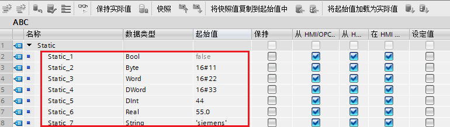{width="770" height="218"}-\
[图4.]{.STYLE1}新建DB块内变量

#### 二、**在同一项目中组态PC Station**

**1.新建PC 站点**

在同一项目中通过"添加新设备"→"PC系统"→"常规PC"
插入一个PC站，PC站名称为"PC station"，图5所示。\
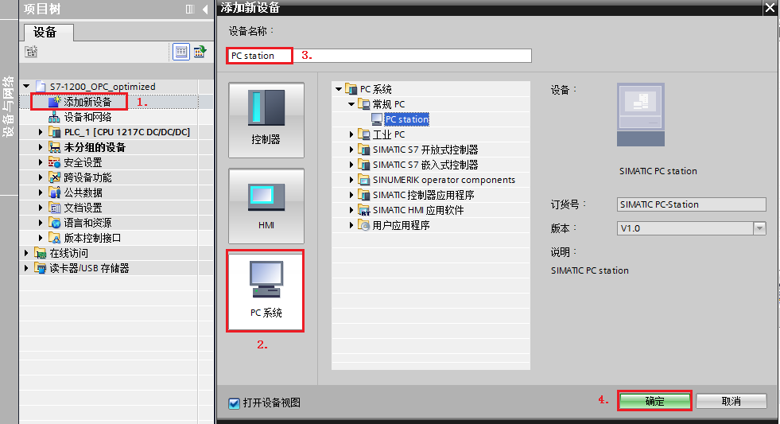{width="981" height="533"}-\
[图5.]{.STYLE1}添加PC Station

双击项目树"设备组态"即可进入PC
Station硬件组态界面，从右侧"硬件目录"添加相关组件：

从"用户应用程序"→"OPC服务器" 添加一个OPC 服务器的应用（OPC
服务器的版本必须小于等于安装的SIMATIC NET版本）。

从"通信模块"→"PROFINET/Ethernet"选择"常规IE"（因为选择普通以太网卡，所以选择"常规IE"），如图6所示。

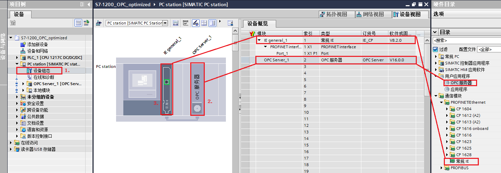{style1\"=""} 图6.PC Station的硬件组态

**2.设置"常规IE" IP地址**

选择\"常规IE\"，在其属性对话框内找到"以太网地址"将接口连接到之前S7-1200建立的子网"PN/IE_1"，并设置IP地址，如图7所示。

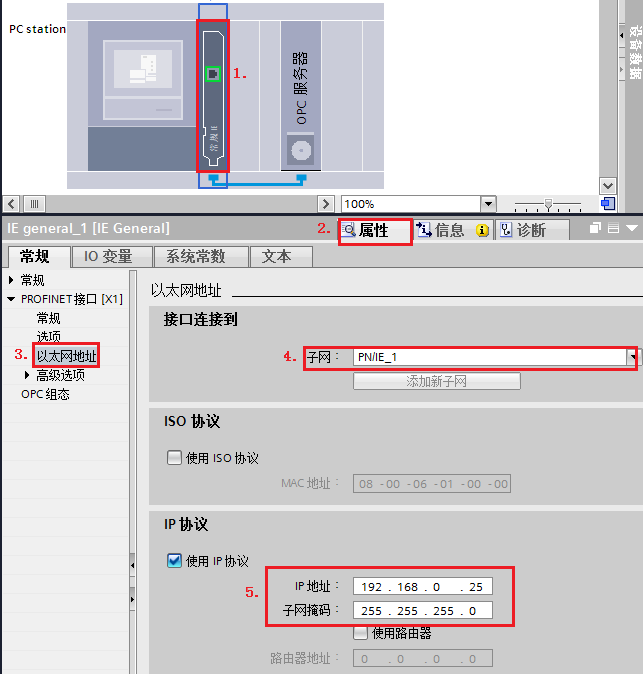\
[图7.]{.STYLE1}设置"常规IE" IP地址

{width="15" height="15"}
注意，上图中设置的IP地址是最终作为OPC UA服务器的电脑的IP，如图8所示。\
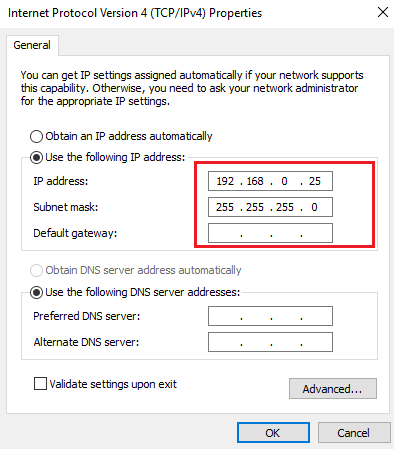\
[图8.]{.STYLE1}计算机以太网地址

**3.设置\"OPC服务器\" 参数**

选择"OPC 服务器"，打开其"属性"对话框，选择"S7"→"OPC
符号"→"全部"，如图9所示。\
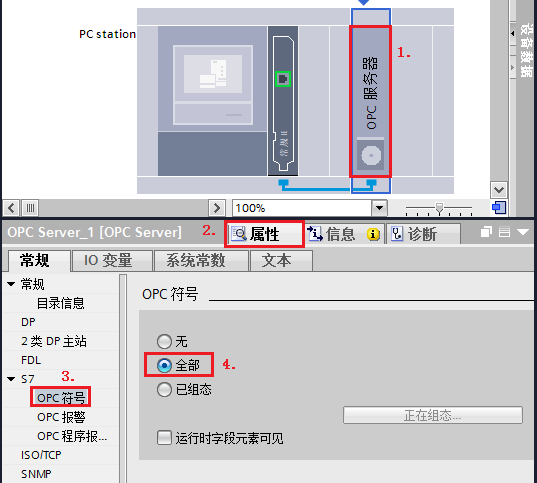\
[图9.]{.STYLE1}设置OPC 符号属性

{width="15" height="15"}
注意！选择\"OPC服务器\"→右键→选中\"更改设备\"，可以选择其他版本OPC服务器。

**4. 配置网络连接**

通过点击"网络视图"的图标。进入网络配置，然后在网络视图设置连接，添加S7连接。如图10所示。\
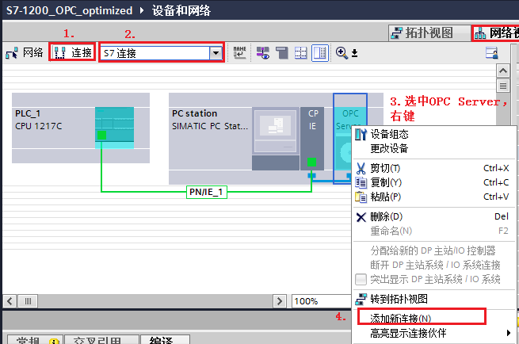\
[图10.]{.STYLE1}添加S7连接_1

在弹出的"添加新连接"对话框内。确认连接类型为"S7连接"后，选择S7-1200站点
"PLC_1"，点击"添加"，然后点击"关闭"，如图11所示。\
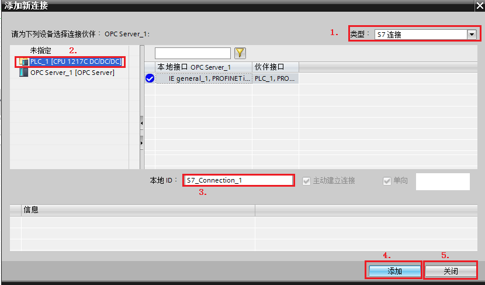\
[图11.]{.STYLE1}添加S7连接_2

设置完毕以后，可以看到在S7-1200与PC
Station之间已经建立S7连接，可以找到该连接查看其属性，因为是指定伙伴的S7连接，连接相关参数会自行匹配，见表2所示。

表2.S7 Connection 连接参数\

  -----------------------------------------------------------------------
  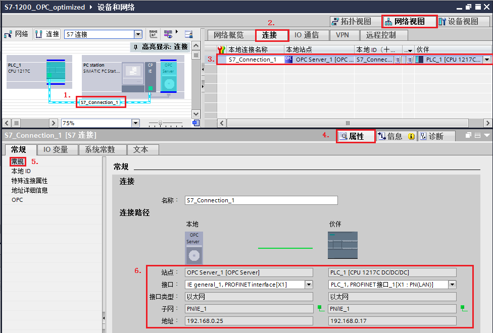
  -----------------------------------------------------------------------
  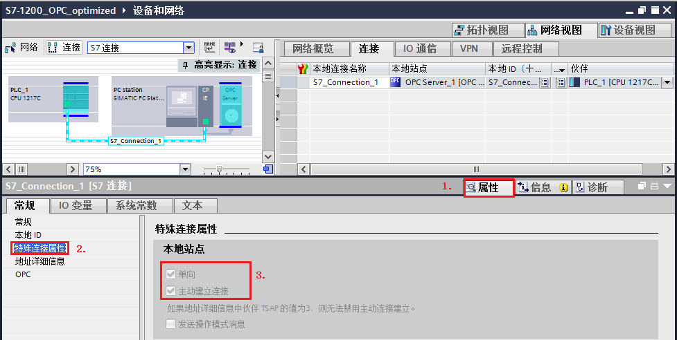\

  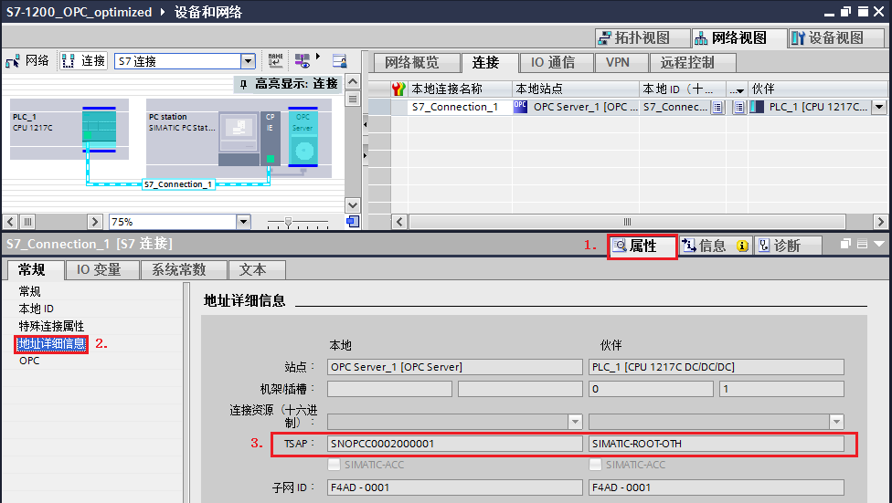\
  -----------------------------------------------------------------------

连接建立成功后，编译，并且将当前项目保存。分别将PLC程序与PC
Station组态下载。PLC下载程序此处不再赘述，下面介绍PC Station的下载步骤。

**5. PC Station组态下载**

在TIA Protal "设备视图"内。选择"PC Station
站点"，在其属性对话框内，"SIMATIC PC Station " →"XDB组态"
→勾选"生成XDB文件"，并点击"浏览"设置文件存储路径。

路径设置完毕后，点击软件上方的\"编译\"按钮。就可以在设置路径内保存该XDB文件。
如图12所示。\
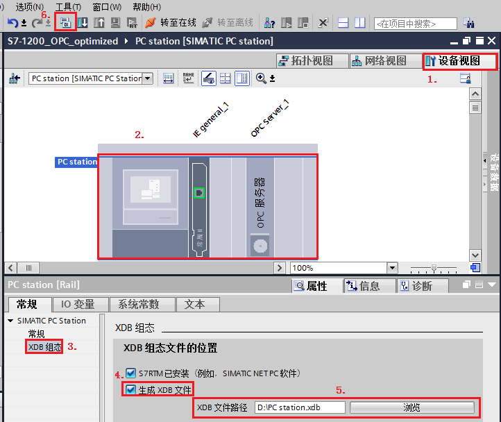\
[图12.]{.STYLE1}生成XDB文件

将生成的XDB文件导入至\"Station Configurator\"内，具体步骤见表3。

表3.导入XDB文件\

  ------------------------------------------------ -----------------------------------
  (1).双击桌面\"Station                            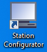
  Configurator\"快捷方式打开\"\"Station            
  Configurator Editor\"对话框                      

  (2).点击右图中\"Import                           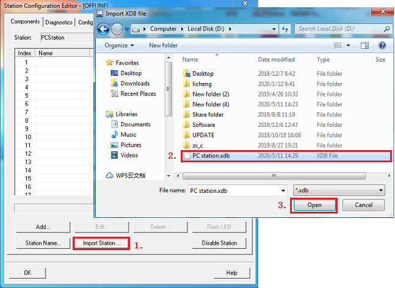\
  Station\"按钮，选择路径，导入图12保存的XDB文件   

  (3).提示信息，点击\"OK\"即可                     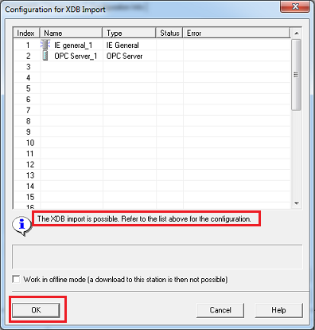\

  (4).导入成功，并且可以看到\"IE general\"与\"OPC  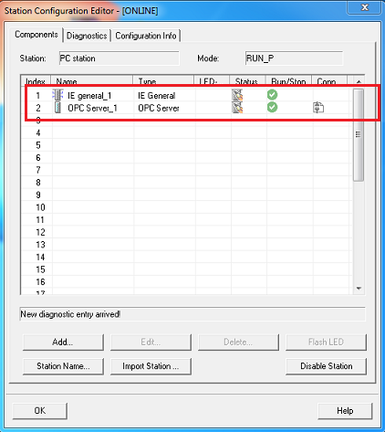\
  Server\"均处于Run，并且Conn状态正常。            

                                                   
  ------------------------------------------------ -----------------------------------

到这里，PC Station的下载就结束了。

#### 三、使用OPC Scout V10测试通信结果

**1.添加OPC UA Server站点**

1.点击电脑左下角的\"Start\"→\"All Programs\"→\"Siemens
Automation\"→\"SIMATIC\"→\"SIMATIC NET\"→\"OPC Scout
V10\"(或者直接在Start里搜索 OPC Scout V10)，启动OPC Scout
V10。如图13所示。\
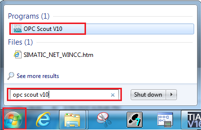\
[图13.]{.STYLE1}启动OPC Scout V10

打开OPC Scout V10，在 Server explorer窗口，查找UA server→Local UA
Server→OPC.simaticNET.S7OPT，找到本地UA服务器，如图14所示。\
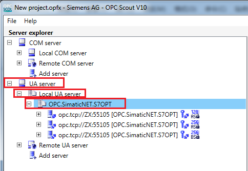\
[图14.]{.STYLE1}添加OPC UA 服务器_1

此处以第二种加密算法为例，连接UA 服务器，双击该服务器，在弹出的"User
authentication change"对话框内设置如图15所示。\
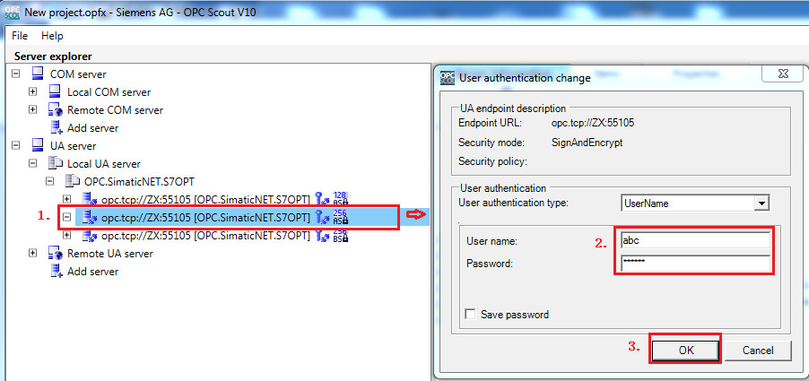\
[图15.]{.STYLE1}添加OPC UA 服务器_2

{width="15"
height="15"}注意！上图中步骤2的用户名和密码为本计算机登陆的用户名和密码。

**2.访问OPC UA Server数据**

正常连接服务器后，查找"Objects"→"SYM"→"S7-1200 station_1
"→"PLC_1"，找到S7-1200里创建的DB块变量，然后将其拖拽至右下方"Data View
1"，点击"Monitoring On"监视，如果需要写操作也可以直接在"New
Value"处填写新值，然后点击"Write"按钮，即可执行写操作，如图16所示。\
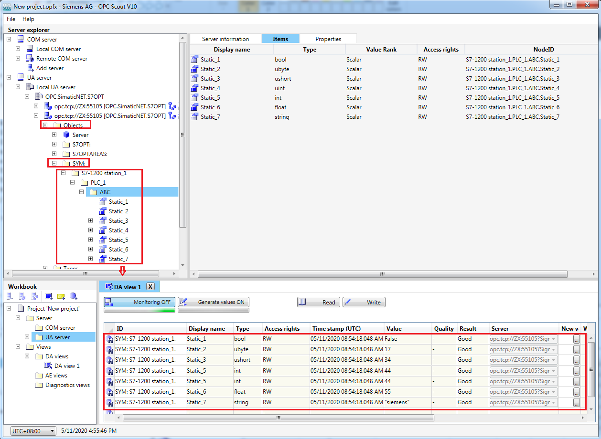\
[图16.]{.STYLE1}访问 UA server数据

#### 常问问题

{width="15" height="15"}1.
如上文图15所示，为什么必须经过用户登录才能进行数据访问？

是否需要用户登录取决于 SIMATIC NET的OPC
服务器的安全策略内的\"登录设置\"参数。

用户可以在电脑左下角的\"Start\"→\"All Programs\"→\"Siemens
Automation\"→\"SIMATIC\"→\"SIMATIC NET\"→\"Communication
Settings\"(或者直接在Start里搜索 Communication
Settings)，启动Communication Settings。

如图17所示，确认\"OPC 设置\"→\"OPC协议选择\"→\"S7
已优化\"→\"登录设置\"→\"允许匿名登录到OPC UA服务器\"是否勾选。\
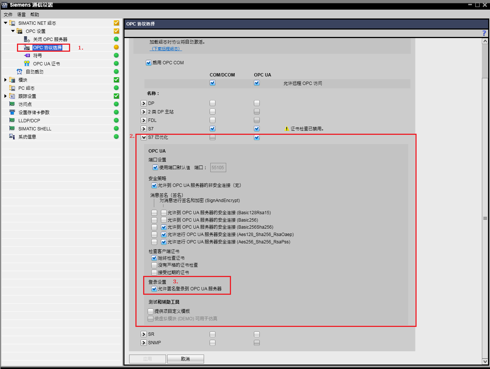\
图17.Communication Settings设置

如果勾选\"允许匿名登录到OPC
UA服务器\"，则在连接服务器时会出现匿名访问的选项，如下图所示，此时不需要用户登录就可以访问服务器。但是如果需要用户登录，则登录锁使用的用户名与密码为本计算机登陆的用户名和密码。\
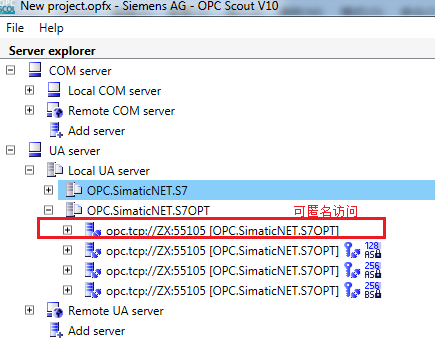\
图18.OPC UA服务器登录权限

{width="15" height="15"}2.
通信正常时，某些变量突然无法正常访问？

用户在运行过程中对原有变量修改变量名称、数据类型，对原有的DB块修改DB号，以及后期增加的变量，均无法正常访问（虽然已经设置OPC符号为全部（如上图9所示））。解决方法需要重新编译导入XDB文件。
