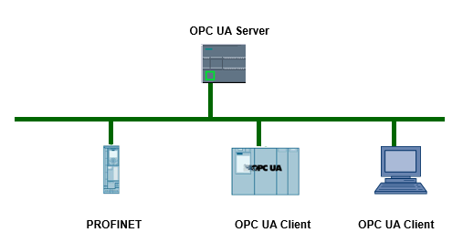

### OPC UA 功能概述 

#### 什么是 OPC UA？

标准 OPC 仅支持 Windows 操作系统。为了应对这一限制条件，OPC Foundation
研发出了 OPC UA（OPC 统一架构）标准。

OPC UA 标准并不特定于某个平台，并且针对高性能应用使用优化的基于 TCP
的二进制协议。\
OPC UA 支持诸如 Window、Linux、Apple OS
X、实时操作系统或移动操作系统（Android 或 iOS）。

OPC UA 目前支持以下传输机制和协议：

-   通过 TCP/IP，将消息作为二进制流直接传输 (S7-1200 支持)
-   通过 TCP/IP 和 HTTP 采用 XML
    形式传送消息。由于这种传输机制仅支持慢速传输，因此极少使用

S7-1200 基本控制器支持\"Micro Embedded Device 2017 Server Profile\"。

由于 OPC UA
标准独立于特定的操作系统，并采用安全传送机制和数据语义描述，因此尤其适合于跨层级的数据交换。机器数据（受控变量，测量值或参数）也可采用这种方式传输。

OPC UA
采用简单的客户端/服务器的机制进行通信。服务器可在网络中提供大量信息，如有关
CPU、OPC UA 服务器、数据和数据类型的信息。OPC UA 客户端访问这些信息。

{width="507" height="266"}\
[图1.]{.STYLE1} S7-1200 OPC UA通信

#### 通过 OPC UA 可以做些什么？

OPC UA 通信常用的有以下功能：

浏览

\

读/写

\

注册读/写

\

订阅

\

方法

\

伴随规范

\

#### S7-1200 支持的 OPC UA 功能

**服务器：**

S7-1200 CPU 固件版本 V4.4 及以上版本均配备 OPC UA 服务器，除了标准的
S7-1200 CPU 外，还包括 S7-1200F 系列 CPU。

浏览

\

读/写

\

订阅

\

方法（仅 V4.5 支持）

\

伴随规范

固件版本 V4.5 开始支持结构化数据类型（结构和数组）、诊断功能。

**客户端：**

S7-1200 CPU 目前不支持，具体信息可以参考表 1 描述。

[表 1.]{.STYLE1}S7-1200 OPC UA 各版本兼容性

  -------- ----------- ----------------------------------
                       S7-1200 以及 TIA Portal 最低版本
  服务器   浏览        V4.4/TIA V16
           读/写       V4.4/TIA V16
           注册读/写   \-
           订阅        V4.4/TIA V16
           方法        V4.5/TIA V17
           伴随规范    V4.4/TIA V16
           诊断        V4.5/TIA V17
  客户端   浏览        \-
           注册读/写   
           方法        
  -------- ----------- ----------------------------------

#### S7-1200 OPC UA性能参数

S7-1200 OPC UA 的性能参数，以固件版本 V4.5 为例，参考表 2 内容。

[表 2.]{.STYLE1}S7-1200 OPC UA 性能参数

  ------------------ ----------------------
                     S7-1200
  最大会话数         10（V4.4 为 5）
  最大访问变量数     2000（V4.4 为 1000）
  最大会话订阅数     50（V4.4 为 5）
  最小采样间隔       100ms
  最小发布间隔       200ms
  最大服务器接口数   2
  最大监视项         1000（V4.4 为 500）
  ------------------ ----------------------

 
