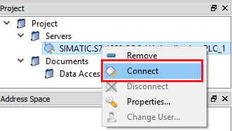

### S7-1200 作为OPC UA 服务器，UA Expert作为OPC UA 客户端

**S7-1200 CPU实现OPC UA 服务器的硬件和软件要求，如表1所示：**

表1.S7-1200 CPU实现OPC UA 服务器的硬件和软件要求\

                      组件                                  版本                 备注
  ------------------- ------------------------------------- -------------------- --------------------------------------------------------------
  硬件部分            S7-1200 各型号CPU                     V4.4版本及以上       V4.4版本的S7-1200仅支持作为OPC UA的服务器
  软件部分            TIA Porta STEP 7 Basic/Professional   V16及以上            TIA V16起才可以组态V4.4 版本的S7-1200CPU
  OPC UA 许可证授权   SIMATIC OPC UA S7-1200 Basic          6ES7823-0BA00-2BA0   纸质授权 S7-1200全系列CPU均使用该授权（一个PLC一个授权即可）
  测试客户端          Ua Expert                             [可免费下载](#ua)    

#### 一、激活S7-1200 OPC UA服务器并设置相关参数

**1.创建PLC站点并设置IP地址**

使用 TIA STEP7 V16 软件，创建S7-1200 CPU版本为V4.4的站点，如图1所示。

{width="705" height="693"}-\
[图1.]{.STYLE1}添加新设备

为CPU分配子网以及IP地址，如图2所示。

{width="811" height="380"}-\
[图2.]{.STYLE1}设置子网以及IP

**2. 启动OPC UA服务器**

进入"设备视图"，选中CPU，CPU属性 →OPC UA →服务器，勾选"激活OPC
UA服务器"，如图3所示。

\
[图3.]{.STYLE1}启动OPCUA服务器

a.激活OPC UA 服务器\
b.服务器地址：用于客户端访问服务器，激活S7-1200的OPC
UA服务器功能后，该OPC
UA服务器的地址为图中的："opc:tcp://192.168.0.17:4840"，服务器地址格式为："opc:tcp://服务器IP：服务器端口号"\

**3. 设置服务器相关参数**

CPU属性 →OPC UA →服务器 →选件 →常规
属性对话框内，可以设置端口号、最大会话超时时间，最大OPC
UA会话数量等参数，如表2所示。

表2.S7-1200 OPC UA 选件设置\

+-----------------------------------+-----------------------------------+
| OPC UA 选件 参数                  | 备注                              |
+===================================+===================================+
| \            | **端口：**设置服务器的端口号，默  |
|                                   | 认4840，允许范围：1024-49151之间  |
|                                   |                                   |
|                                   | **最大会话超时时间                |
|                                   | ：**指定在不进行数据交换的情况下  |
|                                   | OPC UA                            |
|                                   | 服务器关闭会话之前的最大时长。    |
|                                   | 默认30s，允许范围：1-600000s之间  |
|                                   |                                   |
|                                   | **最大OPC UA会话数量：**OPC UA    |
|                                   | 服务器启动并同时操                |
|                                   | 作的最大会话数。最大会话数取决于  |
|                                   | CPU                               |
|                                   | 的                                |
|                                   | 性能。截至到V4.5版本，S7-1200最大 |
|                                   | 会话数是10个（V4.4版本为5个）。\  |
+-----------------------------------+-----------------------------------+
| \            | ::: {align="left"}                |
|                                   | **服务器的订阅设置：**            |
|                                   | :::                               |
|                                   |                                   |
|                                   | **最短采样间隔：**设置 OPC UA     |
|                                   | 服务器记录 CPU                    |
|                                   | 变量值并与以前值相                |
|                                   | 比较检查是否发生变更的时间间隔。  |
|                                   |                                   |
|                                   | ::: {align="left"}                |
|                                   | **最短发布间                      |
|                                   | 隔：**变量值发生改变时服务器通过  |
|                                   | 新值向客户端发送消息的时间间隔。  |
|                                   | :::                               |
|                                   |                                   |
|                                   | **已监视项的最大数量：**指定该    |
|                                   | CPU 的 OPC UA                     |
|                                   | 服务器可同时监视值更改            |
|                                   | 的最大元素数量。监视会占用资源。  |
|                                   | 可监视元素的最大数量取决于所用的  |
|                                   | CPU。                             |
+-----------------------------------+-----------------------------------+

**4. Secure channel设置**

仅当 OPC UA 服务器可向 OPC UA
客户端证明身份时，才能建立服务器与客户端之间的安全连接。服务器证书可用于证实身份。\
CPU属性 →OPC UA →服务器 →Security →Secure
channel，在此对话框内可以设置服务器证书、服务器上可用的安全策略、以及可信客户端，如表3所示。

表3.S7-1200 Secure channel设置\

+-----------------------+-----------------------+-----------------------+
|                       | 参数                  | 备注                  |
+=======================+=======================+=======================+
| 建立服务器证书        | !                     | 激活 OPC UA           |
|                       | \ | 服务器并              |
|                       |                       | 确认安全提示后，STEP  |
|                       |                       | 7                     |
|                       |                       | 会自动为服务          |
|                       |                       | 器生成自签署证书，用  |
|                       |                       | 户也可以生成由证书颁  |
|                       |                       | 发机构签名的CA证书；  |
|                       |                       |                       |
|                       |                       | 注意！如何生 |
|                       |                       | 成CA证书以及证书的管  |
|                       |                       | 理请参考后续的常见问  |
|                       |                       | 题。（新增、导出或删  |
|                       |                       | 除证书）可在CPU的证书 |
|                       |                       | 管理器中实现：CPU属性 |
|                       |                       | 防护与安全→证书管理器 |
+-----------------------+-----------------------+-----------------------+
| 设置服务器安全策略    | !                     | 调试初                |
|                       | \ | 期可以考虑使用默认的" |
|                       |                       | 无安全设置"，一旦调试 |
|                       |                       | 结束，建议只选择与您  |
|                       |                       | 的设备或工厂的安全概  |
|                       |                       | 念兼容的安全策略，如  |
|                       |                       | 果可能，请使用\"Basic |
|                       |                       | 256Sha256\"设置，并禁 |
|                       |                       | 用所有其它安全策略。  |
+-----------------------+-----------------------+-----------------------+
| 设置可信客户端        | !                     | 使用可信客户          |
|                       | \ | 端列表，以仅允许对特  |
|                       |                       | 定客户端进行访问。此  |
|                       |                       | 项为可选操作，可以直  |
|                       |                       | 接选择下载的"运行时自 |
|                       |                       | 动接受所有客户端证书" |
|                       |                       |                       |
|                       |                       | 如                    |
|                       |                       | 果选择选项\"运行时自  |
|                       |                       | 动接受所有客户端证书\ |
|                       |                       | "（位于\"受信客户端\" |
|                       |                       | 列表                  |
|                       |                       | 下），则服务器会自动  |
|                       |                       | 接受所有客户端证书。  |
+-----------------------+-----------------------+-----------------------+

**5. 用户身份验证**

CPU属性 →OPC UA →服务器 →Security →用户身份验证，此参数可设置 OPC UA
客户端中用户访问服务器时需通过的认证方式，如图4所示。

\
[图4.]{.STYLE1}用户身份认证

a\. 启用访客认证：用户无需证明其身份（匿名访问）。OPC UA
服务器不会检查客户端用户的授权。\
b. 启用用户名和密码认证：用户必须证明其身份（非匿名访问）。OPC UA
服务器将检查客户端用户是否具备访问服务器的权限。并通过用户名和正确的密码进行身份验证，在下方\"用户管理\"
表中输入用户，最多可添加 21 个用户。\
注意！以上两个选项，建议仅在通信调试初期使用使用"启动访客认证"，调试结束后应启用"启用用户名和密码认证"，以确保通信安全。\

**6. 设置OPC UA 运行许可证**

CPU属性 →运行系统许可证 →OPC UA
→设置"购买的许可证类型"，S7-1200所有CPU所使用的许可证类型都是一种：SIMATIC
OPC UA S7-1200 Basic，如图5所示。

\
[图5.]{.STYLE1}设置OPC UA 运行许可证

#### 二、OPC UA服务器接口

标准的SIMATIC服务器接口不可用于S7-1200，必须使用"OPC UA
通信"中添加的服务器接口，通过这些服务器接口启用PLC变量后，方可对OPC
UA客户端可见，具体见下文描述。

**1. 新增服务器接口**

项目树 PLC站点下，OPC UA 通信→服务器接口
→新增服务器接口，在弹出的"新增服务器接口"内选择"服务器接口"，如图6所示。

\
[图6.]{.STYLE1}新增服务器接口

**2. 建立通信数据块，并设置相关属性**

手动建立通信数据块"opc ua DATA",并确保该DB 块的属性"数据从OPC
UA可访问"处于勾选状态，如图7所示。

\
[图7.]{.STYLE1}新建通信DB块并确认其属性

**3.
建立通信变量，**双击打开新建的DB块，并建立通信的变量，并根据需求勾选不同变量的OPC
UA 读写访问属性，如图8所示。

\
[图8.]{.STYLE1}设置各变量的OPC UA读写访问属性

**4. 将OPC UA 元素连接至OPC UA 服务器接口**

双击图6中新增的服务器接口，（项目树 PLC站点下，OPC UA 通信→服务器接口
→服务器接口_1 ),打开"OPC UA 服务器接口"对话框，将对话框右侧的OPC
UA元素依次或者整体拖拽至左侧的服务器接口下方的空白行，如图9所示。

\
[图9.]{.STYLE1}将OPC UA 元素连接至OPC UA 服务器接口

### OPC UA 测试客户端

**[]{#ua}S7-1200 CPU目前不支持OPC UA 的客户端功能，用户可以采用Unified
Automation提供免费的OPC
UA客户端\"UaExpert\"用于测试。点击下方的下载连接，注册、下载UaExpert并且安装成功。**

[**UaExpert下载链接**](https://www.unified-automation.com/downloads/opc-ua-clients.html%20)

#### **UaExpert**测试步骤

**1.添加OPC UA Server站点**

打开UaExpert，在项目左侧，右键点击"Servers"添加服务器，如图10所示。

\
[图10.]{.STYLE1}添加UA Server1

打开"Add Server"对话框，在"Custom Discovey"下点击"Double click to Add
Server"，在弹出的"Enter URL"对话框内输入S7-1200的OPC
UA的服务器地址，如图11所示。

\
[图11.]{.STYLE1}添加UA Server2

添加成功后可以浏览到S7-1200的 OPC UA
Server，选择对应的安全策略，本文以None-None（uatcp-uasc-uabinary）\-\--无安全设置以及"Anonymous"匿名访问\-\--访客权限
登陆，然后点击"OK"，如图12所示。

\
[图12.]{.STYLE1}添加UA Server3

**2.连接OPC UA Server站点**

S7-1200 OPC UA
Server添加成功后右键选中点击"Connect"，连接服务器，如图13所示。

\
[图13.]{.STYLE1}连接UA Server

首次连接需要通信双方进行证书验证，UaExpert会弹出证书验证的窗口
，如表4所示。

表4.UaExpert Certificate Validation\

  -------------------------------------------------------------------------
  OPC UA 证书验证前        点击"Trust Server        OPC UA 证书验证后
                           Certificate"后 →         
  ------------------------ ------------------------ -----------------------
  \   \   

  -------------------------------------------------------------------------

证书验证成功之后，就可以在地址空间窗口浏览S7-1200 OPC UA
支持的信息，单独选择某个节点可以在"Attributes"窗口查看该节点的属性，如图14所示。

{width="1587" height="981"}\
[图14.]{.STYLE1}UA Server的数据访问

**3.UA Expert针对UA Server的数据访问**

**浏览：**不单独体现，通常与订阅、读写等组合使用，图14中查看地址空间也属于浏览。

**订阅、读写：**将变量拖拽之至"Data Access
View"窗口内查看，该窗口默认存在，用户可以在"Value"列读或者写相关参数（双击变量Value列数据），通过"StatusCode"列获取该便量的通信状态，同时用户还可以在窗口范围之内点击右键，进行相关参数的设置。
