### 常见问题

{width="15" height="15"} **1.什么是服务器接口？**

服务器接口将 CPU 的 OPC UA 地址空间的节点合并到一个单元中，以便为 OPC UA
客户端提供该 CPU 的特定视图。每个服务器接口都会在 CPU 的 OPC UA
服务器中定义一个或多个命名空间。\
下表是S7-1200支持的服务器接口类型，具体如表1所示。

表1.S7-1200 服务器接口类型\

+-----------------------------------+-----------------------------------+
| 服务器接口类型                    | 备注                              |
+===================================+===================================+
| 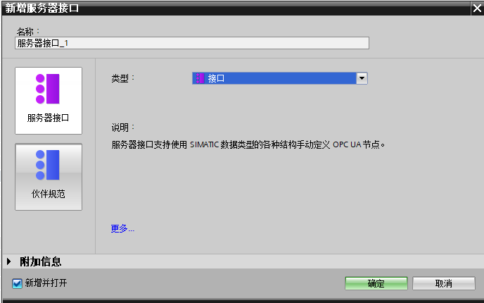\            | ::: {align="left"}                |
|                                   | **服务器接口：**支持使用SIMATIC数 |
|                                   | 据类型的各种结构手动定义OPC节点。 |
|                                   | （最大支持2个服务器接口）         |
|                                   |                                   |
|                                   | 目前，仅                          |
|                                   | 介绍基于\"服务器接口\"的相关设置  |
|                                   | :::                               |
+-----------------------------------+-----------------------------------+
| 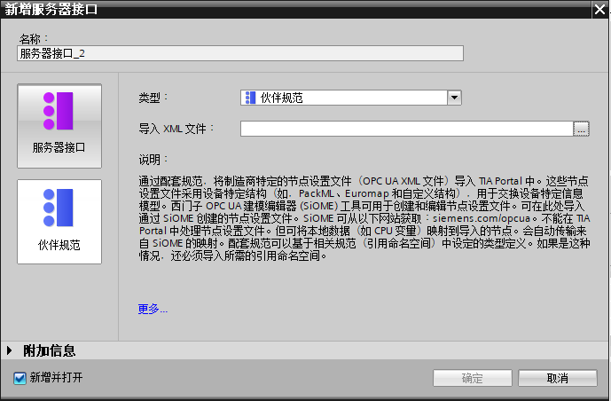\            | **伙伴规范：**通过配套规范        |
|                                   | ，将制造商特定的节点设置文件（OPC |
|                                   | UA XML 文件）导入 TIA Portal      |
|                                   | 中。这些节点设置文件采用          |
|                                   | 设备特定结构（如，PackML、Euromap |
|                                   | 和自定义结                        |
|                                   | 构），用于交换设备特定信息模型。  |
|                                   | 西门子 OPC UA 建模编辑器 (SiOME)  |
|                                   | 工具可用于创建和编                |
|                                   | 辑节点设置文件。可在此处导入通过  |
|                                   | SiOME 创建的节点设置文件。SiOME   |
|                                   | 可从以下网                        |
|                                   | 站获取：siemens.com/opcua。不能在 |
|                                   | TIA Portal                        |
|                                   | 中处理                            |
|                                   | 节点设置文件。但可将本地数据（如  |
|                                   | CPU 变量）映射到导入的节点。      |
|                                   | 会自动传输来自 SiOME 的映射。     |
|                                   | 配套规范                          |
|                                   | 可以基于相关规范（引用命名空间）  |
|                                   | 中设定的类型定义。如果是这种情况  |
|                                   | ，还必须导入所需的引用命名空间。  |
|                                   |                                   |
|                                   | **该文档内暂不涉及**              |
+-----------------------------------+-----------------------------------+

{width="15" height="15"}
**2.如下图所示，程序编译提示"所选的 OPC UA 许可证不足。要使用 OPC
UA，请购买并选择正确数量的许可证"，该如何解决？**

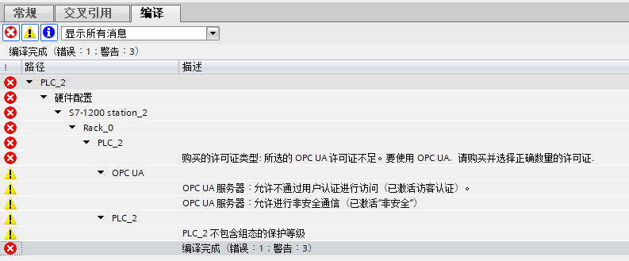\
[图1.]{.STYLE1}连接UA Server

注意！编译信息中，黄色叹号的编译信息属于警告，但不影响程序下载，但是红色的信息属于错误，必须修改后程序才能正常下载。

上图中的"许可证不足"的错误是因为没有在CPU 属性
"运行系统许可证"内设置许可证类型。如图2所示。

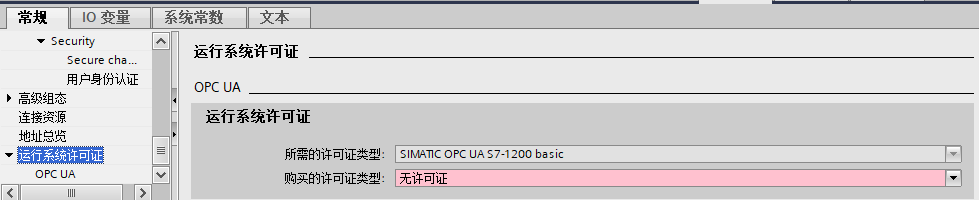\
[图2.]{.STYLE1}连接UA Server

{width="15" height="15"}
**3.如何生成CA证书，以及如何导入导出证书？**

CA证书的生成需要启用证书管理器，并且具有管理员权限，具体步骤：

1).
设置项目保护的用户名以及密码，可在项目树下，安全设置→设置内设置。如图3所示。

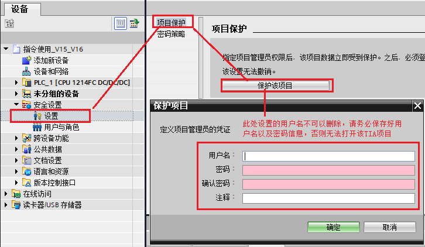{width="726" height="422"}\
[图3.]{.STYLE1}设置项目保护的用户名以及密码

2).
步骤1设置成功以后，在"安全设置"下方会自动添加"证书管理器"，可以在该管理器内对证书作相应的管理，例如删除、导入以及导出等，如图4所示。

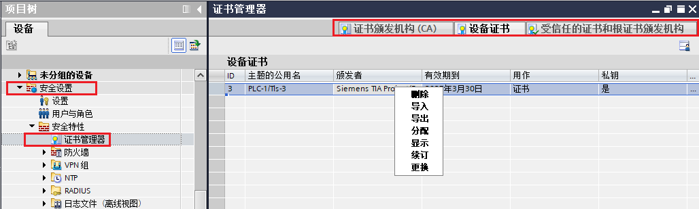\
[图4.]{.STYLE1}证书管理器

3).
CA证书的创建，需要在PLC属性内，先启用证书管理器的全局安全设置：CPU属性
防护与安全→证书管理器→勾选"使用证书管理器的全局安全设置"然后就可以在下方的"设备证书"处添加证书，如图5所示。

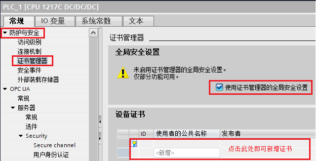\
[图5.]{.STYLE1}启用证书管理器的全局安全设置

此时用户可以根据自己的需求添加自签署或者是CA证书，如图6所示。

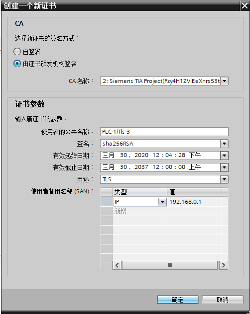\
[图6.]{.STYLE1}启用证书管理器的全局安全设置

需要注意的是，启用证书管理器时，会提示当前的证书组态会丢失，需要重新确认和对已组态的证书信息，所以推荐在项目初期，就考虑是否需要启用该安全设置，如图7所示。

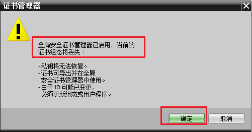\
[图7.]{.STYLE1}启用证书管理器的全局安全设置注意事项

4). 证书的创建以后需要在对应的功能里分配证书，S7-1200 OPC UA
服务器的证书分配需要在：CPU属性 OPC UA→Secure channel
内选择已经创建好的证书，当然也可以直接在此处新建，如图8所示。

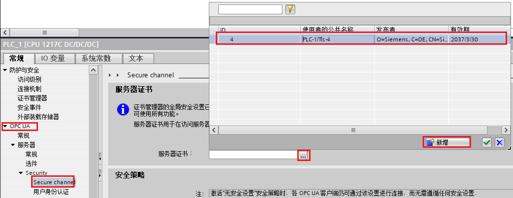\
[图8.]{.STYLE1}分配证书

{width="15" height="15"} **4.S7-1200 OPC UA
占用什么连接资源？**

OPC UA
连接在固件V4.4版本中占用\"可用自由连接\"中的资源，在固件V4.5版本中占用"OPC
UA客户端/服务器通信"中的资源，S7-1200 V4.5支持OPC
UA的最大会话数是10个，使用时确保应用程序有足够的可用连接。

查看方式：S7-1200
PLC在线的前提下：在窗口下方的属性对话框侧，选择诊断→连接信息
即可查看，如图9（固件V4.4，显示为"其他通信"），图10（固件V4.5，显示为"OPC
UA客户端/服务器通信"）所示。

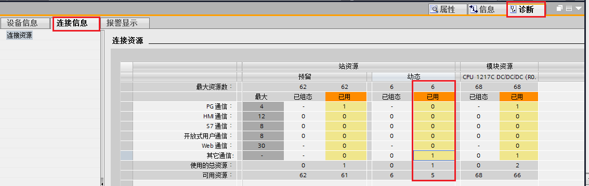\
[图9.]{.STYLE1}S7-1200 OPC UA占用的连接资源（固件V4.4）

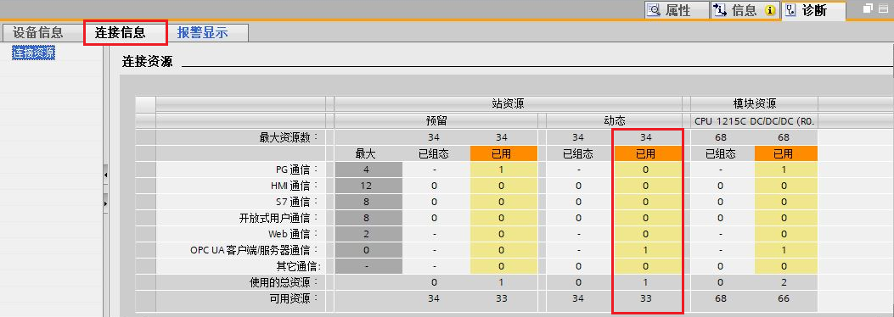{width="1053" height="374"}

[图10.]{.STYLE1}S7-1200 OPC UA占用的连接资源（固件V4.5）

{width="15" height="15"} **5.OPC UA
通信能否支持非优化的DB块数据？**

OPC UA
通信仅支持符号访问，对于非优化的DB块数据，因为其有符号名，同样也可以作为OPC
UA的元素添加至"OPC UA 服务器接口中"，从而实现数据访问，如图11所示。

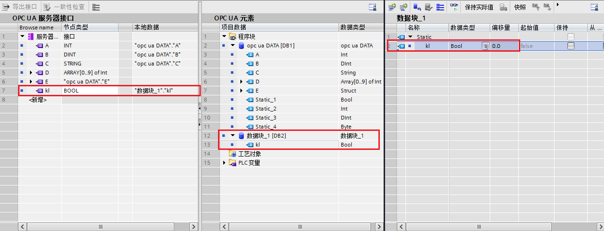\
[图11.]{.STYLE1}非优化的DB块变量添加至服务器接口

具体连接状态，如图12所示。

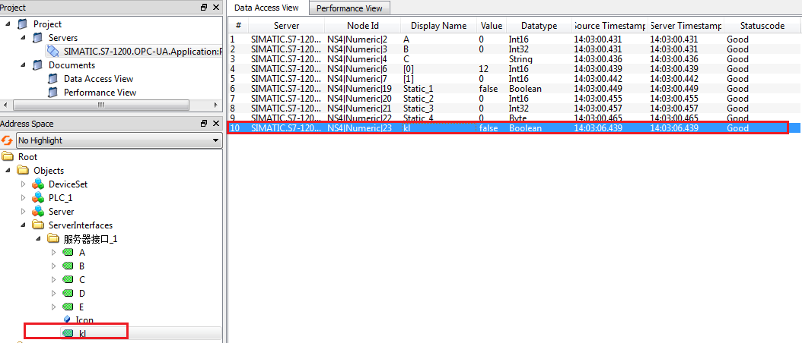\
[图12.]{.STYLE1}非优化的DB块变量连接状态

{width="15" height="15"} **6.S7-1200 OPC UA
支持哪些数据类型？**

OPC
基金会定义了一组支持的数据类型，这些数据类型用于描述变量及其变量类型的
Value 属性的结构。S7-1200 V4.5 支持其中一部分数据类型，如表2所示。

[表2.]{.STYLE1}S7-1200 OPC UA支持的数据类型

  -------------- -----------------
  SIMATIC 类型   OPC UA 类型名称
  Bool           Boolean
  SInt           SByte
  USInt          Byte
  Int            Int16
  UInt           UInt16
  DInt           Int32
  UDInt          UInt32
  Real           浮点型
  LReal          双精度浮点型
  WString        字符串
  DWord          StatusCode
  DATE           UInt16
  TOD            UInt32
  TIME           Int32
  DTL            结构
  -------------- -----------------

S7-1200
V4.5还支持服务器方法以及结构化数据类型（结构体和数组）。不支持以下项目：联合。\

需要注意的是，该表2中表示受支持的基本节点类型，许多SIMATIC数据类型都映射到基本节点类型。映射到基本节点类型的任何
SIMATIC 数据 类型也是受支持的节点类型。
