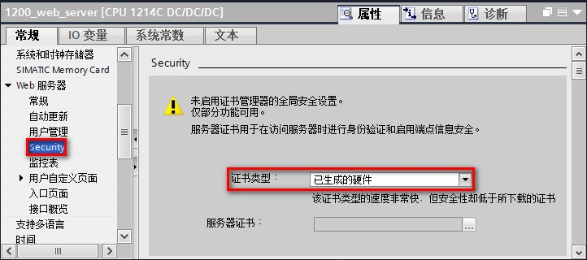
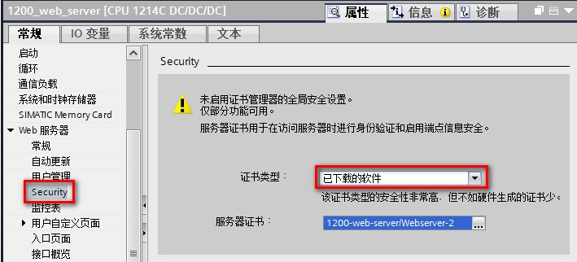
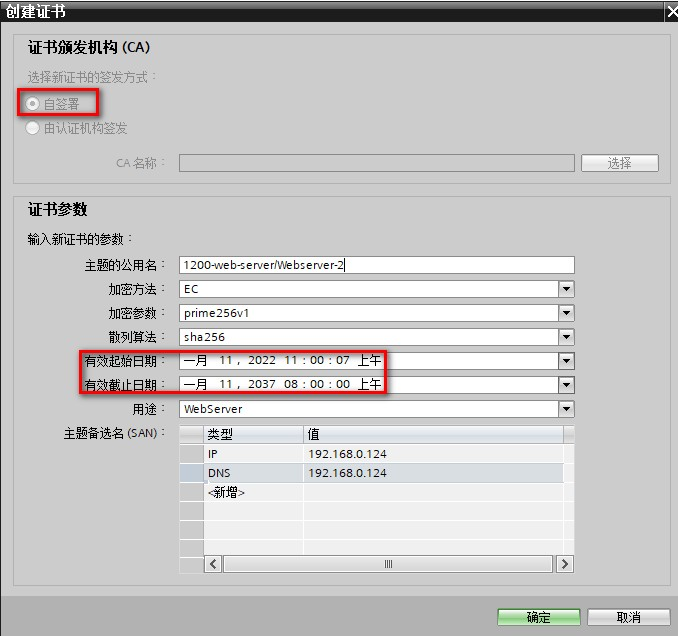
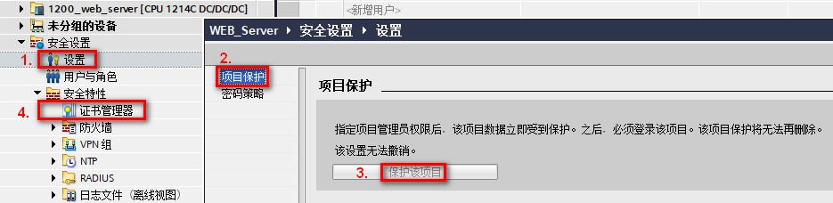
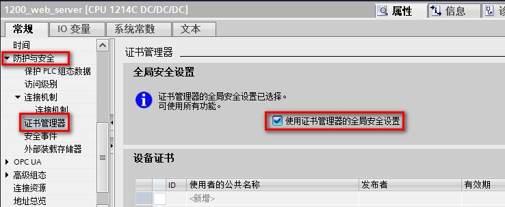
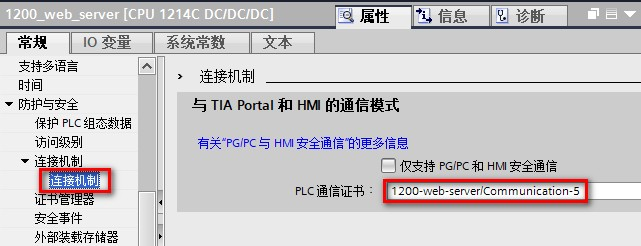
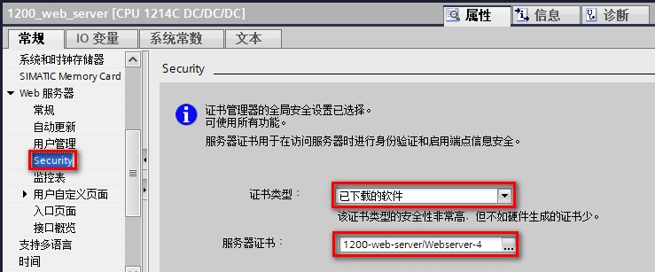
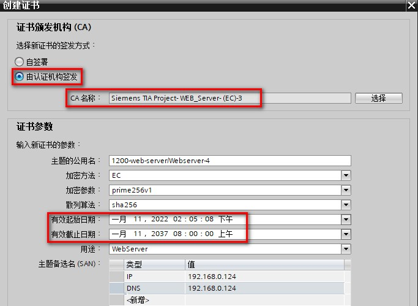
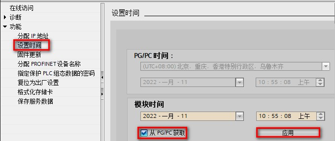

### Web 服务器安全属性设置

TIA Portal 从 V17 版本开始、S7-1200 CPU 从 V4.5 版本开始，Web
服务器支持现代 API 和证书处理。并且在 Web
服务器属性中新增了安全属性，在其中设置安全通信所用的证书。在使用 TIA
Portal V17 对 V4.5 版本的 S7-1200 组态 Web
服务器时，必须在安全属性中的证书类型进行选择，以使用不同的证书。

本文档将介绍如何配置及访问 S7-1200 的 Web 服务器安全功能。

#### 硬件和软件版本

以下是本文档中所使用的硬件和软件：

**硬件：**S7-1200 V4.5 及以上 （本文档使用硬件： 6ES7 214-1AG40-0XB0
V4.5 版本）

**软件：**TIA Portal V17 及以上（本文档使用软件：STEP7 Professional
V17）

#### Web 服务器 Security 属性设置

Web 服务器属性中点击 Security 属性，设置证书。Security
属性设置有三种情况，三种情况选择一种即可。

> **选择已生成的硬件证书 （安全性较低）**
>
> **选择已下载的软件------生成自签署证书**
>
> **选择已下载的软件------生成由 CA 签署的证书**

**情况一：选择已生成的硬件证书**

1\. Web 服务器属性中，点击 Security，证书类型选择"已生成的硬件"，如图 1
所示。

{width="722" height="320"}

图 1.选择已生成的硬件

**情况二：选择已下载的软件------生成自签署证书**

1\. Web 服务器属性中，点击
Security，证书类型选择"已下载的软件"，本文档使用的软件证书就是下方的
1200-web-server/webserver-2，如图 2 所示。

{width="15" height="15"}此处生成的证书是自签署证书！

{width="709" height="322"}

图 2.选择已下载的软件证书类型

2.在创建证书的时候，可以看到证书包含的信息，此种方式创建的证书是自签署证书，注意证书的有效期范围，保证
PLC 模块时间在有效期范围内，如图3所示。

{width="678" height="636"}

图 3.创建自签署证书

**情况三：选择已下载的软件------生成由 CA 签署的证书**

1\. 如果要生成由 CA
签署的证书，需要在项目树中安全设置中，启用项目保护，点击保护该项目的按钮，输入项目名称和密码。启用项目保护后，安全特性下会出现证书管理器。如图
4 所示。

{width="15"
height="15"}**启用项目保护后，一定要记清楚设置的项目名称和密码！在重新打开该项目的时候，需要输入正确的用户名和密码，如果忘记，将无法进入项目！**

{width="935" height="228"}

图 4.启用项目保护

2\. 在 CPU
属性的防护与安全，证书管理器，全局安全设置中，勾选使用证书管理器的全局安全设置，如图
5 所示。

{width="738" height="303"}

图 5.勾选全局安全设置

3\. 由于勾选完全局安全设置后，设备证书都被清除，所以，在 CPU
属性防护与安全，连接机制中需要重新创建 PLC 通信证书，如图 6 所示。

{width="641" height="246"}

图 6.创建 PLC 通信证书

4\. Web 服务器属性中，点击
Security，证书类型选择"已下载的软件"，本文档使用的软件证书就是下方的
1200-web-server/webserver-4，如图 7 所示。

{width="739" height="307"}

图 7.选择已下载的软件证书

5\.
创建证书时，选择由认证机构签发，可以设置证书的相关参数，注意证书有效期范围。如图
8 所示。

{width="683" height="499"}

图 8.创建由 CA 签发的证书

#### 编译下载PLC项目

1\. 设置 Security 属性完成后，将项目整体编译，下载至 PLC 中。

2\. **如果在组态时证书选择已下载的软件类型**，在下载完成后，需要设置 CPU
模块时间，保证模块时间在证书有效期范围时间之内，如图 9 所示。

{width="680" height="287"}

图 9.设置模块时间

#### 浏览器访问

PC 访问 Web 服务器的方法，可以参考：[**PC 端访问 Web
服务器**](04-WebServer_AccessFromPC.html)

手机端访问 Web 服务器的方法，可以参考：[**手机端访问 Web
服务器**](05-WebServer_AccessFromMobile.html)
