### PC 端访问 Web 服务器

从 PC 端访问 Web 服务器，一般情况下 PC 和 PLC
在同一个局域网中，否则就需要设置路由，这里不对路由访问进行介绍。

需要在浏览器地址栏中输入 HTTP://ww.xx.yy.zz 或者
HTTPS://ww.xx.yy.zz。其中，HTTP 表示非安全访问，HTTPS
表示安全访问；ww.xx.yy.zz 表示 S7-1200 CPU 的 IP 地址。

不同的浏览器证书的下载以及证书管理器的位置有可能会有不同，本文档使用的是
IE11 浏览器。

PC 端访问 S7-1200 Web 服务器有以下几种情况，按需使用即可：

-   **[HTTP://访问（不安全，不推荐）](04-WebServer_AccessFromPC.html#a)**
-   **[HTTPS://访问，浏览器中添加例外](04-WebServer_AccessFromPC.html#b)**
-   **[HTTPS://访问，在浏览器中下载 /
    另存证书并导入到浏览器证书管理器中](04-WebServer_AccessFromPC.html#c)**
-   **[HTTPS://访问，博途中导出证书并且导入到浏览器证书管理器中](04-WebServer_AccessFromPC.html#d)**

手机端访问 Web 服务器的方法，可以参考：[**手机端访问 Web
服务器**](05-WebServer_AccessFromMobile.html)

#### 硬件和软件版本

以下是本文档中所使用的硬件和软件：

**PLC：**

-   S7-1200 V4.5 及以上 （本文档使用硬件： 6ES7 214-1AG40-0XB0 V4.5
    版本）

**编程软件：**

-   TIA Portal V17 及以上（本文档使用软件：STEP7 Professional V17）

**交换机：**

-   SCALANCE X308

PC 和 PLC 分别连接到交换机上，IP 地址设置如下：

-   PC：192.168.0.222
-   PLC：192.168.0.124

#### **[]{#a}情况一：HTTP://访问**

1\. 要使用 HTTP 访问 Web 服务器，需要保证在组态 1200Web
服务器时，取消勾选仅允许通过 HTTPS 访问，如图 1 所示。

{width="15" height="15"}**建议勾选仅允许通过 HTTPS
访问！**

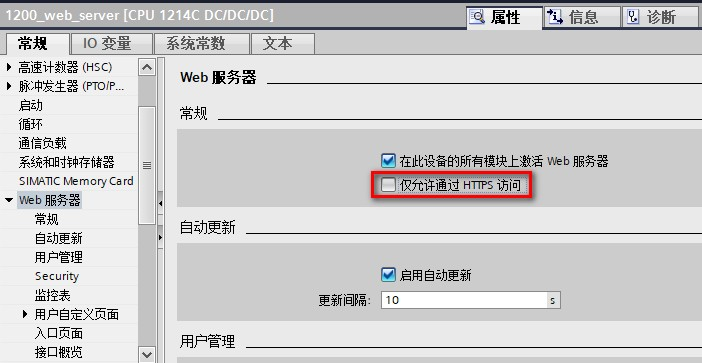{width="702" height="363"}

图 1.取消仅允许通过 HTTPS 访问

2\. 打开 IE11 浏览器，地址栏中输入 HTTP://192.168.0.124，可以进入到
1200Web 服务器的简介页面，如图 2 所示。

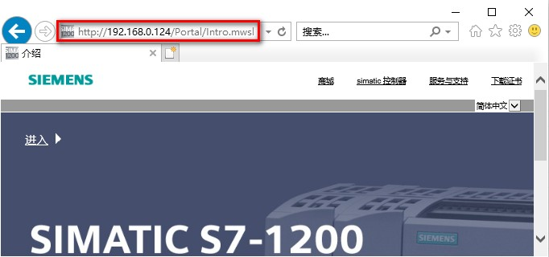{width="682" height="320"}

图 2.HTTP 访问简介页面

3\. 图 2 中点击进入，可以进入到 1200Web
服务器的标准页面，包含起始页面和介绍页面。如图 3 所示。

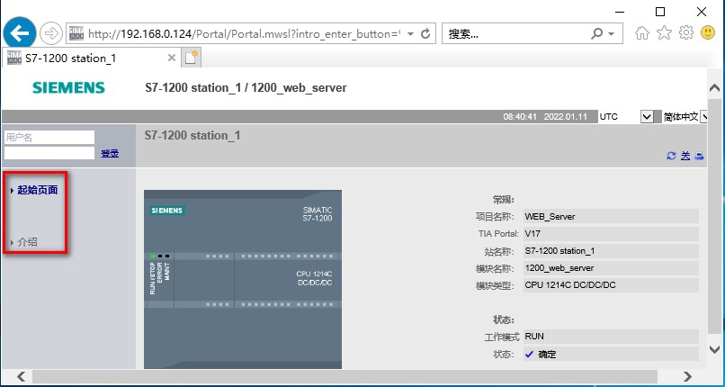{width="806" height="430"}

图 3.HTTP 访问标准页面

4\. 如果在图 3
中，输入用户名和密码，用户登录以获取相应的访问权限，可以观察到访问自动切换至
HTTPS。如图 4 所示。

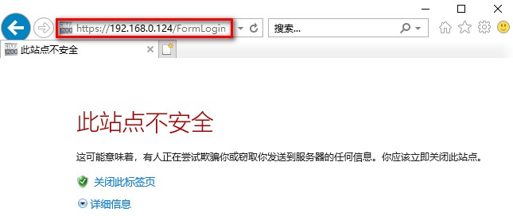{width="645" height="272"}

图 4.HTTP 访问用户登录

#### **[]{#b}情况二：HTTPS://访问，浏览器中添加例外**

使用 HTTPS:// 连接 S7-1200 时，网站将通过数字证书对会话进行加密。Web
服务器将安全地发送数据，不会被任何人看到。

1\. 打开 IE11 浏览器，在地址栏中应输入
HTTPS://192.168.0.124。弹出安全警告窗口提示此站点不安全。点击详细信息，然后，点击转至此网页（不推荐）。如图
5
所示。点击转至此网页（不推荐）的操作，相当于为浏览器将此访问作为一个安全例外。

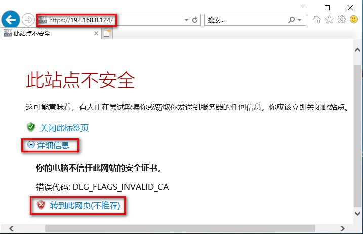{width="717" height="464"}

图 5.HTTPS 访问点击转至此网页

3\.
点击转到此网页（不推荐）后，可访问简介页面，但是，地址栏会提示证书出错，颜色变为红色以作警告。如图
6 所示。

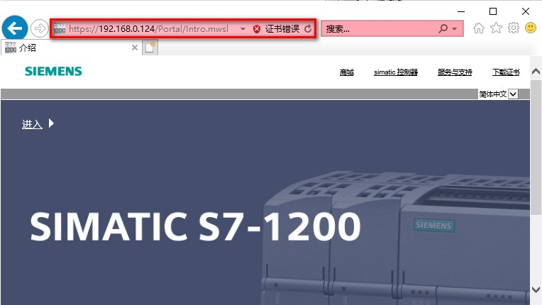{width="764" height="430"}

图 6.添加例外并访问简介页面

4\. 图 6
中点击进入，进入标准页面后在左上角输入用户明和密码，可成功登陆，获取到该用户所拥有的访问权限。如图
7 所示。

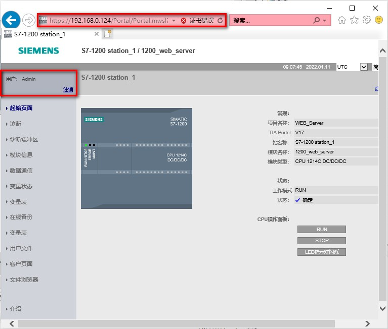{width="767" height="652"}

图 7.添加例外后用户登陆

{width="15" height="15"}**使用添加例外的方式访问 Web
服务器，有可能在关闭浏览器后再重新访问 Web
服务器时，依然出现安全警告，在地址栏显示证书错误！**

#### **[]{#c}情况三：在浏览器中下载 / 另存证书并导入到浏览器证书管理器中**

使用 HTTPS:// 连接 S7-1200
时，需要进行证书的验证以确定身份。为了避免添加例外的方式，重新访问时总是提示安全警告，可以在浏览器的证书管理器中安装证书。

1\. 打开 IE11 浏览器，输入 HTTPS://192.168.0.124

弹出安全警告窗口提示此站点不安全。点击详细信息，然后，点击转至此网页（不推荐），参考图
5。

跳转到 Web
服务器的简介页面，在浏览器地址栏中点击证书错误然后点击查看证书，如图 8
所示。或者在简介页面右上角点击"下载证书"，然后点击打开，如图 9 所示。

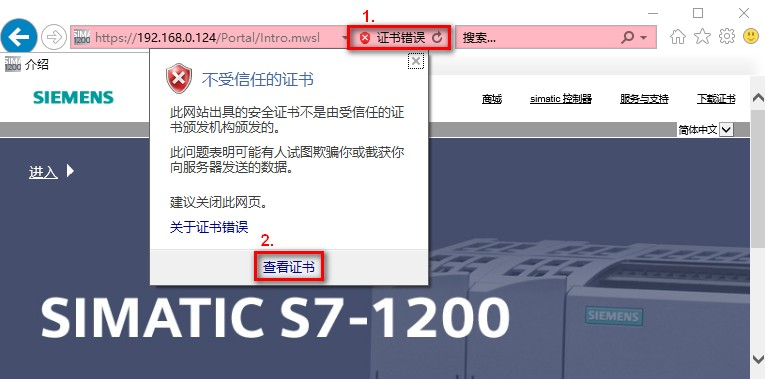{width="765" height="379"}

图 8.浏览器中查看证书

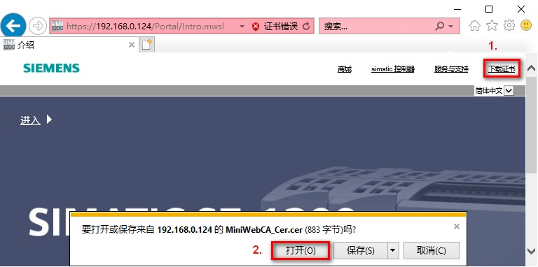{width="768" height="382"}

图 9.Web 服务器简介页面下载证书

2\. 打开证书后，可以看到证书的参数

如果在博途中对 Web 服务器 Security
属性中选择不同类型，生成的证书信息也不同，点击图中安装证书，如图 10 - 图
12 所示。

选择：已生成的硬件，证书为如图 10 所示，证书的颁发者和使用者为 S7-1200
Controller Family，证书有效期从 2012-1-1 到 2042-1-1，不可修改，即便 CPU
做过复位或者恢复出厂设置，CPU 的模块时间也满足要求。

选择：已下载的软件，没有进行安全设置，生成自签署证书，证书如图 11
所示，证书的颁发者和使用者一致，有效期起始值和结束值可自行设置，所以需要检查
CPU 模块时间是否在有效期内。

选择：已下载的软件，进行安全设置，生成由 CA 签署的证书，证书如图 12
所示，证书有颁发机构，有使用者，有效期起始值和结束值可自行设置，所以需要检查
CPU 模块时间是否在有效期内。

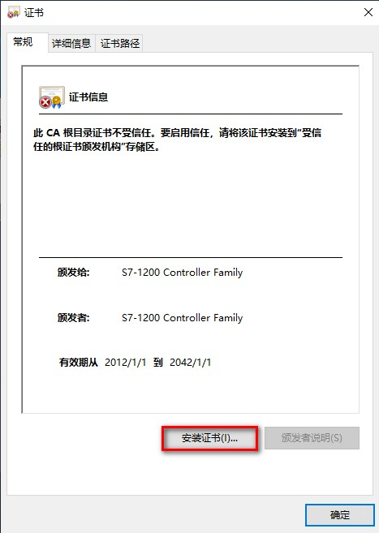{width="467" height="657"}

图 10. 安装证书（硬件生成的证书）

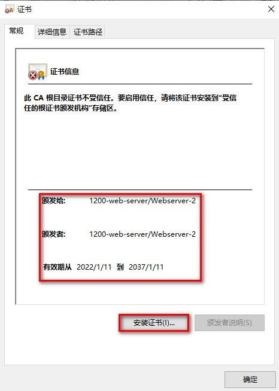{width="466" height="654"}

图 11. 安装证书（自签署证书）

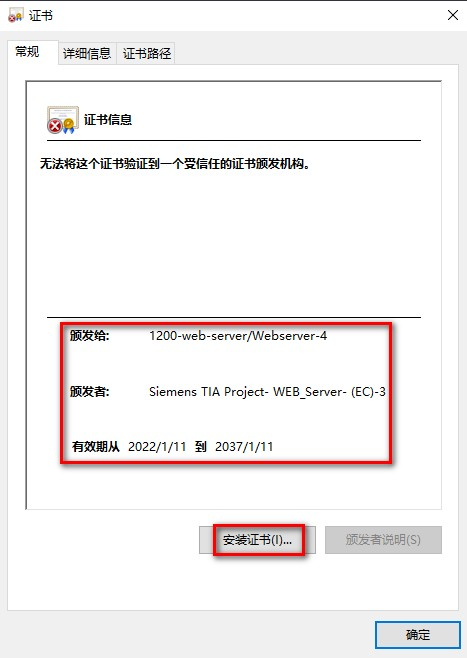{width="467" height="658"}

图 12. 安装证书（由 CA 签署的证书）

**{width="15"
height="15"}注意：不同浏览器下载证书的方式不同，有的浏览器需要保存证书，然后对证书进行导入**！

3\. 在证书导入向导中选择本地计算机，如图 13 所示。

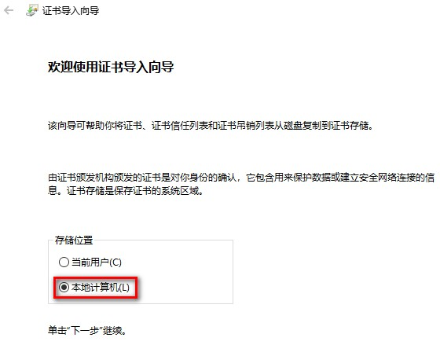{width="560" height="439"}

图 13.选择本地计算机

4\.
在证书导入向导中选择将所有的证书都放入下列存储，然后点击浏览选择存放的路径，此处选择第三方根证书颁发机构，如图
14 所示。

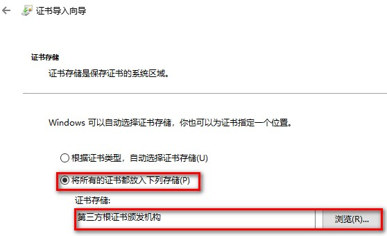{width="558" height="340"}

图 14.选择证书存储路径

5\. 证书导入完成，单击确认退出证书导入向导，如图 15 所示。

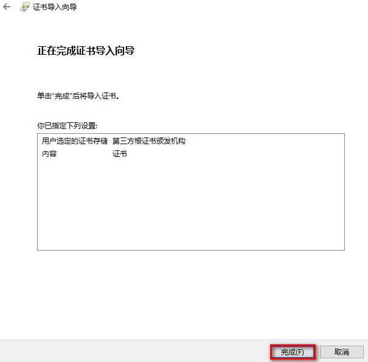{width="605" height="595"}

图 15.证书导入完成

6\. 在浏览器中安装证书之后，再以 https://192.168.0.124 访问 Web
服务器时就不会再出现安全验证提示，可以直接跳转到 S7-1200 的 Web
服务器页面。

此时可以点击左上角的用户登录位置，输入正确的用户名称和密码。如图 16
所示。

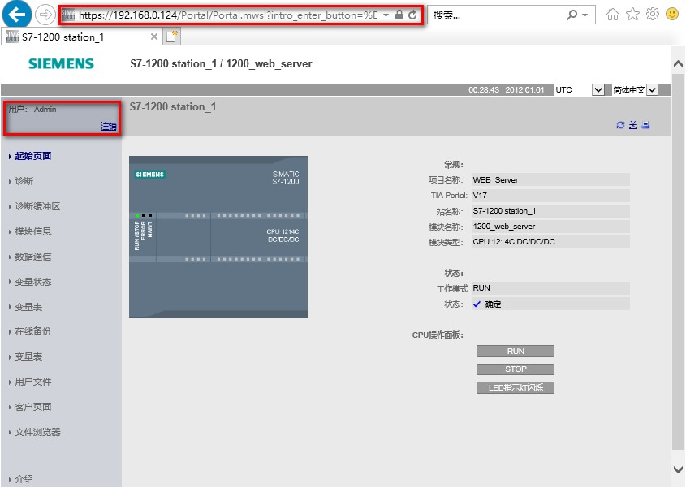{width="845" height="601"}

图 16.登录 Web 服务器

#### **[]{#d}情况四：HTTPS://访问，博途中导出证书并且导入到浏览器证书管理器中**

在情况三：在浏览器中下载 /
另存证书并导入到浏览器证书管理器中，是先添加例外，然后直接在浏览器中下载/安装证书。

在情况四中，直接从博途中导出证书，然后导入到浏览器的证书管理其中，这样再使用
HTTPS://访问时，直接可以安全的访问 Web 服务器了。

**情况四，仅适用于证书类型选择已下载的软件**。

#### 情况四（之一）：博途导出自签署证书，并导入到浏览器证书管理器中

1\. 从博途中导出服务器证书

CPU 属性 Web 服务器，Security
中证书类型选择：已下载的软件，自签署证书时，导出证书并存放在某一路径。如图
17 - 图 18 所示。

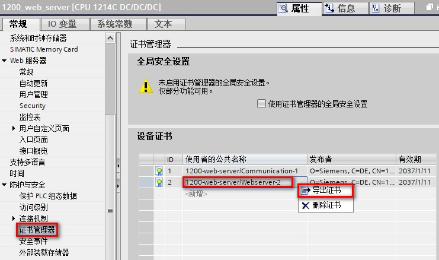{width="741" height="438"}

图 17.导出证书

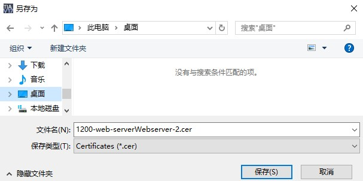{width="607" height="302"}

图 18.选择保存位置

2\. 打开浏览器，点击设置按钮，下拉菜单中选择 Internet 选项，如图 19
所示。

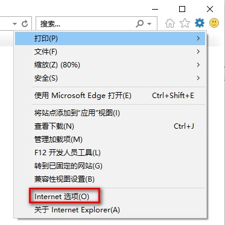{width="373" height="374"}

图 19.打开 Internet 选项

3\. 在 Internet 选项中点击内容按钮，点击证书按钮，如图 20 所示。

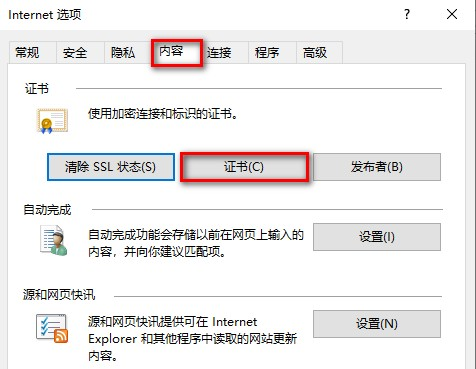{width="476" height="369"}

图 20.点击证书按钮

4\. 在证书管理器中点击导入按钮，如图 21 所示。

{width="586" height="435"}

图 21.点击导入按钮

5\.
在证书导入向导中点击浏览按钮，并且到存储证书的路径选中之前导出的证书。如图
22 - 图 23 所示。

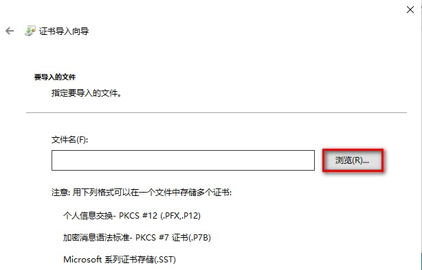{width="614" height="394"}

图 22.点击浏览

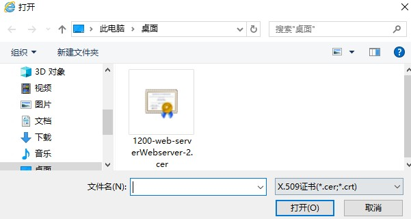{width="601" height="320"}

图 23.浏览并选中证书

6\.
在证书导入向导中选择将所有的证书都放入下列存储，点击浏览，选择受信任的根证书颁发机构，如图
24 所示。

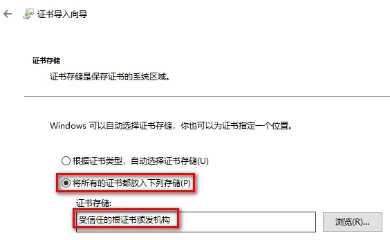{width="564" height="347"}

图 24.将证书导入到受信任的根证书颁发机构

#### 情况四（之二）：博途导出由 CA 签署的证书，并导入到浏览器证书管理器中

此处仅列出与情况四（之一）的不同之处：

**不同点一：从博途中导出证书的位置不同**

1\. Web 服务器组态使用的证书如果是 CA
签署的证书，从项目树，安全设置，安全特性中的证书管理器中，点击**证书颁发机构**，选择签发证书的
CA，右键导出。如图 25 所示。

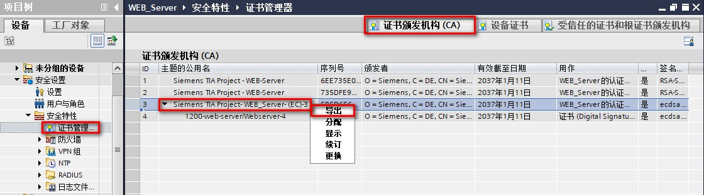{width="1120" height="312"}

图 25.导出证书颁发机构

2\. 导出的证书保存在设置的位置，如图 26 所示。

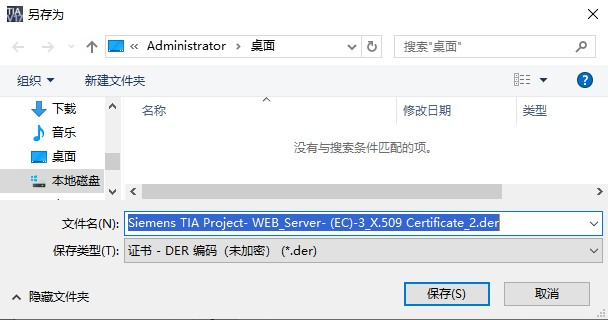{width="608" height="320"}

图 26.选择证书导出路径

3\. 导出证书对话框中选择导出按钮，如图 27 所示。

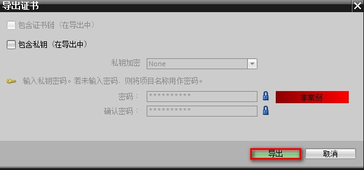{width="598" height="280"}

图 27.点击导出按钮确认导出

**不同点二：向浏览器证书管理器中导入证书时，选择文件类型为所有类型，如图
28 所示。**

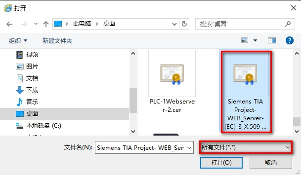{width="609" height="355"}

图 28.选择文件类型为所有文件
