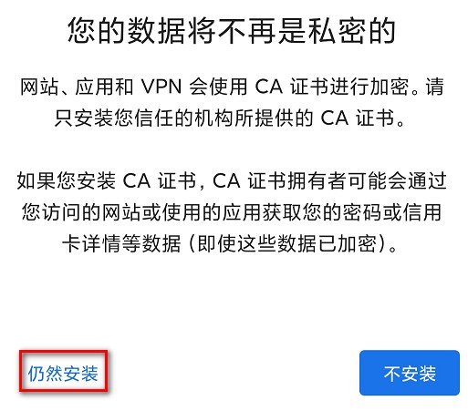

### 手机端访问 Web 服务器

从手机端访问 S7-1200 Web 服务器，需要将 S7-1200 CPU 连接 Internet
网络或者本地无线接入点相连的网络。本文档是将 S7-1200 CPU
用网线直接连接到无线设备上，并将手机的 WIFI
信号连接到由无线设备创建的无线网络中。无线设备只要保证能同时连接 CPU
和手机的 WIFI 信号即可，无品牌及型号的特殊需求！

通过手机访问和通过 PC 访问 S7-1200 Web
服务器的区别及相同点，大概总结以下几点：

-   电脑有以太网接口，可以通过网线或交换机将 PLC
    与电脑连接到同一个局域网中；手机无以太网接口，连接 PLC
    一般通过无线连接，需要增加无线设备。
-   电脑和手机所用操作系统不同，操作界面及文件存储路径不同，例如：导入证书及证书存储路径不同。
-   电脑和手机访问 S7-1200 Web 服务器操作的方法种类及主要步骤大致相同
-   电脑和手机访问 Web 服务器成功后，能够获取的功能相同。

PC 访问 Web 服务器的方法，可以参考：[**PC 端访问 Web
服务器**](04-WebServer_AccessFromPC.html)

#### 硬件和软件版本

以下是本文档中所使用的硬件和软件：

**PLC：**

-   S7-1200 V4.5 及以上 （本文档使用硬件： 6ES7 214-1AG40-0XB0 V4.5
    版本）

**编程软件：**

-   TIA Portal V17 及以上（本文档使用软件：STEP7 Professional V17）

**手机：**

-   Android 操作系统

**无线交换机：**

-   SCALANCE W788-2 RJ45

**手机中浏览器：**

-   Edge 浏览器

#### 配置无线设备设置无线网络

本文档使用西门子 SCALANCE W788
无线交换机，如果实际使用的无线设备与本文档不同，可按照实际设备的配置方法进行配置！

W788
无线交换机的配置，可以参考如下文档快速完成：**[西门子工业无线SCALANCE W
802.11n产品配置快速入门](https://support.industry.siemens.com/cs/cn/zh/view/91143611)**

无线网络名称：1200Webserver；密码：12345678。

#### **设置手机 WIFI** 连接到无线网络

1\. 手机设置页面，开启 WLAN，如图 1 所示。

{width="389" height="394"}

图 1.开启 WLAN

2\. 选取附近的 WLAN 网络，选择 1200Webserver 网络，如图 2 所示。

 

{width="410" height="482"}

图 2.选择 1200Webserver 网络

3\. 输入无线网络的密码。如图 3 所示。

{width="410" height="243"}

图 3.输入网络密码

4\. 进入 1200Webserver 网络中设置参数，IP 地址处，选择静态，并且设置 IP
地址为192.168.0.79，保证和网络中其他设备的 IP 地址不冲突。如图 4 所示。

{width="416" height="521"}

图 4.设置静态 IP 地址

5\. 无线网络显示已连接，如图 5 所示。

 

{width="415" height="369"}

图 5.已连接无线网络

#### **手机访问 S7-1200 Web 服务器**

1\. 打开手机中 Edge 浏览器，在地址栏中输入
https://192.168.0.124，前往访问，显示：''你的连接不是专用连接"，点击下方高级按钮。如图
6 所示。

{width="528" height="674"}

图 6.连接不安全

2\. 点击继续访问 192.168.0.124（不安全），如图 7 所示。

{width="525" height="417"}

图 7.点击继续访问按钮

3\. 进入到 S7-1200 Web 服务器的简介页面，点击下载证书按钮，如图 8 所示。

{width="15" height="15"}**注意：**

**如果不点击下载证书，也是可以访问 Web
服务器或者进行用户登录，只不过，关闭浏览器重新访问时又会有安全警告的提示。**

**可以在浏览器的证书管理器中安装证书，使 Edge 浏览器信任 1200 Web
浏览器所用的证书，以后每次访问时，不会再弹出不安全的提示。**

{width="430" height="478"}

图 8.点击下载证书按钮

4\. 可以查看到证书已经下载至手机中，如图 9 所示。

{width="421" height="297"}

图 9.证书已下载

5\. 点击手机设置按钮，在设置界面，点击密码与安全，如图 10 所示。

{width="425" height="450"}

图 10.点击密码与安全

6\. 点击系统安全，如图 11 所示。

{width="399" height="649"}

图 11.点击系统安全

7\. 点击安装证书按钮，如图 12 所示。

{width="412" height="733"}

图 12.手机安装证书

8\. 点击 CA 证书，如图 13 所示。

{width="401" height="309"}

图 13.安装 CA 证书

9\. 手机会提示警告信息：您的数据将不再是私密的，点击下方仍然安装，如图
14 所示。

{width="513" height="451"}

图 14.仍然安装

10\.
证书中安装成功后，点击信任的凭据，在用户中可以看到已经安装成功的证书，如图
15 所示。

{width="434" height="292"}

图 15.手机中已经成功安装 CA 证书

11\. 此时，手机 Edge 浏览器中重新访问
https://192.168.0.124，可以看到手机不再提示连接是不安全的，直接进入到
S7-1200Web 服务器简介页面，如图 16 所示。

{width="427" height="515"}

图 16.安全连接 Web 服务器简介页面

12\. 点击图 16
中简介页面的进入按钮，进入到标准页面，输入正确的用户名和密码，点击登录按钮后，可以获取到该用户所拥有的操作权限，本文档中该用户拥有管理员权限。如图
17 所示。

{width="429" height="820"}

图 17.标准页面用户登录
