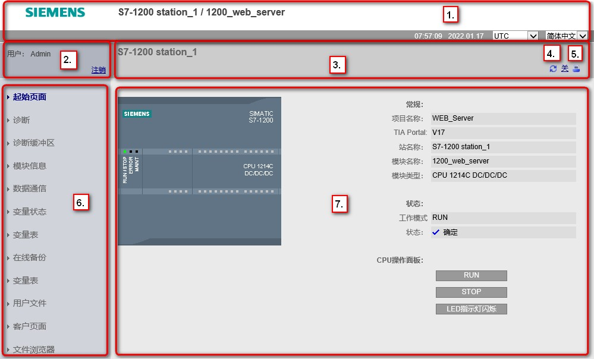
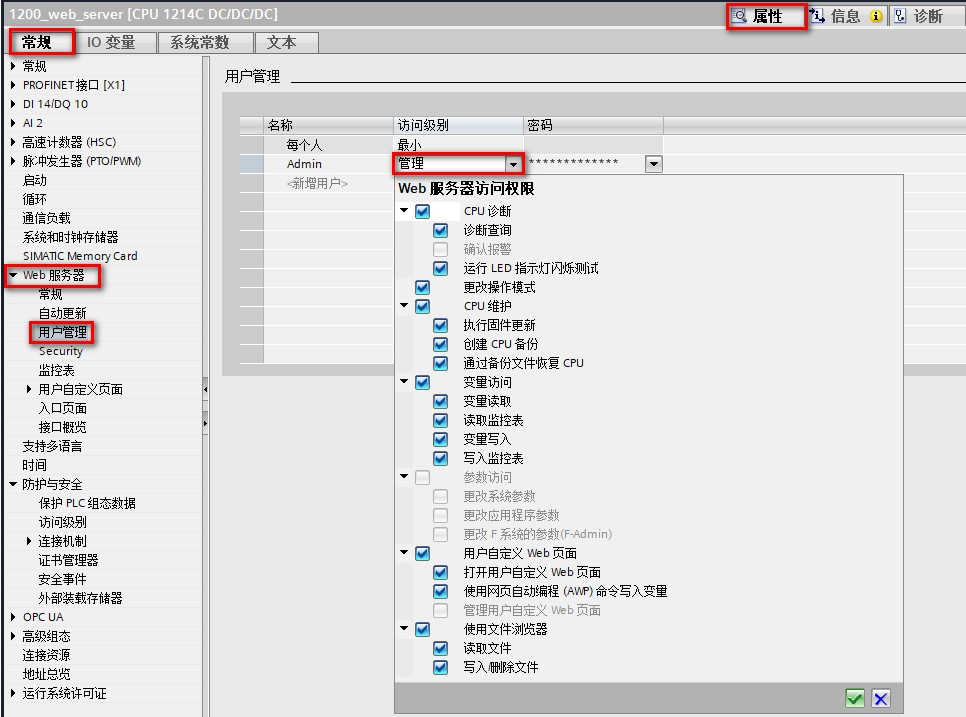

### 标准 Web 页面

每个 S7-1200 标准 Web 页面的布局均相同，都具有导航链接和页面控件。
无论您在 PC
还是在移动设备上查看页面，每个页面都具有相同的内容区域，但布局和导航控件会根据屏幕大小和设备分辨率发生变化。
在标准 PC 或大型移动设备上，标准 Web 页面的布局，如图 1 所示。

{width="999" height="604"}

图 1.标准 Web 页面布局

1.  Web 服务器标题，其中包括显示 PLC 本地时间或 UTC
    时间的选择器以及显示语言的选择器
2.  登录或注销
3.  包含正在查看的页面的名称的标准 Web 页面标题。 有些标准 Web
    页面（如模块信息页面）还会在此处显示导航路径，前提是可以访问该类型的多个画面。
4.  刷新图标：对于具有自动更新功能的页面，可用来启用或禁用自动更新功能；对于不具有自动更新功能的页面，可以使页面用当前数据进行更新
5.  打印图标：准备并显示所显示页面提供的信息的可打印版本
6.  用来切换到其它页面的导航区
7.  正在查看的特定标准 Web 页面的内容区域。 本示例为 CPU
    的状态起始页面。

#### 2. 登录和用户权限

每个 PC 标准 Web 页面都会在导航窗格上方提供登录窗口。
考虑到空间问题，移动Web 页面提供的是独立的登录页面。 S7-1200
为不同的用户登录提供不同的访问级别（权限）：

-   查询诊断
-   读取变量
-   写入变量
-   读取变量状态
-   写入变量状态
-   打开用户定义页面
-   写入用户定义页面
-   读取文件
-   写入/删除文件
-   更改工作模式
-   闪烁 LED
-   执行固件更新
-   更改系统参数
-   更改应用程序参数

在 CPU 的设备组态的 Web
服务器用户管理属性中，组态用户角色、相应访问级别（权限）和密码 ，如图 2
所示。

{width="966" height="717"}

图 2.登录和用户权限

#### 标准 Web 页面链接集合

[简介页面](02-introduce.html)

[起始页面](03-Start.html)

[诊断页面](04-Identification.html)

[诊断缓冲区页面](05-Diagnostic.html)

[模块信息页面](06-Information.html)

[数据通信页面](07-Communication.html)

[变量状态页面](08-TagStatus.html)

[变量表页面](09-WatchTables.html)

[在线备份页面](10-OnlineBackup.html)

[文件浏览器页面](11-File.html)

[用户自定义页面](../07-User_Define/01-Intro.html)
