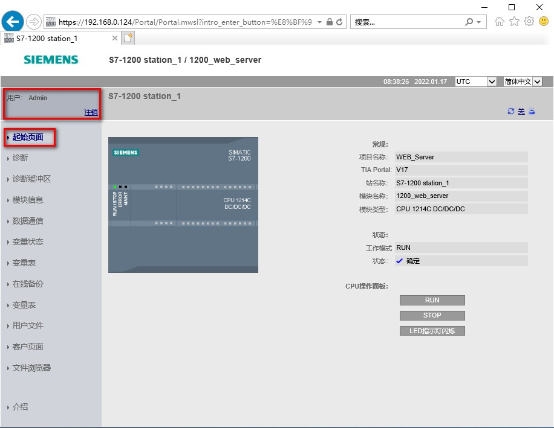

### 标准 Web 页面 - 起始页面

\"起始\"页面显示所连接 CPU 或 CP
的图示，并列出有关设备的常规信息。对于CPU，如果以特定权限登录，则可以使用按钮更改
CPU 工作模式以及闪烁 LED。 如图 1 所示。\

{width="916" height="709"}

图 1.标准 Web 页面 - 起始

{width="15" height="15"}注意，S7-1200 故障安全 CPU
会在此页面上显示与功能安全相关的额外数据。
