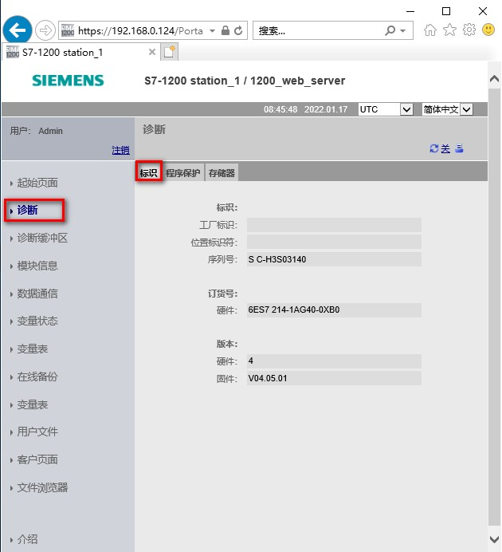
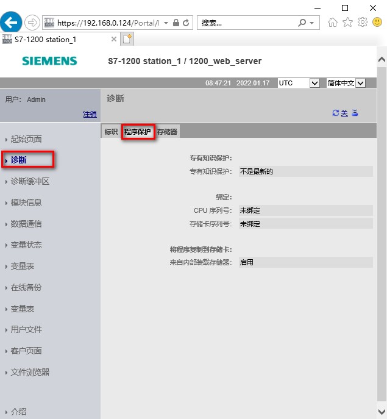
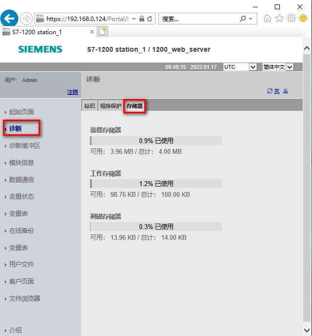

### 标准 Web 页面 - 诊断页面

诊断页面包含三个选项卡，内容如下所示：

-   标识：模块和设备的标识特征以及 CPU 固件版本、硬件版本，如图 1 所示。
-   程序保护：专有技术保护和 CPU
    绑定的状态，允许或阻止将内部装载存储器复制到外部装载存储器的状态，如图
    2 所示。
-   存储器：装载存储器、工作存储器和保持存储器的使用，如图3所示。

{width="15" height="15"}**注意：**

对于 F-CPU，还配有\"故障 - 安全\"(Fail-safe) 选项卡。

查看\"标识\"(Identification) 页面需要\"查询诊断\"权限。

{width="630" height="692"}

图 1.诊断页面-标识

{width="635" height="687"}

图 2.诊断页面-程序保护

{width="638" height="688"}

图 3.诊断页面-存储器
