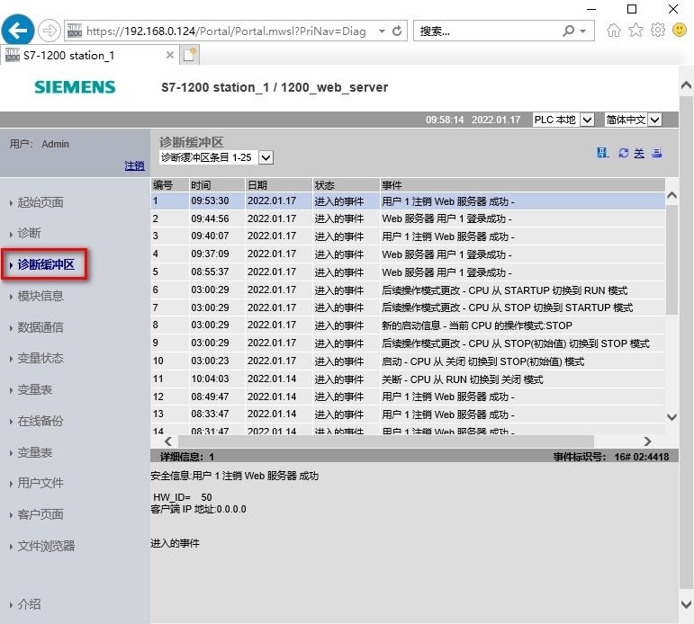

### 标准 Web 页面 - 诊断缓冲区页面

诊断缓冲区页面会显示诊断事件，如图 1 所示。

在左上方的选择器中，可以选择要显示的诊断缓冲区条目范围（50）。在右上方的选择器中，可以选择以
UTC 时间还是 PLC 本地时间显示，页面中间会显示包含时间和日期的诊断条目。

可以从页面中间选择任何单独的条目，以在页面底部显示有关该条目的详细信息。

{width="771" height="694"}

图 1.标准 Web 页面 - 诊断缓冲区

查看\"诊断缓冲区\"(Diagnostic Buffer) 页面需要\"查询诊断\"权限。
