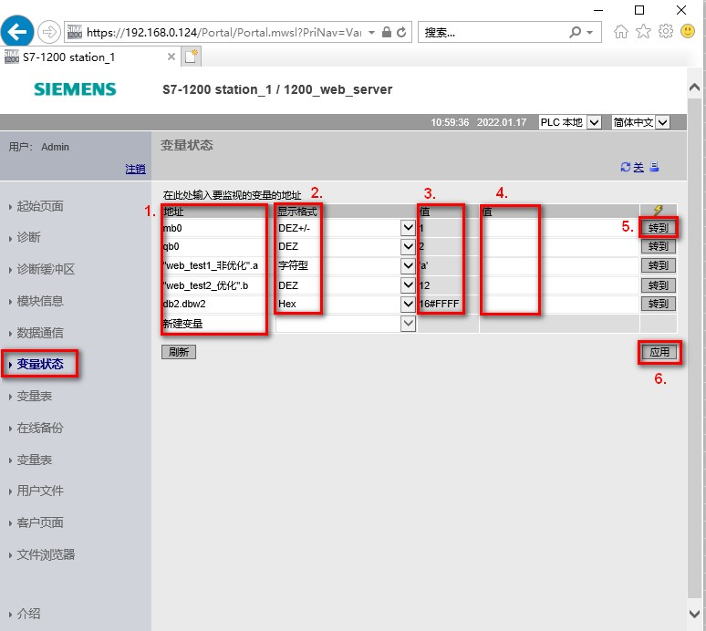

### 标准 Web 页面 - 变量状态页面

变量状态页面可以查看任何 CPU 中的 I/O
或者存储器数据。可以输入绝对地址（例如：MB0、I0.0、Q1.0等）、PLC
变量名或者数据块中的变量。可以选择显示的数据类型的格式；可以显示或者更改当前值。更改变量当前值可以单独更改或者统一更改，如图
1 所示。

{width="15"
height="15"}**注意：**查看变量状态页面，需要在组态用户权限时勾选"读取变量状态"权限；修改变量数值，需要勾选"写入变量状态"权限。

{width="774" height="692"}

图 1. 变量状态

**图中标注 1 地址栏**

可以输入绝对地址或者符号名。对于数据块中的变量，有两种访问方式：绝对地址和符号访问。绝对地址访问仅用于非优化的
DB 块。

绝对地址访问：此文档第五行访问 DB2.DBW2。

符号访问：此文档第三行、第四行访问"web_test1_非优化".a
或者"web_test2_优化".b。

**图中标注 2 显示格式**

可以根据监视的变量的数据类型在此处切换选择相关的显示格式。

可以选择的格式有：bin（二进制）、字符型（字符串）、Unicode字符、hex（十六进制）、DEZ（无符号整型）、DEZ+/-（有符号整型），浮点型（Real/LReal）、时间（time）
等等。

**图中标注 3 和 4 监视值和修改值**

监视值：所监视变量的当前数值；修改值：对所监视变量修改当前值。

**图中标注 5 和 6 转到和应用**

转到：点击转到按钮，可以单独修改选中行的变量的当前值

应用：点击引用按钮，可以统一修改所有修改当前值的变量
