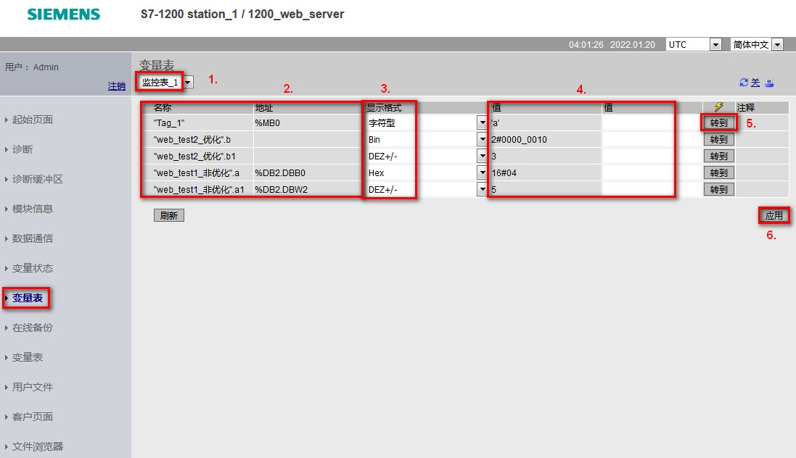

### 标准 Web 页面 - 变量表页面

组态Web服务器监控表：

1.  S7-1200 PLC 项目树中添加监控表，并在其中添加变量
2.  CPU 属性 \> Web 服务器 \>
    监控表，名称列选择已经建立好的监控表，设置访问权限。读访问权限仅可查看变量值；读/写访问权限可读取或者修改变量的数值。如图
    1 所示。

{width="735" height="247"}

图 1.Web 服务器组态监控表

在监控表页面，可以选择已组态好的监控表，根据拥有的权限，监视或者修改变量的数值，如图
2 所示。

{width="1097" height="632"}

图 2.监控表

图中标注 1 处，切换要监控哪个监控表的变量；

图中标注 2 处，显示监控表包含的变量；

图中标注 3 处，切换显示格式；

图中标注 4 处，监视值和修改值；

图中标注 5 处，点击转到按钮，可以单独修改某个变量；

图中标注 6 处，点击应用按钮，可以同时修改多个变量
