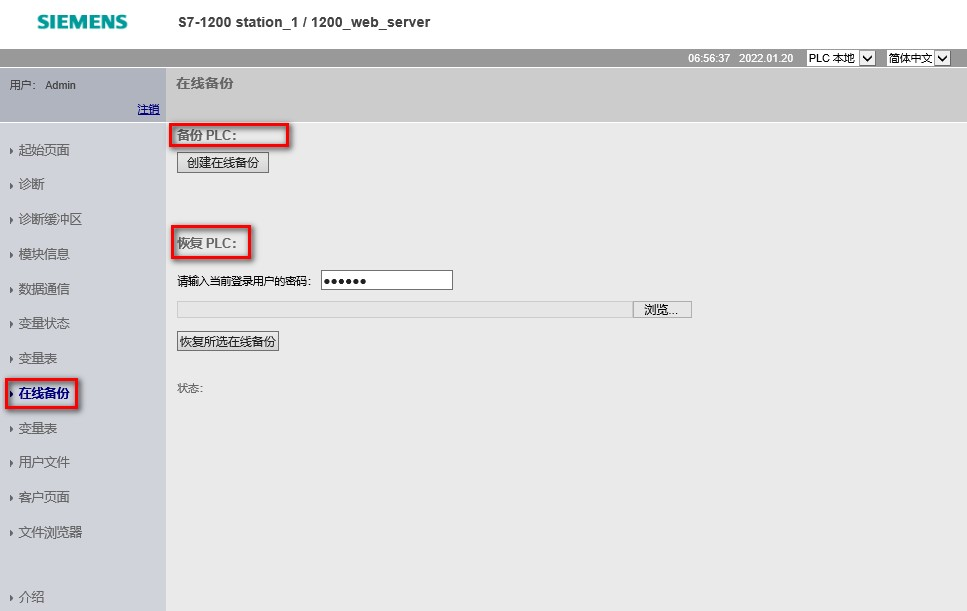

### 标准 Web 页面 - 在线备份页面

在线备份页面可以为在线 PLC 创建项目备份，或者恢复之前创建的 PLC
备份，如图 1 所示。

{width="15" height="15"}**注意**：

-   如果需要使用此功能，一定在充分理解该功能并保证现场人员及设备安全的前提下，才可以操作！
-   要在线备份 PLC 项目，需要在组态 Web 服务器用户权限时，勾选"创建 CPU
    备份"和"更改工作模式"的权限。
-   要恢复已备份的项目，需要在组态 Web
    服务器用户权限时，勾选"备份文件恢复 CPU"和"更改工作模式"的权限。

{width="967" height="611"}

图 1.在线备份

创建或恢复备份之前，需要将 PLC 置于停止模式并停止与 PLC
之间的全部通信（例如，HMI 访问）。如果 CPU
未处于停止模式，则备份和恢复功能会在继续执行之前提示 CPU
处于停止模式，如图 2 、图 3 所示。

{width="15" height="15"}**注意：**

如果现场不允许停机，请不要使用该功能！

{width="267" height="110"}

图 2.备份时需要停止 CPU

{width="271" height="113"}

图 3.恢复时需要停止 CPU

在执行恢复备份项目时，会有恢复的状态提示，如图 4 所示。

在执行加载组态前，需要重新输入用户名和密码进行用户登录，如图 5 所示。

{width="536" height="350"}

图 4.恢复备份项目状态提示

{width="290" height="162"}

图 5.恢复备份中用户重新登录

{width="15" height="15"}**注意：**

-   无法通过 Web 服务器恢复 TIA Portal 备份文件
-   也不能通过 TIA Portal 恢复 Web 服务器备份文件。
-   但是，可以将 TIA Portal 备份文件保存到用来存储 Web
    服务器备份文件的文件夹中。这样便可以通过 Web 服务器恢复这些文件。
