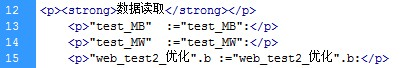
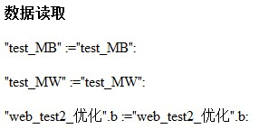

### AWP 命令 - 读取变量

用户定义的 Web 页面可从 CPU 读取 PLC
变量和数据块变量，前提是这些变量已激活"从 HMI/OPC UA/Web API 可访问"。\

语法：

-   :=\<Varname\>:

要读取的变量，可以是 PLC 变量名称、数据块变量、I/O 或位存储器。

-   对于别名或绝对地址访问的 PLC 变量，请勿使用引号将变量名称括起来。
-   对于 PLC 变量，使用双引号将变量名称括起来。
-   对于数据块变量，只用双引号将块名称括起来，变量名称位于引号外。请注意，应使用数据块名称，而不是数据块编号。
-   使用数组元素语法引用数组元素。\

**示例如下：**

-   \"test_MB\" :=\"test_MB\":
-   \"test_MW\" :=\"test_MW\":
-   \"web_test2_优化\".b :=\"web_test2_优化\".b:

**上述语句实现功能：**

-   读取名称为 "test_MB "的变量的数值；
-   读取名称为 "test_MW" 的变量的数值；
-   读取名称为 "web_test2_优化" 的 DB 块中名称为 "b"
    的变量的数值。数据块中变量的访问整体为 \"web_test2_优化\".b。\

在 HTML 编辑器中编辑如图 1 所示。

{width="419" height="68"}

图 1.HTML 编辑器中编辑读取数据

编辑完成网页中显示界面如图 2 所示 。

{width="286" height="143"}

图 2.网页显示页面
