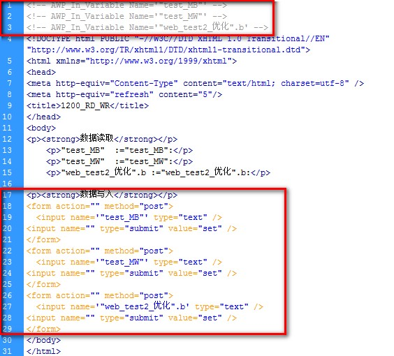

### AWP 命令 - 写入变量

用户定义的 Web 页面可将值写入 CPU 的 PLC
变量和数据块变量，前提是这些变量已激活"从 HMI/OPC UA/Web API
可访问"和"从 HMI/OPC UA/Web API 可写"。

语法：

-   \<!\-- AWP_In_Variable Name='\<Varname1\>'\--\> ： 要将 IN 变量写入
    CPU，必须首先通过一个明确的 AWP 指令来定义变量；\

要将数据写入 CPU，应使用标准 HTTP POST
命令，配合常用的文本输入域语法如下：

添加表单：

-   \<form action=\"\" method=\"post\"\> \</form\>

添加文本域，input name 后双引号中间写变量名称：

-   \<input name=\"\" type=\"text\" /\> ：

添加按钮，类型选择\"submit\"，value 后双引号中间写按钮显示的内容：

-   \<input name=\"\" type=\"submit\" value=\"\" /\> ：

**定义变量示例：**

-   \<!\-- AWP_In_Variable Name=\'\"test_MB\"\' \--\>
-   \<!\-- AWP_In_Variable Name=\'\"test_MW\"\' \--\>
-   \<!\-- AWP_In_Variable Name=\'\"web_test2_优化\".b\' \--\>

**实现功能：**

-   定义变量 "test_MB"，"test_MW"，"\"web_test2_优化\".b" 可写。

**写入修改值示例：**

> \<form action=\"\" method=\"post\"\>\
> \<input name=\'\"test_MB\"\' type=\"text\" /\>\
> \<input name=\"\" type=\"submit\" value=\"set\" /\>\
> \</form\>\
> \<form action=\"\" method=\"post\"\>\
> \<input name=\'\"test_MW\"\' type=\"text\" /\>\
> \<input name=\"\" type=\"submit\" value=\"set\" /\>\
> \</form\>\
> \<form action=\"\" method=\"post\"\>\
> \<input name=\'\"web_test2_优化\".b\' type=\"text\" /\>\
> \<input name=\"\" type=\"submit\" value=\"set\" /\>\
> \</form\>

**实现功能：**

-   添加三个表单，每个表单中添加一个文本域，文本域中写入变量修改值，点击按钮
    set 提交修改值。

在 HTML 编辑器中编辑界面如图 1 所示：

{width="564" height="510"}

图 1.HTML 编辑器中编辑

编辑完成在网页中显示如图 2 所示。

{width="240" height="151"}

图 2.网页中显示界面
