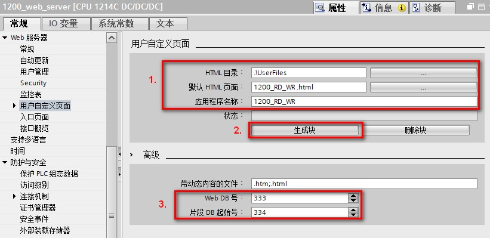
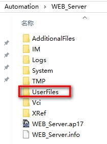
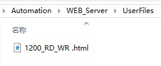
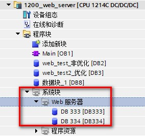

### 组态用户定义 Web 页面的使用

在 Web 服务器，用户自定义页面中进行配置，如图 1 所示。

{width="15"
height="15"}注意：添加用户自定义页面的前提是已经配置 Web
服务器相关参数。有关 Web
服务器配置，请参考[配置文档](../02-WebServer_GeneralSetting.html)。

{width="821" height="399"}

图 1.组态用户自定义页面

**图中标注 1 处**

在 HTML 目录处选择编辑好的 HTML 文件存放的路径，如图 2 和图 3 所示。

默认 HTML 页面中浏览并选中编辑好的 HTML 文件，HTML 文件见图 3。

应用程序名称填写编辑好的 HTML 文件的文件名称，HTML 文件见图 3。

{width="210" height="283"}

图 2.HTML 文件存储路径

{width="269" height="111"}

图 3.HTML 文件

**图中标注 2 处**

单击\"生成块\"(Generate blocks) 按钮时，TIA Portal 会基于指定的 HTML
源目录下的 HTML 页面生成数据块，以及一个用于 Web
页面操作的控制数据块。可以根据应用的需要设置这些属性。TIA Portal
还会生成一组片段数据块，以保存所有 HTML 页面的显示。 在生成数据块时，TIA
Portal
会更新属性，以显示控制数据块编号和首个片段数据块编号，编号的定义，见**图中标注
3 处。**

生成该数据块之后，用户定义的 Web
页面就会成为程序的一部分。与这些页面对应的块会出现在项目导航树中\"程序块\"(Program
blocks) 下\"系统块\"(System blocks) 文件夹中的\"Web 服务器\"(Web server)
文件夹中，如图 4 所示。

{width="284" height="267"}

图 4.生成DB块
