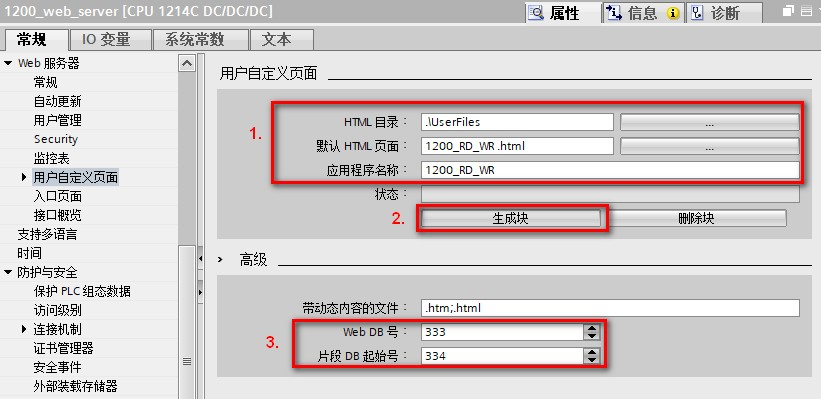
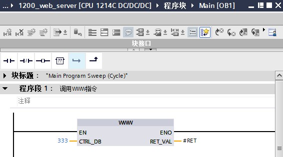

### 用户定义 Web 页面编写 WWW 指令

用户程序必须包含并执行 WWW 指令，以便能够通过标准 Web 页面访问用户定义
Web 页面。控制数据块是 WWW
指令的输入参数，指定如片段数据块中所表示的页面内容、状态以及控制信息。在组态用户定义
Web 页面时单击\"生成块\"按钮后，TIA Portal 便会创建控制数据块，如图 1
所示。

{width="821" height="399"}

图 1. Web Server 生成数据块

#### 编写 WWW 指令

要通过标准 Web 页面访问用户定义的 Web 页面，程序必须执行 WWW
指令。如果希望用户定义的 Web
页面仅在应用程序要求和首选项指定的一些情况下可用。在这种情况下，程序逻辑可控制何时调用
WWW 指令，如图 2 所示。

{width="566" height="315"}

图 2. Web Server 程序调用 WWW 指令

WWW 指令位于"通信指令 \> WEB 服务器"指令库下，如图 3 所示。

{width="329" height="196"}

图 3. WWW指令

CTRL_DB 参数对应于控制 DB 的 DB 编号，参考图 1 的标注 3 处的 "Web DB
号"，该参数必须正确填写。返回值 (RET_VAL) 包含函数结果。

注意，WWW 指令异步执行，RET_VAL 输出的初始值可能为
0，但这不能说明后来不会发生错误。

程序会检查控制 DB 的状态，以确定应用程序是否已成功启动，或者通过随后对
WWW 的调用来检查 RET_VAL。表 1 为 RET_VAL 的值说明。

表 1 RET_VAL 的值说明

+-----------------------------------+-----------------------------------+
| ::: {align="left"}                | ::: {align="left"}                |
| RET_VAL                           | 说明                              |
| :::                               | :::                               |
+-----------------------------------+-----------------------------------+
| ::: {align="left"}                | ::: {align="left"}                |
| 0                                 | 无错误                            |
| :::                               | :::                               |
+-----------------------------------+-----------------------------------+
| ::: {align="left"}                | ::: {align="left"}                |
| 16#00yx                           | x：                               |
| :::                               | 相关位声称的请求处于等待状态：\   |
|                                   | x=1： 请求 0\                     |
|                                   | x=2： 请求 1\                     |
|                                   | x=4： 请求 2\                     |
|                                   | x=8： 请求 3\                     |
|                                   | 可以对 x                          |
|                                   | 值进行逻辑或运                    |
|                                   | 算，以说明多个请求处于等待状态。  |
|                                   | 例如，如果 x = 6，则说明请求 1    |
|                                   | 和请求 2 处于等待状态。\          |
|                                   | y： 0: 没有错误；1：              |
|                                   | 存在错误，并且已在控制 DB         |
|                                   | 中置位\"last_error\"              |
|                                   | :::                               |
+-----------------------------------+-----------------------------------+
| ::: {align="left"}                | ::: {align="left"}                |
| 16#803a                           | 未装载控制 DB。                   |
| :::                               | :::                               |
+-----------------------------------+-----------------------------------+
| ::: {align="left"}                | ::: {align="left"}                |
| 16#8081                           | 控制 DB 的类型、格式或版本错误。  |
| :::                               | :::                               |
+-----------------------------------+-----------------------------------+
| ::: {align="left"}                | ::: {align="left"}                |
| 16#80C1                           | 没有资源可用于初始化 Web          |
| :::                               | 应用程序。                        |
|                                   | :::                               |
+-----------------------------------+-----------------------------------+
