### TS Adapter IE Basic 简要介绍

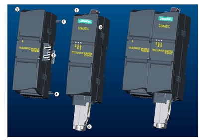{width="410" height="281"}

图. 模块外观

TeleService Adapter IE Basic 是新一代适配器侧重于通过 S7-1200 PLC
经工业以太网或 Profinet
实现简单、经济有效且安全的远程服务或远程维护服务。由于采用模块化设计，用户可以根据各自的电信基础设施选择不同的
TeleService 模块。目前，提供带模拟、ISDN、GSM 调制解调器的 TS
模块和一个用于连接外部调制解调器的模块。详细的订货信息请参考下列表格：

  ----------------------- ------------------------- ---------------------
                          产品名称                  订货号
  基本单元 (始终需要)：   TS Adapter IE Basic       6ES7 972-0EB00-0XA0
  TS 模块                 TS Module Modem           6ES7 972-0MM00-0XA0
                          TS Module ISDN            6ES7 972-0MD00-0XA0
                          TS Module RS 232          6ES7 972-0MS00-0XA0
                          TS Module GSM             6GK7 972-0MG00-0XA0
  附件                    S7-300 导轨的安装适配器   6ES7 972-0SE00-7AA0
                          四频 GSM 天线             6NH9 860-1AA00
  ----------------------- ------------------------- ---------------------

表.订货信息

### 硬件和软件需要

硬件：

-   TS Adapter IE Basic
-   TS模块（根据需要选择一种）
-   S7-1200PLC
-   电脑及普通网卡
-   电话调制解调器
-   网线
-   电话线

软件：

-   SIMATIC STEP 7 Professional V11或STEP7 Basic V11

### 初次使用，为TS Adapter IE Basic 分配IP地址

处于出厂设置的TS Adapter IE Basic
没有IP地址，只有MAC地址，用户需要通过直接连接的方式（如下图所示），使用STEP
7 Basic
软件为其分配IP，然后才能访问其配置网页。首先，您需要通过一根以太网线直接连接（或者经过交换机）将电脑网卡和TS
Adapter UE Basic 的以太网口连接起来，如下图所示：

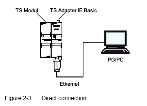{width="303" height="219"}

图. 直接连接

一、在STEP 7 Basic V11中，展开项目树下的"Online access"，鼠标双击"Update
accessible devices"，可以经由PC网卡浏览到TS Adapter basic
IE。处于出厂设置的TSA basic没有IP，仅能访问浏览到MAC地址。\

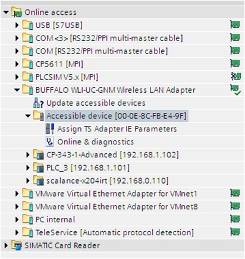{width="412" height="436"}

图. 可访问的设备1

二、鼠标双击"Asign TS AdapterIE Parameters"，打开下面窗口：\

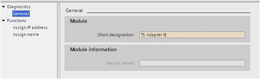{width="523" height="160"}

图. TSA 参数

在"Functions"下面的\"Assign IP address
"中填入您需要设定的IP地址和子网掩码。如需要使用路由器，则勾选\"Use
router"，并在下方的"Router
address"中填写路由器的IP地址。填写完成后即点击\"Assign IP address
"按钮即完成分配。

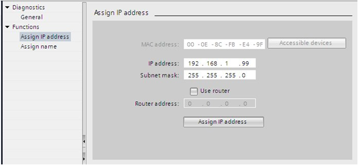{width="601" height="277"}

图. 填写IP 地址

设置成功后可以在信息窗口中看到成功信息，并在项目树种刷新出TS Adapter IE
basic 的IP地址：

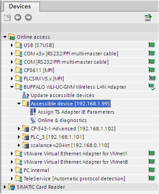{width="322" height="392"}

图. 可访问的设备2

### 建立拨号连接 {#建立拨号连接 align="left"}

接下来您可以按照下面网络结构来连接远程的PLC设备了，在电脑本地，需要有一个电话调制解调器连接到公共电话网络，在PLC远程一侧，也需要将一根公共电话网络的电话线插到TS
Module上，通过一根以太网线或者经过交换机，将TS Adapter IE Basic
的以太网口和CPU1200的以太网口连接起来。

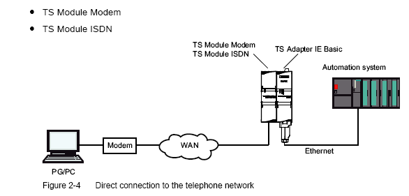{width="586" height="281"}

图. 远程连接

#### 1、在设置PG/PC 中选择"TS Adapter IE" {#在设置pgpc-中选择ts-adapter-ie align="left"}

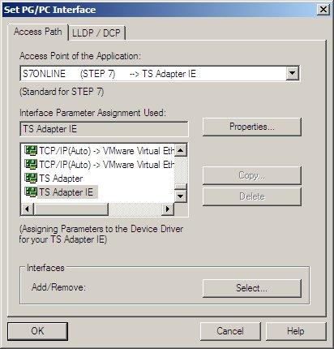{width="412" height="430"}

图. 设置PG/PC接口

第一次使用TS适配器时，设置PG/PC 接口中可能没有"TS Adapter IE"，
您需要点击上图中的"Select\..."按钮添加，如下图所示，选中左侧的"TS
Adapter IE"，点击"Install\--\>"按钮添加。

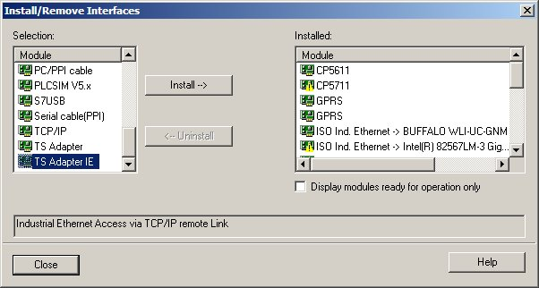{width="602" height="322"}

图. select

#### 2、在STEP 7 V11 项目树中展开"Online access"，双击"phone book"打开电话薄。 {#在step-7-v11-项目树中展开online-access双击phone-book打开电话薄 align="left"}

##### 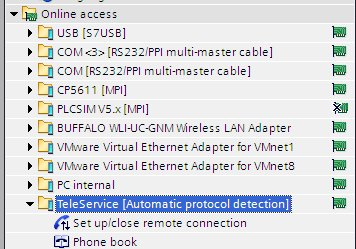{width="356" height="249"} {#section align="left"}

图. 在线访问

#### 3、在电话簿中添加TS Adapter IE 的电话号码、用户名和密码等信息。 {#在电话簿中添加ts-adapter-ie-的电话号码用户名和密码等信息 align="left"}

如果您没有在TS Adapter IE
Basic的配置网页中修改过安全信息，则它的默认用户名是"Administrator"(注意A大写)，密码是"admin"

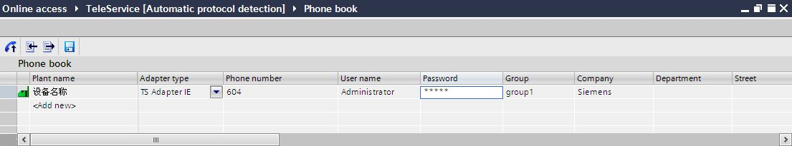{width="1105" height="205"}

图. 电话薄

#### 4、建立拨号连接 {#建立拨号连接-1 align="left"}

可以双击指令树中的"Set up/close remote
connection"或者直接点击电话簿左上角的按钮{width="27"
height="27"}，建立拨号连接。

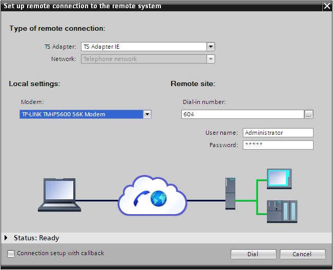{width="650" height="527"}

图. 建立拨号连接

#### 5、点击上图所示中的"Dail"按钮，即开始拨号，拨号连接成功建立后，上面的窗口会自动关闭。 {#点击上图所示中的dail按钮即开始拨号拨号连接成功建立后上面的窗口会自动关闭 align="left"}

拨号连接成功建立后，双击项目树中的"Update accessible devices",
就能够在在线和访问中浏览到远程的设备了，如下图所示

{width="332" height="176"}

图. 远程的设备。

#### 6、在STEP 7 V11软件的"Extend download to device\" 中，\"Type of PG/PC interface \"和"PG/PC interface "都选择"TeleService"，点击"Load"按钮即能开始下载： {#在step-7-v11软件的extend-download-to-device-中type-of-pgpc-interface-和pgpc-interface-都选择teleservice点击load按钮即能开始下载 align="left"}

##### 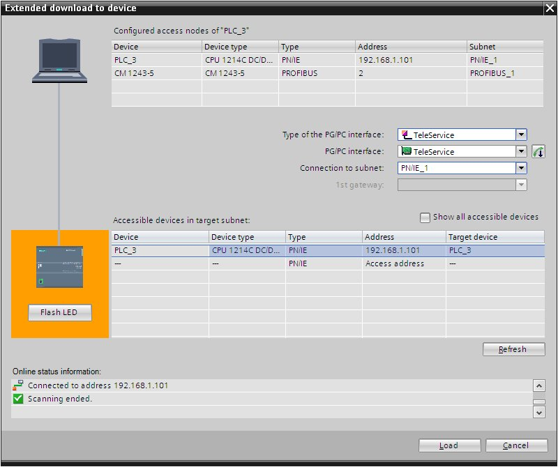{width="800" height="670"} {#section-1 align="left"}

图. 扩展的下载到设备

### 挂断拨号连接 {#挂断拨号连接 align="left"}

当您完成下载任务后，您可通过再次双击项目树中\"Online access"\--\>\"Set
up/close remote connection"， 即可挂断拨号连接，如下图所示：

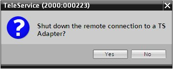{width="358" height="144"}

图. 挂断连接
