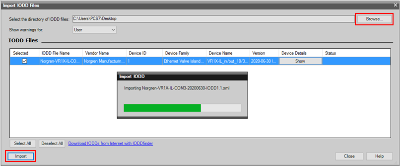
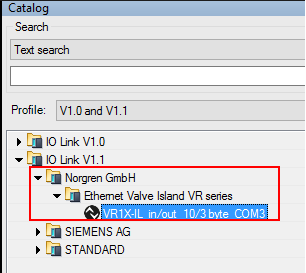

### IO-Link 概述

**定义：** IO-Link 是一种创新型点到点通信接口，适用于符合 IEC 61131-9
标准的传感器/执行器应用领域。

IO-Link 包含以下系统组件：

-   IO-Link 主站
-   IO-Link 设备

如：

-   传感器/执行器
-   RFID 阅读器
-   I/O 模块
-   阀

使用 3 线制或 5 线制非屏蔽标准电缆

对 IO-Link 进行组态和分配参数的工程组态工具

西门子推出了各种 IO-Link 产品并提供相应的技术支持：

-   主站
-   设备，I/O 模块
-   设备，工业开关装置
-   设备，RFID 系统（射频识别）
-   端口组态工具 - S7-PCT：

{width="15" height="15"} 按住 Shift
键时用鼠标点击下列链接，打开新浏览器窗口。

<https://support.industry.siemens.com/cs/cn/zh/view/32469496>

### 一、IO-Link 协议

在 IO-Link 系统的技术定义中，IO-Link 协会首先创建了规范版本 1.0，
IO-Link 系统的进一步开发和附加功能产生了版本 1.1。 版本 1.1 在 1.0
的基础上主要增加功能：

-   操作过程中设备更换，进行数据备份（备份与恢复）
-   IO-Link 主站的数据传输速率强制为 230.4 kbps

在 IO-Link 规范 V1.1 中，IO-Link
操作模式中定义了三种数据传输速率（波特率）：

-   COM 1 = 4.8 kbps
-   COM 2 = 38.4 kbps
-   COM 3 = 230.4 kbps （V1.1）

组合 IO-Link 设备时，请注意：

-   只有符合 V1.0 的 IO-Link 设备才可在符合 V1.0 的 IO-Link 主站上运行。
-   符合 V1.0 和 V1.1 的 IO-Link 设备可在符合 V1.1 的 IO-Link
    主站上运行。
-   仅当 IO-Link 设备同样支持数据备份和能和 230.4 kbps
    的数据传输速率时，IO-Link 主站 V1.1 及以上版本才能使用这些功能。

### 二、组态方式

IO-Link 系统组态方式有两种：

① 不使用 S7-PCT 进行组态

② 使用 S7-PCT 进行组态

功能区别如下表所示：

  要求                                    使用 S7-PCT 进 行组态   不使用 S7-PCT 进行组态   
  --------------------------------------- ----------------------- ------------------------ --------
  **IO-Link 自动启动**                    **IO-Link 手动启动**                             
  使用 IO-Link 设备描述 IODD              √                       \-                       \-
  设置输入和输出数据的长度（每 个端口）   自动                    手动                     手动
  分配供应商 ID 和设备 ID                 自动                    \-                       手动
  IO-Link 设备更换时的特性                可编程                  \-                       可编程
  IO-Link 循环时间可调整                  √                       \-                       \-
  IO-Link 设备参数可调整                  √                       \-                       \-
  显示 IO-Link 过程数据结构               √                       \-                       \-
  监视 IO-Link 过程数据                   √                       \-                       \-
  显示 IO-Link 设备的诊断消息             √                       \-                       \-

从上表可见：

1、使用 S7-PCT 进行组态的特点

① 使用 S7 端口组态工具 (S7-PCT) 组态 IO-Link
主站，不仅可显示完整的系统架构，而且还可对 IO-Link
系统进行详细组态和参数设置。

② 通过 S7-PCT，可通过设备制造商提供的 IODD 轻松组态 IO-Link 设备。

③ 在 S7-PCT 在线视图中，可显示 IO-Link 设备的详细诊断状态和过程值。

2、不使用 S7-PCT 进行组态的特点

① 如果选择"IO-Link 自动组态"，则采用 IO-Link
设备的默认工作模式（自动获取供应商 ID 和设备
ID，且无法进行详细组态和设置参数）。

② 如果选择"IO-Link 手动组态"，则采用 IO-Link
设备的默认工作模式（需手动设置供应商 ID 和设备
ID，且无法进行详细组态和设置参数）。

对于 IO-Link master 主站模块而言，各个版本均可以选择"使用 S7-PCT
进行组态"功能。 是否可选择"不使用 S7-PCT 进行组态"，取决于 TIA Portal
的版本和 IO-Link 主站模块的固件版本，具体信息请查阅：

{width="15" height="15"} 按住 Shift
键时用鼠标点击下列链接，打开新浏览器窗口。

<https://support.industry.siemens.com/cs/cn/zh/view/65949252>
，章节：3.1.3 组态方式概述。

后续内容以 S7-1200 的 IO-Link master 模块 SM1278
的使用为例进行说明，要实现上述"不使用 S7-PCT 进行组态"功能，要求：

① TIA Portal step7 V15.1 及以上版本

② SM1278 固件 V2.1 及以上版本

### 三、常见问题

1\. 如何向 S7-PCT 中添加第三方 IO-Link 设备？

打开 S7-PCT 工具软件，菜单："Options\>Import IODD"。

{width="519" height="272"}

图.01

点击"Browse"选择 IODD 文件，点击"Import"按钮进行安装。

{width="806" height="334"}

图.02

安装完成后，在右侧目录中可见第三方 IO-Link 设备。

{width="306" height="273"}

图.03

2.对于某些 IO-Link 设备需要通过非周期访问读取/修改设备参数，如何实现？

以下链接中提供的库，包含可用于处理 SIMATIC S7 的 IO-Link
通信模块设备参数以及所连接 IO-Link 设备数据记录的函数块。

{width="15" height="15"} 按住 Shift
键时用鼠标点击下列链接，打开新浏览器窗口。

<https://support.industry.siemens.com/cs/cn/en/view/82981502>

3.如何使用端口组态工具\"S7-PCT\"建立与IO-Link Master的连接？

{width="15" height="15"} 按住 Shift
键时用鼠标点击下列链接，打开新浏览器窗口。

<https://support.industry.siemens.com/cs/cn/zh/view/109479071>
