### SM1278------使用S7-PCT

**硬件：**

① CPU 1214FC DC/DC/DC V4.4

② SM1278 V2.1（IO-Link 协议版本 V1.1）

③ 带 IO-Link 接口的 RF260R V1.0

④ IO-LINK MODULE K20， 8DI-M8

**软件：**

① 本文中使用 TIA Portal STEP7 V16

② 本文中使用 S7-PCT V3.5 SP1

**硬件接线，请参考相关手册：**

① SM1278 接线端子定义，参考下面链接中的手册，章节：A.12.1 SM 1278
4xIO-Link 主站

{width="15" height="15"} 按住 Shift
键时用鼠标点击下列链接，打开新浏览器窗口。

<https://support.industry.siemens.com/cs/cn/zh/view/109772940>

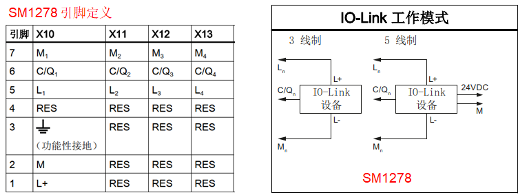{width="752" height="283"}

图.01

② 带 IO-Link 接口的 RF260R 接线端子定义，参考下面链接中的手册，章节：9
连接电缆

{width="15" height="15"} 按住 Shift
键时用鼠标点击下列链接，打开新浏览器窗口。

<https://support.industry.siemens.com/cs/cn/zh/view/109747228>

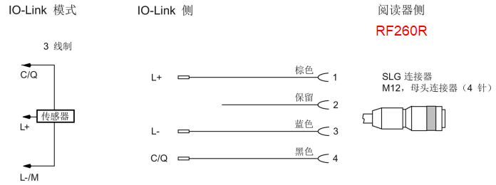{width="696" height="260"}

图.02

③ IO-LINK MODULE K20， 8DI-M8 接线端子定义，参考下面链接

{width="15" height="15"} 按住 Shift
键时用鼠标点击下列链接，打开新浏览器窗口。

<https://support.industry.siemens.com/cs/cn/zh/view/29683449> .

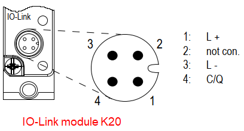{width="408" height="219"}

图.03

注意：下文中涉及 RFID 的三种工作模式，SIO 模式，UID 模式，User data
模式；

相关详细的使用说明，请参见如下手册中的章节：5.3 RF200 IO-Link
阅读器的模式

{width="15" height="15"} 按住 Shift
键时用鼠标点击下列链接，打开新浏览器窗口。

<https://support.industry.siemens.com/cs/cn/zh/view/109747228>

### 一、使用 S7-PCT，SIO 模式

打开 TIA Portal，组态 CPU 1214FC 和 SM1278 模块，取消勾选 "组态无需使用
S7-PCT"，如图 4 所示：

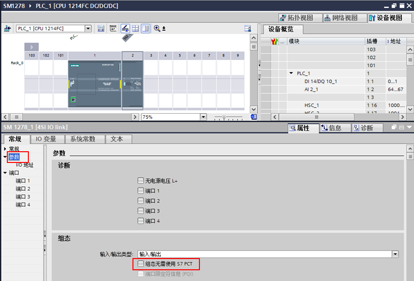{width="847" height="576"}

图.04

注意：对于新配置的 SM1278 模块，建议先将该未配置任何 IO-Link
设备的组态下载到 PLC 中，使得 CPU 能通过背板总线正确识别到 SM1278。

然后，在 SM1278 上鼠标右键，菜单选择"启动设备工具..."，如图 5 所示：

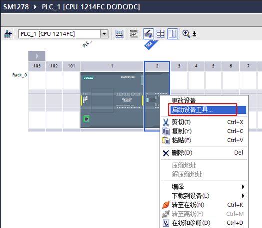{width="524" height="456"}

图.05

进入 S7-PCT 配置界面，对 RF260R 和 IO-LINK MODULE K20， 8DI-M8
进行配置，如图 6 所示：

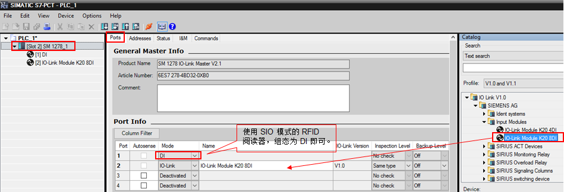{width="949" height="324"}

图.06

端口 3 和端口 4 未连接设备，则"mode"设置为"Deactivated"。（注：如果使用
RFID 的 SIO 模式，须通过 S7-PCT 进行设置）。

点击"Addresses"菜单查看 IO-Link 设备的 IO 地址，如图 7 所示：

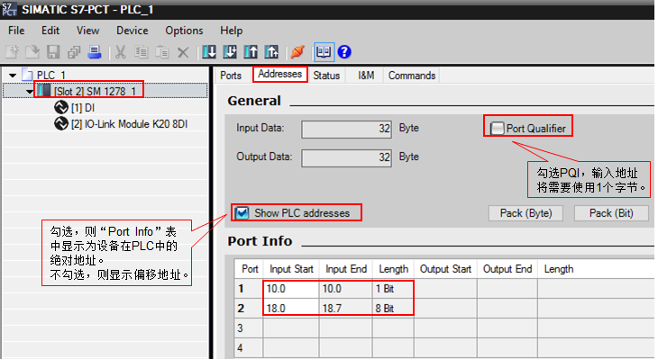{width="730" height="399"}

图.07

在 S7-PCT 中，点击按钮 {width="24" height="23"}
，下载成功后，退出 S7-PCT，打开监控表，如图 8 所示：

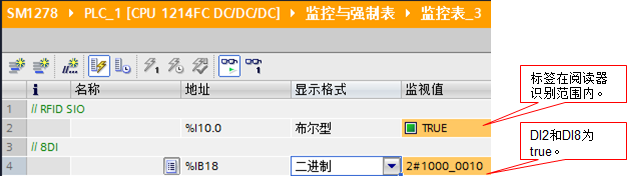{width="627" height="178"}

图.08

### 二、使用S7-PCT，UID 模式

也可以通过 S7-PCT 读取 RFID 标签中的 UID值，对 RFID
阅读器进行组态方法，如图 9 所示：

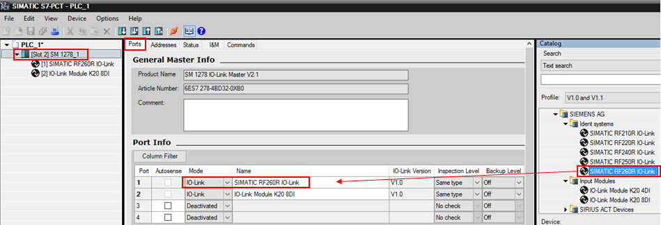{width="949" height="324"}

图.09

点击"Addresses"菜单查看 IO-Link 设备的 IO 地址，如图 10 所示：

{width="636" height="358"}

图.10

选择端口 1 的 RF260R，在属性\"Parameters\>Operating Mode\"中选择"Scan
UID"模式，设置如图 11 所示：

{width="564" height="340"}

图.11

在 S7-PCT 中，点击按钮 {width="21" height="19"}
，下载成功后，退出 S7-PCT，打开监控表，如图 12 所示：

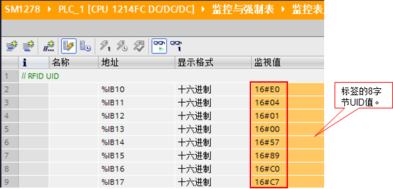{width="565" height="272"}

图.12

### 三、使用S7-PCT，User data 模式

如需使用 RFID 的 User data 模式（该模式必须使用 S7-PCT
进行组态），在属性\"Parameters\>Operating Mode\"中选择"Scan user
data"模式，设置如图 13 所示：

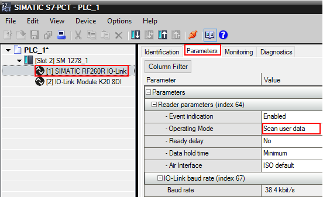{width="552" height="337"}

图.13

在 S7-PCT 中，点击按钮 {width="21" height="19"}
，下载成功后，退出 S7-PCT，打开监控表。
本例中，对标签的用户数据区，偏移起始地址为16#0A，写入 4 个数据，如图 14
所示为写数据操作：

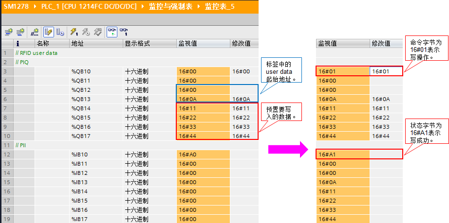{width="922" height="459"}

图.14

对标签的用户数据区，偏移起始地址为16#0A，读取 4个数据，如图 15
所示为读数据操作：

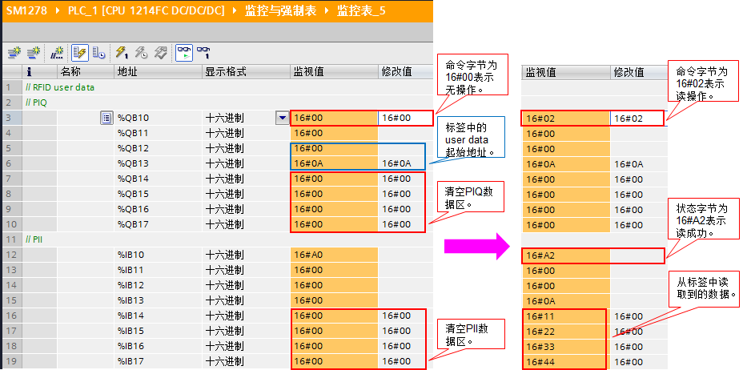{width="933" height="462"}

图.15

**对于 PIQ 和 PII 的定义和说明请查看本文前部提供的链接中下载的手册。**

通过上述图 14 和图 15 的操作，可见：通过 PIQ 和 PII 操作 RFID
标签的用户数据区不太灵活，且每次操作的数据局限于 4 个字节。

对于有大量用户数据需要进行读和写操作的应用，建议使用使用西门子官方提供的指令库：

{width="15" height="15"} 按住 Shift
键时用鼠标点击下列链接，打开新浏览器窗口。

<https://support.industry.siemens.com/cs/cn/en/view/73565887>
