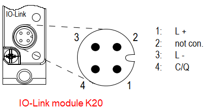

### SM1278------不使用S7-PCT

**硬件：**

① CPU 1214FC DC/DC/DC V4.4

② SM1278 V2.1（IO-Link 协议版本 V1.1）

③ 带 IO-Link 接口的 RF260R V1.0

④ IO-LINK MODULE K20，8DI-M8

**软件：**

① 本文中使用 TIA Portal STEP7 V16

**硬件接线，请参考相关手册：**

① SM1278 接线端子定义，参考下面链接中的手册，章节：A.12.1 SM 1278
4xIO-Link 主站

{width="15" height="15"} 按住 Shift
键时用鼠标点击下列链接，打开新浏览器窗口。

<https://support.industry.siemens.com/cs/cn/zh/view/109772940>

{width="752" height="283"}

图.01

② 带 IO-Link 接口的 RF260R 接线端子定义，参考下面链接中的手册，章节：9
连接电缆

{width="15" height="15"} 按住 Shift
键时用鼠标点击下列链接，打开新浏览器窗口。

<https://support.industry.siemens.com/cs/cn/zh/view/109747228>

{width="696" height="260"}

图.02

③ IO-LINK MODULE K20，8DI-M8 接线端子定义，参考下面链接

{width="15" height="15"} 按住 Shift
键时用鼠标点击下列链接，打开新浏览器窗口。

<https://support.industry.siemens.com/cs/cn/zh/view/29683449>

{width="408" height="219"}

图.03

### 一、不使用S7-PCT，自动组态

打开 TIA Portal，组态 CPU 1214FC 和 SM1278 模块，设置为"组态无需使用
S7-PCT"，如图 4 所示：

{width="732" height="670"}

图.04

**注意：对于需要自动组态的 IO-Link
设备，请提前了解所连接设备的相关资料，确定在自动模式下，该设备所具备的功能和需要的
IO 地址长度。**

需要注意：如果在"参数"页面中勾选"端口限定符信息（PQI）"，则每个端口所连接的
IO-Link 设备的输入地址将多占用1个字节。

本例中，使用的带 IO-Link 接口的 RF260R V1.0
在**自动组态模式**下需要8字节输入和8字节输出，**返回的8字节输入为 RFID
标签中的 UID 值**；IO-LINK MODULE K20，8DI-M8 是一个 8DI
模块，自动组态模式下需要1字节输入。

端口 1 连接带 IO-Link 接口的 RF260R V1.0，设置如图 5 所示：

{width="534" height="518"}

图.05

端口 2 连接 IO-LINK MODULE K20，8DI-M8，设置如图 6 所示：

{width="538" height="520"}

图.06

端口 3 和端口 4 未连接设备，则操作模式设置为"已禁用"。

将组态下载到 PLC 中，当一个 RFID 标签放到 RF260R
可识别范围内，可读取到标签的 UID；当 K20，8DI 有输入信号时，可查看 PLC
监控表，如图 7 所示：

{width="572" height="351"}

图.07

通道状态诊断字节的说明，如图 8 所示：

{width="522" height="242"}

图.08

当端口 1 和端口 2 的 IO-Link 设备断开时，查看诊断字节状态，如图 9 所示：

{width="569" height="346"}

图.09

### 二、不使用S7-PCT，手动组态

IO-Link
设备允许拥有一个区分设备类型的唯一标识码。这样可以检查设置是否正确，并在更换设备时自动进行参数设置。
两个识别码：

① 供应商 ID：设备制造商可以通过供应商 ID 来确定。

② 设备 ID：设备 ID 标识设备制造商范围内的设备类型。

除了使用 S7-PCT 的基本工具组态外，所有西门子的 IO-Link V1.1
主站系统都可以在不使用任何 IO-Link
组态工具的情况下进行调试。因此，必须在\"IO-Link 手动组态\"
操作模式中输入已连接的 IO-Link 设备的供应商 ID 和设备 ID。

如下链接说明了，如果通过手动组态，需要设备供应商 ID 和设备 ID。

{width="15" height="15"} 按住 Shift
键时用鼠标点击下列链接，打开新浏览器窗口。

<https://support.industry.siemens.com/cs/cn/zh/view/109748852>

① 在上述链接中，文末提供了如何获取供应商 ID 的链接：

{width="15" height="15"} 按住 Shift
键时用鼠标点击下列链接，打开新浏览器窗口。

<https://io-link.com/share/Downloads/Vendor_ID_Table.xml>

打开网页后，可以查看到各品牌的供应商
ID。本例中使用的产品为西门子产品，供应商 ID 为 42，如图 10 所示：

{width="686" height="298"}

图.10

② 上述链接中，提供了如何获取设备 ID 的链接：

{width="15" height="15"} 按住 Shift
键时用鼠标点击下列链接，打开新浏览器窗口。

<https://ioddfinder.io-link.com/>

打开网页后，可以通过设备的订货号进行查询。
本例中使用的产品为西门子产品，通过设备订货号可以查到设备 ID，如图 11
所示：

{width="960" height="224"}

图.11

端口 1 连接带 IO-Link 接口的 RF260R V1.0，在\"IO-Link 手动组态\"
操作模式中输入供应商 ID 和设备 ID，设置如图 12 所示：

{width="445" height="224"}

图.12

端口 2 连接 IO-LINK MODULE K20，8DI-M8，在\"IO-Link 手动组态\"
操作模式中输入供应商 ID 和设备 ID，设置如图 13 所示：

{width="445" height="224"}

图.13

将通过\"IO-Link 手动组态\" 的组态下载到 PLC
中，同样可以在线监控到设备数据，结果与 "图.07" 相同。
