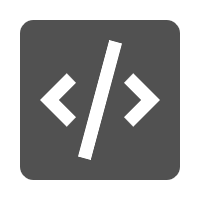

# S7-1200 PLC EasyPlus

## 说明

- S7-1200 EasyPlus 包括 S7-1200 PLC 系列的使用、通信、技术工艺等的编程配置的详细步骤，并对用户经常，甚至是必然遇到的问题、疑问的解答，以及隐含着其他许多问题答案的叙述性文字，还有一些作者认为有助于读者理解、解决问题的背景知识。S7-1200 Easy Plus力争做到精简实用，帮助技术人员快速上手，解决使用中的常见问题。
- S7-1200 EasyPlus 的内容来自西门子的技术资料，西门子的产品开发、技术支持工程师的知识、经验，用户的知识和经验，以及其他技术资料。
- S7-1200 EasyPlus 不能代替或部分代替西门子的任何正式出版物，如产品宣传样本，产品目录，产品手册，随同产品、软件发布的说明性文档和在线帮助文件等等。在所有正式场合，一切应以西门子的正式出版物为准。
- S7-1200 Easy Plus 原版是HTML Help格式的文档，版本号为 **Version4.3**,本项目以其为摹版，诸章逐条归纳转换。
- 虽然作者已经尽力保证其正确性，但疏漏难免。读者如欲采纳，请注意风险。
- 如果您认为本项目对您有所帮助，请您[加星+关注](https://github.com/lybhb8/S7-1200EasyPlus/tree/main "本项目github仓库")，也可以给朋友分享:
    - [https://blowmoldingshare.cn/S7-1200EasyPlus/](https://blowmoldingshare.cn/S7-1200EasyPlus/ "本项目github/gh-pages部署")。
    - [https://s7-1200plc-easyplus.readthedocs.io/zh-cn/latest/](https://s7-1200plc-easyplus.readthedocs.io/zh-cn/latest/ "本项目readthedocs部署")。
- 感谢大家的支持和帮助。

## S7-1200 PLC 基础汇总

-  __[S7-1200 简介]__   SIMATIC S7-1200 特性综述。
-  __[S7-1200 硬件]__   SIMATIC S7-1200 可编程控制器硬件组成、模块、参数、性能。
-  __[网络资源]__    SIMATIC S7-1200 PLC 西门子工业在线支持的网络资源汇总。
-  __[版本信息]__    本文档简要 S7-1200 系列 CPU 的固件常见的升降级、组态、兼容性相关问题。

  

## [S7-1200 PLC 组态编程](07-Program/index.md)

-  __[TIA Portal STEP 7 V18]__   S7-1200 PLC 开发工具平台组态软件TIA Portal STEP 7 V18 安装要求和安装实例
-  __[TIA Portal STEP7 组态软件操作]__    STEP 7 (TIA Portal) 是用于组态 SIMATIC S7-1200、S7-1500、S7-300/400 和 WinAC 控制器系列的工程组态软件。
-  __[编程基础]__   S7-1200 PLC 数据类型、OB组织块、 FC函数、FB函数块、DB背景数据块。
-  __[编程指令]__    S7-1200 PLC 编程语言中的指令和编程语言：基础指令、扩展指令、工艺指令、SCL语言、间接寻址等。

 [S7-1200 简介]: 02-introduction/index.md
 [S7-1200 硬件]: 03-hardware/index.md
 [网络资源]: 01-resource/source/index.md
 [版本信息]: 04-version/index.md

 [TIA Portal STEP 7 V18]: ./07-Program/install.md
 [TIA Portal STEP7 组态软件操作]: ./07-Program/01-operation/index.md
 [编程基础]: ./07-Program/02-basic/index.md
 [编程指令]: ./07-Program/03-instruction/index.md
