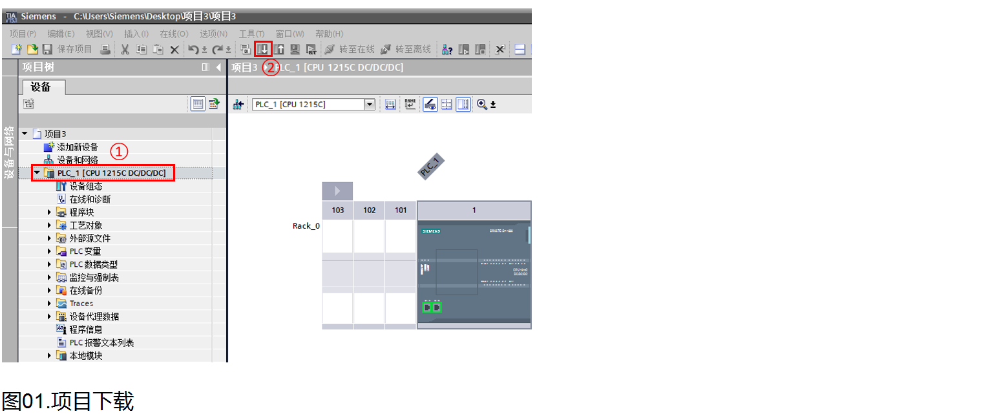
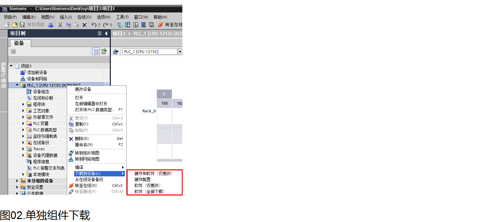
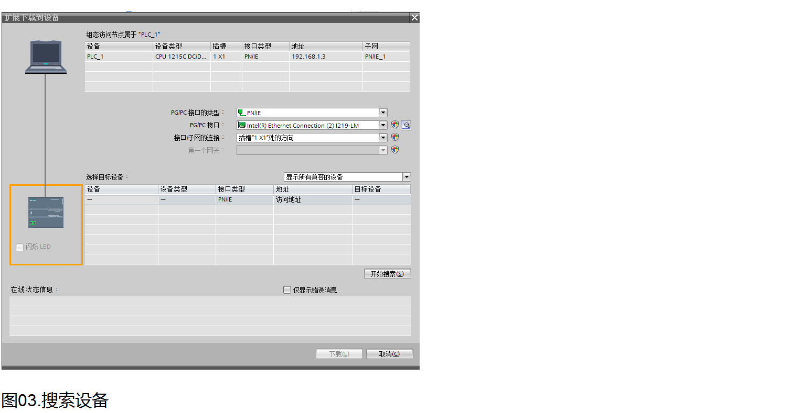

# 项目下载

S7-1200的CPU本体上集成了PROFINET通信口，通过这个通信口可以实现CPU与编程设备的通信。

此外，S7-1200 可以通过连接CM1243-5扩展模块，然后电脑通过PC ADAPTER USB A2电缆、或者电脑上的CP卡（例如CP5612）通过PROFIBUS DP线进行下载。

当然，S7-1200 还可以通过连接CP1243-1扩展模块，然后电脑通过网线进行下载。

在这里只介绍最常用的第一种方法，后两种方法只需在下载页面修改接口类型或接口即可。

STEP 7 TIA Portal 软件向用户提供了简便、灵活的下载方式，操作步骤如下：

## 1.下载到设备

在项目树中，选中需要下载的项目文件夹，然后执行菜单命令"在线〉下载到设备"或直接点击工具栏上的图标"下载到设备"，如图01所示。

另外，还可以下载单独的组件，例如硬件组态和程序块。在项目树中，右键点击项目文件夹，如图02所示，在弹出的菜单中会提供如下菜单命令：

- **下载到设备〉硬件和软件（仅更改）**：设备组态和改变的程序下载到CPU中。 
- **下载到设备〉硬件配置** ：只有硬件组态下载到CPU中。 
- **下载到设备〉软件（仅更改）**：只有改变的程序块下载到CPU中。 
- **下载到设备〉软件（仅更改）**：下载所有的程序块到CPU中。 

S7-1200下载程序必须是一致性下载，也就是无法做到只下载部分块到CPU。

## 2.扩展的下载到设备
在弹出的 **扩展的下载到设备** 对话框中，设置PG/PC接口类型，其 **PG/PC接口** 下拉选项中选择编程设备的网卡，点击 **开始搜索** ，如图03所示。
