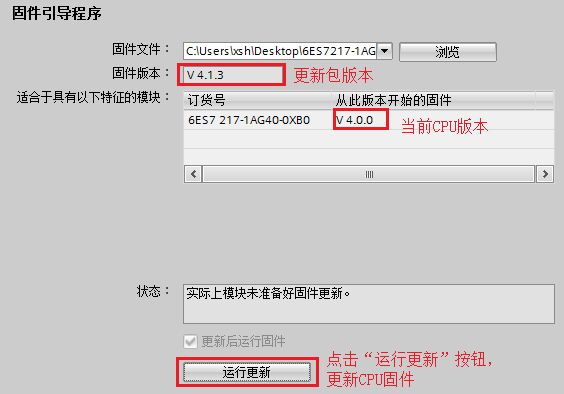

# CPU固件升级

伴随着TIA 软件V13 版本以及S7-1200 CPU V4.0 固件版本的发布，S7-1200 CPU的固件已经可以通过以下几种方式进行升级：

- 使用存储卡更新CPU固件，具体步骤请参考 [存储卡](../08-Function/10-Memory_Card.md#memorycard使用存储卡更新s7-1200cpu的固件版本-使用存储卡更新s7-1200cpu的固件版本-style1)的使用章节
- 使用TIA软件更新CPU固件
- 通过Web访问方式更新CPU固件

本文将详细介绍上述方法中的后两种。
固件下载链接参见：[链接](../01-resource/08-online_download.md#s7-1200-固件下载)。

## 使用TIA软件更新CPU固件

1.打开所连接 CPU 的"在线和诊断"(Online and Diagnostics) 视图，并切换到“在线”模式。如图1所示。

2.从"Functions"文件夹中选择"固件更新"(Firmware update)，并单击 <kbd> **浏览(Browse)** </kbd>  按钮并导航至包含固件更新文件的位置。如图2所示

3.浏览到新版本固件后，点击 <kbd> **运行更新** </kbd> 按钮，即可执行更新CPU固件操作。如图3所示。

在加载固件更新时会显示进程对话框。固件更新完成后，对话框会提示您使用新固件启动模块。

## 通过Web访问方式更新CPU固件

1.启动CPU的Web服务器功能

如果需要通过Web方式更新CPU固件，首先需要在设备组态视图中选择CPU，在CPU属性中使能“启动模块上的Web服务器”。
并出于安全考虑，对Web服务器进行安全访问时，需要选择"仅允许使用 HTTPS 访问"。相关设置如图4所示。

2.组态Web服务器用户权限。

为了使能Web服务器升级固件功能，需要组态Web服务器访问CPU的权限，需要在Web服务器属性的“用户管理”中添加授权的用户名、访问权限和密码。
本例需要开放“执行固件更新”权限，如图5所示。

将上述的Web服务器组态下载到CPU后，授权用户就可以通过Web服务器访问CPU。

3.通过PC 访问Web页面

首先需要确保PC机与S7-1200 CPU位于同一个以太网络中，然后打开 Web 浏览器，输入 URL "https://ww.xx.yy.zz"，其中"ww.xx.yy.zz"为 S7-1200 CPU 的 IP 地址。
并在Web服务器上登录授权用户，如图6所示。

4.登录授权用户后，点击“模块信息”，然后点击相应PLC站点名称，即可查看PLC 站点信息，如图7所示。

5.在PLC站点信息显示页面，点击 <kbd> **固件** </kbd> 按钮，并"浏览"至固件更新包，点击<kbd> **运行更新** </kbd> 按钮，即可执行CPU固件更新操作。如图8所示。

