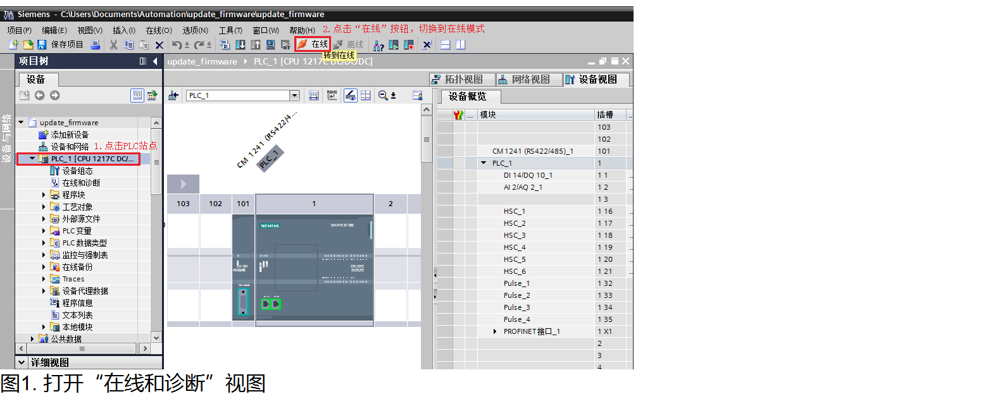
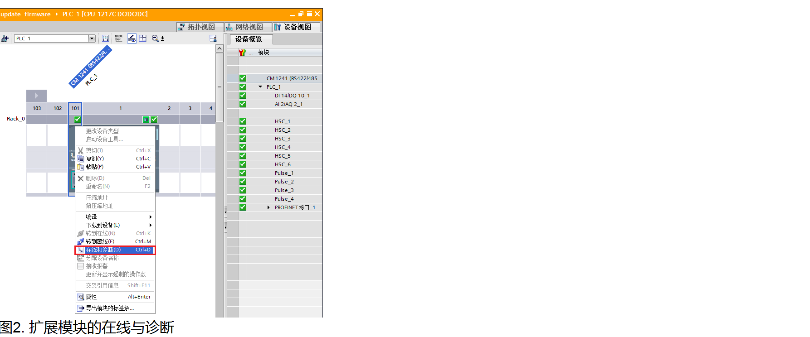
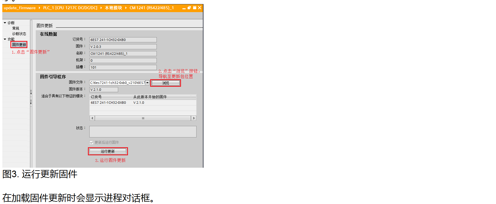
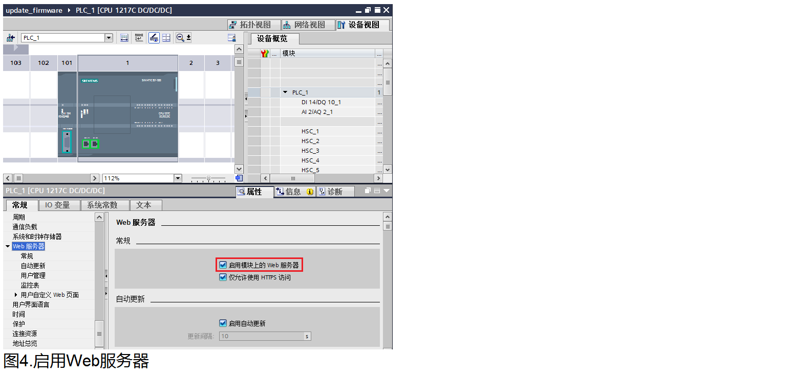
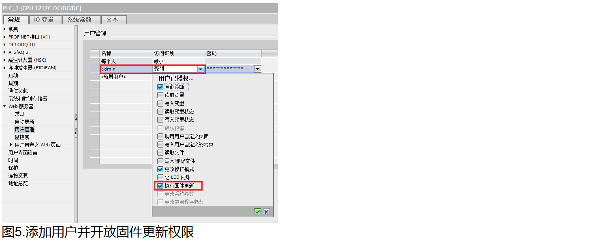
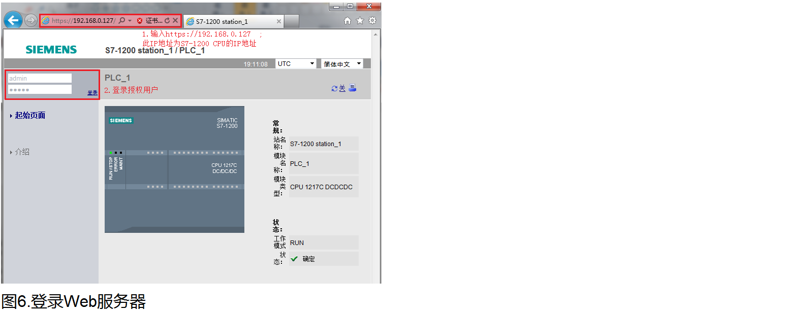
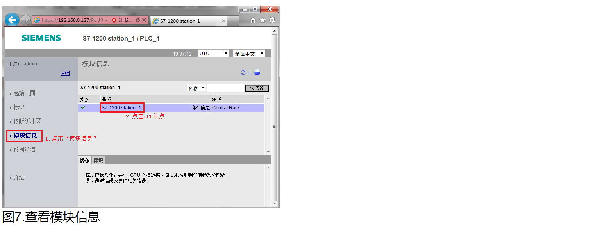
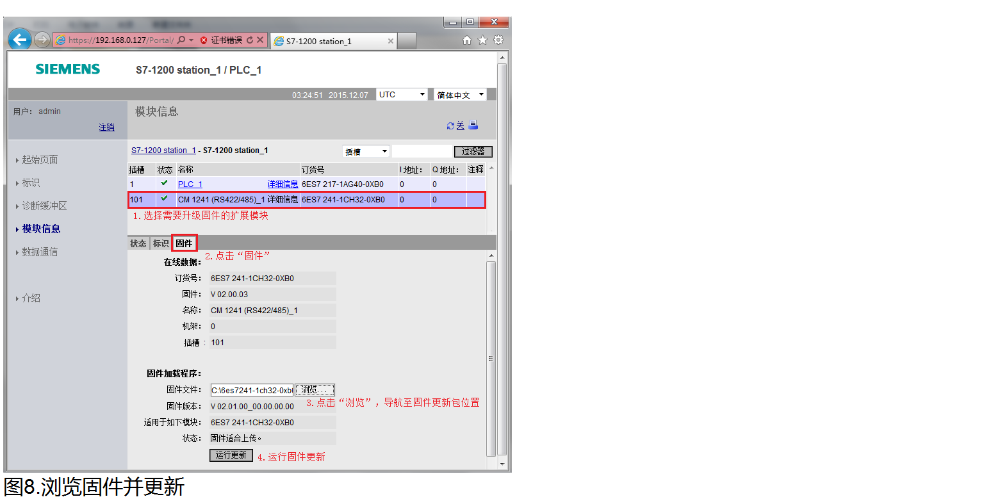

# 扩展模块固件更新

伴随着TIA 软件V13 版本以及S7-1200 CPU V4.0 固件版本的发布，S7-1200 PLC
扩展模块的固件已经可以通过如下几种方式进行升级：

* 使用存储卡更新CPU固件，具体步骤请参考 [存储卡的使用](../08-Function/10-Memory_Card.html) 章节。
* 使用TIA 软件更新CPU固件。
* 通过Web访问方式更新CPU固件。

本文以CM 1241
RS422/485模块(订货号：6ES7241-1CH32-0XB0)为例介绍如何通过TIA软件和Web方式升级扩展模块固件。
注意：
并不是所有S7-1200
PLC的扩展模块都支持TIA 软件、Web方式更新模块固件。
固件下载链接参见：[链接](../../01-resource/08-online_download.htm#firm)。

## 使用TIA软件更新扩展模块固件

1. 打开所连接 CPU 的设备视图，并切换到“在线”模式，如图1所示。

2. 在线"设备视图"中，鼠标右键需要固件升级的扩展模块，在弹出的菜单栏中选择"在线和诊断"。如图2所示。

3. 在扩展模块的在线和诊断页面中，点击"固件更新"并浏览到新版本固件后，点击“运行更新”按钮，即可执行扩展模块的固件更新操作。如图3所示。

## Web访问方式更新CPU固件

1.启动CPU的Web服务器功能

如果需要通过Web方式更新CPU固件，首先需要在设备组态视图中选择CPU，在CPU属性中使能“启动模块上的Web服务器”。
并出于安全考虑，对Web服务器进行安全访问时，需要选择"仅允许使用 HTTPS 访问"。相关设置如图4所示。

2.组态Web服务器用户权限。

为了使能Web服务器升级固件功能，需要组态Web服务器访问CPU的权限，需要在Web服务器属性的“用户管理”中添加授权的用户名、访问权限和密码。
本例需要开放“执行固件更新”权限，如图5所示。

将上述的Web服务器组态下载到CPU后，授权用户就可以通过Web服务器访问CPU。

3.通过PC 访问Web页面

首先需要确保PC机与S7-1200 CPU位于同一个以太网络中，然后打开 Web 浏览器，输入 URL "https://ww.xx.yy.zz"，其中"ww.xx.yy.zz"为 S7-1200 CPU 的 IP 地址。
并在Web服务器上登录授权用户，如图6所示。

4.登录授权用户后，点击“模块信息”，然后点击相应PLC站点名称，即可查看PLC 站点信息，如图7所示。

5.在PLC站点信息显示页面，选择需要升级固件的扩展模块，然后点击“固件”按钮，并"浏览"至固件更新包，点击“运行更新”按钮，即可执行CPU固件更新操作。如图8所示。

